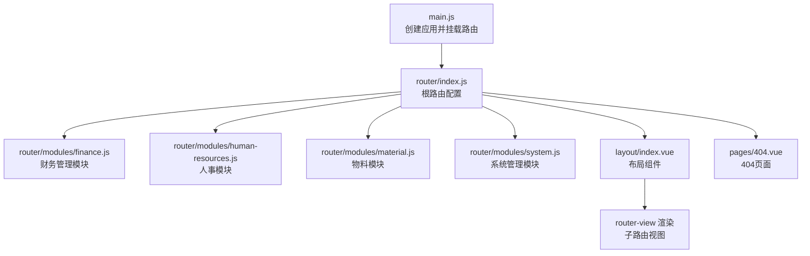
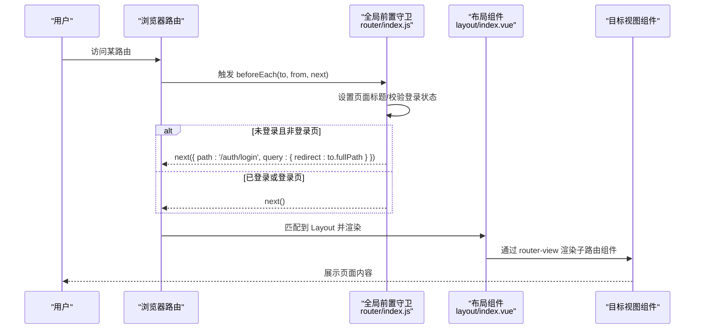
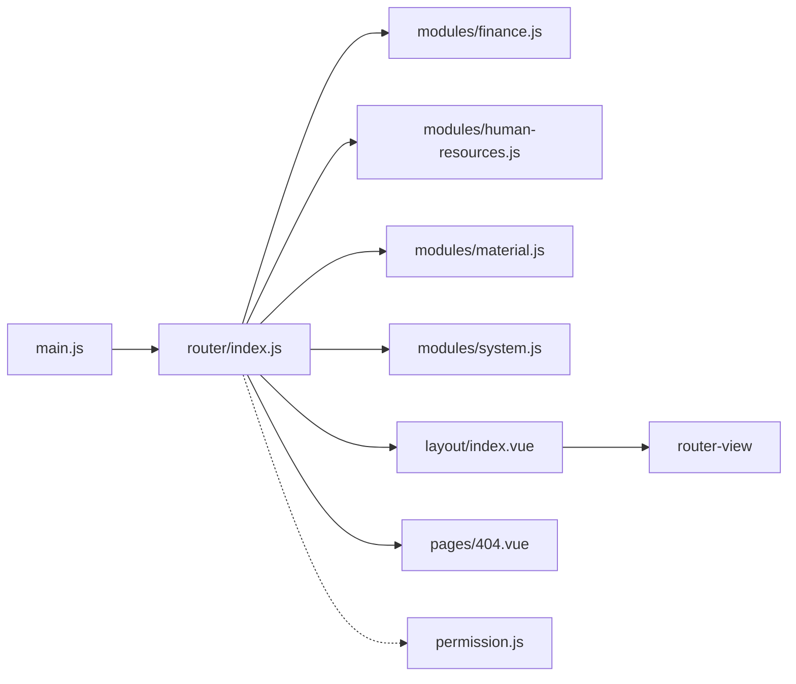

# 路由与导航

<cite>
**本文引用的文件**
- [router/index.js](file://07-frontend/src/router/index.js)
- [permission.js](file://07-frontend/src/permission.js)
- [layout/index.vue](file://07-frontend/src/layout/index.vue)
- [pages/404.vue](file://07-frontend/src/pages/404.vue)
- [router/modules/finance.js](file://07-frontend/src/router/modules/finance.js)
- [router/modules/human-resources.js](file://07-frontend/src/router/modules/human-resources.js)
- [router/modules/material.js](file://07-frontend/src/router/modules/material.js)
- [router/modules/system.js](file://07-frontend/src/router/modules/system.js)
- [main.js](file://07-frontend/src/main.js)
- [pages/finance/general-ledger/GeneralLedgerDetail.vue](file://07-frontend/src/pages/finance/general-ledger/GeneralLedgerDetail.vue)
- [pages/finance/accounts-receivable/ReceivableApprove.vue](file://07-frontend/src/pages/finance/accounts-receivable/ReceivableApprove.vue)
- [pages/404.vue](file://07-frontend/src/pages/404.vue)
</cite>

## 目录
1. [简介](#简介)
2. [项目结构](#项目结构)
3. [核心组件](#核心组件)
4. [架构总览](#架构总览)
5. [详细组件分析](#详细组件分析)
6. [依赖关系分析](#依赖关系分析)
7. [性能考量](#性能考量)
8. [故障排查指南](#故障排查指南)
9. [结论](#结论)
10. [附录](#附录)

## 简介
本文件面向前端开发者，系统性解析基于 Vue Router 的模块化路由配置机制，重点覆盖：
- 根路由配置文件如何动态导入各业务模块路由并统一挂载
- finance、human-resources、material 等模块路由的组织结构与命名规范
- 权限控制机制在 permission.js 中的实现思路（含路由守卫、权限验证与动态路由加载）
- layout 目录下布局组件与路由的配合方式
- 404 页面的异常路由处理策略
- 路由参数传递、嵌套路由配置与编程式导航的实际使用示例

## 项目结构
前端路由系统位于 07-frontend/src/router 目录，采用“根路由 + 模块化路由”的分层设计：
- 根路由：集中声明全局路由、重定向、嵌套路由与异常路由，并按需导入各模块路由
- 模块路由：每个业务域一个独立文件，统一以 Layout 包裹，形成清晰的父子关系
- 布局组件：layout/index.vue 提供侧边栏、面包屑、头部与主内容区，承载路由视图渲染
- 异常路由：404 页面作为兜底路由，确保未知路径友好提示

图表来源
- [main.js](file://07-frontend/src/main.js#L1-L27)
- [router/index.js](file://07-frontend/src/router/index.js#L1-L198)
- [router/modules/finance.js](file://07-frontend/src/router/modules/finance.js#L1-L437)
- [router/modules/human-resources.js](file://07-frontend/src/router/modules/human-resources.js#L1-L26)
- [router/modules/material.js](file://07-frontend/src/router/modules/material.js#L1-L19)
- [router/modules/system.js](file://07-frontend/src/router/modules/system.js#L1-L397)
- [layout/index.vue](file://07-frontend/src/layout/index.vue#L102-L122)
- [pages/404.vue](file://07-frontend/src/pages/404.vue#L1-L23)

章节来源
- [router/index.js](file://07-frontend/src/router/index.js#L1-L198)
- [main.js](file://07-frontend/src/main.js#L1-L27)

## 核心组件
- 根路由配置（router/index.js）
  - 动态导入各模块路由并合并到 routes 数组
  - 定义全局重定向、仪表盘嵌套路由、工作台路由、仓库管理嵌套路由、研发项目管理嵌套路由
  - 注册全局前置守卫，负责页面标题设置、登录状态校验与重定向
- 布局组件（layout/index.vue）
  - 侧边栏菜单、面包屑、头部用户信息与主内容区
  - 通过 router-view 渲染当前匹配的子路由组件
  - 内置菜单搜索、折叠切换、登出逻辑
- 异常路由（pages/404.vue）
  - 兜底 404 页面，提供返回首页的导航
- 权限控制（permission.js）
  - 展示审计页面的权限校验思路：读取 store 中的权限集合，判断路径包含特定标识时的放行逻辑

章节来源
- [router/index.js](file://07-frontend/src/router/index.js#L1-L198)
- [layout/index.vue](file://07-frontend/src/layout/index.vue#L102-L122)
- [pages/404.vue](file://07-frontend/src/pages/404.vue#L1-L23)
- [permission.js](file://07-frontend/src/permission.js#L1-L13)

## 架构总览
整体架构围绕“根路由聚合 + 模块路由拆分 + 布局组件承载”的模式展开，辅以全局前置守卫完成鉴权与标题设置。

图表来源
- [router/index.js](file://07-frontend/src/router/index.js#L199-L228)
- [layout/index.vue](file://07-frontend/src/layout/index.vue#L102-L122)

## 详细组件分析

### 根路由配置与模块化导入
- 动态导入策略
  - 通过 import 动态导入各模块路由文件，减少初始包体与启动时间
  - 将导入结果直接注入到 routes 数组中，便于集中管理
- 全局路由与嵌套路由
  - 登录页、仪表盘工作台、仓库管理、研发项目管理等均以 Layout 为父级容器
  - 子路由通过 children 定义，形成父子关系，利于权限与面包屑联动
- 异常路由
  - 使用通配符路径作为 404 兜底，隐藏于菜单之外，meta 中设置标题与隐藏标记

章节来源
- [router/index.js](file://07-frontend/src/router/index.js#L1-L198)

### 模块化路由组织与命名规范
- 统一父级容器
  - 各模块路由均以 Layout 作为父级组件，保证一致的侧边栏、面包屑与头部体验
- 命名规范
  - 模块路由文件名采用短横线分隔，如 finance.js、human-resources.js、material.js、system.js
  - 路由 path 采用小写短横线风格，name 采用驼峰命名，meta.title 用于菜单与面包屑
- 嵌套路由示例
  - 财务管理模块（finance.js）包含 expense、budget、funds、reports、tax、general-ledger、accounts-receivable 等多级子路由
  - 人事模块（human-resources.js）包含 dashboard、user-list 等子路由
  - 物料模块（material.js）包含 list 子路由
  - 系统模块（system.js）包含 users、roles、departments、menu、dictionary、config、audit-log、data-change、operation-trace、monitor 等多级子路由

章节来源
- [router/modules/finance.js](file://07-frontend/src/router/modules/finance.js#L1-L437)
- [router/modules/human-resources.js](file://07-frontend/src/router/modules/human-resources.js#L1-L26)
- [router/modules/material.js](file://07-frontend/src/router/modules/material.js#L1-L19)
- [router/modules/system.js](file://07-frontend/src/router/modules/system.js#L1-L397)

### 权限控制机制（路由守卫、权限验证与动态路由）
- 全局前置守卫
  - 设置页面标题：根据 meta.title 动态拼接系统标题
  - 登录校验：通过本地存储 token 判断是否已登录；未登录则重定向至登录页并携带 redirect 参数
  - 登录页特例：若已登录再次访问登录页，则重定向至首页
- 权限校验思路（permission.js）
  - 该文件展示了审计页面的权限校验思路：从 store 获取权限集合，若路径包含特定标识且不满足权限，则重定向至 403 页面
  - 注意：该文件未与 store 完整集成，仅为概念性示例，实际项目中应结合状态管理与后端权限体系完善
- 动态路由加载
  - 根路由通过动态 import 导入模块路由，实现按需加载
  - 布局组件内部可扩展为：登录后从后端拉取菜单与权限，动态构建路由表并注册

章节来源
- [router/index.js](file://07-frontend/src/router/index.js#L199-L228)
- [permission.js](file://07-frontend/src/permission.js#L1-L13)

### 布局组件与路由的配合
- 路由视图渲染
  - 通过 router-view 插槽渲染当前匹配的子路由组件，支持过渡动画
- 侧边栏与面包屑
  - 侧边栏菜单项与路由 path 对应，支持子菜单与图标
  - 面包屑根据当前路由路径逐级生成，提升导航体验
- 登录状态与菜单加载
  - 监听登录状态变化，登录后加载菜单；未登录时直接渲染路由内容
- 编程式导航
  - 通过 this.$router.push 进行菜单跳转；登出时清空本地存储并跳转登录页

章节来源
- [layout/index.vue](file://07-frontend/src/layout/index.vue#L102-L122)
- [layout/index.vue](file://07-frontend/src/layout/index.vue#L195-L210)
- [layout/index.vue](file://07-frontend/src/layout/index.vue#L399-L416)

### 404 页面与异常路由处理
- 404 路由
  - 采用通配符路径，作为兜底路由，隐藏于菜单之外
  - 页面提供返回首页的按钮，增强用户体验
- 异常处理策略
  - 全局前置守卫中对未登录访问受保护路由进行重定向
  - 404 路由作为最终兜底，避免空白页

章节来源
- [router/index.js](file://07-frontend/src/router/index.js#L184-L191)
- [pages/404.vue](file://07-frontend/src/pages/404.vue#L1-L23)

### 路由参数传递、嵌套路由与编程式导航示例

#### 路由参数传递
- 查询参数（route.query）
  - 示例：总账详情页通过查询参数 id 获取数据，随后渲染详情
  - 参考路径：[pages/finance/general-ledger/GeneralLedgerDetail.vue](file://07-frontend/src/pages/finance/general-ledger/GeneralLedgerDetail.vue#L89-L101)
- 路径参数（route.params）
  - 示例：应收单审核页通过路径参数 id 获取数据，随后进行审批操作
  - 参考路径：[pages/finance/accounts-receivable/ReceivableApprove.vue](file://07-frontend/src/pages/finance/accounts-receivable/ReceivableApprove.vue#L249-L274)

#### 嵌套路由配置
- 财务管理模块（finance.js）包含多层级子路由，如 expense、budget、funds、reports、tax、general-ledger、accounts-receivable 等
- 人事模块（human-resources.js）包含 dashboard、user-list 等子路由
- 物料模块（material.js）包含 list 子路由
- 系统模块（system.js）包含 users、roles、departments、menu、dictionary、config、audit-log、data-change、operation-trace、monitor 等多级子路由

章节来源
- [router/modules/finance.js](file://07-frontend/src/router/modules/finance.js#L1-L437)
- [router/modules/human-resources.js](file://07-frontend/src/router/modules/human-resources.js#L1-L26)
- [router/modules/material.js](file://07-frontend/src/router/modules/material.js#L1-L19)
- [router/modules/system.js](file://07-frontend/src/router/modules/system.js#L1-L397)

#### 编程式导航
- 菜单跳转
  - 侧边栏菜单选择后通过 this.$router.push(key) 进行跳转
  - 参考路径：[layout/index.vue](file://07-frontend/src/layout/index.vue#L206-L208)
- 返回与重定向
  - 404 页面提供返回首页的按钮，使用 $router.push('/dashboard')
  - 参考路径：[pages/404.vue](file://07-frontend/src/pages/404.vue#L4-L6)
- 登出跳转
  - 登出时清除本地存储并跳转登录页
  - 参考路径：[layout/index.vue](file://07-frontend/src/layout/index.vue#L409-L411)

## 依赖关系分析
- 根路由依赖各模块路由文件，形成“聚合-拆分”关系
- 布局组件依赖 Element Plus 的菜单、面包屑、下拉等组件，承担导航与内容承载职责
- 全局前置守卫依赖本地存储 token 与路由元信息 meta.title
- 权限控制依赖 store 的权限集合（示例中）

图表来源
- [main.js](file://07-frontend/src/main.js#L1-L27)
- [router/index.js](file://07-frontend/src/router/index.js#L1-L198)
- [router/modules/finance.js](file://07-frontend/src/router/modules/finance.js#L1-L437)
- [router/modules/human-resources.js](file://07-frontend/src/router/modules/human-resources.js#L1-L26)
- [router/modules/material.js](file://07-frontend/src/router/modules/material.js#L1-L19)
- [router/modules/system.js](file://07-frontend/src/router/modules/system.js#L1-L397)
- [layout/index.vue](file://07-frontend/src/layout/index.vue#L102-L122)
- [pages/404.vue](file://07-frontend/src/pages/404.vue#L1-L23)
- [permission.js](file://07-frontend/src/permission.js#L1-L13)

## 性能考量
- 按需加载
  - 使用动态 import 导入模块路由与页面组件，降低首屏体积
- 路由守卫轻量化
  - 仅做必要校验（登录状态、标题设置），避免阻塞主流程
- 布局组件复用
  - 通过 Layout 统一承载导航与内容，减少重复渲染

[本节为通用建议，无需列出具体文件来源]

## 故障排查指南
- 无法进入受保护页面
  - 检查全局前置守卫是否正确设置 token 与重定向逻辑
  - 参考路径：[router/index.js](file://07-frontend/src/router/index.js#L199-L228)
- 404 页面未出现
  - 确认通配符路由已配置且未被其他路由覆盖
  - 参考路径：[router/index.js](file://07-frontend/src/router/index.js#L184-L191)
- 菜单不可见或权限不足
  - 检查布局组件的 hasPermission 方法与菜单 meta.permissions 的使用
  - 参考路径：[layout/index.vue](file://07-frontend/src/layout/index.vue#L386-L391)
- 审计页面权限校验无效
  - 确认 permission.js 中的 store.getters.permissions 是否正确接入状态管理
  - 参考路径：[permission.js](file://07-frontend/src/permission.js#L1-L13)

章节来源
- [router/index.js](file://07-frontend/src/router/index.js#L199-L228)
- [router/index.js](file://07-frontend/src/router/index.js#L184-L191)
- [layout/index.vue](file://07-frontend/src/layout/index.vue#L386-L391)
- [permission.js](file://07-frontend/src/permission.js#L1-L13)

## 结论
该路由系统通过“根路由聚合 + 模块化拆分 + 布局承载”的架构，实现了清晰的导航结构与良好的扩展性。全局前置守卫保障了基本的鉴权与标题设置，布局组件提供了统一的导航体验。权限控制可在现有基础上进一步完善，结合 store 与后端权限体系实现细粒度的菜单与页面级权限管理。404 兜底路由提升了异常场景的用户体验。通过动态 import 与嵌套路由，系统具备良好的性能与可维护性。

[本节为总结性内容，无需列出具体文件来源]

## 附录

### 路由参数与导航使用清单
- 查询参数（route.query）
  - 示例：总账详情页通过查询参数 id 获取数据
  - 参考路径：[pages/finance/general-ledger/GeneralLedgerDetail.vue](file://07-frontend/src/pages/finance/general-ledger/GeneralLedgerDetail.vue#L89-L101)
- 路径参数（route.params）
  - 示例：应收单审核页通过路径参数 id 获取数据
  - 参考路径：[pages/finance/accounts-receivable/ReceivableApprove.vue](file://07-frontend/src/pages/finance/accounts-receivable/ReceivableApprove.vue#L249-L274)
- 编程式导航
  - 菜单跳转：this.$router.push(key)
    - 参考路径：[layout/index.vue](file://07-frontend/src/layout/index.vue#L206-L208)
  - 返回首页：$router.push('/dashboard')
    - 参考路径：[pages/404.vue](file://07-frontend/src/pages/404.vue#L4-L6)
  - 登出跳转：this.$router.push('/auth/login')
    - 参考路径：[layout/index.vue](file://07-frontend/src/layout/index.vue#L409-L411)

章节来源
- [pages/finance/general-ledger/GeneralLedgerDetail.vue](file://07-frontend/src/pages/finance/general-ledger/GeneralLedgerDetail.vue#L89-L101)
- [pages/finance/accounts-receivable/ReceivableApprove.vue](file://07-frontend/src/pages/finance/accounts-receivable/ReceivableApprove.vue#L249-L274)
- [layout/index.vue](file://07-frontend/src/layout/index.vue#L206-L208)
- [pages/404.vue](file://07-frontend/src/pages/404.vue#L4-L6)
- [layout/index.vue](file://07-frontend/src/layout/index.vue#L409-L411)