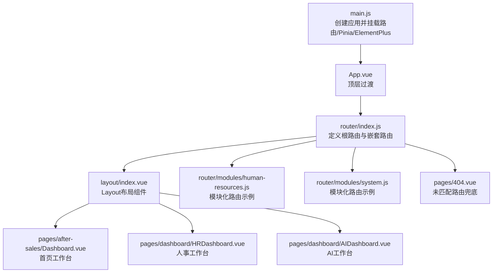
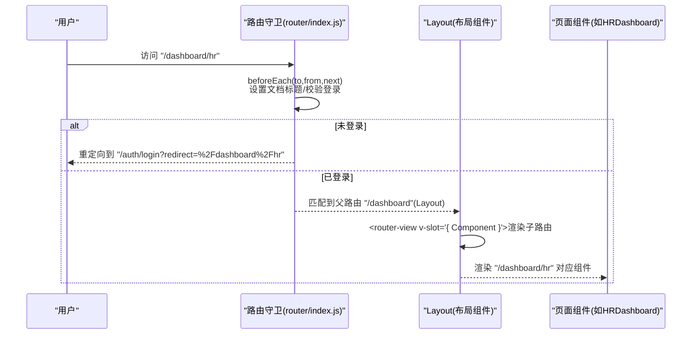
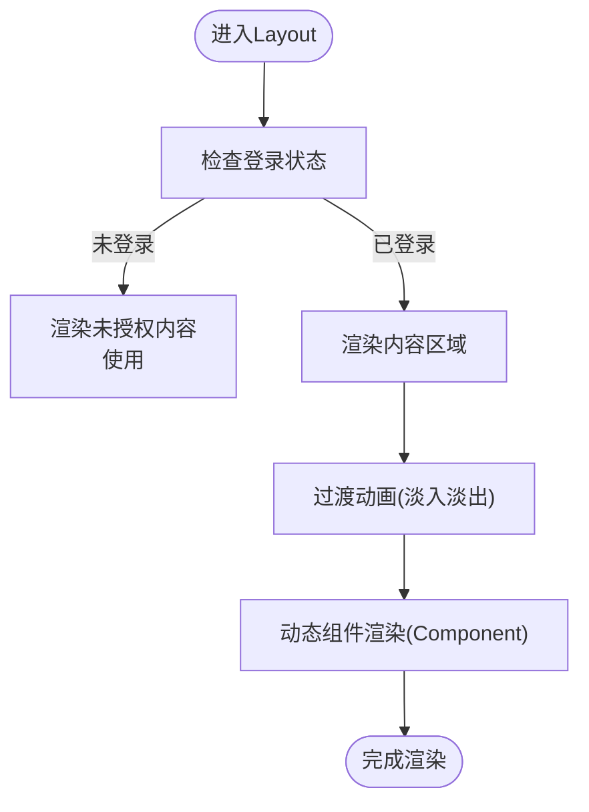
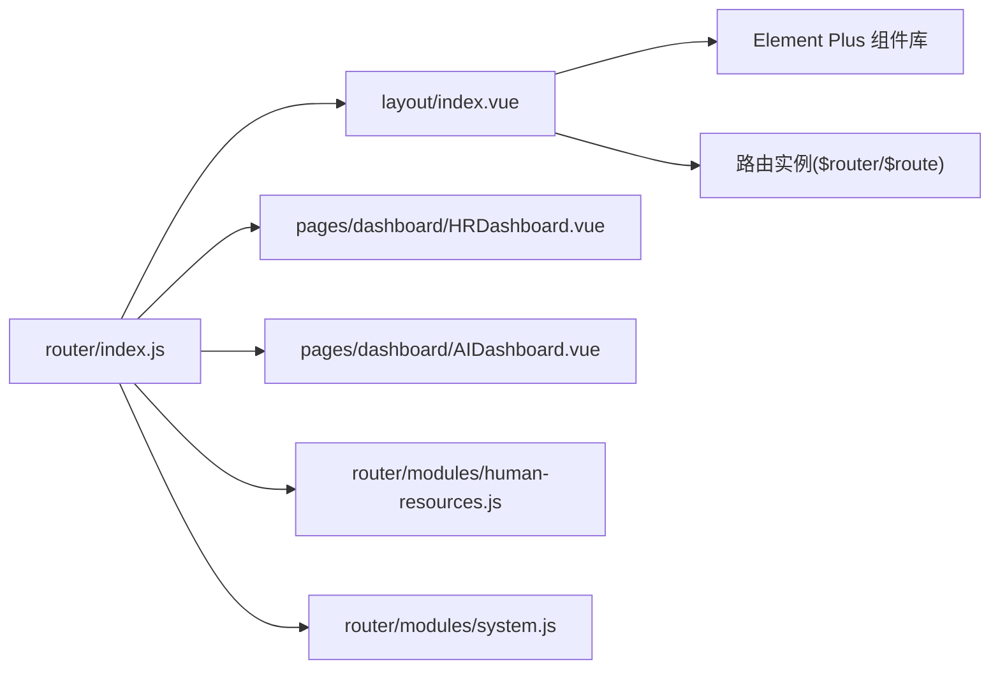

# 嵌套路由实现

<cite>
**本文引用的文件**
- [router/index.js](file://07-frontend/src/router/index.js)
- [layout/index.vue](file://07-frontend/src/layout/index.vue)
- [App.vue](file://07-frontend/src/App.vue)
- [main.js](file://07-frontend/src/main.js)
- [pages/after-sales/Dashboard.vue](file://07-frontend/src/pages/after-sales/Dashboard.vue)
- [pages/dashboard/HRDashboard.vue](file://07-frontend/src/pages/dashboard/HRDashboard.vue)
- [pages/dashboard/AIDashboard.vue](file://07-frontend/src/pages/dashboard/AIDashboard.vue)
- [pages/404.vue](file://07-frontend/src/pages/404.vue)
- [router/modules/human-resources.js](file://07-frontend/src/router/modules/human-resources.js)
- [router/modules/system.js](file://07-frontend/src/router/modules/system.js)
</cite>

## 目录
1. [引言](#引言)
2. [项目结构](#项目结构)
3. [核心组件](#核心组件)
4. [架构总览](#架构总览)
5. [详细组件分析](#详细组件分析)
6. [依赖分析](#依赖分析)
7. [性能考虑](#性能考虑)
8. [故障排查指南](#故障排查指南)
9. [结论](#结论)

## 引言
本文件围绕“嵌套路由”的设计模式与实现方式进行深入讲解，重点以/dashboard路径下的多个工作台页面（HRDashboard、AIDashboard等）为例，说明如何通过父路由的children属性构建多级路由结构；并结合Layout.vue中的<router-view>插槽机制，解释父路由组件如何渲染其子路由内容，实现布局复用与页面内容的动态切换，最终构建清晰的页面层级关系。

## 项目结构
- 路由定义集中在前端工程的router目录，采用模块化拆分，便于维护与扩展。
- 布局组件位于layout目录，统一承载侧边栏、头部导航、面包屑与内容区。
- 页面组件按功能域划分在pages目录，dashboard子目录包含各业务工作台页面。
- 应用入口在main.js中注册路由、状态管理与UI框架，并在App.vue中通过顶层<router-view>包裹过渡动画。

图表来源
- [main.js](file://07-frontend/src/main.js#L1-L27)
- [App.vue](file://07-frontend/src/App.vue#L1-L16)
- [router/index.js](file://07-frontend/src/router/index.js#L1-L192)
- [layout/index.vue](file://07-frontend/src/layout/index.vue#L1-L122)
- [pages/after-sales/Dashboard.vue](file://07-frontend/src/pages/after-sales/Dashboard.vue#L1-L182)
- [pages/dashboard/HRDashboard.vue](file://07-frontend/src/pages/dashboard/HRDashboard.vue#L1-L139)
- [pages/dashboard/AIDashboard.vue](file://07-frontend/src/pages/dashboard/AIDashboard.vue#L1-L31)
- [router/modules/human-resources.js](file://07-frontend/src/router/modules/human-resources.js#L1-L26)
- [router/modules/system.js](file://07-frontend/src/router/modules/system.js#L1-L397)
- [pages/404.vue](file://07-frontend/src/pages/404.vue#L1-L23)

章节来源
- [router/index.js](file://07-frontend/src/router/index.js#L1-L192)
- [layout/index.vue](file://07-frontend/src/layout/index.vue#L1-L122)
- [main.js](file://07-frontend/src/main.js#L1-L27)

## 核心组件
- 根路由与嵌套路由：在router/index.js中，通过children数组为父路由定义子路由，形成/dashboard、/system等多级结构。
- 布局组件Layout：在layout/index.vue中，通过<router-view v-slot="{ Component }">插槽机制渲染子路由组件，同时提供侧边栏、面包屑、头部导航等通用UI。
- 页面组件：dashboard目录下的HRDashboard、AIDashboard等作为具体业务页面，被父路由的children引用。
- 顶层过渡：App.vue与main.js共同确保页面切换时的过渡动画与全局依赖注入。

章节来源
- [router/index.js](file://07-frontend/src/router/index.js#L1-L192)
- [layout/index.vue](file://07-frontend/src/layout/index.vue#L1-L122)
- [App.vue](file://07-frontend/src/App.vue#L1-L16)
- [main.js](file://07-frontend/src/main.js#L1-L27)

## 架构总览
下面的序列图展示了从用户访问/dashboard到Layout渲染其子路由组件的完整流程，包括路由守卫对页面标题与登录态的处理。

图表来源
- [router/index.js](file://07-frontend/src/router/index.js#L200-L226)
- [layout/index.vue](file://07-frontend/src/layout/index.vue#L102-L110)
- [pages/dashboard/HRDashboard.vue](file://07-frontend/src/pages/dashboard/HRDashboard.vue#L1-L139)

## 详细组件分析

### 父路由与children嵌套设计
- 父路由“/dashboard”使用Layout作为容器，并通过children定义多个子路由：
  - home：首页工作台
  - hr：人事工作台
  - ai：AI工作台
  - rd：研发/设计工作台
  - kpi：KPI工作台
  - sales：销售工作台
  - quality：品保工作台
- 子路由均指向对应的页面组件，且每个子路由携带meta.title用于页面标题与面包屑展示。
- 该设计实现了“布局复用 + 内容动态切换”的典型嵌套路由模式：Layout负责通用UI，子路由负责具体业务页面。

章节来源
- [router/index.js](file://07-frontend/src/router/index.js#L30-L79)

### Layout.vue 的<router-view>插槽机制
- Layout通过<router-view v-slot="{ Component }">接收子路由组件，再用<component :is="Component"/>动态渲染。
- 为提升用户体验，Layout对渲染过程加上了淡入淡出过渡动画。
- 登录态判断：当未登录时，Layout内部也使用<router-view>渲染未授权状态下的组件（如登录页），并在登录后回到父路由内容。
- 面包屑：Layout根据当前路由路径解析匹配的路由记录，生成面包屑列表，增强导航可发现性。

图表来源
- [layout/index.vue](file://07-frontend/src/layout/index.vue#L102-L110)
- [layout/index.vue](file://07-frontend/src/layout/index.vue#L114-L120)

章节来源
- [layout/index.vue](file://07-frontend/src/layout/index.vue#L1-L122)

### 页面级导航与工作台入口
- pages/after-sales/Dashboard.vue作为/dashboard的首页工作台，提供部门工作台入口（如/hr、/ai等），点击后通过router.push跳转至对应子路由。
- 该入口页体现了“父路由承载布局，子路由承载页面”的职责分离，便于后续扩展更多工作台。

章节来源
- [pages/after-sales/Dashboard.vue](file://07-frontend/src/pages/after-sales/Dashboard.vue#L111-L147)

### 子路由页面示例：HRDashboard 与 AIDashboard
- HRDashboard.vue：展示统计卡片与快捷功能，体现业务页面的独立性与布局复用。
- AIDashboard.vue：作为占位页面，同样复用Layout布局，便于后续功能扩展。

章节来源
- [pages/dashboard/HRDashboard.vue](file://07-frontend/src/pages/dashboard/HRDashboard.vue#L1-L139)
- [pages/dashboard/AIDashboard.vue](file://07-frontend/src/pages/dashboard/AIDashboard.vue#L1-L31)

### 模块化路由与深层嵌套
- 通过router/modules/human-resources.js与router/modules/system.js可见，嵌套路由不仅限于/dashboard，系统管理等模块同样采用children进行深层嵌套，例如用户管理、角色权限、菜单管理等。
- 这种模块化拆分有利于团队协作与功能边界清晰，同时保持嵌套路由的一致性。

章节来源
- [router/modules/human-resources.js](file://07-frontend/src/router/modules/human-resources.js#L1-L26)
- [router/modules/system.js](file://07-frontend/src/router/modules/system.js#L1-L397)

### 顶层过渡与全局依赖
- App.vue与main.js分别负责顶层过渡与全局依赖注入（路由、状态管理、UI框架），保证整个应用的统一体验与运行环境。

章节来源
- [App.vue](file://07-frontend/src/App.vue#L1-L16)
- [main.js](file://07-frontend/src/main.js#L1-L27)

## 依赖分析
- 路由层依赖：router/index.js依赖Layout作为父路由容器，并通过children引用各业务页面组件。
- 布局层依赖：layout/index.vue依赖Element Plus组件库与路由实例，以实现菜单、面包屑与导航交互。
- 页面层依赖：各业务页面组件独立，仅依赖UI库与业务逻辑，不直接耦合布局。
- 模块化路由：router/modules/*.js将不同功能域的嵌套路由拆分为独立文件，降低主路由文件复杂度。

图表来源
- [router/index.js](file://07-frontend/src/router/index.js#L1-L192)
- [layout/index.vue](file://07-frontend/src/layout/index.vue#L1-L122)
- [router/modules/human-resources.js](file://07-frontend/src/router/modules/human-resources.js#L1-L26)
- [router/modules/system.js](file://07-frontend/src/router/modules/system.js#L1-L397)

章节来源
- [router/index.js](file://07-frontend/src/router/index.js#L1-L192)
- [layout/index.vue](file://07-frontend/src/layout/index.vue#L1-L122)

## 性能考虑
- 路由懒加载：子路由组件通过动态导入实现按需加载，减少首屏体积与初次渲染时间。
- 过渡动画：Layout与App均使用轻量过渡效果，避免过度渲染导致卡顿。
- 布局复用：通过Layout统一承载通用UI，避免重复渲染与状态分散，提高整体性能与一致性。

## 故障排查指南
- 404页面：当访问不存在的路由时，系统会跳转至/pages/404.vue，可通过按钮返回首页，便于快速定位问题。
- 登录态异常：路由守卫会根据localStorage中的token决定是否放行或重定向到登录页，若出现无法进入受保护页面的情况，优先检查token与登录状态。
- 面包屑不显示：若面包屑为空，检查当前路由路径是否正确匹配到父路由，以及meta.title是否设置。

章节来源
- [pages/404.vue](file://07-frontend/src/pages/404.vue#L1-L23)
- [router/index.js](file://07-frontend/src/router/index.js#L200-L226)
- [layout/index.vue](file://07-frontend/src/layout/index.vue#L366-L384)

## 结论
通过/dashboard路径下的多工作台页面与Layout的<router-view>插槽机制，本项目实现了清晰的嵌套路由设计：父路由负责布局与通用UI，子路由负责具体业务页面，二者通过children建立稳定的层级关系。配合模块化路由与路由守卫，系统在可维护性、可扩展性与用户体验方面均表现良好。未来可在现有基础上继续扩展更多工作台与深层嵌套，保持一致的嵌套路由模式与布局复用策略。