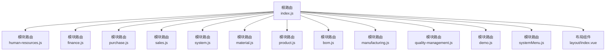
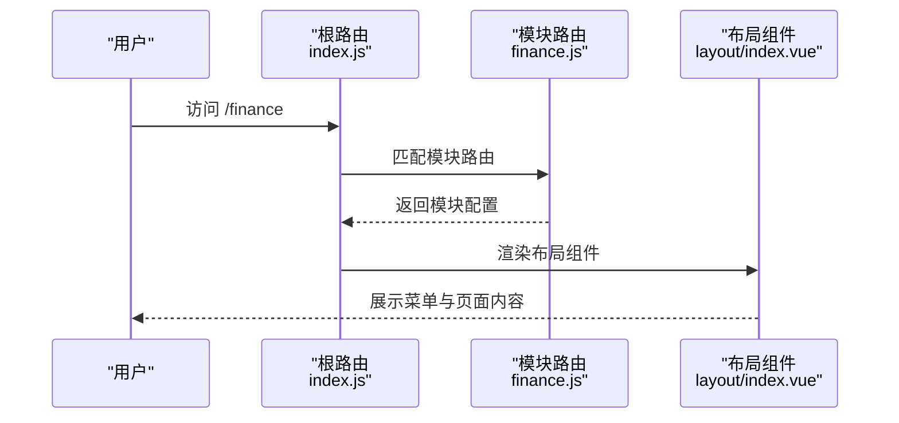
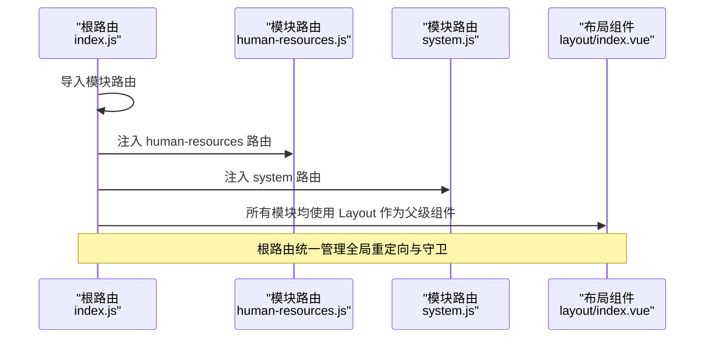
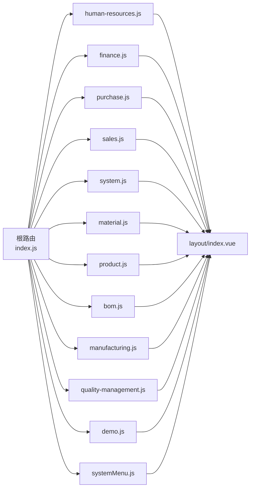

# 模块化路由结构

<cite>
**本文引用的文件**
- [07-frontend/src/router/index.js](file://07-frontend/src/router/index.js)
- [07-frontend/src/router/modules/human-resources.js](file://07-frontend/src/router/modules/human-resources.js)
- [07-frontend/src/router/modules/finance.js](file://07-frontend/src/router/modules/finance.js)
- [07-frontend/src/router/modules/material.js](file://07-frontend/src/router/modules/material.js)
- [07-frontend/src/router/modules/product.js](file://07-frontend/src/router/modules/product.js)
- [07-frontend/src/router/modules/purchase.js](file://07-frontend/src/router/modules/purchase.js)
- [07-frontend/src/router/modules/sales.js](file://07-frontend/src/router/modules/sales.js)
- [07-frontend/src/router/modules/system.js](file://07-frontend/src/router/modules/system.js)
- [07-frontend/src/router/modules/systemMenu.js](file://07-frontend/src/router/modules/systemMenu.js)
- [07-frontend/src/router/modules/bom.js](file://07-frontend/src/router/modules/bom.js)
- [07-frontend/src/router/modules/manufacturing.js](file://07-frontend/src/router/modules/manufacturing.js)
- [07-frontend/src/router/modules/quality-management.js](file://07-frontend/src/router/modules/quality-management.js)
- [07-frontend/src/router/modules/demo.js](file://07-frontend/src/router/modules/demo.js)
- [07-frontend/src/layout/index.vue](file://07-frontend/src/layout/index.vue)
</cite>

## 目录
1. [引言](#引言)
2. [项目结构](#项目结构)
3. [核心组件](#核心组件)
4. [架构总览](#架构总览)
5. [详细组件分析](#详细组件分析)
6. [依赖关系分析](#依赖关系分析)
7. [性能考量](#性能考量)
8. [故障排查指南](#故障排查指南)
9. [结论](#结论)

## 引言
本文件聚焦于前端模块化路由结构设计，围绕财务、人力资源、物料、产品、采购、销售、系统管理等业务模块，系统梳理：
- 模块路由如何通过 export default 导出并被根路由集成
- 父级路径、图标、重定向规则与子路由配置
- meta 字段在权限控制与菜单显示中的作用
- 模块间路由命名规范的一致性要求

## 项目结构
前端路由采用“根路由聚合 + 模块化路由导出”的分层组织方式：
- 根路由负责全局布局、登录页、重定向、404 页面以及模块路由的统一注入
- 各业务模块以独立文件导出路由配置，便于维护与扩展
- 布局组件提供统一的侧边栏、面包屑、头部导航与权限校验

图表来源
- [07-frontend/src/router/index.js](file://07-frontend/src/router/index.js#L1-L120)
- [07-frontend/src/router/modules/human-resources.js](file://07-frontend/src/router/modules/human-resources.js#L1-L26)
- [07-frontend/src/router/modules/finance.js](file://07-frontend/src/router/modules/finance.js#L1-L120)
- [07-frontend/src/router/modules/purchase.js](file://07-frontend/src/router/modules/purchase.js#L1-L120)
- [07-frontend/src/router/modules/sales.js](file://07-frontend/src/router/modules/sales.js#L1-L120)
- [07-frontend/src/router/modules/system.js](file://07-frontend/src/router/modules/system.js#L1-L120)
- [07-frontend/src/router/modules/material.js](file://07-frontend/src/router/modules/material.js#L1-L19)
- [07-frontend/src/router/modules/product.js](file://07-frontend/src/router/modules/product.js#L1-L20)
- [07-frontend/src/router/modules/bom.js](file://07-frontend/src/router/modules/bom.js#L1-L34)
- [07-frontend/src/router/modules/manufacturing.js](file://07-frontend/src/router/modules/manufacturing.js#L1-L79)
- [07-frontend/src/router/modules/quality-management.js](file://07-frontend/src/router/modules/quality-management.js#L1-L95)
- [07-frontend/src/router/modules/demo.js](file://07-frontend/src/router/modules/demo.js#L1-L23)
- [07-frontend/src/router/modules/systemMenu.js](file://07-frontend/src/router/modules/systemMenu.js#L1-L56)
- [07-frontend/src/layout/index.vue](file://07-frontend/src/layout/index.vue#L1-L120)

章节来源
- [07-frontend/src/router/index.js](file://07-frontend/src/router/index.js#L1-L120)
- [07-frontend/src/layout/index.vue](file://07-frontend/src/layout/index.vue#L1-L120)

## 核心组件
- 根路由：集中导入各模块路由，统一注册；设置全局重定向、登录页、404 页面；配置路由前置守卫
- 模块路由：每个模块以对象形式导出，包含 path、component、redirect、name、meta、children 等字段
- 布局组件：提供侧边栏菜单、面包屑、头部导航、用户信息与权限校验逻辑

章节来源
- [07-frontend/src/router/index.js](file://07-frontend/src/router/index.js#L1-L120)
- [07-frontend/src/layout/index.vue](file://07-frontend/src/layout/index.vue#L1-L120)

## 架构总览
模块化路由遵循“父路由承载布局与权限，子路由承载具体页面”的模式。根路由将模块路由注入到全局路由表，布局组件负责渲染菜单树与面包屑。

图表来源
- [07-frontend/src/router/index.js](file://07-frontend/src/router/index.js#L1-L120)
- [07-frontend/src/router/modules/finance.js](file://07-frontend/src/router/modules/finance.js#L1-L120)
- [07-frontend/src/layout/index.vue](file://07-frontend/src/layout/index.vue#L1-L120)

## 详细组件分析

### 通用设计原则
- 父级路径：每个模块以独立 path 作为父级路径，例如 /finance、/sales、/system 等
- 重定向规则：模块通常设置 redirect，将访问父级路径重定向到首个子路由或概览页
- 图标与标题：meta 中的 title 用于菜单显示，部分模块在 meta 中提供 icon 字段
- 子路由配置：children 数组承载具体页面，支持多层级嵌套
- 权限控制：meta 中可携带 permission 或 permissions 字段，配合布局组件的 hasPermission 方法进行菜单可见性与页面访问控制

章节来源
- [07-frontend/src/router/modules/finance.js](file://07-frontend/src/router/modules/finance.js#L1-L120)
- [07-frontend/src/router/modules/sales.js](file://07-frontend/src/router/modules/sales.js#L1-L120)
- [07-frontend/src/router/modules/system.js](file://07-frontend/src/router/modules/system.js#L1-L120)
- [07-frontend/src/layout/index.vue](file://07-frontend/src/layout/index.vue#L1-L120)

### 人力资源模块（human-resources）
- 父级路径：/human-resources
- 重定向：/human-resources/dashboard
- 图标：meta 中提供 icon
- 子路由：dashboard、user-list 等
- 导出方式：export default 导出模块对象，根路由通过 import 后直接加入 routes

章节来源
- [07-frontend/src/router/modules/human-resources.js](file://07-frontend/src/router/modules/human-resources.js#L1-L26)

### 财务模块（finance）
- 父级路径：/finance
- 重定向：/finance/overview
- 图标：meta 中提供 icon
- 子路由：费用报销、预算管理、资金管理、财务报表、税务管理、总账管理、应收账款等
- 权限控制：meta 中包含 permission 数组，用于细粒度权限控制
- 导出方式：export default 导出模块对象，根路由统一注入

章节来源
- [07-frontend/src/router/modules/finance.js](file://07-frontend/src/router/modules/finance.js#L1-L120)

### 采购模块（purchase）
- 父级路径：/purchase
- 重定向：/purchase/dashboard
- 图标：meta 中提供 icon
- 子路由：供应商管理、采购申请、采购订单、采购合同、入库管理、付款管理、采购报表等
- 权限控制：meta 中包含 permission 数组
- 导出方式：export default 导出模块对象

章节来源
- [07-frontend/src/router/modules/purchase.js](file://07-frontend/src/router/modules/purchase.js#L1-L120)

### 销售模块（sales）
- 父级路径：/sales
- 重定向：/sales/dashboard
- 图标：meta 中提供 icon
- 子路由：客户管理、销售订单、销售机会、合同管理、报价管理、销售报表等
- 权限控制：meta 中包含 permission 数组
- 导出方式：export default 导出模块对象

章节来源
- [07-frontend/src/router/modules/sales.js](file://07-frontend/src/router/modules/sales.js#L1-L120)

### 系统管理模块（system）
- 父级路径：/system
- 重定向：/system/overview
- 图标：meta 中提供 icon
- 子路由：用户管理、角色权限、部门管理、菜单管理、字典管理、系统配置、审计日志、系统监控等
- 权限控制：meta 中包含 permission 数组
- 导出方式：export default 导出模块对象

章节来源
- [07-frontend/src/router/modules/system.js](file://07-frontend/src/router/modules/system.js#L1-L120)

### 物料模块（material）
- 父级路径：/material
- 重定向：/material/list
- 子路由：产品物料库
- 导出方式：const 定义后 export default 导出模块对象

章节来源
- [07-frontend/src/router/modules/material.js](file://07-frontend/src/router/modules/material.js#L1-L19)

### 产品模块（product）
- 父级路径：/product
- 重定向：/product/manual
- 图标：meta 中提供 icon
- 子路由：产品手册
- 导出方式：export default 导出模块对象

章节来源
- [07-frontend/src/router/modules/product.js](file://07-frontend/src/router/modules/product.js#L1-L20)

### BOM 模块（bom）
- 父级路径：/bom
- 重定向：/bom/design
- 图标：meta 中提供 icon
- 子路由：设计BOM、生产BOM、销售BOM
- 导出方式：const 定义后 export default 导出模块对象

章节来源
- [07-frontend/src/router/modules/bom.js](file://07-frontend/src/router/modules/bom.js#L1-L34)

### 生产管理模块（manufacturing）
- 父级路径：/manufacturing
- 重定向：/manufacturing/production-order/list
- 图标：meta 中提供 icon
- 子路由：工序管理、生产订单管理（含列表、创建、编辑、排程、进度、计划、物料需求、报表）
- 导出方式：export default 导出模块对象

章节来源
- [07-frontend/src/router/modules/manufacturing.js](file://07-frontend/src/router/modules/manufacturing.js#L1-L79)

### 质量管理模块（quality-management）
- 父级路径：/quality-management
- 重定向：/quality-management/dashboard
- 图标：meta 中提供 icon
- 子路由：质量仪表板、质量计划、质量检验、质量检查、质量控制、质量审核、缺陷分析、统计过程控制
- 导出方式：export default 导出模块对象

章节来源
- [07-frontend/src/router/modules/quality-management.js](file://07-frontend/src/router/modules/quality-management.js#L1-L95)

### 演示模块（demo）
- 父级路径：/demo
- 重定向：/demo/smart-select
- 图标：meta 中提供 icon
- 子路由：智能下拉演示
- 导出方式：export default 导出模块对象

章节来源
- [07-frontend/src/router/modules/demo.js](file://07-frontend/src/router/modules/demo.js#L1-L23)

### 系统菜单模块（systemMenu）
- 父级路径：/system
- 重定向：/system/menu-management
- 子路由：菜单管理、菜单排序、菜单权限、用户菜单配置
- 导出方式：export default 导出模块对象

章节来源
- [07-frontend/src/router/modules/systemMenu.js](file://07-frontend/src/router/modules/systemMenu.js#L1-L56)

### 根路由集成流程
- 导入模块路由：在根路由文件中导入各模块路由
- 注册模块路由：将模块路由对象直接加入 routes 数组
- 统一布局：模块路由的 component 指向布局组件，确保菜单与面包屑一致
- 全局守卫：设置页面标题、登录态校验与重定向

图表来源
- [07-frontend/src/router/index.js](file://07-frontend/src/router/index.js#L1-L120)
- [07-frontend/src/router/modules/human-resources.js](file://07-frontend/src/router/modules/human-resources.js#L1-L26)
- [07-frontend/src/router/modules/system.js](file://07-frontend/src/router/modules/system.js#L1-L120)
- [07-frontend/src/layout/index.vue](file://07-frontend/src/layout/index.vue#L1-L120)

## 依赖关系分析
- 根路由对模块路由的依赖：通过 import 导入各模块路由对象，并将其合并到全局 routes
- 模块路由对布局组件的依赖：所有模块路由的 component 指向布局组件，保证菜单与面包屑一致性
- 布局组件对菜单数据与权限的依赖：布局组件内部维护菜单列表与权限校验方法，meta 的 title、icon、permissions 控制菜单渲染与可见性

图表来源
- [07-frontend/src/router/index.js](file://07-frontend/src/router/index.js#L1-L120)
- [07-frontend/src/layout/index.vue](file://07-frontend/src/layout/index.vue#L1-L120)

章节来源
- [07-frontend/src/router/index.js](file://07-frontend/src/router/index.js#L1-L120)
- [07-frontend/src/layout/index.vue](file://07-frontend/src/layout/index.vue#L1-L120)

## 性能考量
- 路由懒加载：模块路由中使用动态 import 加载页面组件，有助于减少首屏体积
- 菜单渲染优化：布局组件对菜单进行搜索与过滤，建议在实际项目中结合后端菜单数据与权限，避免一次性渲染过多节点
- 前置守卫：登录态与页面标题设置在路由层面完成，避免重复计算

[本节为通用指导，不涉及具体文件分析]

## 故障排查指南
- 登录态异常
  - 现象：访问受保护页面被重定向至登录页
  - 排查：检查根路由前置守卫中对 localStorage 的 token 读取逻辑
  - 参考路径：[07-frontend/src/router/index.js](file://07-frontend/src/router/index.js#L200-L226)
- 菜单不可见
  - 现象：菜单项不显示或禁用
  - 排查：确认布局组件中 hasPermission 方法对 meta.permissions 的判断逻辑；检查模块路由 meta 中的权限字段是否正确
  - 参考路径：[07-frontend/src/layout/index.vue](file://07-frontend/src/layout/index.vue#L386-L410)
- 重定向循环
  - 现象：访问父级路径出现循环重定向
  - 排查：检查模块路由的 redirect 是否指向有效子路由；确认子路由是否存在且可访问
  - 参考路径：[07-frontend/src/router/modules/finance.js](file://07-frontend/src/router/modules/finance.js#L1-L40)
- 页面标题未更新
  - 现象：页面标题未按 meta.title 显示
  - 排查：检查根路由前置守卫中对 document.title 的设置逻辑
  - 参考路径：[07-frontend/src/router/index.js](file://07-frontend/src/router/index.js#L200-L206)

章节来源
- [07-frontend/src/router/index.js](file://07-frontend/src/router/index.js#L200-L226)
- [07-frontend/src/layout/index.vue](file://07-frontend/src/layout/index.vue#L386-L410)
- [07-frontend/src/router/modules/finance.js](file://07-frontend/src/router/modules/finance.js#L1-L40)

## 结论
该模块化路由结构通过“根路由聚合 + 模块路由导出”的方式，实现了清晰的职责分离与良好的可维护性。各模块路由统一采用父级路径、重定向、图标与子路由配置，meta 字段在权限控制与菜单显示中发挥关键作用。建议在实际项目中：
- 统一 meta 字段命名规范（如 title、icon、permission/permissions），确保布局组件与权限校验逻辑一致
- 将菜单数据与权限从后端拉取，避免硬编码在布局组件中
- 对复杂模块（如财务、销售、采购、系统管理）保持子路由层级清晰，便于扩展与维护