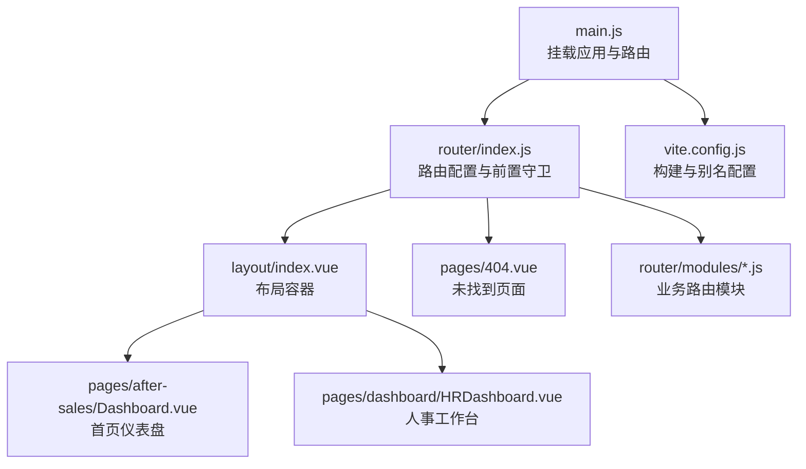
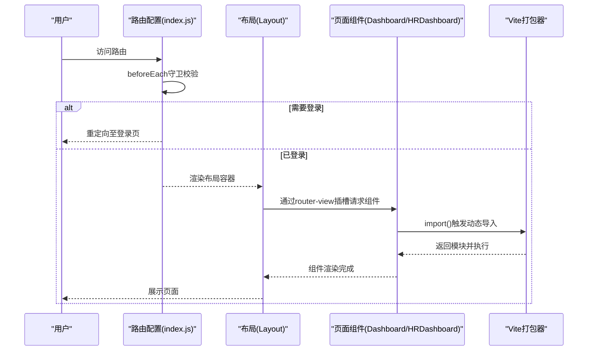
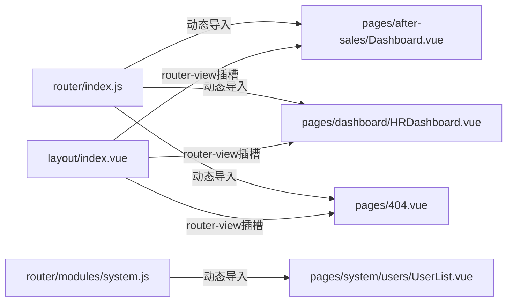

# 组件懒加载机制

<cite>
**本文引用的文件**
- [07-frontend/src/router/index.js](file://07-frontend/src/router/index.js)
- [07-frontend/src/router/modules/human-resources.js](file://07-frontend/src/router/modules/human-resources.js)
- [07-frontend/src/router/modules/system.js](file://07-frontend/src/router/modules/system.js)
- [07-frontend/src/layout/index.vue](file://07-frontend/src/layout/index.vue)
- [07-frontend/src/pages/after-sales/Dashboard.vue](file://07-frontend/src/pages/after-sales/Dashboard.vue)
- [07-frontend/src/pages/dashboard/HRDashboard.vue](file://07-frontend/src/pages/dashboard/HRDashboard.vue)
- [07-frontend/src/pages/404.vue](file://07-frontend/src/pages/404.vue)
- [07-frontend/src/main.js](file://07-frontend/src/main.js)
- [07-frontend/vite.config.js](file://07-frontend/vite.config.js)
- [07-frontend/package.json](file://07-frontend/package.json)
</cite>

## 目录
1. [引言](#引言)
2. [项目结构](#项目结构)
3. [核心组件](#核心组件)
4. [架构总览](#架构总览)
5. [详细组件分析](#详细组件分析)
6. [依赖关系分析](#依赖关系分析)
7. [性能考量](#性能考量)
8. [故障排查指南](#故障排查指南)
9. [结论](#结论)
10. [附录](#附录)

## 引言
本文件围绕 Vue Router 中“组件懒加载”的实现机制展开，结合项目中的实际代码，解释 import() 函数如何实现路由组件的按需加载，从而降低应用初始包体、提升首屏加载性能。文档同时展示 Layout 布局组件与具体页面组件（如 Dashboard、HRDashboard）的异步导入方式，并探讨懒加载与 Vite 构建系统的协同工作原理以及对打包体积优化的影响。

## 项目结构
- 路由入口集中于路由配置文件，采用按需导入策略，将大型模块拆分为独立路由模块文件，便于按需加载。
- Layout 作为全局布局容器，通过 router-view 插槽渲染当前路由对应的页面组件。
- 页面组件通过 import() 返回的动态导入函数实现懒加载，避免在应用启动时一次性打包全部页面资源。
- Vite 提供了基于现代打包器的分块策略，配合 Vue Router 的动态导入，形成高效的按需加载链路。

图表来源
- [07-frontend/src/main.js](file://07-frontend/src/main.js#L1-L27)
- [07-frontend/src/router/index.js](file://07-frontend/src/router/index.js#L1-L228)
- [07-frontend/src/layout/index.vue](file://07-frontend/src/layout/index.vue#L102-L122)
- [07-frontend/src/pages/after-sales/Dashboard.vue](file://07-frontend/src/pages/after-sales/Dashboard.vue#L1-L359)
- [07-frontend/src/pages/dashboard/HRDashboard.vue](file://07-frontend/src/pages/dashboard/HRDashboard.vue#L1-L257)
- [07-frontend/src/pages/404.vue](file://07-frontend/src/pages/404.vue#L1-L23)
- [07-frontend/src/router/modules/system.js](file://07-frontend/src/router/modules/system.js#L1-L397)
- [07-frontend/vite.config.js](file://07-frontend/vite.config.js#L1-L27)

章节来源
- [07-frontend/src/router/index.js](file://07-frontend/src/router/index.js#L1-L228)
- [07-frontend/src/main.js](file://07-frontend/src/main.js#L1-L27)
- [07-frontend/vite.config.js](file://07-frontend/vite.config.js#L1-L27)

## 核心组件
- 路由配置与懒加载
  - 路由配置中，页面组件通过 () => import('...') 的形式声明，使浏览器在访问该路由时才发起网络请求并加载对应模块，实现按需加载。
  - 典型位置：
    - 登录页与仪表盘首页：[07-frontend/src/router/index.js](file://07-frontend/src/router/index.js#L22-L40)
    - 人事工作台：[07-frontend/src/router/index.js](file://07-frontend/src/router/index.js#L42-L59)
    - 系统管理子路由（含多处懒加载）：[07-frontend/src/router/modules/system.js](file://07-frontend/src/router/modules/system.js#L14-L396)
    - 人力资源模块懒加载：[07-frontend/src/router/modules/human-resources.js](file://07-frontend/src/router/modules/human-resources.js#L11-L21)
- 布局容器
  - Layout 通过 router-view 插槽接收当前路由组件，并使用过渡动画进行切换，确保懒加载完成后平滑渲染。
  - 关键位置：[07-frontend/src/layout/index.vue](file://07-frontend/src/layout/index.vue#L102-L122)
- 应用入口
  - main.js 中引入并挂载路由，确保路由系统在应用启动时即被启用。
  - 关键位置：[07-frontend/src/main.js](file://07-frontend/src/main.js#L1-L27)

章节来源
- [07-frontend/src/router/index.js](file://07-frontend/src/router/index.js#L22-L79)
- [07-frontend/src/router/modules/system.js](file://07-frontend/src/router/modules/system.js#L14-L396)
- [07-frontend/src/router/modules/human-resources.js](file://07-frontend/src/router/modules/human-resources.js#L11-L21)
- [07-frontend/src/layout/index.vue](file://07-frontend/src/layout/index.vue#L102-L122)
- [07-frontend/src/main.js](file://07-frontend/src/main.js#L1-L27)

## 架构总览
下面的序列图展示了从用户访问到页面渲染的完整流程，突出 import() 动态导入与路由守卫、布局渲染之间的协作关系。

图表来源
- [07-frontend/src/router/index.js](file://07-frontend/src/router/index.js#L194-L228)
- [07-frontend/src/layout/index.vue](file://07-frontend/src/layout/index.vue#L102-L122)
- [07-frontend/src/pages/after-sales/Dashboard.vue](file://07-frontend/src/pages/after-sales/Dashboard.vue#L1-L359)
- [07-frontend/src/pages/dashboard/HRDashboard.vue](file://07-frontend/src/pages/dashboard/HRDashboard.vue#L1-L257)

## 详细组件分析

### 路由懒加载与 import() 机制
- import() 的作用
  - 将组件定义为动态导入函数，浏览器仅在首次访问该路由时才下载对应模块，显著减少初始包体。
  - 示例位置：
    - 仪表盘首页：[07-frontend/src/router/index.js](file://07-frontend/src/router/index.js#L36-L40)
    - 人事工作台：[07-frontend/src/router/index.js](file://07-frontend/src/router/index.js#L42-L59)
    - 系统管理用户列表：[07-frontend/src/router/modules/system.js](file://07-frontend/src/router/modules/system.js#L36-L43)
- 路由守卫与懒加载
  - beforeEach 守卫负责登录态判断与页面标题设置，不影响懒加载行为；但会在用户未登录时重定向，避免不必要的网络请求。
  - 示例位置：[07-frontend/src/router/index.js](file://07-frontend/src/router/index.js#L194-L228)

章节来源
- [07-frontend/src/router/index.js](file://07-frontend/src/router/index.js#L22-L79)
- [07-frontend/src/router/modules/system.js](file://07-frontend/src/router/modules/system.js#L14-L396)

### Layout 布局与页面渲染
- Layout 的职责
  - 作为全局布局容器，统一承载侧边栏、面包屑、主内容区与页面切换动画。
  - 通过 router-view 插槽接收当前路由组件，实现按需渲染。
- 页面切换动画
  - 使用过渡动画确保组件替换过程平滑，避免白屏或闪烁。
- 示例位置：
  - 布局容器与 router-view 插槽：[07-frontend/src/layout/index.vue](file://07-frontend/src/layout/index.vue#L102-L122)
  - 仪表盘首页组件：[07-frontend/src/pages/after-sales/Dashboard.vue](file://07-frontend/src/pages/after-sales/Dashboard.vue#L1-L359)
  - 人事工作台组件：[07-frontend/src/pages/dashboard/HRDashboard.vue](file://07-frontend/src/pages/dashboard/HRDashboard.vue#L1-L257)

章节来源
- [07-frontend/src/layout/index.vue](file://07-frontend/src/layout/index.vue#L102-L122)
- [07-frontend/src/pages/after-sales/Dashboard.vue](file://07-frontend/src/pages/after-sales/Dashboard.vue#L1-L359)
- [07-frontend/src/pages/dashboard/HRDashboard.vue](file://07-frontend/src/pages/dashboard/HRDashboard.vue#L1-L257)

### 404 页面与兜底策略
- 404 页面同样采用动态导入，保证未命中路由时只在需要时加载。
- 示例位置：
  - 404 页面路由与组件：[07-frontend/src/router/index.js](file://07-frontend/src/router/index.js#L184-L191)
  - 404 组件实现：[07-frontend/src/pages/404.vue](file://07-frontend/src/pages/404.vue#L1-L23)

章节来源
- [07-frontend/src/router/index.js](file://07-frontend/src/router/index.js#L184-L191)
- [07-frontend/src/pages/404.vue](file://07-frontend/src/pages/404.vue#L1-L23)

### 业务路由模块中的懒加载
- 业务路由模块（如系统管理、人力资源等）将子路由分散到独立文件，每个子路由的组件均通过 import() 懒加载。
- 示例位置：
  - 系统管理模块（大量子路由懒加载）：[07-frontend/src/router/modules/system.js](file://07-frontend/src/router/modules/system.js#L14-L396)
  - 人力资源模块（含 HRDashboard 懒加载）：[07-frontend/src/router/modules/human-resources.js](file://07-frontend/src/router/modules/human-resources.js#L11-L21)

章节来源
- [07-frontend/src/router/modules/system.js](file://07-frontend/src/router/modules/system.js#L14-L396)
- [07-frontend/src/router/modules/human-resources.js](file://07-frontend/src/router/modules/human-resources.js#L11-L21)

### Vite 构建系统与懒加载协同
- Vite 默认采用现代打包器，对动态导入（import()）进行分块处理，生成独立的 chunk 文件，与 Vue Router 的懒加载天然契合。
- 项目配置要点：
  - 别名配置：通过 @ 指向 src 目录，简化路径书写，便于统一管理。
  - 开发服务器：自动打开登录页，便于调试懒加载效果。
- 示例位置：
  - 别名与开发服务器配置：[07-frontend/vite.config.js](file://07-frontend/vite.config.js#L1-L27)
  - 依赖与脚本：[07-frontend/package.json](file://07-frontend/package.json#L1-L34)

章节来源
- [07-frontend/vite.config.js](file://07-frontend/vite.config.js#L1-L27)
- [07-frontend/package.json](file://07-frontend/package.json#L1-L34)

## 依赖关系分析
- 路由配置对页面组件的依赖均为运行时动态导入，避免静态依赖导致的全量打包。
- Layout 对页面组件的依赖通过 router-view 插槽注入，形成松耦合的渲染链路。
- Vite 通过动态导入生成独立 chunk，结合路由守卫与布局容器，形成完整的按需加载闭环。

图表来源
- [07-frontend/src/router/index.js](file://07-frontend/src/router/index.js#L22-L79)
- [07-frontend/src/router/modules/system.js](file://07-frontend/src/router/modules/system.js#L14-L396)
- [07-frontend/src/layout/index.vue](file://07-frontend/src/layout/index.vue#L102-L122)
- [07-frontend/src/pages/after-sales/Dashboard.vue](file://07-frontend/src/pages/after-sales/Dashboard.vue#L1-L359)
- [07-frontend/src/pages/dashboard/HRDashboard.vue](file://07-frontend/src/pages/dashboard/HRDashboard.vue#L1-L257)
- [07-frontend/src/pages/404.vue](file://07-frontend/src/pages/404.vue#L1-L23)

## 性能考量
- 初始包体优化
  - 通过 import() 将大型页面组件延迟加载，显著降低首屏 JavaScript 体积，缩短首屏渲染时间。
- 并行与缓存
  - 浏览器可并行下载多个懒加载 chunk；已加载的 chunk 会被缓存，再次访问时无需重复下载。
- 路由守卫与懒加载
  - beforeEach 守卫在用户未登录时重定向，避免无效的网络请求；登录后再触发懒加载，进一步优化用户体验。
- Vite 分块策略
  - Vite 默认对动态导入进行分块，结合路由懒加载，形成细粒度的按需加载，有利于长期维护与性能优化。

[本节提供通用指导，不直接分析具体文件]

## 故障排查指南
- 路由无法匹配或空白页
  - 检查 404 路由是否正确配置与动态导入是否生效。
  - 参考位置：[07-frontend/src/router/index.js](file://07-frontend/src/router/index.js#L184-L191)，[07-frontend/src/pages/404.vue](file://07-frontend/src/pages/404.vue#L1-L23)
- 登录态导致页面不显示
  - 确认 beforeEach 守卫逻辑与本地存储键值是否存在。
  - 参考位置：[07-frontend/src/router/index.js](file://07-frontend/src/router/index.js#L194-L228)
- 懒加载失败或白屏
  - 检查动态导入路径是否正确、组件导出是否规范、Vite 别名配置是否生效。
  - 参考位置：[07-frontend/vite.config.js](file://07-frontend/vite.config.js#L1-L27)
- 页面切换动画异常
  - 确认 Layout 中 router-view 插槽与过渡动画配置正确。
  - 参考位置：[07-frontend/src/layout/index.vue](file://07-frontend/src/layout/index.vue#L102-L122)

章节来源
- [07-frontend/src/router/index.js](file://07-frontend/src/router/index.js#L184-L191)
- [07-frontend/src/pages/404.vue](file://07-frontend/src/pages/404.vue#L1-L23)
- [07-frontend/src/router/index.js](file://07-frontend/src/router/index.js#L194-L228)
- [07-frontend/vite.config.js](file://07-frontend/vite.config.js#L1-L27)
- [07-frontend/src/layout/index.vue](file://07-frontend/src/layout/index.vue#L102-L122)

## 结论
本项目通过 Vue Router 的 import() 动态导入与 Vite 的分块策略，实现了路由级的组件懒加载。Layout 作为统一容器，借助 router-view 插槽与过渡动画，确保懒加载组件在访问时平滑渲染。该方案有效降低了初始包体，提升了首屏性能，并为后续扩展大型业务模块提供了良好的工程化基础。

[本节为总结性内容，不直接分析具体文件]

## 附录
- 代码片段路径参考
  - 仪表盘首页懒加载：[07-frontend/src/router/index.js](file://07-frontend/src/router/index.js#L36-L40)
  - 人事工作台懒加载：[07-frontend/src/router/index.js](file://07-frontend/src/router/index.js#L42-L59)
  - 系统管理用户列表懒加载：[07-frontend/src/router/modules/system.js](file://07-frontend/src/router/modules/system.js#L36-L43)
  - 人力资源模块懒加载：[07-frontend/src/router/modules/human-resources.js](file://07-frontend/src/router/modules/human-resources.js#L11-L21)
  - 404 页面懒加载：[07-frontend/src/router/index.js](file://07-frontend/src/router/index.js#L184-L191)
  - 布局容器与 router-view 插槽：[07-frontend/src/layout/index.vue](file://07-frontend/src/layout/index.vue#L102-L122)
  - 应用入口挂载路由：[07-frontend/src/main.js](file://07-frontend/src/main.js#L1-L27)
  - Vite 别名与开发服务器：[07-frontend/vite.config.js](file://07-frontend/vite.config.js#L1-L27)
  - 依赖与脚本：[07-frontend/package.json](file://07-frontend/package.json#L1-L34)