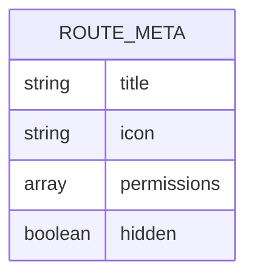
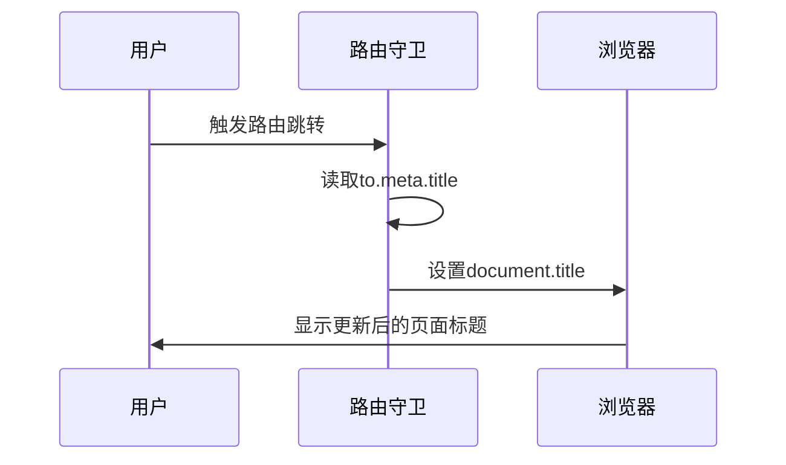
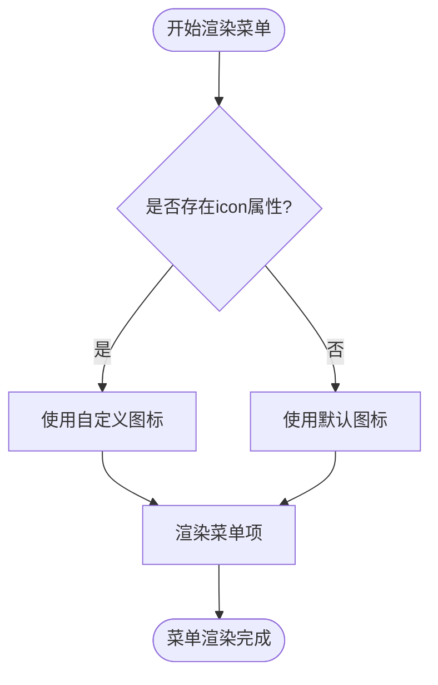
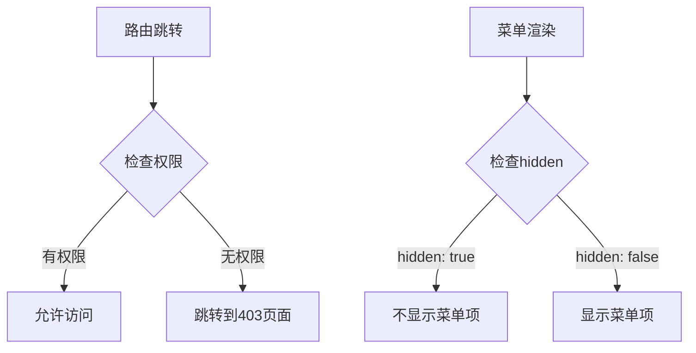
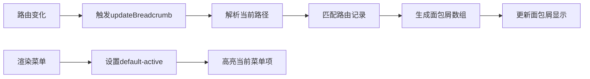
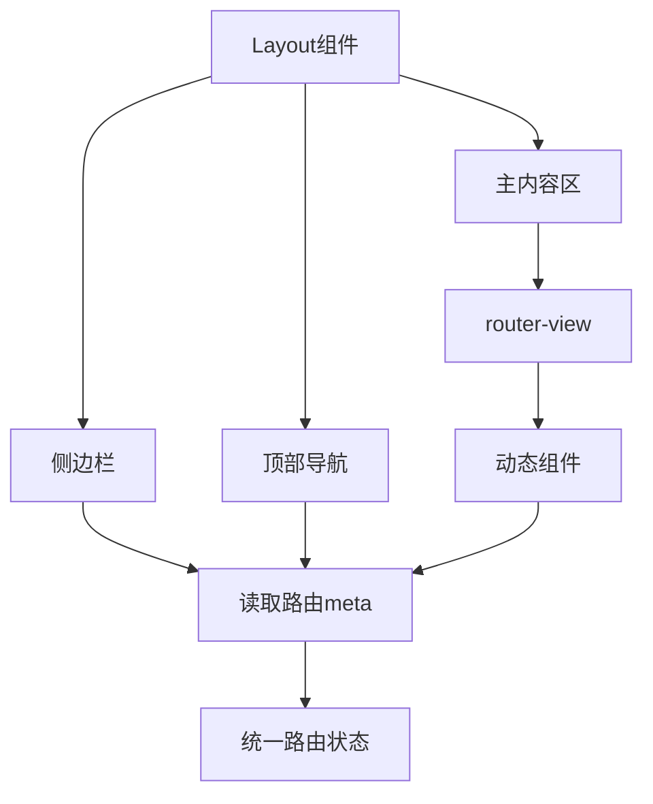

# 路由元信息应用

<cite>
**本文档引用文件**  
- [index.js](file://07-frontend/src/router/index.js)
- [index.vue](file://07-frontend/src/layout/index.vue)
- [system.js](file://07-frontend/src/router/modules/system.js)
- [systemMenu.js](file://07-frontend/src/router/modules/systemMenu.js)
- [menu.ts](file://07-frontend/src/utils/menu.ts)
- [permission.js](file://07-frontend/src/permission.js)
- [Dashboard.vue](file://07-frontend/src/pages/after-sales/Dashboard.vue)
- [Overview.vue](file://07-frontend/src/pages/system/Overview.vue)
</cite>

## 目录
1. [引言](#引言)
2. [路由元信息结构](#路由元信息结构)
3. [页面标题动态设置](#页面标题动态设置)
4. [侧边栏菜单图标渲染](#侧边栏菜单图标渲染)
5. [权限校验与菜单控制](#权限校验与菜单控制)
6. [导航高亮与面包屑](#导航高亮与面包屑)
7. [Layout组件与router-view集成](#layout组件与router-view集成)
8. [综合应用示例](#综合应用示例)
9. [结论](#结论)

## 引言
在现代前端应用中，路由元信息（meta字段）是实现路由配置与UI展示解耦的关键机制。通过在路由配置中定义meta字段，可以灵活控制页面标题、菜单显示、权限校验等多维度功能。本文将深入分析项目中路由meta字段的多维度应用，阐述其如何支持动态页面标题设置、侧边栏图标渲染、权限控制等核心功能。

**Section sources**
- [index.js](file://07-frontend/src/router/index.js#L1-L228)

## 路由元信息结构
路由元信息（meta字段）是Vue Router中用于存储路由相关元数据的对象。在本项目中，meta字段被广泛应用于存储页面标题、图标、权限等信息。典型的meta字段结构包括：

- **title**: 用于设置页面标题和菜单显示文本
- **icon**: 用于指定侧边栏菜单的图标
- **permissions**: 用于定义访问该路由所需的权限
- **hidden**: 用于控制菜单项是否在侧边栏中显示

这些元信息在路由配置中被定义，并在应用的各个组件中被读取和使用，实现了路由配置与UI展示的解耦。



**Diagram sources**
- [index.js](file://07-frontend/src/router/index.js#L1-L228)
- [system.js](file://07-frontend/src/router/modules/system.js#L1-L397)

**Section sources**
- [index.js](file://07-frontend/src/router/index.js#L1-L228)
- [system.js](file://07-frontend/src/router/modules/system.js#L1-L397)

## 页面标题动态设置
路由守卫通过读取meta字段中的title属性来动态设置页面标题，实现了每个页面的个性化标题显示。

在`index.js`文件中，路由前置守卫（beforeEach）通过以下逻辑实现页面标题的动态设置：

```javascript
router.beforeEach((to, from, next) => {
  document.title = to.meta.title ? `${to.meta.title} - 企业大脑系统` : '企业大脑系统';
  // ...其他逻辑
});
```

当路由切换时，系统会自动读取目标路由的meta.title属性，并将其设置为浏览器标签页的标题。这种机制确保了用户在浏览不同页面时，能够清晰地识别当前所处的页面位置。



**Diagram sources**
- [index.js](file://07-frontend/src/router/index.js#L200-L203)

**Section sources**
- [index.js](file://07-frontend/src/router/index.js#L200-L203)

## 侧边栏菜单图标渲染
侧边栏组件通过读取路由meta字段中的icon属性来驱动菜单图标的渲染，实现了菜单图标的动态配置。

在`Layout/index.vue`文件中，侧边栏菜单的渲染逻辑如下：

```vue
<el-sub-menu v-if="menu.children && menu.children.length > 0" :index="menu.path">
  <template #title>
    <el-icon><component :is="menu.icon || 'el-icon-menu'" /></el-icon>
    <span>{{ menu.meta.title }}</span>
  </template>
</el-sub-menu>
```

当渲染菜单项时，系统会检查路由配置中的icon属性。如果存在，则使用指定的图标组件；如果不存在，则使用默认图标。这种设计使得菜单图标的配置完全由路由元信息驱动，实现了UI展示与路由配置的分离。



**Diagram sources**
- [index.vue](file://07-frontend/src/layout/index.vue#L37-L41)

**Section sources**
- [index.vue](file://07-frontend/src/layout/index.vue#L37-L61)

## 权限校验与菜单控制
路由meta字段中的hidden字段和permissions字段被用于实现权限校验和菜单显示控制，确保了系统的安全性和用户体验。

在`system.js`路由模块中，可以看到权限相关的meta字段配置：

```javascript
{
  path: 'create',
  name: 'UserCreate',
  component: () => import('@/pages/system/users/UserForm.vue'),
  meta: { 
    title: '新增用户',
    permission: ['system:users:create'],
    hidden: true
  }
}
```

这里的`hidden: true`表示该路由不会在侧边栏菜单中显示，通常用于表单页面等不需要直接导航的页面。`permission`字段则定义了访问该页面所需的权限。

在`permission.js`文件中，权限校验逻辑如下：

```javascript
router.beforeEach(async (to, from, next) => {
  const permissions = store.getters.permissions;
  
  if (to.path.includes('/system/audit') && !permissions.includes('system:audit')) {
    return next({ path: '/403' });
  }
  
  next();
});
```

这种基于meta字段的权限控制机制，使得权限管理更加灵活和可维护。



**Diagram sources**
- [system.js](file://07-frontend/src/router/modules/system.js#L45-L52)
- [permission.js](file://07-frontend/src/permission.js#L2-L11)

**Section sources**
- [system.js](file://07-frontend/src/router/modules/system.js#L45-L52)
- [permission.js](file://07-frontend/src/permission.js#L2-L11)

## 导航高亮与面包屑
路由meta字段被用于实现导航高亮和面包屑功能，提升了用户的导航体验。

在`Layout/index.vue`文件中，面包屑的生成逻辑如下：

```javascript
updateBreadcrumb() {
  const path = this.$route.path
  const breadcrumb = []
  
  let currentPath = ''
  const pathParts = path.split('/').filter(part => part)
  
  pathParts.forEach((part, index) => {
    currentPath += '/' + part
    const route = this.$router.resolve(currentPath).matched[0]
    if (route) {
      breadcrumb.push(route)
    }
  })
  
  this.breadcrumbList = breadcrumb
}
```

同时，在侧边栏菜单中，通过`default-active`属性实现当前菜单项的高亮：

```vue
<el-menu :default-active="activeMenu">
```

其中`activeMenu`计算属性返回当前路由路径，确保对应的菜单项被高亮显示。



**Diagram sources**
- [index.vue](file://07-frontend/src/layout/index.vue#L366-L384)
- [index.vue](file://07-frontend/src/layout/index.vue#L147-L150)

**Section sources**
- [index.vue](file://07-frontend/src/layout/index.vue#L366-L384)

## Layout组件与router-view集成
Layout组件通过`<router-view>`的使用，实现了路由元信息与页面内容的无缝集成。

在`Layout/index.vue`文件中，主内容区域的结构如下：

```vue
<div class="content-wrapper">
  <router-view v-slot="{ Component }">
    <transition name="fade" mode="out-in">
      <component :is="Component" />
    </transition>
  </router-view>
</div>
```

这种设计模式使得Layout组件能够作为所有页面的容器，同时通过读取当前路由的meta字段来动态调整UI展示。路由守卫、侧边栏、面包屑等都基于同一个路由状态，确保了整个应用的一致性。



**Diagram sources**
- [index.vue](file://07-frontend/src/layout/index.vue#L104-L108)

**Section sources**
- [index.vue](file://07-frontend/src/layout/index.vue#L104-L108)

## 综合应用示例
通过分析系统管理模块的路由配置，我们可以看到meta字段的综合应用：

```javascript
export default {
  path: '/system',
  component: Layout,
  redirect: '/system/overview',
  name: 'System',
  meta: { 
    title: '系统管理', 
    icon: 'Setting',
    permission: ['system:view']
  },
  children: [
    {
      path: 'overview',
      name: 'SystemOverview',
      component: () => import('@/pages/system/Overview.vue'),
      meta: { 
        title: '系统总览',
        icon: 'Monitor',
        permission: ['system:overview']
      }
    }
  ]
}
```

在这个示例中：
- `title`用于设置页面标题和菜单显示
- `icon`用于驱动侧边栏图标渲染
- `permission`用于权限校验
- 路由守卫利用这些信息实现页面标题设置
- Layout组件利用这些信息实现菜单高亮和面包屑生成

这种设计模式使得路由配置成为应用UI和权限控制的单一数据源，极大地提高了代码的可维护性和一致性。

**Section sources**
- [system.js](file://07-frontend/src/router/modules/system.js#L3-L23)

## 结论
路由元信息在项目中扮演着至关重要的角色，通过title、icon、permissions、hidden等字段的合理使用，实现了路由配置与UI展示的完美解耦。这种设计模式不仅提高了代码的可维护性，还增强了应用的灵活性和安全性。路由守卫利用meta字段动态设置页面标题，侧边栏组件根据icon属性渲染菜单图标，权限系统基于permissions字段进行访问控制，而hidden字段则精确控制菜单的显示逻辑。结合Layout组件中的router-view使用，meta字段支持了权限校验、导航高亮、面包屑生成等多种场景，构建了一个灵活、可扩展的前端架构。