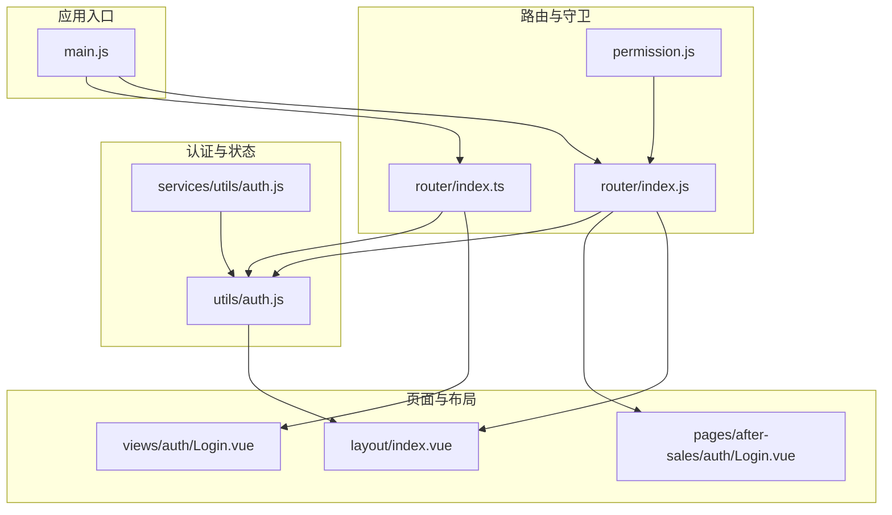
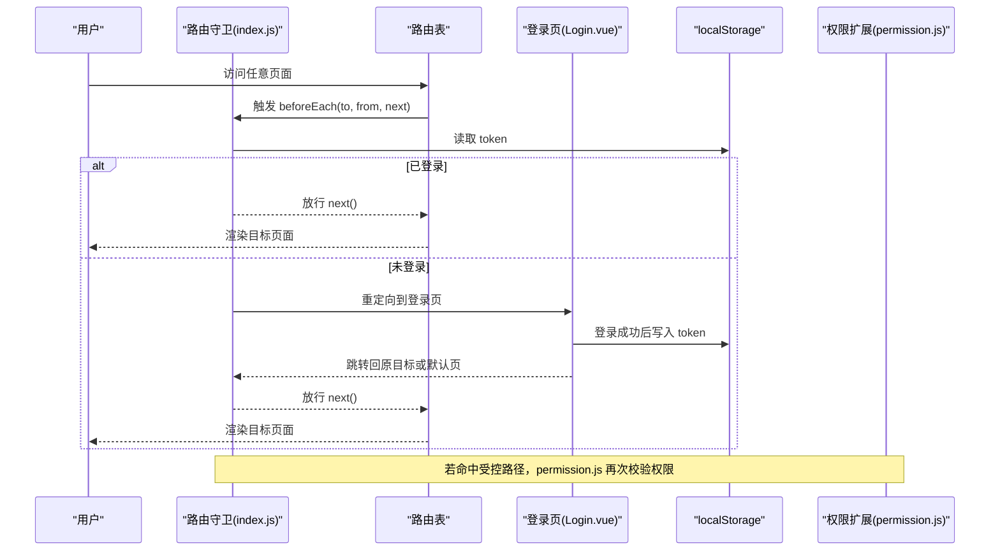
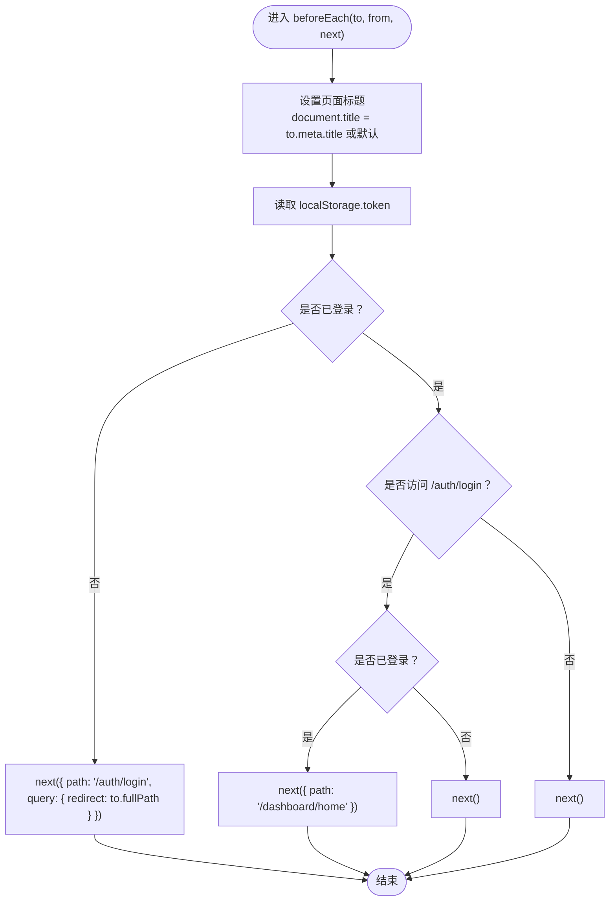
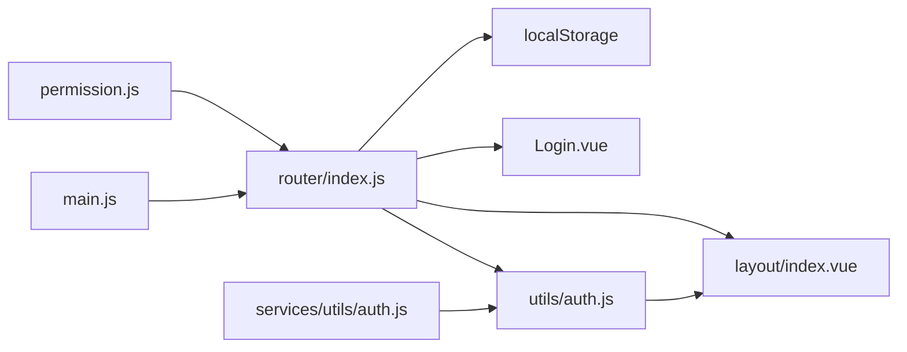

# 路由守卫机制

<cite>
**本文引用的文件**
- [router/index.js](file://07-frontend/src/router/index.js)
- [router/index.ts](file://07-frontend/src/router/index.ts)
- [permission.js](file://07-frontend/src/permission.js)
- [utils/auth.js](file://07-frontend/src/utils/auth.js)
- [layout/index.vue](file://07-frontend/src/layout/index.vue)
- [pages/after-sales/auth/Login.vue](file://07-frontend/src/pages/after-sales/auth/Login.vue)
- [views/auth/Login.vue](file://07-frontend/src/views/auth/Login.vue)
- [services/utils/auth.js](file://07-frontend/src/services/utils/auth.js)
- [main.js](file://07-frontend/src/main.js)
</cite>

## 目录
1. [引言](#引言)
2. [项目结构](#项目结构)
3. [核心组件](#核心组件)
4. [架构总览](#架构总览)
5. [详细组件分析](#详细组件分析)
6. [依赖关系分析](#依赖关系分析)
7. [性能考量](#性能考量)
8. [故障排查指南](#故障排查指南)
9. [结论](#结论)

## 引言
本文件围绕前端路由守卫的实现逻辑与安全控制策略展开，重点基于 index.js 中的 beforeEach 守卫函数，说明如何通过 localStorage 检查用户登录状态（token），实现未登录用户的自动重定向至登录页；同时对比 index.ts 的简化版本，分析路由守卫在不同环境下的配置差异，并阐述其在权限控制、页面访问拦截、登录状态管理中的核心作用。

## 项目结构
本次分析聚焦于前端路由与认证相关的核心文件：
- 路由与守卫：router/index.js、router/index.ts、permission.js
- 认证工具与状态：utils/auth.js、services/utils/auth.js
- 登录页面与布局：pages/after-sales/auth/Login.vue、views/auth/Login.vue、layout/index.vue
- 应用入口：main.js

图表来源
- [main.js](file://07-frontend/src/main.js#L1-L27)
- [router/index.js](file://07-frontend/src/router/index.js#L1-L228)
- [router/index.ts](file://07-frontend/src/router/index.ts#L1-L27)
- [permission.js](file://07-frontend/src/permission.js#L1-L13)
- [utils/auth.js](file://07-frontend/src/utils/auth.js#L1-L110)
- [services/utils/auth.js](file://07-frontend/src/services/utils/auth.js#L1-L279)
- [layout/index.vue](file://07-frontend/src/layout/index.vue#L1-L120)
- [pages/after-sales/auth/Login.vue](file://07-frontend/src/pages/after-sales/auth/Login.vue#L1-L140)
- [views/auth/Login.vue](file://07-frontend/src/views/auth/Login.vue#L1-L136)

章节来源
- [main.js](file://07-frontend/src/main.js#L1-L27)
- [router/index.js](file://07-frontend/src/router/index.js#L1-L228)
- [router/index.ts](file://07-frontend/src/router/index.ts#L1-L27)
- [permission.js](file://07-frontend/src/permission.js#L1-L13)

## 核心组件
- 路由守卫（JavaScript 版本）：在 beforeEach 中读取 localStorage 中的 token，判断是否已登录；对登录页特殊处理；未登录时重定向并携带 redirect 参数；已登录则放行。
- 路由守卫（TypeScript 版本）：在 beforeEach 中读取 localStorage 中的 token，非登录页且未登录时重定向到登录页；已登录则放行。
- 权限扩展守卫：在 permission.js 中对特定路径（如系统审计）进行权限校验，若无相应权限则重定向到 403。
- 认证工具：utils/auth.js 提供 token、用户信息、权限、角色等的本地存储与检查方法；services/utils/auth.js 提供更完善的认证类封装（包含过期检测、刷新等）。
- 登录页面：两个登录页均在登录成功后写入 localStorage 并跳转；前者支持 redirect 参数回跳，后者直接跳转到仪表盘。
- 布局组件：layout/index.vue 通过计算属性读取 localStorage 决定是否渲染侧边栏与菜单，并提供退出登录逻辑。

章节来源
- [router/index.js](file://07-frontend/src/router/index.js#L199-L226)
- [router/index.ts](file://07-frontend/src/router/index.ts#L18-L25)
- [permission.js](file://07-frontend/src/permission.js#L1-L13)
- [utils/auth.js](file://07-frontend/src/utils/auth.js#L1-L110)
- [services/utils/auth.js](file://07-frontend/src/services/utils/auth.js#L1-L279)
- [layout/index.vue](file://07-frontend/src/layout/index.vue#L136-L145)
- [pages/after-sales/auth/Login.vue](file://07-frontend/src/pages/after-sales/auth/Login.vue#L105-L118)
- [views/auth/Login.vue](file://07-frontend/src/views/auth/Login.vue#L112-L129)

## 架构总览
路由守卫作为全局拦截点，贯穿页面访问流程，结合 localStorage 的 token 状态与登录页组件，形成“未登录自动拦截、登录成功回跳”的闭环。同时，permission.js 对特定受控路径进行细粒度权限校验，进一步强化安全边界。

图表来源
- [router/index.js](file://07-frontend/src/router/index.js#L199-L226)
- [router/index.ts](file://07-frontend/src/router/index.ts#L18-L25)
- [pages/after-sales/auth/Login.vue](file://07-frontend/src/pages/after-sales/auth/Login.vue#L105-L118)
- [views/auth/Login.vue](file://07-frontend/src/views/auth/Login.vue#L112-L129)
- [permission.js](file://07-frontend/src/permission.js#L1-L13)

## 详细组件分析

### 组件A：JavaScript 路由守卫（index.js）
- 功能要点
  - 设置页面标题：根据 meta.title 动态设置 document.title。
  - 登录状态判定：通过 localStorage.getItem('token') 是否存在判断是否已登录。
  - 登录页特殊处理：若访问 /auth/login 且已登录，则重定向到首页；否则放行。
  - 其他页面拦截：未登录访问其他页面时，重定向到登录页并附带 redirect 查询参数，便于登录后回跳。
  - 已登录放行：直接调用 next()。

- 关键流程图

图表来源
- [router/index.js](file://07-frontend/src/router/index.js#L199-L226)

章节来源
- [router/index.js](file://07-frontend/src/router/index.js#L199-L226)

### 组件B：TypeScript 路由守卫（index.ts）
- 功能要点
  - 简化版守卫：仅判断 token 是否存在与路径是否以 /auth 开头。
  - 未登录且非登录页：重定向到 /auth/login。
  - 已登录或访问登录页：直接放行。

- 流程对比
  - 与 JavaScript 版本相比，该版本未显式设置页面标题，也未对 /auth/login 做“已登录回跳”处理，逻辑更简洁但灵活性较低。

章节来源
- [router/index.ts](file://07-frontend/src/router/index.ts#L18-L25)

### 组件C：权限扩展守卫（permission.js）
- 功能要点
  - 从 store.getters.permissions 获取用户权限集合。
  - 对包含 /system/audit 的路径进行权限校验（例如 system:audit）。
  - 无权限时重定向到 403；有权限则放行。

- 适用场景
  - 针对敏感模块（如审计）进行二次权限校验，弥补路由层无法动态判断权限的不足。

章节来源
- [permission.js](file://07-frontend/src/permission.js#L1-L13)

### 组件D：认证工具与状态（utils/auth.js）
- 功能要点
  - 提供 token、用户信息、权限、角色的本地存储与读取方法。
  - 提供 hasPermission、hasRole、isAdmin 等便捷检查函数。
  - 提供 isTokenExpired（基于 JWT 解析 exp 的简单实现）。

- 与守卫的关系
  - 路由守卫依赖 localStorage 中的 token 判断登录状态。
  - 布局组件与业务页面可复用这些工具进行权限判断与状态展示。

章节来源
- [utils/auth.js](file://07-frontend/src/utils/auth.js#L1-L110)

### 组件E：认证类封装（services/utils/auth.js）
- 功能要点
  - 封装了更完善的认证类，包括配置、存储抽象、过期检测、自动刷新、登出流程等。
  - 支持多种存储介质（localStorage、sessionStorage、cookie）与令牌前缀。
  - 提供登录、登出、认证状态检查等能力。

- 与守卫的关系
  - 可替代简单的 localStorage 检查，提供更健壮的令牌生命周期管理与刷新策略，适合生产环境。

章节来源
- [services/utils/auth.js](file://07-frontend/src/services/utils/auth.js#L1-L279)

### 组件F：登录页与回跳逻辑
- after-sales 登录页
  - 登录成功后写入 token 与用户信息，并根据 query.redirect 决定回跳地址；若无 redirect，默认跳转到 /dashboard/home。
- views 登录页
  - 登录成功后写入 token、用户名、角色，清空密码，直接跳转到 /dashboard，避免根路径重定向循环。

章节来源
- [pages/after-sales/auth/Login.vue](file://07-frontend/src/pages/after-sales/auth/Login.vue#L105-L118)
- [views/auth/Login.vue](file://07-frontend/src/views/auth/Login.vue#L112-L129)

### 组件G：布局与登录状态联动（layout/index.vue）
- 功能要点
  - 通过计算属性读取 localStorage.token 判断登录状态，决定渲染侧边栏与菜单或直接显示路由内容。
  - 提供退出登录逻辑：清除 token 与用户信息并跳转到登录页。

章节来源
- [layout/index.vue](file://07-frontend/src/layout/index.vue#L136-L145)
- [layout/index.vue](file://07-frontend/src/layout/index.vue#L399-L416)

## 依赖关系分析
- 路由守卫依赖
  - localStorage：用于判断登录状态与回跳参数。
  - 登录页：负责写入 token 并触发回跳。
  - 权限扩展：对特定路径进行二次权限校验。
- 认证工具与类
  - 为守卫与布局提供统一的状态查询与权限判断能力。
- 应用入口
  - main.js 挂载路由、状态管理与 UI 组件库，确保守卫在应用启动后生效。

图表来源
- [router/index.js](file://07-frontend/src/router/index.js#L199-L226)
- [permission.js](file://07-frontend/src/permission.js#L1-L13)
- [utils/auth.js](file://07-frontend/src/utils/auth.js#L1-L110)
- [services/utils/auth.js](file://07-frontend/src/services/utils/auth.js#L1-L279)
- [layout/index.vue](file://07-frontend/src/layout/index.vue#L136-L145)
- [pages/after-sales/auth/Login.vue](file://07-frontend/src/pages/after-sales/auth/Login.vue#L105-L118)
- [main.js](file://07-frontend/src/main.js#L1-L27)

章节来源
- [router/index.js](file://07-frontend/src/router/index.js#L199-L226)
- [permission.js](file://07-frontend/src/permission.js#L1-L13)
- [utils/auth.js](file://07-frontend/src/utils/auth.js#L1-L110)
- [services/utils/auth.js](file://07-frontend/src/services/utils/auth.js#L1-L279)
- [layout/index.vue](file://07-frontend/src/layout/index.vue#L136-L145)
- [pages/after-sales/auth/Login.vue](file://07-frontend/src/pages/after-sales/auth/Login.vue#L105-L118)
- [main.js](file://07-frontend/src/main.js#L1-L27)

## 性能考量
- 守卫执行频率：每次路由切换都会触发 beforeEach，建议保持判断逻辑轻量（如 localStorage 读取）。
- 权限校验成本：permission.js 中的权限判断应尽量避免复杂计算，必要时缓存权限集合。
- 令牌过期处理：在生产环境中建议采用 services/utils/auth.js 的过期检测与刷新机制，减少无效请求与频繁重定向。
- 页面标题设置：仅在 meta.title 存在时才设置，避免不必要的 DOM 操作。

## 故障排查指南
- 无法登录或反复重定向
  - 检查登录页是否正确写入 token 与用户信息；确认回跳参数 redirect 是否传递。
  - 参考路径：[pages/after-sales/auth/Login.vue](file://07-frontend/src/pages/after-sales/auth/Login.vue#L105-L118)、[views/auth/Login.vue](file://07-frontend/src/views/auth/Login.vue#L112-L129)
- 登录后仍被重定向到登录页
  - 确认 localStorage 中 token 是否存在；检查守卫逻辑是否误判。
  - 参考路径：[router/index.js](file://07-frontend/src/router/index.js#L205-L216)、[router/index.ts](file://07-frontend/src/router/index.ts#L18-L25)
- 访问受控路径报 403
  - 检查 store.getters.permissions 是否包含所需权限；确认 permission.js 是否正确拦截。
  - 参考路径：[permission.js](file://07-frontend/src/permission.js#L1-L13)
- 退出登录后仍显示菜单
  - 确认退出登录逻辑是否清除 token 与用户信息，并触发路由跳转。
  - 参考路径：[layout/index.vue](file://07-frontend/src/layout/index.vue#L399-L416)

章节来源
- [pages/after-sales/auth/Login.vue](file://07-frontend/src/pages/after-sales/auth/Login.vue#L105-L118)
- [views/auth/Login.vue](file://07-frontend/src/views/auth/Login.vue#L112-L129)
- [router/index.js](file://07-frontend/src/router/index.js#L205-L216)
- [router/index.ts](file://07-frontend/src/router/index.ts#L18-L25)
- [permission.js](file://07-frontend/src/permission.js#L1-L13)
- [layout/index.vue](file://07-frontend/src/layout/index.vue#L399-L416)

## 结论
- JavaScript 版本的路由守卫通过 localStorage 的 token 实现登录状态判断与自动重定向，逻辑清晰、覆盖全面；TypeScript 版本更简洁，适合轻量场景。
- permission.js 提供了针对敏感模块的二次权限校验，增强了系统的安全边界。
- utils/auth.js 与 services/utils/auth.js 为守卫与页面提供了统一的认证与权限工具，建议在生产环境采用更完善的认证类封装以提升稳定性与可维护性。
- 登录页与布局组件与守卫紧密配合，形成“登录—回跳—渲染”的完整闭环，保障用户体验与安全。