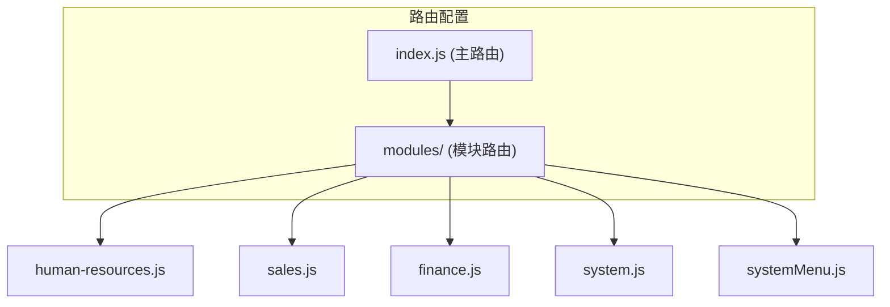
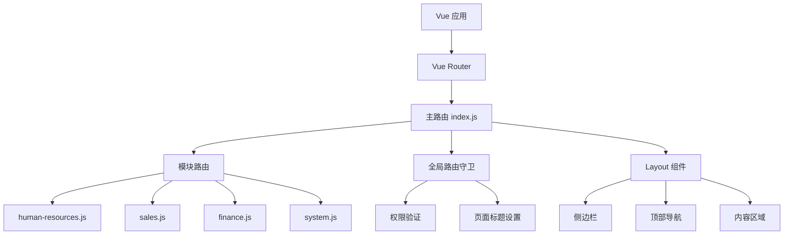
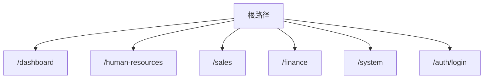
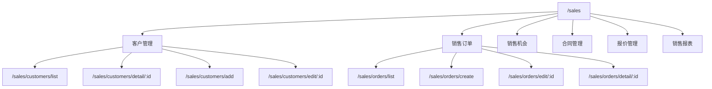
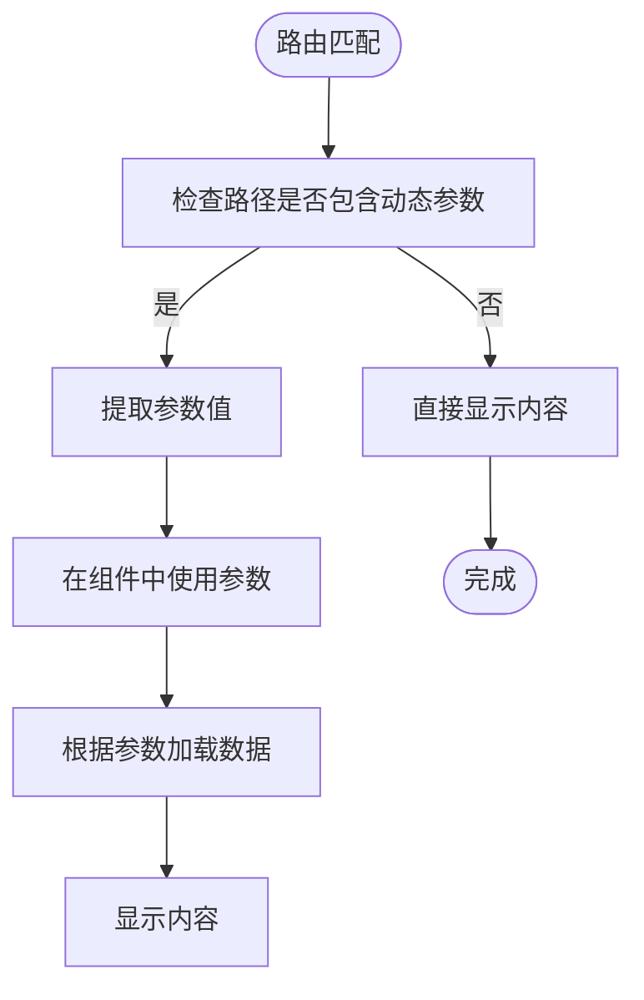
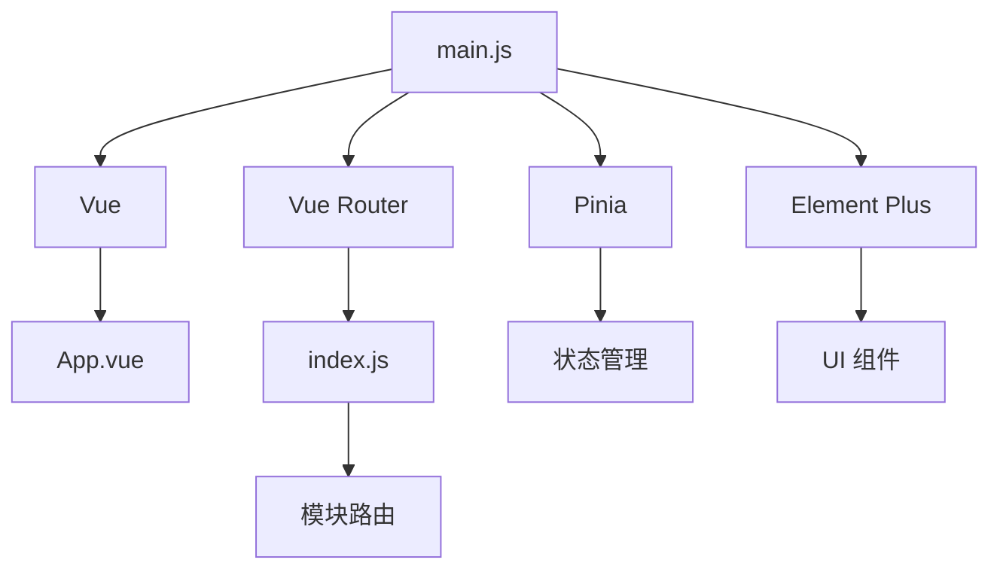

# 路由路径规范

<cite>
**本文档引用文件**  
- [index.js](file://07-frontend/src/router/index.js)
- [human-resources.js](file://07-frontend/src/router/modules/human-resources.js)
- [sales.js](file://07-frontend/src/router/modules/sales.js)
- [finance.js](file://07-frontend/src/router/modules/finance.js)
- [system.js](file://07-frontend/src/router/modules/system.js)
- [systemMenu.js](file://07-frontend/src/router/modules/systemMenu.js)
- [index.vue](file://07-frontend/src/layout/index.vue)
- [permission.js](file://07-frontend/src/permission.js)
- [main.js](file://07-frontend/src/main.js)
</cite>

## 目录
1. [引言](#引言)
2. [项目结构](#项目结构)
3. [核心组件](#核心组件)
4. [架构概述](#架构概述)
5. [详细组件分析](#详细组件分析)
6. [依赖分析](#依赖分析)
7. [性能考虑](#性能考虑)
8. [故障排除指南](#故障排除指南)
9. [结论](#结论)

## 引言
本文档旨在系统梳理前端路由的路径命名约定与层级设计原则，详细说明根路径与嵌套路由的层级关系，分析路径别名、动态路径参数的使用场景及配置方式，并结合 `index.js` 中的 `redirect` 配置，阐述路由重定向的最佳实践，确保用户导航流畅性与 URL 语义清晰。

## 项目结构
本项目采用模块化路由设计，将不同功能模块的路由配置分离到独立文件中，通过主路由文件统一导入和注册。这种结构提高了代码的可维护性和可读性。



**图源**  
- [index.js](file://07-frontend/src/router/index.js#L1-L228)
- [human-resources.js](file://07-frontend/src/router/modules/human-resources.js#L1-L26)
- [sales.js](file://07-frontend/src/router/modules/sales.js#L1-L349)
- [finance.js](file://07-frontend/src/router/modules/finance.js#L1-L437)
- [system.js](file://07-frontend/src/router/modules/system.js#L1-L397)
- [systemMenu.js](file://07-frontend/src/router/modules/systemMenu.js#L1-L56)

**节源**  
- [index.js](file://07-frontend/src/router/index.js#L1-L228)

## 核心组件
前端路由系统基于 Vue Router 实现，采用嵌套路由设计，通过 `Layout` 组件统一管理页面布局。路由配置中包含路径、组件、重定向、元信息等关键属性，支持权限控制和动态参数。

**节源**  
- [index.js](file://07-frontend/src/router/index.js#L1-L228)
- [index.vue](file://07-frontend/src/layout/index.vue#L1-L631)

## 架构概述
系统采用基于 Vue Router 的前端路由架构，通过模块化设计将不同业务领域的路由分离管理。主路由文件 `index.js` 负责整合所有模块路由，并配置全局路由守卫进行权限验证和页面标题设置。



**图源**  
- [index.js](file://07-frontend/src/router/index.js#L1-L228)
- [index.vue](file://07-frontend/src/layout/index.vue#L1-L631)
- [main.js](file://07-frontend/src/main.js#L1-L27)

**节源**  
- [index.js](file://07-frontend/src/router/index.js#L1-L228)
- [main.js](file://07-frontend/src/main.js#L1-L27)

## 详细组件分析
### 路由层级与命名约定
系统路由采用清晰的层级结构和命名约定，根路径如 `/`、`/dashboard`、`/human-resources` 等表示主要功能模块，嵌套路由如 `/dashboard/hr`、`/sales/orders` 则表示子功能模块。

#### 根路径设计
根路径设计遵循业务领域划分原则，每个主要功能模块都有独立的根路径：
- `/dashboard`：仪表盘与工作台
- `/human-resources`：人力资源管理
- `/sales`：销售管理
- `/finance`：财务管理
- `/system`：系统管理



**图源**  
- [index.js](file://07-frontend/src/router/index.js#L19-L192)

**节源**  
- [index.js](file://07-frontend/src/router/index.js#L19-L192)

#### 嵌套路由设计
嵌套路由通过 `children` 属性实现，形成清晰的父子关系。例如，销售管理模块包含客户管理、订单管理、合同管理等多个子模块：



**图源**  
- [sales.js](file://07-frontend/src/router/modules/sales.js#L4-L349)

**节源**  
- [sales.js](file://07-frontend/src/router/modules/sales.js#L4-L349)

### 动态路径参数
系统广泛使用动态路径参数来处理需要传递标识符的场景，如详情页、编辑页等。动态参数以冒号 `:` 开头，如 `:id`。

#### 动态参数使用场景
动态路径参数主要用于以下场景：
- 详情页面：`/sales/customers/detail/:id`
- 编辑页面：`/sales/orders/edit/:id`
- 审批页面：`/finance/general-ledger/approve/:id`



**图源**  
- [sales.js](file://07-frontend/src/router/modules/sales.js#L45-L73)
- [finance.js](file://07-frontend/src/router/modules/finance.js#L263-L271)

**节源**  
- [sales.js](file://07-frontend/src/router/modules/sales.js#L45-L73)
- [finance.js](file://07-frontend/src/router/modules/finance.js#L263-L271)

### 路由重定向
系统通过 `redirect` 配置实现路由重定向，优化用户体验和导航流程。

#### 重定向配置
重定向配置主要应用于以下场景：
- 根路径重定向到登录页
- 模块根路径重定向到默认子页面
- 未匹配路径重定向到 404 页面

```javascript
// 根路径重定向到登录页
{
  path: '/',
  redirect: '/auth/login'
}

// 仪表盘重定向到首页
{
  path: '/dashboard',
  redirect: '/dashboard/home'
}

// 人力资源管理重定向到概览页
{
  path: '/human-resources',
  redirect: '/human-resources/dashboard'
}
```

**节源**  
- [index.js](file://07-frontend/src/router/index.js#L19-L21)
- [human-resources.js](file://07-frontend/src/router/modules/human-resources.js#L7-L8)

### 权限控制
系统通过路由元信息中的 `permission` 字段实现基于角色的权限控制，确保用户只能访问其权限范围内的页面。

#### 权限配置示例
```javascript
{
  path: '/system',
  meta: { 
    title: '系统管理', 
    permission: ['system:view']
  },
  children: [
    {
      path: 'users',
      meta: { 
        title: '用户管理', 
        permission: ['system:users']
      },
      children: [
        {
          path: 'list',
          meta: { 
            title: '用户列表',
            permission: ['system:users:list']
          }
        }
      ]
    }
  ]
}
```

**节源**  
- [system.js](file://07-frontend/src/router/modules/system.js#L8-L12)
- [permission.js](file://07-frontend/src/permission.js#L1-L13)

## 依赖分析
系统路由依赖于 Vue Router、Element Plus 组件库和 Pinia 状态管理。主应用通过 `main.js` 文件注册这些依赖，并挂载到 DOM 中。



**图源**  
- [main.js](file://07-frontend/src/main.js#L1-L27)
- [index.js](file://07-frontend/src/router/index.js#L1-L228)

**节源**  
- [main.js](file://07-frontend/src/main.js#L1-L27)

## 性能考虑
路由系统通过懒加载（`import()`）实现代码分割，按需加载组件，减少初始加载时间。同时，使用路由守卫进行权限验证，避免未授权访问。

## 故障排除指南
### 路由不生效
检查路由配置是否正确导入到主路由文件，确保路径拼写无误。

### 权限控制失效
确认 `permission.js` 中的路由守卫逻辑是否正确执行，检查用户权限数据是否正确加载。

### 动态参数无法获取
确保在组件中正确使用 `useRoute()` 钩子获取路由参数。

**节源**  
- [index.js](file://07-frontend/src/router/index.js#L200-L225)
- [permission.js](file://07-frontend/src/permission.js#L1-L13)

## 结论
本文档系统梳理了前端路由的路径命名约定与层级设计原则，详细说明了根路径与嵌套路由的层级关系，分析了路径别名、动态路径参数的使用场景及配置方式，并结合 `index.js` 中的 `redirect` 配置，阐述了路由重定向的最佳实践。通过模块化设计、权限控制和懒加载等技术，确保了用户导航的流畅性和 URL 的语义清晰性。