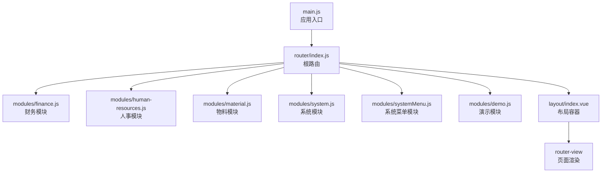
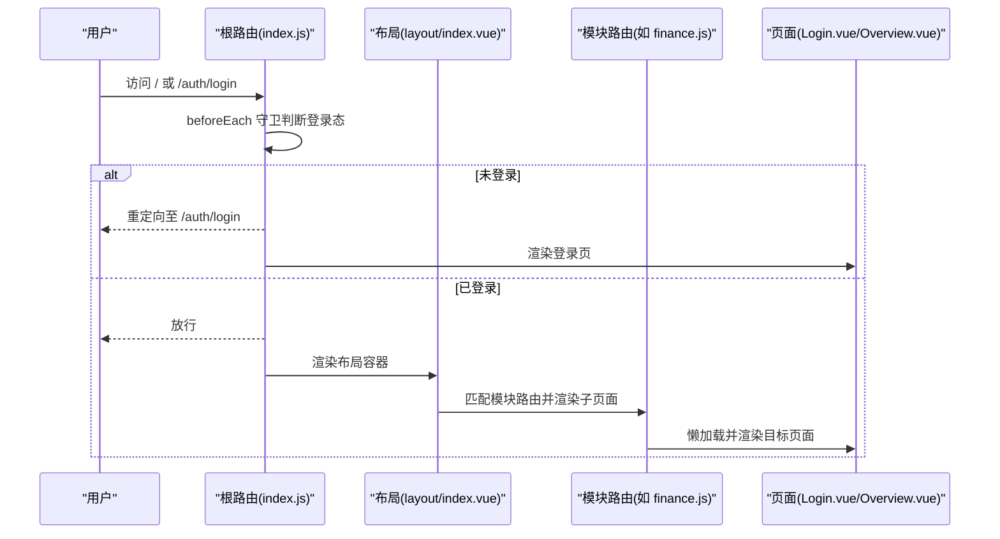
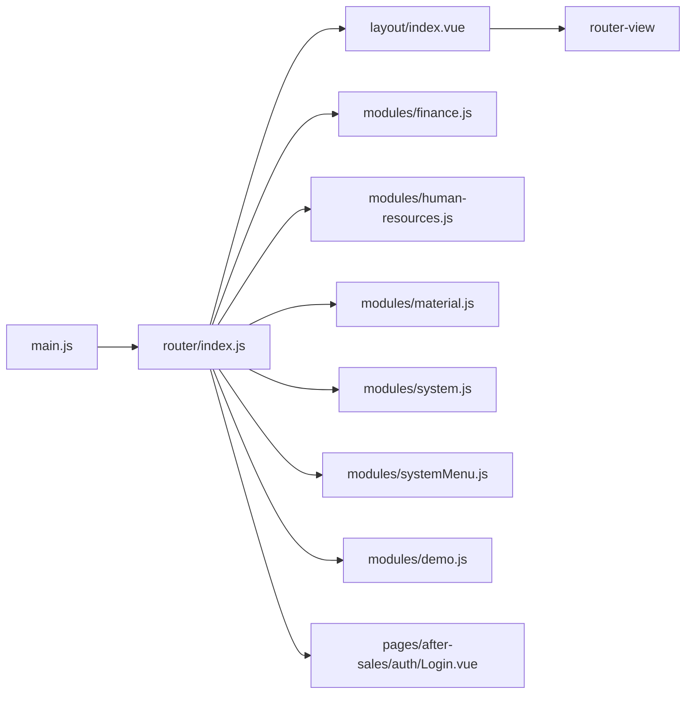

# 路由配置

<cite>
**本文引用的文件**
- [index.js](file://07-frontend/src/router/index.js)
- [finance.js](file://07-frontend/src/router/modules/finance.js)
- [human-resources.js](file://07-frontend/src/router/modules/human-resources.js)
- [material.js](file://07-frontend/src/router/modules/material.js)
- [system.js](file://07-frontend/src/router/modules/system.js)
- [systemMenu.js](file://07-frontend/src/router/modules/systemMenu.js)
- [demo.js](file://07-frontend/src/router/modules/demo.js)
- [index.vue](file://07-frontend/src/layout/index.vue)
- [main.js](file://07-frontend/src/main.js)
- [Login.vue](file://07-frontend/src/pages/after-sales/auth/Login.vue)
- [Overview.vue](file://07-frontend/src/pages/finance/Overview.vue)
- [HRDashboard.vue](file://07-frontend/src/pages/dashboard/HRDashboard.vue)
- [permission.js](file://07-frontend/src/permission.js)
</cite>

## 目录
1. [简介](#简介)
2. [项目结构](#项目结构)
3. [核心组件](#核心组件)
4. [架构总览](#架构总览)
5. [详细组件分析](#详细组件分析)
6. [依赖关系分析](#依赖关系分析)
7. [性能考量](#性能考量)
8. [故障排查指南](#故障排查指南)
9. [结论](#结论)

## 简介
本文件围绕前端路由的模块化配置机制展开，重点解析根路由文件如何通过动态导入整合各业务模块路由；深入剖析 finance、human-resources、material 等模块的结构设计与路径组织；阐述嵌套路由在 dashboard 下的工作台页面配置；并结合代码示例展示重定向、别名、命名视图等高级特性在实际工程中的应用方式，帮助开发者掌握复杂路由场景下的配置方法。

## 项目结构
前端路由采用“根路由聚合 + 模块化拆分”的组织方式：
- 根路由集中定义全局默认行为、登录页、404、仪表盘嵌套路由及模块路由集合
- 各业务模块以独立文件导出路由对象，根路由统一引入并挂载
- 布局组件负责整体容器、侧边栏、面包屑与过渡动画
- 入口文件负责安装路由、状态管理与 UI 库

图表来源
- [main.js](file://07-frontend/src/main.js#L1-L27)
- [index.js](file://07-frontend/src/router/index.js#L1-L120)
- [index.vue](file://07-frontend/src/layout/index.vue#L100-L122)

章节来源
- [index.js](file://07-frontend/src/router/index.js#L1-L120)
- [main.js](file://07-frontend/src/main.js#L1-L27)

## 核心组件
- 根路由 index.js：集中声明全局重定向、登录页、仪表盘嵌套路由、404，以及按需引入各模块路由并注入到路由表
- 布局组件 layout/index.vue：提供侧边栏、面包屑、顶部导航与页面过渡动画，作为所有模块路由的容器
- 模块路由：finance.js、human-resources.js、material.js、system.js、systemMenu.js、demo.js，每个模块导出一个包含 path、component、children、meta 的路由对象
- 登录页 Login.vue：用于认证流程与重定向处理
- 权限守卫 permission.js：演示如何在路由守卫中做细粒度权限拦截

章节来源
- [index.js](file://07-frontend/src/router/index.js#L1-L120)
- [index.vue](file://07-frontend/src/layout/index.vue#L100-L122)
- [finance.js](file://07-frontend/src/router/modules/finance.js#L1-L60)
- [human-resources.js](file://07-frontend/src/router/modules/human-resources.js#L1-L26)
- [material.js](file://07-frontend/src/router/modules/material.js#L1-L19)
- [system.js](file://07-frontend/src/router/modules/system.js#L1-L120)
- [systemMenu.js](file://07-frontend/src/router/modules/systemMenu.js#L1-L56)
- [demo.js](file://07-frontend/src/router/modules/demo.js#L1-L23)
- [Login.vue](file://07-frontend/src/pages/after-sales/auth/Login.vue#L112-L140)
- [permission.js](file://07-frontend/src/permission.js#L1-L12)

## 架构总览
根路由通过 createRouter + createWebHistory 初始化，配合 beforeEach 前置守卫实现登录态与页面标题设置；布局组件作为所有模块的父级容器，承载侧边栏与面包屑导航；模块路由以 children 形式组织子页面，支持多层嵌套与权限元信息。

图表来源
- [index.js](file://07-frontend/src/router/index.js#L194-L228)
- [index.vue](file://07-frontend/src/layout/index.vue#L100-L122)
- [finance.js](file://07-frontend/src/router/modules/finance.js#L1-L60)
- [Login.vue](file://07-frontend/src/pages/after-sales/auth/Login.vue#L112-L140)

## 详细组件分析

### 根路由 index.js：模块化聚合与动态导入
- 全局默认重定向：/ -> /auth/login
- 登录页：/auth/login，懒加载 Login.vue，meta 中设置标题
- 仪表盘嵌套路由：/dashboard 作为 Layout 容器，children 下包含 home、hr、ai、rd、kpi、sales、quality 等工作台页面，均采用懒加载
- 模块路由聚合：通过 import 引入各模块路由对象，并在 routes 数组中直接注入，形成模块化聚合
- 404 页面：通配符路由，懒加载 404.vue
- 前置守卫：设置页面标题、校验登录态；登录页特殊处理；未登录自动跳转登录并携带 redirect 参数

章节来源
- [index.js](file://07-frontend/src/router/index.js#L1-L120)
- [index.js](file://07-frontend/src/router/index.js#L120-L193)
- [index.js](file://07-frontend/src/router/index.js#L194-L228)

### 布局组件 layout/index.vue：容器与导航
- 侧边栏：基于 Element Plus 菜单，支持折叠、搜索、图标与权限禁用
- 面包屑：根据当前路由路径动态生成
- 顶部导航：用户信息与登出
- 页面内容：通过 router-view + 过渡动画渲染模块页面
- 登录态与菜单：根据本地 token 决定是否渲染布局与菜单

章节来源
- [index.vue](file://07-frontend/src/layout/index.vue#L1-L122)
- [index.vue](file://07-frontend/src/layout/index.vue#L123-L419)

### 模块路由：finance（财务）
- 结构：顶层 /finance 作为 Layout 容器，children 下包含 overview、expense、budget、funds、reports、tax、general-ledger、accounts-receivable 等子模块
- 路径与重定向：多数子模块提供 redirect，便于快速进入列表页
- 懒加载：子页面均采用动态导入
- 元信息：meta 中包含 title、icon、permission 等字段，用于菜单渲染与权限控制
- 嵌套深度：general-ledger 与 accounts-receivable 等包含多层子路由，适合复杂业务场景

章节来源
- [finance.js](file://07-frontend/src/router/modules/finance.js#L1-L60)
- [finance.js](file://07-frontend/src/router/modules/finance.js#L60-L160)
- [finance.js](file://07-frontend/src/router/modules/finance.js#L160-L320)
- [finance.js](file://07-frontend/src/router/modules/finance.js#L320-L437)
- [Overview.vue](file://07-frontend/src/pages/finance/Overview.vue#L1-L22)

### 模块路由：human-resources（人事）
- 结构：/human-resources 作为 Layout 容器，children 下包含 dashboard、user-list 等
- 路径与重定向：redirect 到 dashboard
- 元信息：meta 中包含 title、icon
- 与系统模块复用：user-list 复用系统模块的用户列表组件

章节来源
- [human-resources.js](file://07-frontend/src/router/modules/human-resources.js#L1-L26)

### 模块路由：material（物料）
- 结构：/material 作为 Layout 容器，children 下包含 list 子路由
- 路径与重定向：redirect 到 list
- 元信息：meta 中包含 title
- 设计简洁：适合单一页面模块

章节来源
- [material.js](file://07-frontend/src/router/modules/material.js#L1-L19)

### 模块路由：system（系统管理）
- 结构：/system 作为 Layout 容器，children 下包含 overview、users、roles、departments、menu、dictionary、config、audit-log、data-change、operation-trace、monitor 等
- 路径与重定向：多处提供 redirect，便于快速进入列表页
- 元信息：meta 中包含 title、icon、permission
- 嵌套深度：users、roles、departments、menu、dictionary、config、monitor 等均有多层子路由，体现系统管理的复杂性

章节来源
- [system.js](file://07-frontend/src/router/modules/system.js#L1-L120)
- [system.js](file://07-frontend/src/router/modules/system.js#L120-L260)
- [system.js](file://07-frontend/src/router/modules/system.js#L260-L397)

### 模块路由：systemMenu（系统菜单）
- 结构：/system 作为 Layout 容器，children 下包含 menu-management、menu-drag-sort、menu-permission、user-menu-config 等
- 元信息：meta 中包含 title、icon、permissions
- 与 system.js 的差异：该模块聚焦菜单管理的子功能，避免与 system.js 的大模块耦合

章节来源
- [systemMenu.js](file://07-frontend/src/router/modules/systemMenu.js#L1-L56)

### 模块路由：demo（演示）
- 结构：/demo 作为 Layout 容器，children 下包含 smart-select 子路由
- 元信息：meta 中包含 title、icon
- 用途：用于演示组件或功能

章节来源
- [demo.js](file://07-frontend/src/router/modules/demo.js#L1-L23)

### 嵌套路由与工作台页面：dashboard
- 顶层 /dashboard 作为 Layout 容器，children 下包含 home、hr、ai、rd、kpi、sales、quality 等工作台页面
- 每个工作台页面均为懒加载组件，meta 中设置标题，便于面包屑与页面标题一致
- 通过 redirect 将 /dashboard 重定向到 /dashboard/home，保证首次访问的友好体验

章节来源
- [index.js](file://07-frontend/src/router/index.js#L30-L79)
- [HRDashboard.vue](file://07-frontend/src/pages/dashboard/HRDashboard.vue#L1-L200)

### 路由元信息（meta）使用规范
- 基础字段：title（页面标题）、icon（菜单图标）、hidden（是否隐藏于菜单）
- 权限字段：permission 或 permissions（用于菜单禁用与权限拦截）
- 布局字段：作为 Layout 容器的模块通常不直接设置 title/icon，而是由 children 页面设置
- 在布局组件中，菜单渲染与权限禁用均读取 meta 字段

章节来源
- [finance.js](file://07-frontend/src/router/modules/finance.js#L1-L60)
- [system.js](file://07-frontend/src/router/modules/system.js#L1-L120)
- [systemMenu.js](file://07-frontend/src/router/modules/systemMenu.js#L1-L56)
- [index.vue](file://07-frontend/src/layout/index.vue#L1-L122)

### 路由重定向与别名
- 重定向（redirect）：多处模块提供 redirect，如 /finance/expense/list、/system/users/list 等，便于快速进入列表页
- 别名（alias）：在当前代码中未发现显式 alias 使用
- 通配符 404：/:pathMatch(.*)* 懒加载 404.vue，提升首屏性能

章节来源
- [finance.js](file://07-frontend/src/router/modules/finance.js#L24-L63)
- [system.js](file://07-frontend/src/router/modules/system.js#L24-L120)
- [index.js](file://07-frontend/src/router/index.js#L184-L193)

### 命名视图与多视图渲染
- 当前代码未出现命名视图（如多 router-view 的场景）
- 若需实现命名视图，可在布局组件的 router-view 上使用 name 属性，并在路由配置中提供对应 named views

章节来源
- [index.vue](file://07-frontend/src/layout/index.vue#L100-L122)

### 登录与重定向流程
- 登录页：/auth/login，懒加载 Login.vue
- 登录成功后：从 query 中读取 redirect（若无则默认 /dashboard/home），随后跳转
- 未登录访问受保护路由：前置守卫将自动跳转到 /auth/login 并携带 redirect

章节来源
- [index.js](file://07-frontend/src/router/index.js#L194-L228)
- [Login.vue](file://07-frontend/src/pages/after-sales/auth/Login.vue#L112-L140)

### 权限拦截与细粒度控制
- 路由守卫：在 permission.js 中演示了基于 store.getters.permissions 的权限拦截
- 布局组件：菜单项的 disabled 依据 meta.permissions 判断
- 建议：将用户权限与路由元信息解耦，通过后端返回菜单树或权限清单，在前端动态组装路由与菜单

章节来源
- [permission.js](file://07-frontend/src/permission.js#L1-L12)
- [index.vue](file://07-frontend/src/layout/index.vue#L1-L122)

## 依赖关系分析
- 入口文件 main.js 安装路由、状态管理与 UI 库
- 根路由 index.js 引入各模块路由对象并注入
- 布局组件 layout/index.vue 作为所有模块的父容器
- 模块路由通过动态导入实现懒加载，降低首屏体积
- 登录页 Login.vue 与根路由守卫协作完成认证与重定向

图表来源
- [main.js](file://07-frontend/src/main.js#L1-L27)
- [index.js](file://07-frontend/src/router/index.js#L1-L120)
- [index.vue](file://07-frontend/src/layout/index.vue#L100-L122)
- [finance.js](file://07-frontend/src/router/modules/finance.js#L1-L60)
- [human-resources.js](file://07-frontend/src/router/modules/human-resources.js#L1-L26)
- [material.js](file://07-frontend/src/router/modules/material.js#L1-L19)
- [system.js](file://07-frontend/src/router/modules/system.js#L1-L120)
- [systemMenu.js](file://07-frontend/src/router/modules/systemMenu.js#L1-L56)
- [demo.js](file://07-frontend/src/router/modules/demo.js#L1-L23)
- [Login.vue](file://07-frontend/src/pages/after-sales/auth/Login.vue#L112-L140)

章节来源
- [main.js](file://07-frontend/src/main.js#L1-L27)
- [index.js](file://07-frontend/src/router/index.js#L1-L120)

## 性能考量
- 懒加载：所有页面组件均采用动态导入，减少初始包体，提升首屏加载速度
- 404 通配符：仅在匹配到不存在路径时才加载 404.vue
- 前置守卫：避免未登录用户访问受保护路由，减少无效渲染
- 建议：对大型模块可进一步拆分，按需加载；对高频页面可考虑预加载策略

[本节为通用建议，无需列出具体文件来源]

## 故障排查指南
- 登录后无法跳转：检查 Login.vue 中的 redirect 逻辑与 query.redirect 是否正确传递
- 未登录被重定向：确认根路由守卫逻辑与 localStorage.token 是否存在
- 菜单不可见或禁用：检查 meta.permissions 与布局组件的 hasPermission 实现
- 嵌套路由不生效：确认 children 配置与 Layout 容器是否正确
- 404 页面未显示：检查通配符路由与懒加载是否正常

章节来源
- [index.js](file://07-frontend/src/router/index.js#L194-L228)
- [Login.vue](file://07-frontend/src/pages/after-sales/auth/Login.vue#L112-L140)
- [index.vue](file://07-frontend/src/layout/index.vue#L1-L122)

## 结论
该路由体系通过“根路由聚合 + 模块化拆分”实现了清晰的职责划分与良好的扩展性。模块路由以 children 组织嵌套页面，meta 元信息贯穿菜单渲染与权限控制，结合懒加载与前置守卫，兼顾了性能与安全性。对于复杂业务场景，建议在保持模块边界清晰的前提下，进一步完善权限模型与菜单动态生成机制，以提升系统的可维护性与可扩展性。