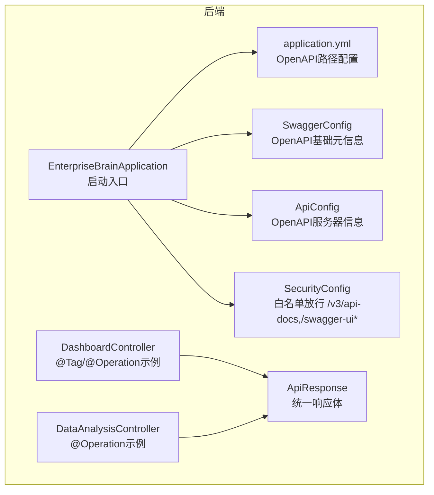
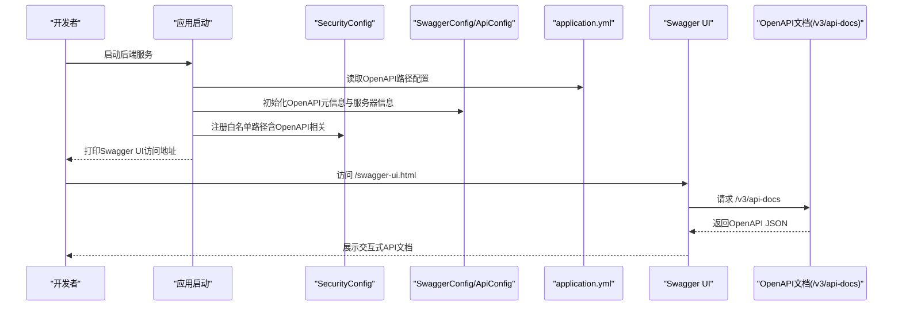
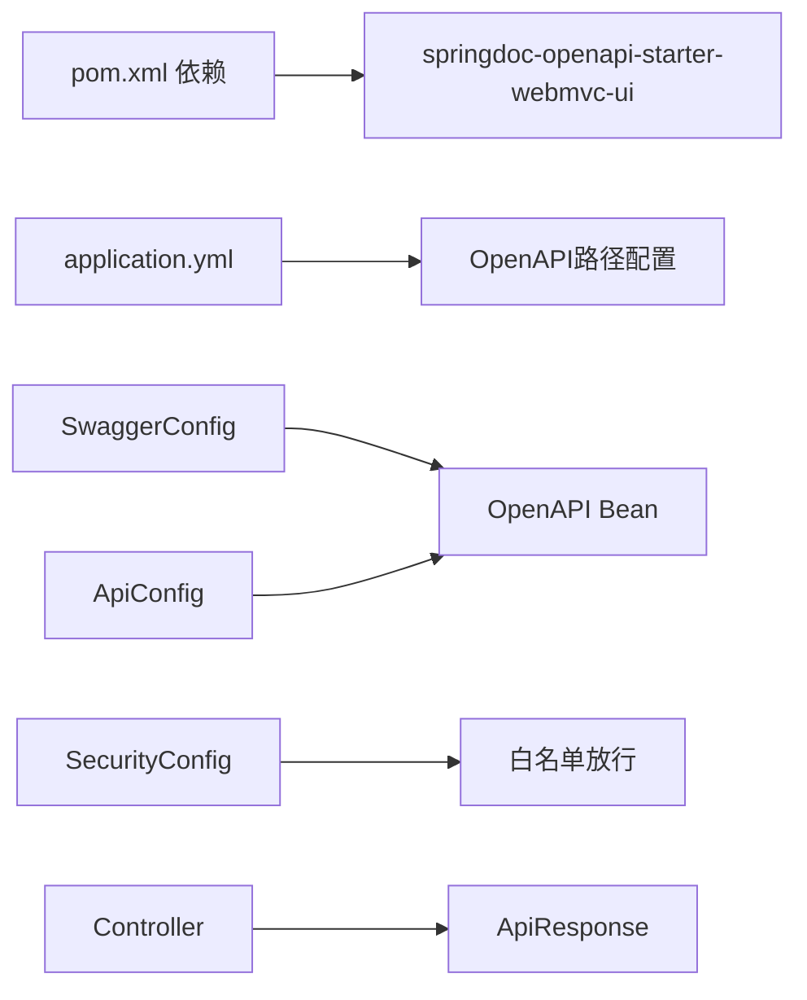

# API接口文档

<cite>
**本文引用的文件**
- [SwaggerConfig.java](file://08-backend/src/main/java/com/enterprise/brain/common/config/SwaggerConfig.java)
- [ApiConfig.java](file://08-backend/src/main/java/com/enterprise/brain/common/config/ApiConfig.java)
- [SecurityConfig.java](file://08-backend/src/main/java/com/enterprise/brain/common/config/SecurityConfig.java)
- [application.yml](file://08-backend/src/main/resources/application.yml)
- [EnterpriseBrainApplication.java](file://08-backend/src/main/java/com/enterprise/brain/EnterpriseBrainApplication.java)
- [DashboardController.java](file://08-backend/src/main/java/com/enterprise/brain/modules/analytics/controller/DashboardController.java)
- [DataAnalysisController.java](file://08-backend/src/main/java/com/enterprise/brain/modules/analytics/controller/DataAnalysisController.java)
- [ApiResponse.java](file://08-backend/src/main/java/com/enterprise/brain/common/response/ApiResponse.java)
- [pom.xml](file://08-backend/pom.xml)
- [VoucherResponse.java](file://08-backend/src/main/java/com/enterprise/brain/modules/finance/dto/response/VoucherResponse.java)
- [VoucherCreateRequest.java](file://08-backend/src/main/java/com/enterprise/brain/modules/finance/dto/request/VoucherCreateRequest.java)
</cite>

## 目录
1. [简介](#简介)
2. [项目结构](#项目结构)
3. [核心组件](#核心组件)
4. [架构总览](#架构总览)
5. [详细组件分析](#详细组件分析)
6. [依赖关系分析](#依赖关系分析)
7. [性能与可用性建议](#性能与可用性建议)
8. [故障排查指南](#故障排查指南)
9. [结论](#结论)
10. [附录](#附录)

## 简介
本指南聚焦于本项目的API文档生成与管理，围绕springdoc-openapi在Spring Boot后端中的集成与配置展开，系统说明：
- SwaggerConfig与ApiConfig对OpenAPI文档元信息、外部文档、服务器信息的配置
- 如何通过OpenAPI注解（@Operation、@Parameter、@Schema等）为REST接口补充详细文档
- /api/v3/api-docs与/swagger-ui.html端点的访问方式与使用方法
- API版本控制策略与文档测试实践

## 项目结构
后端采用Spring Boot工程，OpenAPI相关配置集中在common/config包下，控制器位于modules子包中，统一响应体封装在common/response中。应用启动入口打印Swagger UI访问地址，YAML配置文件中声明了OpenAPI的文档与UI路径。

图表来源
- [EnterpriseBrainApplication.java](file://08-backend/src/main/java/com/enterprise/brain/EnterpriseBrainApplication.java#L26-L61)
- [application.yml](file://08-backend/src/main/resources/application.yml#L37-L42)
- [SwaggerConfig.java](file://08-backend/src/main/java/com/enterprise/brain/common/config/SwaggerConfig.java#L1-L38)
- [ApiConfig.java](file://08-backend/src/main/java/com/enterprise/brain/common/config/ApiConfig.java#L1-L108)
- [SecurityConfig.java](file://08-backend/src/main/java/com/enterprise/brain/common/config/SecurityConfig.java#L31-L41)
- [DashboardController.java](file://08-backend/src/main/java/com/enterprise/brain/modules/analytics/controller/DashboardController.java#L1-L84)
- [DataAnalysisController.java](file://08-backend/src/main/java/com/enterprise/brain/modules/analytics/controller/DataAnalysisController.java#L42-L62)
- [ApiResponse.java](file://08-backend/src/main/java/com/enterprise/brain/common/response/ApiResponse.java#L1-L107)

章节来源
- [EnterpriseBrainApplication.java](file://08-backend/src/main/java/com/enterprise/brain/EnterpriseBrainApplication.java#L26-L61)
- [application.yml](file://08-backend/src/main/resources/application.yml#L37-L42)

## 核心组件
- OpenAPI文档配置
  - SwaggerConfig：定义文档标题、描述、版本、联系人、许可证与外部文档链接
  - ApiConfig：基于配置文件注入应用名、版本、描述与服务器URL，生成OpenAPI文档信息与服务器列表
- 安全与访问控制
  - SecurityConfig：将/v3/api-docs/**、/swagger-ui/**、/swagger-ui.html、/webjars/**等路径加入白名单，允许未鉴权访问
- 文档端点与UI
  - application.yml：声明OpenAPI文档路径为/v3/api-docs，UI路径为/swagger-ui.html
  - EnterpriseBrainApplication：启动时打印Swagger UI访问地址，便于快速定位
- 控制器与统一响应
  - DashboardController、DataAnalysisController：使用@Tag、@Operation标注接口分组与摘要
  - ApiResponse：统一返回结构，便于在UI中展示一致的响应模型

章节来源
- [SwaggerConfig.java](file://08-backend/src/main/java/com/enterprise/brain/common/config/SwaggerConfig.java#L1-L38)
- [ApiConfig.java](file://08-backend/src/main/java/com/enterprise/brain/common/config/ApiConfig.java#L1-L108)
- [SecurityConfig.java](file://08-backend/src/main/java/com/enterprise/brain/common/config/SecurityConfig.java#L31-L41)
- [application.yml](file://08-backend/src/main/resources/application.yml#L37-L42)
- [EnterpriseBrainApplication.java](file://08-backend/src/main/java/com/enterprise/brain/EnterpriseBrainApplication.java#L26-L61)
- [DashboardController.java](file://08-backend/src/main/java/com/enterprise/brain/modules/analytics/controller/DashboardController.java#L1-L84)
- [DataAnalysisController.java](file://08-backend/src/main/java/com/enterprise/brain/modules/analytics/controller/DataAnalysisController.java#L42-L62)
- [ApiResponse.java](file://08-backend/src/main/java/com/enterprise/brain/common/response/ApiResponse.java#L1-L107)

## 架构总览
springdoc-openapi在本项目中的集成路径如下：
- 依赖引入：pom.xml中引入springdoc-openapi-starter-webmvc-ui
- 配置加载：application.yml声明OpenAPI文档与UI路径
- 元信息配置：SwaggerConfig与ApiConfig分别负责文档元信息与服务器信息
- 访问控制：SecurityConfig将OpenAPI相关路径加入白名单
- 启动输出：EnterpriseBrainApplication打印Swagger UI访问地址
- 接口文档：各Controller通过OpenAPI注解完善接口说明与参数模型

图表来源
- [pom.xml](file://08-backend/pom.xml#L73-L82)
- [application.yml](file://08-backend/src/main/resources/application.yml#L37-L42)
- [SwaggerConfig.java](file://08-backend/src/main/java/com/enterprise/brain/common/config/SwaggerConfig.java#L1-L38)
- [ApiConfig.java](file://08-backend/src/main/java/com/enterprise/brain/common/config/ApiConfig.java#L1-L108)
- [SecurityConfig.java](file://08-backend/src/main/java/com/enterprise/brain/common/config/SecurityConfig.java#L31-L41)
- [EnterpriseBrainApplication.java](file://08-backend/src/main/java/com/enterprise/brain/EnterpriseBrainApplication.java#L26-L61)

## 详细组件分析

### OpenAPI配置与元信息
- SwaggerConfig
  - 定义文档标题、描述、版本、联系人、许可证与外部文档链接
  - 适合固定不变的文档元信息
- ApiConfig
  - 通过@Value注入spring.application.name、application.version、application.description、server.url
  - 生成OpenAPI的Info与Server列表，便于多环境差异化配置
- 二者关系
  - 若仅需静态元信息，使用SwaggerConfig即可
  - 若希望从配置文件动态注入元信息与服务器URL，推荐使用ApiConfig
  - 可根据团队规范选择其一或组合使用

章节来源
- [SwaggerConfig.java](file://08-backend/src/main/java/com/enterprise/brain/common/config/SwaggerConfig.java#L1-L38)
- [ApiConfig.java](file://08-backend/src/main/java/com/enterprise/brain/common/config/ApiConfig.java#L1-L108)

### 安全与访问控制
- SecurityConfig将以下路径加入白名单，允许未鉴权访问：
  - /v3/api-docs/**
  - /swagger-ui/**
  - /swagger-ui.html
  - /webjars/**
  - /error
  - /actuator/**
- 生产环境建议：
  - 限制白名单范围，仅开放必要路径
  - 结合网关或反向代理进行访问控制
  - 对敏感接口启用鉴权与权限校验

章节来源
- [SecurityConfig.java](file://08-backend/src/main/java/com/enterprise/brain/common/config/SecurityConfig.java#L31-L41)

### 文档端点与UI访问
- OpenAPI文档端点
  - /v3/api-docs：OpenAPI JSON文档
- Swagger UI端点
  - /swagger-ui.html：交互式API文档界面
- 访问方式
  - 启动后，EnterpriseBrainApplication会在日志中打印Swagger UI访问地址
  - 也可直接在浏览器访问上述路径
- 上下文路径
  - application.yml中server.servlet.context-path为/api，因此完整访问地址为：
    - http://host:port/api/swagger-ui.html
    - http://host:port/api/v3/api-docs

章节来源
- [application.yml](file://08-backend/src/main/resources/application.yml#L24-L30)
- [EnterpriseBrainApplication.java](file://08-backend/src/main/java/com/enterprise/brain/EnterpriseBrainApplication.java#L26-L61)

### OpenAPI注解使用指南
- 控制器分组与接口摘要
  - 使用@Tag为模块分组，如“仪表板管理”
  - 使用@Operation为每个接口提供summary，清晰表达接口用途
  - 示例参考：DashboardController、DataAnalysisController
- 参数与模型注解
  - 使用@Parameter、@Parameters为路径参数、查询参数、请求头参数添加说明
  - 使用@Schema为DTO字段添加描述，提升UI展示质量
  - 示例参考：VoucherCreateRequest、VoucherResponse
- 统一响应体
  - ApiResponse提供统一的code、message、data、timestamp、success字段
  - 建议在控制器中返回ApiResponse，以便在UI中正确展示响应结构

章节来源
- [DashboardController.java](file://08-backend/src/main/java/com/enterprise/brain/modules/analytics/controller/DashboardController.java#L1-L84)
- [DataAnalysisController.java](file://08-backend/src/main/java/com/enterprise/brain/modules/analytics/controller/DataAnalysisController.java#L42-L62)
- [VoucherCreateRequest.java](file://08-backend/src/main/java/com/enterprise/brain/modules/finance/dto/request/VoucherCreateRequest.java#L1-L65)
- [VoucherResponse.java](file://08-backend/src/main/java/com/enterprise/brain/modules/finance/dto/response/VoucherResponse.java#L1-L73)
- [ApiResponse.java](file://08-backend/src/main/java/com/enterprise/brain/common/response/ApiResponse.java#L1-L107)

### API版本控制策略
- 文档层面
  - 在SwaggerConfig或ApiConfig中维护OpenAPI版本号，作为文档版本标识
  - 通过Info.version字段体现，便于客户端与前端对接时明确版本
- 接口层面
  - 建议在URL中体现版本（如/api/v1/...），或通过Accept头部协商版本
  - 保持向后兼容，新增字段时标记为可选，避免破坏旧客户端
- 发布流程
  - 版本发布前更新OpenAPI版本号与变更说明
  - 在ExternalDocumentation或独立文档中同步版本变更记录

章节来源
- [SwaggerConfig.java](file://08-backend/src/main/java/com/enterprise/brain/common/config/SwaggerConfig.java#L1-L38)
- [ApiConfig.java](file://08-backend/src/main/java/com/enterprise/brain/common/config/ApiConfig.java#L1-L108)

### 文档测试实践
- 自动化验证
  - 使用OpenAPI JSON（/v3/api-docs）与契约测试工具（如OpenAPI Generator、Swagger UI的Try it out）进行接口连通性与参数校验
- 本地联调
  - 通过Swagger UI直接发起请求，验证@Operation、@Parameter、@Schema的展示效果
- 回归测试
  - 在CI中拉取OpenAPI JSON，执行静态校验（如字段缺失、类型不匹配），确保接口契约稳定
- 文档一致性
  - 保持控制器注解与DTO注解的一致性，避免UI展示与实际接口行为不一致

章节来源
- [application.yml](file://08-backend/src/main/resources/application.yml#L37-L42)

## 依赖关系分析
- 依赖引入
  - pom.xml引入springdoc-openapi-starter-webmvc-ui，启用OpenAPI与Swagger UI
- 配置依赖
  - application.yml声明OpenAPI文档与UI路径，影响端点访问
  - SwaggerConfig/ApiConfig提供OpenAPI元信息与服务器信息
- 安全依赖
  - SecurityConfig将OpenAPI相关路径加入白名单，保证文档可访问
- 控制器依赖
  - 控制器依赖ApiResponse统一响应体，提升UI展示一致性

图表来源
- [pom.xml](file://08-backend/pom.xml#L73-L82)
- [application.yml](file://08-backend/src/main/resources/application.yml#L37-L42)
- [SwaggerConfig.java](file://08-backend/src/main/java/com/enterprise/brain/common/config/SwaggerConfig.java#L1-L38)
- [ApiConfig.java](file://08-backend/src/main/java/com/enterprise/brain/common/config/ApiConfig.java#L1-L108)
- [SecurityConfig.java](file://08-backend/src/main/java/com/enterprise/brain/common/config/SecurityConfig.java#L31-L41)
- [ApiResponse.java](file://08-backend/src/main/java/com/enterprise/brain/common/response/ApiResponse.java#L1-L107)

章节来源
- [pom.xml](file://08-backend/pom.xml#L73-L82)
- [application.yml](file://08-backend/src/main/resources/application.yml#L37-L42)
- [SwaggerConfig.java](file://08-backend/src/main/java/com/enterprise/brain/common/config/SwaggerConfig.java#L1-L38)
- [ApiConfig.java](file://08-backend/src/main/java/com/enterprise/brain/common/config/ApiConfig.java#L1-L108)
- [SecurityConfig.java](file://08-backend/src/main/java/com/enterprise/brain/common/config/SecurityConfig.java#L31-L41)
- [ApiResponse.java](file://08-backend/src/main/java/com/enterprise/brain/common/response/ApiResponse.java#L1-L107)

## 性能与可用性建议
- 文档端点性能
  - OpenAPI JSON体积较大时，建议在生产环境开启Gzip压缩
  - 控制注解复杂度，避免过多嵌套模型导致UI渲染卡顿
- 访问控制
  - 生产环境严格限制白名单范围，仅开放必要路径
  - 对敏感接口启用鉴权，防止未授权访问
- 版本演进
  - 保持OpenAPI版本与接口版本一致，减少客户端适配成本
  - 通过变更日志与外部文档同步版本信息

## 故障排查指南
- 无法访问Swagger UI
  - 检查application.yml中OpenAPI路径配置是否与实际访问路径一致
  - 确认SecurityConfig白名单是否包含/v3/api-docs与/swagger-ui*
  - 查看启动日志中打印的Swagger UI地址是否正确
- OpenAPI JSON为空或不完整
  - 确保控制器已添加@Tag、@Operation等注解
  - DTO字段添加@Schema注解，提升模型展示
  - 检查SwaggerConfig/ApiConfig是否正确注入并生效
- 响应体展示异常
  - 确保控制器返回ApiResponse统一结构
  - 检查ApiResponse字段是否与注解描述一致

章节来源
- [application.yml](file://08-backend/src/main/resources/application.yml#L37-L42)
- [SecurityConfig.java](file://08-backend/src/main/java/com/enterprise/brain/common/config/SecurityConfig.java#L31-L41)
- [EnterpriseBrainApplication.java](file://08-backend/src/main/java/com/enterprise/brain/EnterpriseBrainApplication.java#L26-L61)
- [ApiResponse.java](file://08-backend/src/main/java/com/enterprise/brain/common/response/ApiResponse.java#L1-L107)

## 结论
本项目通过springdoc-openapi实现了完善的API文档生成与管理能力。通过SwaggerConfig/ApiConfig配置文档元信息与服务器信息，结合SecurityConfig的白名单放行，配合application.yml的端点路径配置，开发者可以快速访问Swagger UI并完成接口文档的编写与维护。建议在团队内统一OpenAPI注解规范，持续完善文档与测试流程，保障API的可发现性与可维护性。

## 附录
- 快速开始
  - 启动后端服务，查看启动日志中的Swagger UI地址
  - 在Swagger UI中浏览与调试接口
  - 在控制器中添加@Tag、@Operation、@Parameter、@Schema等注解
- 版本管理
  - 在SwaggerConfig/ApiConfig中维护OpenAPI版本号
  - 在ExternalDocumentation或独立文档中记录版本变更