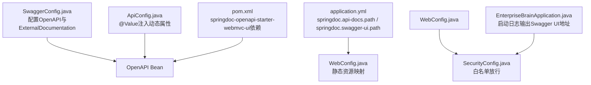
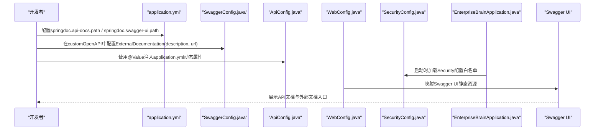
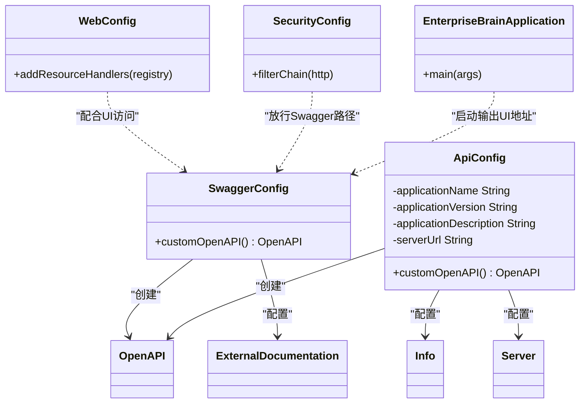

# API外部文档配置

<cite>
**本文引用的文件列表**
- [SwaggerConfig.java](file://08-backend/src/main/java/com/enterprise/brain/common/config/SwaggerConfig.java)
- [ApiConfig.java](file://08-backend/src/main/java/com/enterprise/brain/common/config/ApiConfig.java)
- [application.yml](file://08-backend/src/main/resources/application.yml)
- [pom.xml](file://08-backend/pom.xml)
- [WebConfig.java](file://08-backend/src/main/java/com/enterprise/brain/common/config/WebConfig.java)
- [SecurityConfig.java](file://08-backend/src/main/java/com/enterprise/brain/common/config/SecurityConfig.java)
- [EnterpriseBrainApplication.java](file://08-backend/src/main/java/com/enterprise/brain/EnterpriseBrainApplication.java)
</cite>

## 目录
1. [简介](#简介)
2. [项目结构](#项目结构)
3. [核心组件](#核心组件)
4. [架构总览](#架构总览)
5. [详细组件分析](#详细组件分析)
6. [依赖关系分析](#依赖关系分析)
7. [性能与可用性考虑](#性能与可用性考虑)
8. [故障排查指南](#故障排查指南)
9. [结论](#结论)
10. [附录](#附录)

## 简介
本指南围绕后端工程中的API外部文档配置展开，重点说明如何在SpringDoc OpenAPI（Swagger）中通过ExternalDocumentation对象配置外部文档链接与描述，并指导开发者在application.yml中设置外部文档相关的动态属性，以及如何验证外部文档链接的有效性。当前仓库中存在两处与OpenAPI文档相关的配置：
- SwaggerConfig.java：直接在OpenAPI Bean中配置ExternalDocumentation。
- ApiConfig.java：通过@Value注入application.yml中的动态属性，用于配置OpenAPI的标题、描述、版本等信息。

此外，application.yml中包含springdoc.api-docs.path与springdoc.swagger-ui.path等关键路径配置；WebConfig.java负责Swagger UI静态资源映射；SecurityConfig.java将Swagger相关路径加入白名单；EnterpriseBrainApplication.java在启动时输出Swagger UI访问地址。

## 项目结构
后端采用Spring Boot工程，OpenAPI文档由springdoc-openapi-starter-webmvc-ui提供支持。外部文档配置位于SwaggerConfig.java中，同时可通过application.yml中的springdoc配置项控制API文档与UI的访问路径。

图表来源
- [SwaggerConfig.java](file://08-backend/src/main/java/com/enterprise/brain/common/config/SwaggerConfig.java#L1-L38)
- [ApiConfig.java](file://08-backend/src/main/java/com/enterprise/brain/common/config/ApiConfig.java#L1-L108)
- [application.yml](file://08-backend/src/main/resources/application.yml#L37-L42)
- [WebConfig.java](file://08-backend/src/main/java/com/enterprise/brain/common/config/WebConfig.java#L1-L55)
- [SecurityConfig.java](file://08-backend/src/main/java/com/enterprise/brain/common/config/SecurityConfig.java#L1-L41)
- [EnterpriseBrainApplication.java](file://08-backend/src/main/java/com/enterprise/brain/EnterpriseBrainApplication.java#L26-L61)
- [pom.xml](file://08-backend/pom.xml#L76-L82)

章节来源
- [SwaggerConfig.java](file://08-backend/src/main/java/com/enterprise/brain/common/config/SwaggerConfig.java#L1-L38)
- [ApiConfig.java](file://08-backend/src/main/java/com/enterprise/brain/common/config/ApiConfig.java#L1-L108)
- [application.yml](file://08-backend/src/main/resources/application.yml#L37-L42)
- [WebConfig.java](file://08-backend/src/main/java/com/enterprise/brain/common/config/WebConfig.java#L1-L55)
- [SecurityConfig.java](file://08-backend/src/main/java/com/enterprise/brain/common/config/SecurityConfig.java#L1-L41)
- [EnterpriseBrainApplication.java](file://08-backend/src/main/java/com/enterprise/brain/EnterpriseBrainApplication.java#L26-L61)
- [pom.xml](file://08-backend/pom.xml#L76-L82)

## 核心组件
- SwaggerConfig.java：定义OpenAPI Bean并配置ExternalDocumentation，用于在Swagger UI中展示“外部文档”入口。
- ApiConfig.java：通过@Value从application.yml读取动态属性（如应用名、版本、描述、服务器URL），用于填充OpenAPI的Info与Server信息。
- application.yml：定义springdoc.api-docs.path与springdoc.swagger-ui.path，决定API文档JSON与Swagger UI页面的访问路径。
- WebConfig.java：为Swagger UI静态资源提供映射，确保UI页面能被正确访问。
- SecurityConfig.java：将Swagger相关路径加入白名单，避免安全拦截导致无法访问。
- EnterpriseBrainApplication.java：启动时输出Swagger UI访问地址，便于快速定位。
- pom.xml：引入springdoc-openapi-starter-webmvc-ui依赖，启用OpenAPI/Swagger UI能力。

章节来源
- [SwaggerConfig.java](file://08-backend/src/main/java/com/enterprise/brain/common/config/SwaggerConfig.java#L1-L38)
- [ApiConfig.java](file://08-backend/src/main/java/com/enterprise/brain/common/config/ApiConfig.java#L1-L108)
- [application.yml](file://08-backend/src/main/resources/application.yml#L37-L42)
- [WebConfig.java](file://08-backend/src/main/java/com/enterprise/brain/common/config/WebConfig.java#L1-L55)
- [SecurityConfig.java](file://08-backend/src/main/java/com/enterprise/brain/common/config/SecurityConfig.java#L1-L41)
- [EnterpriseBrainApplication.java](file://08-backend/src/main/java/com/enterprise/brain/EnterpriseBrainApplication.java#L26-L61)
- [pom.xml](file://08-backend/pom.xml#L76-L82)

## 架构总览
下图展示了外部文档配置在系统中的位置与交互流程：

图表来源
- [application.yml](file://08-backend/src/main/resources/application.yml#L37-L42)
- [SwaggerConfig.java](file://08-backend/src/main/java/com/enterprise/brain/common/config/SwaggerConfig.java#L1-L38)
- [ApiConfig.java](file://08-backend/src/main/java/com/enterprise/brain/common/config/ApiConfig.java#L1-L108)
- [WebConfig.java](file://08-backend/src/main/java/com/enterprise/brain/common/config/WebConfig.java#L1-L55)
- [SecurityConfig.java](file://08-backend/src/main/java/com/enterprise/brain/common/config/SecurityConfig.java#L1-L41)
- [EnterpriseBrainApplication.java](file://08-backend/src/main/java/com/enterprise/brain/EnterpriseBrainApplication.java#L26-L61)

## 详细组件分析

### SwaggerConfig.java 中的 ExternalDocumentation 配置
- 作用：在OpenAPI Bean中添加ExternalDocumentation，使Swagger UI显示“外部文档”入口，指向指定URL并带有描述。
- 关键点：
  - 外部文档描述与URL通过ExternalDocumentation对象设置。
  - 该配置独立于ApiConfig.java中的@Value注入，二者可以并存。
- 建议：
  - 将外部文档URL指向团队知识库、产品文档或帮助中心。
  - 描述应简洁明确，便于使用者快速理解用途。

章节来源
- [SwaggerConfig.java](file://08-backend/src/main/java/com/enterprise/brain/common/config/SwaggerConfig.java#L1-L38)

### ApiConfig.java 中的动态属性注入
- 作用：通过@Value从application.yml读取动态属性，填充OpenAPI的Info与Server信息。
- 关键属性（来自application.yml）：
  - spring.application.name：应用名，用于生成标题。
  - application.version：应用版本。
  - application.description：应用描述。
  - server.url：服务器URL，用于生成Server信息。
- 注意：
  - SwaggerConfig.java中也设置了固定标题、描述与版本，若需统一使用application.yml中的动态值，可在SwaggerConfig.java中改为与ApiConfig.java一致的注入方式。

章节来源
- [ApiConfig.java](file://08-backend/src/main/java/com/enterprise/brain/common/config/ApiConfig.java#L1-L108)
- [application.yml](file://08-backend/src/main/resources/application.yml#L1-L42)

### application.yml 中的 springdoc 路径配置
- springdoc.api-docs.path：API文档JSON的访问路径，默认为/v3/api-docs。
- springdoc.swagger-ui.path：Swagger UI页面的访问路径，默认为/swagger-ui.html。
- 影响：
  - WebConfig.java已对Swagger UI静态资源进行映射，确保UI页面可访问。
  - SecurityConfig.java将上述路径加入白名单，避免安全拦截。

章节来源
- [application.yml](file://08-backend/src/main/resources/application.yml#L37-L42)
- [WebConfig.java](file://08-backend/src/main/java/com/enterprise/brain/common/config/WebConfig.java#L1-L55)
- [SecurityConfig.java](file://08-backend/src/main/java/com/enterprise/brain/common/config/SecurityConfig.java#L1-L41)

### WebConfig.java 的静态资源映射
- 作用：为Swagger UI静态资源提供映射，确保UI页面能被正确访问。
- 关键点：
  - 对/springdoc-openapi-ui等资源进行映射，保证Swagger UI正常加载。
  - 若修改springdoc.swagger-ui.path，需同步调整映射规则。

章节来源
- [WebConfig.java](file://08-backend/src/main/java/com/enterprise/brain/common/config/WebConfig.java#L1-L55)

### SecurityConfig.java 的白名单放行
- 作用：将Swagger相关路径加入白名单，避免安全拦截导致无法访问。
- 关键路径：
  - /v3/api-docs/**
  - /swagger-ui/**
  - /swagger-ui.html
  - /webjars/**
- 影响：若自定义了springdoc.swagger-ui.path，请相应更新白名单。

章节来源
- [SecurityConfig.java](file://08-backend/src/main/java/com/enterprise/brain/common/config/SecurityConfig.java#L1-L41)

### EnterpriseBrainApplication.java 的启动日志
- 作用：启动时输出Swagger UI访问地址，便于快速定位。
- 关键点：
  - 输出Local、External与Swagger Doc地址，方便本地与外网访问。
  - 若修改context-path或端口，需根据实际环境调整访问地址。

章节来源
- [EnterpriseBrainApplication.java](file://08-backend/src/main/java/com/enterprise/brain/EnterpriseBrainApplication.java#L26-L61)

### pom.xml 的依赖
- 作用：引入springdoc-openapi-starter-webmvc-ui，启用OpenAPI/Swagger UI能力。
- 影响：缺少该依赖将无法生成API文档与UI页面。

章节来源
- [pom.xml](file://08-backend/pom.xml#L76-L82)

## 依赖关系分析
- SwaggerConfig.java 依赖 OpenAPI/ExternalDocumentation 类型，用于构建OpenAPI Bean。
- ApiConfig.java 依赖 @Value 注入application.yml中的动态属性，用于填充OpenAPI的Info与Server。
- WebConfig.java 依赖 WebMvcConfigurer 接口，提供Swagger UI静态资源映射。
- SecurityConfig.java 依赖 HttpSecurity，将Swagger相关路径加入白名单。
- EnterpriseBrainApplication.java 依赖 Environment，输出Swagger UI访问地址。
- pom.xml 依赖 springdoc-openapi-starter-webmvc-ui，提供OpenAPI/Swagger UI运行时支持。

图表来源
- [SwaggerConfig.java](file://08-backend/src/main/java/com/enterprise/brain/common/config/SwaggerConfig.java#L1-L38)
- [ApiConfig.java](file://08-backend/src/main/java/com/enterprise/brain/common/config/ApiConfig.java#L1-L108)
- [WebConfig.java](file://08-backend/src/main/java/com/enterprise/brain/common/config/WebConfig.java#L1-L55)
- [SecurityConfig.java](file://08-backend/src/main/java/com/enterprise/brain/common/config/SecurityConfig.java#L1-L41)
- [EnterpriseBrainApplication.java](file://08-backend/src/main/java/com/enterprise/brain/EnterpriseBrainApplication.java#L26-L61)

## 性能与可用性考虑
- 外部文档链接应指向稳定、可访问的站点，避免频繁变更导致UI不可用。
- 若外部文档内容较大，建议在目标站点提供清晰导航与索引，提升开发者体验。
- 在生产环境中，确保SecurityConfig.java中的白名单与WebConfig.java的映射与application.yml中的路径保持一致，避免UI无法加载或404。

[本节为通用建议，不直接分析具体文件]

## 故障排查指南
- 问题：Swagger UI无法访问
  - 检查application.yml中的springdoc.swagger-ui.path是否与WebConfig.java映射一致。
  - 确认SecurityConfig.java是否放行了/springdoc/**与/webjars/**等路径。
  - 参考EnterpriseBrainApplication.java输出的访问地址，确认端口与上下文路径。
- 问题：外部文档链接无效
  - 检查SwaggerConfig.java中ExternalDocumentation的url是否可达。
  - 如需动态化，可参考ApiConfig.java的@Value注入方式，将外部文档URL与描述迁移到application.yml中。
- 问题：API文档JSON为空
  - 确认pom.xml中springdoc-openapi-starter-webmvc-ui依赖已引入。
  - 检查application.yml中的springdoc.api-docs.path是否被其他安全策略拦截。

章节来源
- [application.yml](file://08-backend/src/main/resources/application.yml#L37-L42)
- [WebConfig.java](file://08-backend/src/main/java/com/enterprise/brain/common/config/WebConfig.java#L1-L55)
- [SecurityConfig.java](file://08-backend/src/main/java/com/enterprise/brain/common/config/SecurityConfig.java#L1-L41)
- [EnterpriseBrainApplication.java](file://08-backend/src/main/java/com/enterprise/brain/EnterpriseBrainApplication.java#L26-L61)
- [pom.xml](file://08-backend/pom.xml#L76-L82)

## 结论
- 当前工程已在SwaggerConfig.java中通过ExternalDocumentation配置了外部文档入口，开发者可直接修改其描述与URL以适配团队文档。
- ApiConfig.java提供了基于application.yml的动态属性注入能力，建议将外部文档的描述与URL迁移至application.yml，以便集中管理与动态切换。
- WebConfig.java与SecurityConfig.java已默认支持Swagger UI访问，结合application.yml的springdoc路径配置即可完成外部文档的完整链路。

[本节为总结性内容，不直接分析具体文件]

## 附录

### 如何在 application.yml 中配置外部文档的动态属性
- 方案一：保留现有配置（推荐）
  - 在SwaggerConfig.java中继续使用ExternalDocumentation配置固定描述与URL。
  - 优点：简单直接，无需额外属性。
- 方案二：迁移至application.yml（推荐用于动态化）
  - 在application.yml中新增外部文档相关属性，例如：
    - external-docs.description
    - external-docs.url
  - 在SwaggerConfig.java中通过@Value读取上述属性，动态设置ExternalDocumentation。
  - 优点：集中管理，便于CI/CD环境按环境变量覆盖。

章节来源
- [SwaggerConfig.java](file://08-backend/src/main/java/com/enterprise/brain/common/config/SwaggerConfig.java#L1-L38)
- [application.yml](file://08-backend/src/main/resources/application.yml#L1-L42)

### 如何验证外部文档链接的正确性
- 步骤：
  1. 启动应用，查看EnterpriseBrainApplication.java输出的Swagger UI地址。
  2. 打开Swagger UI页面，找到“外部文档”入口，点击跳转。
  3. 确认目标站点可访问且内容与描述匹配。
- 建议：
  - 使用curl或浏览器开发者工具检查HTTP状态码与重定向。
  - 若为内网文档，确保网络连通与代理配置正确。

章节来源
- [EnterpriseBrainApplication.java](file://08-backend/src/main/java/com/enterprise/brain/EnterpriseBrainApplication.java#L26-L61)
- [SwaggerConfig.java](file://08-backend/src/main/java/com/enterprise/brain/common/config/SwaggerConfig.java#L1-L38)