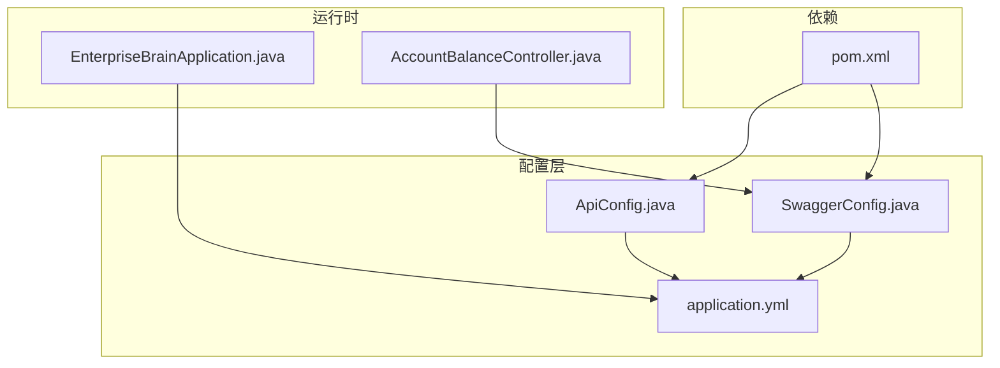
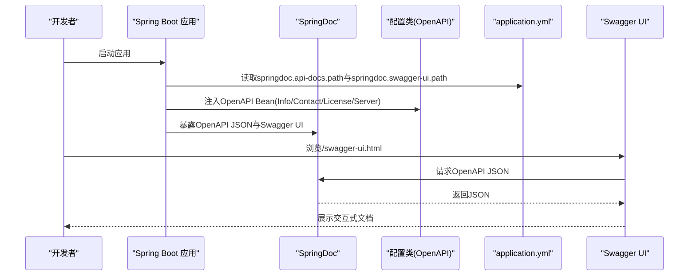
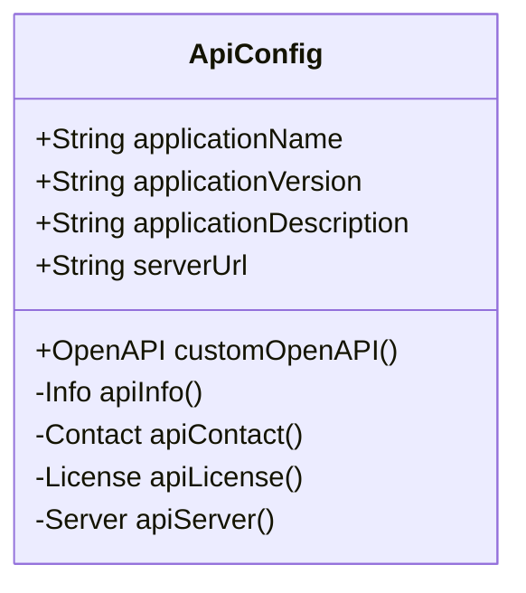
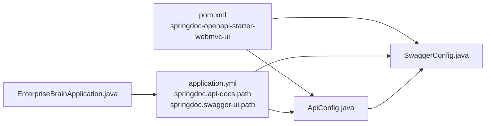

# API文档配置

<cite>
**本文引用的文件**
- [SwaggerConfig.java](file://08-backend/src/main/java/com/enterprise/brain/common/config/SwaggerConfig.java)
- [ApiConfig.java](file://08-backend/src/main/java/com/enterprise/brain/common/config/ApiConfig.java)
- [application.yml](file://08-backend/src/main/resources/application.yml)
- [pom.xml](file://08-backend/pom.xml)
- [EnterpriseBrainApplication.java](file://08-backend/src/main/java/com/enterprise/brain/EnterpriseBrainApplication.java)
- [AccountBalanceController.java](file://08-backend/src/main/java/com/enterprise/brain/modules/finance/controller/AccountBalanceController.java)
</cite>

## 目录
1. [简介](#简介)
2. [项目结构](#项目结构)
3. [核心组件](#核心组件)
4. [架构总览](#架构总览)
5. [详细组件分析](#详细组件分析)
6. [依赖关系分析](#依赖关系分析)
7. [性能与可用性考量](#性能与可用性考量)
8. [故障排查指南](#故障排查指南)
9. [结论](#结论)
10. [附录](#附录)

## 简介
本指南聚焦于后端工程中的API文档配置，系统性讲解如何通过 Swagger/OpenAPI 配置类与 SpringDoc 集成，完成API元信息、服务器信息、外部文档等的统一管理，并结合 application.yml 的动态属性进行灵活配置。同时提供最佳实践与常见问题解决方案，帮助开发者快速搭建可维护、可扩展的API文档体系。

## 项目结构
与API文档配置直接相关的关键位置如下：
- 配置类：位于 common/config 包下，分别负责基础OpenAPI信息与服务器信息的装配
- 文档路径与UI路径：在 application.yml 中集中声明
- 启动类：EnterpriseBrainApplication 在启动日志中输出Swagger UI访问地址
- 控制器：示例控制器展示了如何使用 @Tag 与 @Operation 标注接口文档信息

图表来源
- [SwaggerConfig.java](file://08-backend/src/main/java/com/enterprise/brain/common/config/SwaggerConfig.java#L1-L38)
- [ApiConfig.java](file://08-backend/src/main/java/com/enterprise/brain/common/config/ApiConfig.java#L1-L108)
- [application.yml](file://08-backend/src/main/resources/application.yml#L1-L42)
- [EnterpriseBrainApplication.java](file://08-backend/src/main/java/com/enterprise/brain/EnterpriseBrainApplication.java#L1-L62)
- [AccountBalanceController.java](file://08-backend/src/main/java/com/enterprise/brain/modules/finance/controller/AccountBalanceController.java#L1-L22)
- [pom.xml](file://08-backend/pom.xml#L73-L82)

章节来源
- [SwaggerConfig.java](file://08-backend/src/main/java/com/enterprise/brain/common/config/SwaggerConfig.java#L1-L38)
- [ApiConfig.java](file://08-backend/src/main/java/com/enterprise/brain/common/config/ApiConfig.java#L1-L108)
- [application.yml](file://08-backend/src/main/resources/application.yml#L1-L42)
- [EnterpriseBrainApplication.java](file://08-backend/src/main/java/com/enterprise/brain/EnterpriseBrainApplication.java#L1-L62)
- [AccountBalanceController.java](file://08-backend/src/main/java/com/enterprise/brain/modules/finance/controller/AccountBalanceController.java#L1-L22)
- [pom.xml](file://08-backend/pom.xml#L73-L82)

## 核心组件
- SwaggerConfig.java：定义全局 OpenAPI Bean，设置标题、描述、版本、联系人、许可证以及外部文档链接
- ApiConfig.java：基于 application.yml 动态注入应用名、版本、描述、服务器URL，生成 Info、Contact、License 与 Server，并装配到 OpenAPI
- application.yml：集中声明 springdoc 的 API 文档路径与 Swagger UI 路径，以及服务器上下文路径等
- EnterpriseBrainApplication.java：启动时打印访问地址，包含 Swagger UI 地址
- AccountBalanceController.java：演示如何使用 @Tag 与 @Operation 对接口进行分组与摘要标注

章节来源
- [SwaggerConfig.java](file://08-backend/src/main/java/com/enterprise/brain/common/config/SwaggerConfig.java#L1-L38)
- [ApiConfig.java](file://08-backend/src/main/java/com/enterprise/brain/common/config/ApiConfig.java#L1-L108)
- [application.yml](file://08-backend/src/main/resources/application.yml#L1-L42)
- [EnterpriseBrainApplication.java](file://08-backend/src/main/java/com/enterprise/brain/EnterpriseBrainApplication.java#L1-L62)
- [AccountBalanceController.java](file://08-backend/src/main/java/com/enterprise/brain/modules/finance/controller/AccountBalanceController.java#L1-L22)

## 架构总览
SpringDoc 会扫描控制器并读取 OpenAPI 配置，最终在指定路径暴露 OpenAPI JSON 与 Swagger UI 页面。配置类负责提供 OpenAPI 元信息与服务器信息，application.yml 决定访问路径与上下文。

图表来源
- [SwaggerConfig.java](file://08-backend/src/main/java/com/enterprise/brain/common/config/SwaggerConfig.java#L1-L38)
- [ApiConfig.java](file://08-backend/src/main/java/com/enterprise/brain/common/config/ApiConfig.java#L1-L108)
- [application.yml](file://08-backend/src/main/resources/application.yml#L37-L42)
- [EnterpriseBrainApplication.java](file://08-backend/src/main/java/com/enterprise/brain/EnterpriseBrainApplication.java#L26-L60)

## 详细组件分析

### SwaggerConfig.java：静态OpenAPI配置
- 职责：通过 @Bean 定义 OpenAPI 实例，设置标题、描述、版本、联系人、许可证与外部文档
- 关键点：
  - 使用 Info 设置标题、描述、版本、联系人、许可证
  - 使用 ExternalDocumentation 设置外部文档描述与链接
- 适用场景：当需要固定不变的文档元信息时，推荐使用该方式

章节来源
- [SwaggerConfig.java](file://08-backend/src/main/java/com/enterprise/brain/common/config/SwaggerConfig.java#L1-L38)

### ApiConfig.java：动态OpenAPI配置
- 职责：基于 application.yml 的占位符，动态注入应用名、版本、描述、服务器URL，生成 Info、Contact、License 与 Server，并装配到 OpenAPI
- 关键点：
  - @Value 注入 spring.application.name、application.version、application.description、server.url
  - apiInfo() 组装标题、描述、版本、联系人、许可证
  - apiServer() 组装服务器URL与描述
  - customOpenAPI() 将 Info 与 Server 注入 OpenAPI
- 适用场景：需要根据环境或部署参数动态调整文档元信息时，推荐使用该方式

图表来源
- [ApiConfig.java](file://08-backend/src/main/java/com/enterprise/brain/common/config/ApiConfig.java#L1-L108)

章节来源
- [ApiConfig.java](file://08-backend/src/main/java/com/enterprise/brain/common/config/ApiConfig.java#L1-L108)

### application.yml：动态属性与路径配置
- 职责：集中声明 springdoc 的 API 文档路径与 Swagger UI 路径；server.servlet.context-path 影响访问前缀
- 关键点：
  - springdoc.api-docs.path：默认 "/v3/api-docs"
  - springdoc.swagger-ui.path：默认 "/swagger-ui.html"
  - server.servlet.context-path：默认 "/api"
- 建议：将这些路径作为统一的运维入口，便于前后端联调与发布

章节来源
- [application.yml](file://08-backend/src/main/resources/application.yml#L1-L42)

### EnterpriseBrainApplication.java：启动日志与访问地址
- 职责：启动时根据环境变量输出本地、外网与 Swagger UI 访问地址
- 关键点：日志中包含 Swagger UI 的完整访问路径，便于快速定位

章节来源
- [EnterpriseBrainApplication.java](file://08-backend/src/main/java/com/enterprise/brain/EnterpriseBrainApplication.java#L26-L60)

### AccountBalanceController.java：接口文档注解示例
- 职责：演示如何使用 @Tag 与 @Operation 对接口进行分组与摘要标注
- 关键点：@Tag 提供模块分组，@Operation 提供接口摘要，有助于在 Swagger UI 中清晰展示

章节来源
- [AccountBalanceController.java](file://08-backend/src/main/java/com/enterprise/brain/modules/finance/controller/AccountBalanceController.java#L1-L22)

## 依赖关系分析
- 依赖 springdoc-openapi-starter-webmvc-ui：启用 OpenAPI 与 Swagger UI 的自动装配
- 配置类与 application.yml 的耦合：ApiConfig 通过 @Value 读取 yml 中的属性
- 启动类与配置类的协作：启动类输出 Swagger UI 地址，配合 yml 中的路径配置

图表来源
- [pom.xml](file://08-backend/pom.xml#L73-L82)
- [SwaggerConfig.java](file://08-backend/src/main/java/com/enterprise/brain/common/config/SwaggerConfig.java#L1-L38)
- [ApiConfig.java](file://08-backend/src/main/java/com/enterprise/brain/common/config/ApiConfig.java#L1-L108)
- [application.yml](file://08-backend/src/main/resources/application.yml#L37-L42)
- [EnterpriseBrainApplication.java](file://08-backend/src/main/java/com/enterprise/brain/EnterpriseBrainApplication.java#L26-L60)

章节来源
- [pom.xml](file://08-backend/pom.xml#L73-L82)
- [SwaggerConfig.java](file://08-backend/src/main/java/com/enterprise/brain/common/config/SwaggerConfig.java#L1-L38)
- [ApiConfig.java](file://08-backend/src/main/java/com/enterprise/brain/common/config/ApiConfig.java#L1-L108)
- [application.yml](file://08-backend/src/main/resources/application.yml#L37-L42)
- [EnterpriseBrainApplication.java](file://08-backend/src/main/java/com/enterprise/brain/EnterpriseBrainApplication.java#L26-L60)

## 性能与可用性考量
- 文档生成开销：OpenAPI JSON 由 SpringDoc 在运行时聚合控制器与配置生成，通常对性能影响较小
- UI加载优化：确保 springdoc.swagger-ui.path 与 springdoc.api-docs.path 不冲突，避免重复请求
- 上下文路径：合理设置 server.servlet.context-path，避免与业务路由冲突
- 环境隔离：通过 ApiConfig 的 @Value 注入不同环境的属性，减少硬编码带来的维护成本

[本节为通用建议，不涉及具体文件分析]

## 故障排查指南
- 无法访问 Swagger UI
  - 检查 application.yml 中 springdoc.swagger-ui.path 是否正确
  - 确认 server.servlet.context-path 与实际部署路径一致
  - 参考启动日志中的 Swagger UI 地址
- OpenAPI JSON 404
  - 检查 application.yml 中 springdoc.api-docs.path
  - 确保已引入 springdoc-openapi-starter-webmvc-ui 依赖
- 文档元信息未生效
  - 若使用 ApiConfig，请确认 @Value 注入的属性在运行环境中存在
  - 若使用 SwaggerConfig，请确认自定义 OpenAPI Bean 已被容器加载
- 接口未出现在文档中
  - 确认控制器已添加 @RestController 或 @RequestMapping
  - 确认接口方法上使用了 @Operation 或 @Tag 进行标注

章节来源
- [application.yml](file://08-backend/src/main/resources/application.yml#L37-L42)
- [pom.xml](file://08-backend/pom.xml#L73-L82)
- [EnterpriseBrainApplication.java](file://08-backend/src/main/java/com/enterprise/brain/EnterpriseBrainApplication.java#L26-L60)
- [AccountBalanceController.java](file://08-backend/src/main/java/com/enterprise/brain/modules/finance/controller/AccountBalanceController.java#L1-L22)

## 结论
通过 SwaggerConfig 与 ApiConfig 的组合使用，可以灵活地在“静态固定”与“动态可配”之间选择合适的策略。配合 application.yml 的集中配置与 SpringDoc 的自动装配，能够快速构建出可维护、可扩展的API文档体系。建议在团队内统一规范注解使用与路径命名，以提升协作效率与文档质量。

[本节为总结性内容，不涉及具体文件分析]

## 附录

### 如何通过 @OpenAPI 注解配置API元信息
- 当前仓库未发现 @OpenAPI 注解的直接使用示例。若需使用，可在控制器或配置类上添加相应注解，以补充或覆盖 OpenAPI 元信息
- 建议优先使用 ApiConfig 的 @Value 注入方式，以实现跨环境的动态配置

[本节为概念性说明，不涉及具体文件分析]

### 如何配置API服务器信息与外部文档链接
- 服务器信息：在 ApiConfig 中通过 apiServer() 返回 Server 对象，设置 URL 与描述
- 外部文档链接：在 SwaggerConfig 中通过 externalDocs() 设置描述与 URL
- 两者均支持从 application.yml 动态注入，便于多环境切换

章节来源
- [ApiConfig.java](file://08-backend/src/main/java/com/enterprise/brain/common/config/ApiConfig.java#L98-L108)
- [SwaggerConfig.java](file://08-backend/src/main/java/com/enterprise/brain/common/config/SwaggerConfig.java#L34-L36)

### 如何通过 application.yml 管理API文档的动态属性
- springdoc.api-docs.path：OpenAPI JSON 的访问路径
- springdoc.swagger-ui.path：Swagger UI 的访问路径
- server.servlet.context-path：应用上下文路径，会影响 Swagger UI 与 API 文档的完整访问地址

章节来源
- [application.yml](file://08-backend/src/main/resources/application.yml#L37-L42)

### 最佳实践
- 使用 ApiConfig 管理可变元信息，使用 SwaggerConfig 管理固定元信息
- 统一命名与路径规范，避免与业务路由冲突
- 在控制器中使用 @Tag 与 @Operation 进行接口分组与摘要标注
- 将 springdoc 路径集中管理，便于前后端联调与发布

[本节为通用建议，不涉及具体文件分析]