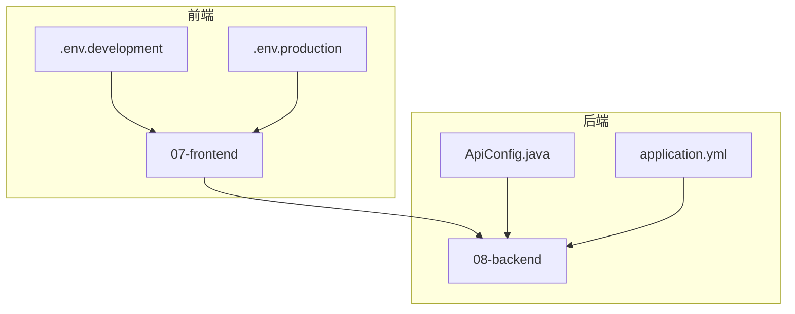
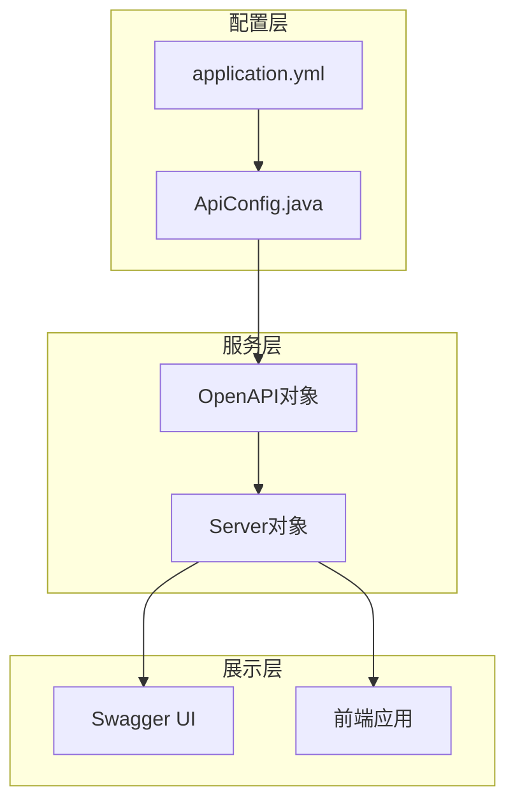
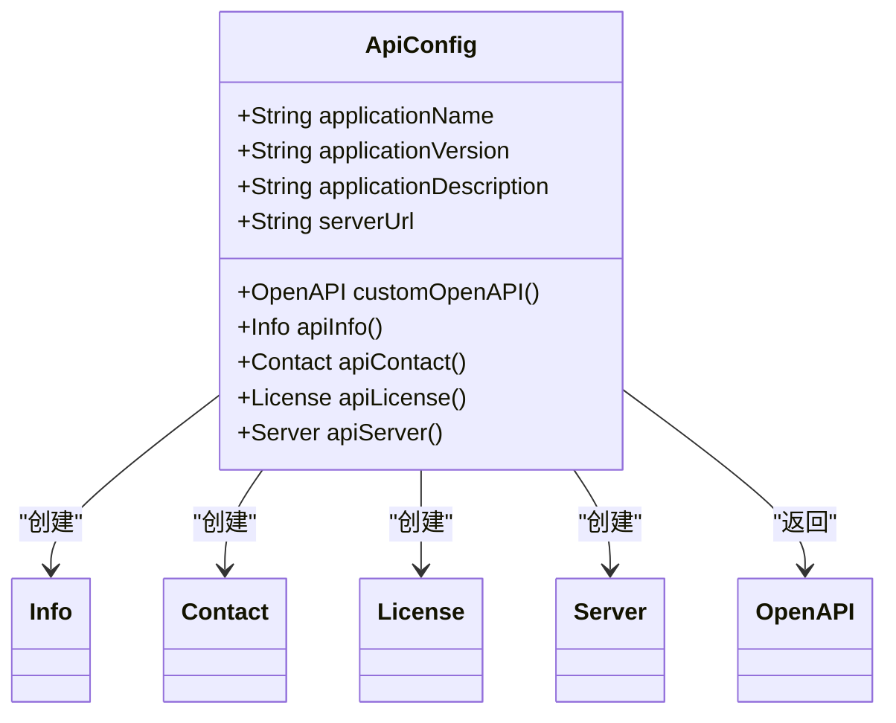
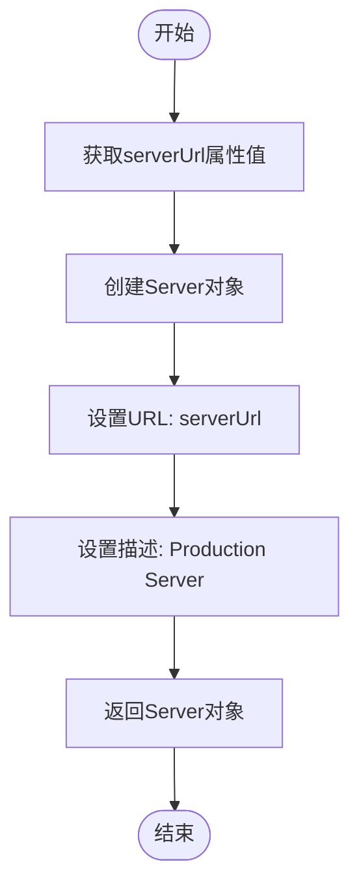
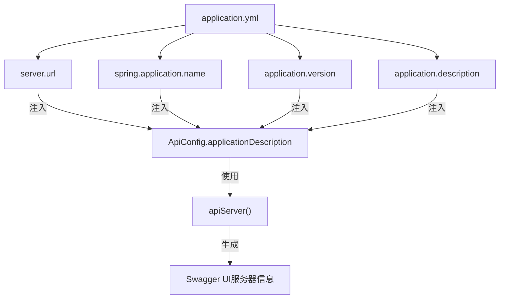
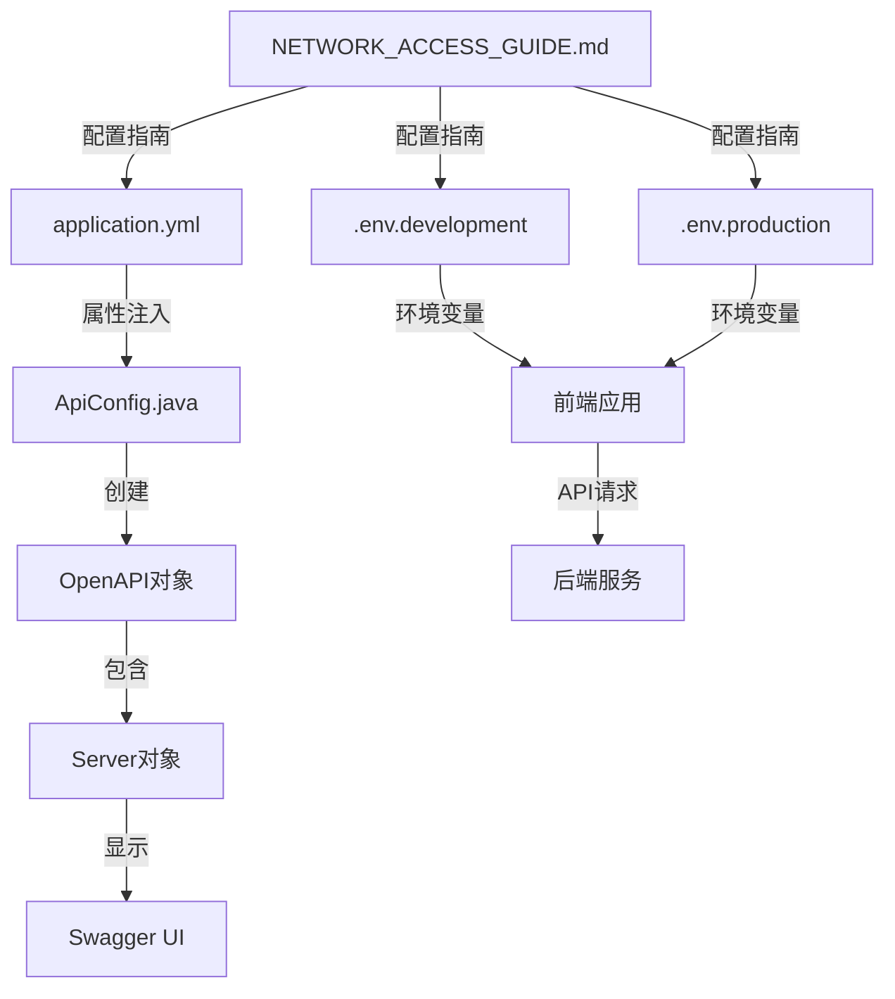

# API服务器配置

<cite>
**本文档引用的文件**   
- [ApiConfig.java](file://08-backend/src/main/java/com/enterprise/brain/common/config/ApiConfig.java)
- [application.yml](file://08-backend/src/main/resources/application.yml)
- [.env.development](file://07-frontend/.env.development)
- [.env.production](file://07-frontend/.env.production)
- [NETWORK_ACCESS_GUIDE.md](file://NETWORK_ACCESS_GUIDE.md)
</cite>

## 目录
1. [简介](#简介)
2. [项目结构](#项目结构)
3. [核心组件](#核心组件)
4. [架构概述](#架构概述)
5. [详细组件分析](#详细组件分析)
6. [依赖分析](#依赖分析)
7. [性能考虑](#性能考虑)
8. [故障排除指南](#故障排除指南)
9. [结论](#结论)

## 简介
本文档详细说明了企业级智能管理系统中API服务器的配置方法。重点介绍如何通过`ApiConfig.java`中的`apiServer()`方法配置API服务器信息，以及如何利用`application.yml`中的`server.url`属性动态配置服务器地址。同时提供多环境（开发、测试、生产）服务器配置的最佳实践和切换方案。

## 项目结构
本项目采用前后端分离架构，后端使用Spring Boot框架，前端使用Vue.js框架。API服务器配置主要涉及后端Java配置文件和前端环境变量配置。

**Diagram sources**
- [ApiConfig.java](file://08-backend/src/main/java/com/enterprise/brain/common/config/ApiConfig.java)
- [application.yml](file://08-backend/src/main/resources/application.yml)
- [.env.development](file://07-frontend/.env.development)
- [.env.production](file://07-frontend/.env.production)

**Section sources**
- [ApiConfig.java](file://08-backend/src/main/java/com/enterprise/brain/common/config/ApiConfig.java)
- [application.yml](file://08-backend/src/main/resources/application.yml)

## 核心组件
API服务器配置的核心组件包括：
- `ApiConfig.java`：定义API文档和服务器信息的Java配置类
- `application.yml`：Spring Boot应用的主要配置文件
- 前端环境变量文件：用于配置不同环境下的API基础URL

**Section sources**
- [ApiConfig.java](file://08-backend/src/main/java/com/enterprise/brain/common/config/ApiConfig.java)
- [application.yml](file://08-backend/src/main/resources/application.yml)
- [.env.development](file://07-frontend/.env.development)
- [.env.production](file://07-frontend/.env.production)

## 架构概述
系统采用分层架构，API服务器配置位于配置层，为整个系统提供统一的API访问入口。配置信息通过Spring Boot的属性注入机制动态加载，并在应用启动时初始化。

**Diagram sources**
- [ApiConfig.java](file://08-backend/src/main/java/com/enterprise/brain/common/config/ApiConfig.java)
- [application.yml](file://08-backend/src/main/resources/application.yml)

## 详细组件分析

### ApiConfig.java分析
`ApiConfig.java`是API配置的核心类，使用`@Configuration`注解标记为配置类，通过`@Value`注解从配置文件中注入属性值。

#### 类结构分析

**Diagram sources**
- [ApiConfig.java](file://08-backend/src/main/java/com/enterprise/brain/common/config/ApiConfig.java#L22-L108)

**Section sources**
- [ApiConfig.java](file://08-backend/src/main/java/com/enterprise/brain/common/config/ApiConfig.java#L22-L108)

### apiServer()方法分析
`apiServer()`方法是配置API服务器信息的关键方法，它创建并返回一个Server对象，用于定义API文档中的服务器信息。

#### 方法执行流程

**Diagram sources**
- [ApiConfig.java](file://08-backend/src/main/java/com/enterprise/brain/common/config/ApiConfig.java#L103-L107)

**Section sources**
- [ApiConfig.java](file://08-backend/src/main/java/com/enterprise/brain/common/config/ApiConfig.java#L103-L107)

### application.yml配置分析
`application.yml`文件是Spring Boot应用的主要配置文件，其中包含了服务器URL等关键配置信息。

#### 配置属性关系

**Diagram sources**
- [application.yml](file://08-backend/src/main/resources/application.yml)
- [ApiConfig.java](file://08-backend/src/main/java/com/enterprise/brain/common/config/ApiConfig.java)

**Section sources**
- [application.yml](file://08-backend/src/main/resources/application.yml)
- [ApiConfig.java](file://08-backend/src/main/java/com/enterprise/brain/common/config/ApiConfig.java)

## 依赖分析
API服务器配置涉及多个组件之间的依赖关系，包括配置文件、Java类和前端环境变量。

**Diagram sources**
- [application.yml](file://08-backend/src/main/resources/application.yml)
- [ApiConfig.java](file://08-backend/src/main/java/com/enterprise/brain/common/config/ApiConfig.java)
- [.env.development](file://07-frontend/.env.development)
- [.env.production](file://07-frontend/.env.production)
- [NETWORK_ACCESS_GUIDE.md](file://NETWORK_ACCESS_GUIDE.md)

**Section sources**
- [application.yml](file://08-backend/src/main/resources/application.yml)
- [ApiConfig.java](file://08-backend/src/main/java/com/enterprise/brain/common/config/ApiConfig.java)
- [.env.development](file://07-frontend/.env.development)
- [.env.production](file://07-frontend/.env.production)

## 性能考虑
API服务器配置对系统性能有重要影响，特别是在多环境部署和动态配置方面。

1. **配置加载性能**：Spring Boot在启动时一次性加载所有配置，避免了运行时频繁读取文件的开销
2. **内存使用**：配置信息在内存中只保存一份，通过依赖注入共享给各个组件
3. **启动时间**：合理的配置结构可以减少应用启动时间
4. **动态更新**：通过环境变量和配置文件分离，实现配置的动态更新而无需重新编译代码

## 故障排除指南
在配置API服务器时可能遇到的常见问题及解决方案：

**Section sources**
- [ApiConfig.java](file://08-backend/src/main/java/com/enterprise/brain/common/config/ApiConfig.java)
- [application.yml](file://08-backend/src/main/resources/application.yml)
- [NETWORK_ACCESS_GUIDE.md](file://NETWORK_ACCESS_GUIDE.md)

## 结论
本文档详细介绍了企业级智能管理系统中API服务器的配置方法。通过`ApiConfig.java`中的`apiServer()`方法和`application.yml`中的`server.url`属性，实现了API服务器信息的灵活配置。同时，结合前端环境变量文件，提供了完整的多环境配置解决方案，确保系统在不同环境下都能正确访问API服务。