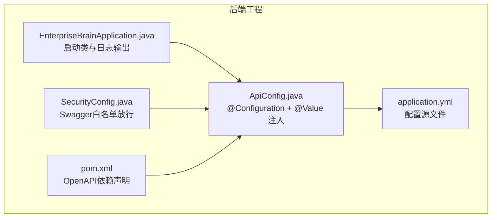
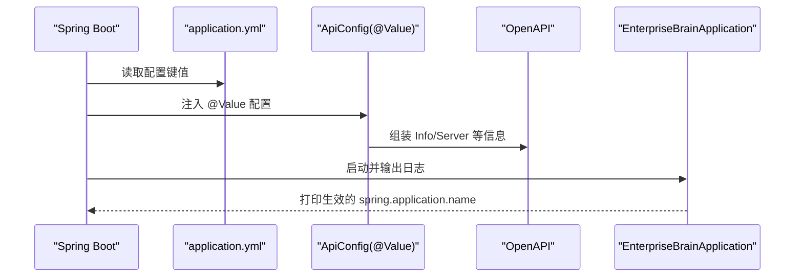
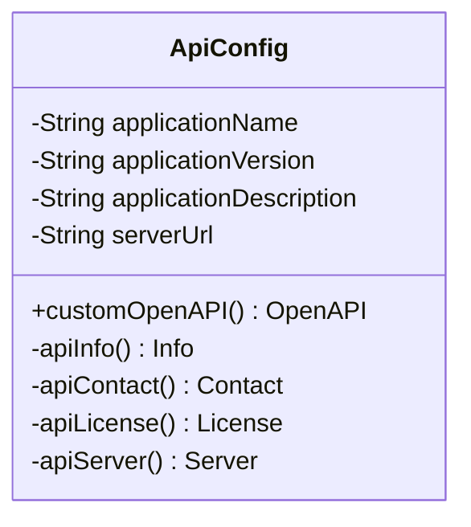
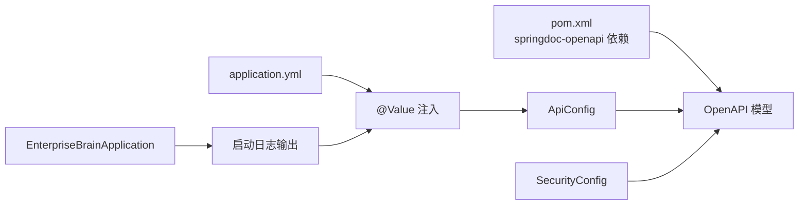

# API核心配置

<cite>
**本文引用的文件**
- [ApiConfig.java](file://08-backend/src/main/java/com/enterprise/brain/common/config/ApiConfig.java)
- [application.yml](file://08-backend/src/main/resources/application.yml)
- [EnterpriseBrainApplication.java](file://08-backend/src/main/java/com/enterprise/brain/EnterpriseBrainApplication.java)
- [SecurityConfig.java](file://08-backend/src/main/java/com/enterprise/brain/common/config/SecurityConfig.java)
- [pom.xml](file://08-backend/pom.xml)
</cite>

## 目录
1. [简介](#简介)
2. [项目结构](#项目结构)
3. [核心组件](#核心组件)
4. [架构总览](#架构总览)
5. [详细组件分析](#详细组件分析)
6. [依赖分析](#依赖分析)
7. [性能考虑](#性能考虑)
8. [故障排查指南](#故障排查指南)
9. [结论](#结论)

## 简介
本文件聚焦于后端模块中的API核心配置，围绕 ApiConfig.java 中通过 @Value 注解注入的关键配置项（应用名称、版本、描述、服务器URL）与其在 application.yml 中的对应关系进行深入解析，并结合 Spring Boot 的配置优先级机制，说明如何灵活覆盖默认值；同时提供默认值与自定义值的使用示例及配置生效的验证方法，帮助开发者快速理解与落地配置管理。

## 项目结构
- 后端采用 Spring Boot 工程，核心配置集中在 common/config 包下的 ApiConfig.java。
- 配置文件 application.yml 位于 resources 目录，用于集中管理运行时配置。
- 启动类 EnterpriseBrainApplication 负责应用启动与日志输出，便于观察最终生效的配置值。
- 安全配置 SecurityConfig 对 OpenAPI/Swagger 路由放行，确保文档可访问。

图表来源
- [ApiConfig.java](file://08-backend/src/main/java/com/enterprise/brain/common/config/ApiConfig.java#L1-L108)
- [application.yml](file://08-backend/src/main/resources/application.yml#L1-L42)
- [EnterpriseBrainApplication.java](file://08-backend/src/main/java/com/enterprise/brain/EnterpriseBrainApplication.java#L1-L61)
- [SecurityConfig.java](file://08-backend/src/main/java/com/enterprise/brain/common/config/SecurityConfig.java#L1-L41)
- [pom.xml](file://08-backend/pom.xml#L77-L82)

章节来源
- [ApiConfig.java](file://08-backend/src/main/java/com/enterprise/brain/common/config/ApiConfig.java#L1-L108)
- [application.yml](file://08-backend/src/main/resources/application.yml#L1-L42)
- [EnterpriseBrainApplication.java](file://08-backend/src/main/java/com/enterprise/brain/EnterpriseBrainApplication.java#L1-L61)
- [SecurityConfig.java](file://08-backend/src/main/java/com/enterprise/brain/common/config/SecurityConfig.java#L1-L41)
- [pom.xml](file://08-backend/pom.xml#L77-L82)

## 核心组件
- ApiConfig.java
  - 通过 @Configuration 声明为配置类。
  - 使用 @Value 注入以下配置项：
    - spring.application.name -> applicationName（默认值：Enterprise Brain）
    - application.version -> applicationVersion（默认值：1.0.0）
    - application.description -> applicationDescription（默认值：企业级智能管理系统）
    - server.url -> serverUrl（默认值：http://localhost:8080）
  - 构建 OpenAPI 文档的 Info、Contact、License 与 Server 信息，统一对外展示。

- application.yml
  - 提供基础运行配置（如数据库、日志、Swagger 路径），并与 ApiConfig.java 中的 @Value 键名形成一一对应关系，用于覆盖默认值。

- EnterpriseBrainApplication.java
  - 在启动日志中打印当前生效的 spring.application.name，便于验证配置是否按预期覆盖。

- SecurityConfig.java
  - 将 Swagger 文档相关路径加入白名单，确保文档页面可被访问。

- pom.xml
  - 引入 springdoc-openapi-starter-webmvc-ui，为 OpenAPI/Swagger 提供支持。

章节来源
- [ApiConfig.java](file://08-backend/src/main/java/com/enterprise/brain/common/config/ApiConfig.java#L24-L47)
- [application.yml](file://08-backend/src/main/resources/application.yml#L1-L42)
- [EnterpriseBrainApplication.java](file://08-backend/src/main/java/com/enterprise/brain/EnterpriseBrainApplication.java#L26-L60)
- [SecurityConfig.java](file://08-backend/src/main/java/com/enterprise/brain/common/config/SecurityConfig.java#L34-L41)
- [pom.xml](file://08-backend/pom.xml#L77-L82)

## 架构总览
下图展示了配置注入与生效的整体流程：Spring Boot 在启动时读取 application.yml 中的配置键值，通过 @Value 将其注入到 ApiConfig.java 的字段中，随后构建 OpenAPI 文档并在启动日志中输出最终生效的应用名称。

图表来源
- [ApiConfig.java](file://08-backend/src/main/java/com/enterprise/brain/common/config/ApiConfig.java#L24-L47)
- [application.yml](file://08-backend/src/main/resources/application.yml#L1-L42)
- [EnterpriseBrainApplication.java](file://08-backend/src/main/java/com/enterprise/brain/EnterpriseBrainApplication.java#L26-L60)

## 详细组件分析

### ApiConfig.java 配置项与对应关系
- 配置项与默认值
  - applicationName：spring.application.name，默认值为 Enterprise Brain
  - applicationVersion：application.version，默认值为 1.0.0
  - applicationDescription：application.description，默认值为企业级智能管理系统
  - serverUrl：server.url，默认值为 http://localhost:8080

- 与 application.yml 的对应关系
  - spring.application.name 与 application.yml 中 spring.application.name 存在直接对应关系，用于覆盖默认值。
  - application.version、application.description、server.url 在 application.yml 中未出现，因此将使用 ApiConfig.java 中声明的默认值。

- 关键方法职责
  - customOpenAPI：创建 OpenAPI Bean，注入 apiInfo 与 apiServer。
  - apiInfo：组装标题、描述、版本、联系人、许可证。
  - apiServer：设置服务器 URL 与描述。

图表来源
- [ApiConfig.java](file://08-backend/src/main/java/com/enterprise/brain/common/config/ApiConfig.java#L24-L108)

章节来源
- [ApiConfig.java](file://08-backend/src/main/java/com/enterprise/brain/common/config/ApiConfig.java#L24-L108)

### application.yml 中的配置项
- application.yml 提供了数据库、日志、Swagger 文档路径等配置，但并未包含 ApiConfig.java 中使用的 application.version、application.description、server.url。
- 因此，这些键将回退到 ApiConfig.java 中声明的默认值。

章节来源
- [application.yml](file://08-backend/src/main/resources/application.yml#L1-L42)

### 启动类与配置验证
- EnterpriseBrainApplication 在启动日志中会打印当前生效的 spring.application.name，可用于验证配置是否被正确覆盖。
- 若 application.yml 中提供了 spring.application.name，则启动日志将显示该值；否则显示默认值。

章节来源
- [EnterpriseBrainApplication.java](file://08-backend/src/main/java/com/enterprise/brain/EnterpriseBrainApplication.java#L26-L60)

### Swagger 白名单与文档访问
- SecurityConfig 将 Swagger 文档相关路径加入白名单，保证在安全策略下仍可访问 OpenAPI 文档页面。
- 结合 ApiConfig 构建的 OpenAPI 信息，可在 Swagger UI 中看到应用名称、版本、描述与服务器信息。

章节来源
- [SecurityConfig.java](file://08-backend/src/main/java/com/enterprise/brain/common/config/SecurityConfig.java#L34-L41)
- [ApiConfig.java](file://08-backend/src/main/java/com/enterprise/brain/common/config/ApiConfig.java#L54-L108)

## 依赖分析
- ApiConfig 依赖 OpenAPI 模型（Info、Contact、License、Server）与 Spring 容器的 @Value 注入能力。
- OpenAPI 依赖 springdoc-openapi-starter-webmvc-ui，已在 pom.xml 中声明。
- 启动类负责输出最终生效的配置值，便于验证。

图表来源
- [pom.xml](file://08-backend/pom.xml#L77-L82)
- [ApiConfig.java](file://08-backend/src/main/java/com/enterprise/brain/common/config/ApiConfig.java#L54-L108)
- [SecurityConfig.java](file://08-backend/src/main/java/com/enterprise/brain/common/config/SecurityConfig.java#L34-L41)
- [EnterpriseBrainApplication.java](file://08-backend/src/main/java/com/enterprise/brain/EnterpriseBrainApplication.java#L26-L60)

章节来源
- [pom.xml](file://08-backend/pom.xml#L77-L82)
- [ApiConfig.java](file://08-backend/src/main/java/com/enterprise/brain/common/config/ApiConfig.java#L54-L108)
- [SecurityConfig.java](file://08-backend/src/main/java/com/enterprise/brain/common/config/SecurityConfig.java#L34-L41)
- [EnterpriseBrainApplication.java](file://08-backend/src/main/java/com/enterprise/brain/EnterpriseBrainApplication.java#L26-L60)

## 性能考虑
- 配置注入属于启动阶段行为，对运行时性能影响极小。
- 建议将频繁变更的配置项集中管理，避免在运行时频繁修改导致不必要的重启。
- 对于 OpenAPI 文档生成，建议仅在开发/测试环境启用，生产环境可通过安全策略限制访问。

## 故障排查指南
- 症状：Swagger 文档无法访问
  - 排查：确认 SecurityConfig 中是否已将 Swagger 路径加入白名单。
  - 参考：[SecurityConfig.java](file://08-backend/src/main/java/com/enterprise/brain/common/config/SecurityConfig.java#L34-L41)

- 症状：OpenAPI 文档中的应用名称与期望不符
  - 排查：检查 application.yml 中是否存在 spring.application.name；若不存在则使用默认值。
  - 验证：启动后查看 EnterpriseBrainApplication 输出的日志，确认最终生效的应用名称。
  - 参考：[application.yml](file://08-backend/src/main/resources/application.yml#L1-L42)、[EnterpriseBrainApplication.java](file://08-backend/src/main/java/com/enterprise/brain/EnterpriseBrainApplication.java#L26-L60)

- 症状：OpenAPI 文档中的版本或描述异常
  - 排查：application.yml 中未提供 application.version 与 application.description，将使用 ApiConfig.java 默认值。
  - 参考：[ApiConfig.java](file://08-backend/src/main/java/com/enterprise/brain/common/config/ApiConfig.java#L24-L47)

- 症状：OpenAPI 文档中的服务器 URL 不正确
  - 排查：application.yml 中未提供 server.url，将使用 ApiConfig.java 默认值。
  - 参考：[ApiConfig.java](file://08-backend/src/main/java/com/enterprise/brain/common/config/ApiConfig.java#L43-L47)

## 结论
- ApiConfig.java 通过 @Value 注入应用名称、版本、描述与服务器 URL，并将其用于 OpenAPI 文档的生成。
- application.yml 中与之对应的键 spring.application.name 存在，其余键缺失，因此其余配置项将使用默认值。
- 通过启动日志与 Swagger 白名单配置，可以有效验证配置覆盖与文档可用性。
- 如需覆盖默认值，请在 application.yml 中添加相应键值，或在启动时通过命令行参数、环境变量等方式进行覆盖（见下一节“配置优先级与覆盖方式”）。

## 配置优先级与覆盖方式（实践指南）

- Spring Boot 配置优先级（从高到低）
  - 命令行参数（如 --spring.application.name=xxx）
  - 系统环境变量（如 SPRING_APPLICATION_NAME=xxx）
  - application.yml（resources 下的配置文件）
  - @Value 的默认值（ApiConfig.java 中声明）

- 实践示例
  - 自定义应用名称
    - 在 application.yml 中添加 spring.application.name 键，值为自定义名称。
    - 或通过命令行参数 --spring.application.name=your-app-name 启动。
  - 自定义版本与描述
    - 在 application.yml 中添加 application.version 与 application.description 键，值为自定义内容。
    - 或通过环境变量 SPRING_APPLICATION_NAME=your-app-name 等方式覆盖。
  - 自定义服务器 URL
    - 在 application.yml 中添加 server.url 键，值为自定义服务地址。
    - 或通过命令行参数 --server.url=http://your-host:port 启动。

- 验证方法
  - 启动应用后，查看启动日志中打印的 spring.application.name，确认是否为自定义值。
  - 访问 Swagger 文档页面，确认标题、版本、描述与服务器信息是否符合预期。
  - 如需进一步验证，可在 ApiConfig.java 中临时输出注入的字段值（仅限调试场景）。

章节来源
- [ApiConfig.java](file://08-backend/src/main/java/com/enterprise/brain/common/config/ApiConfig.java#L24-L47)
- [application.yml](file://08-backend/src/main/resources/application.yml#L1-L42)
- [EnterpriseBrainApplication.java](file://08-backend/src/main/java/com/enterprise/brain/EnterpriseBrainApplication.java#L26-L60)
- [SecurityConfig.java](file://08-backend/src/main/java/com/enterprise/brain/common/config/SecurityConfig.java#L34-L41)