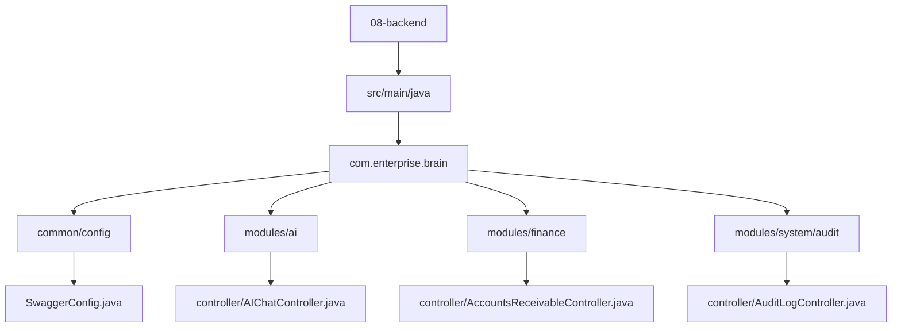
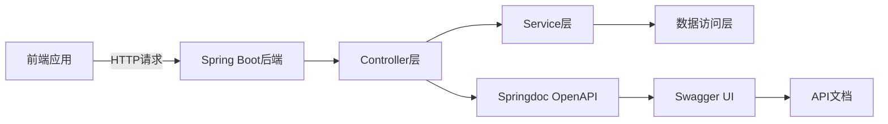
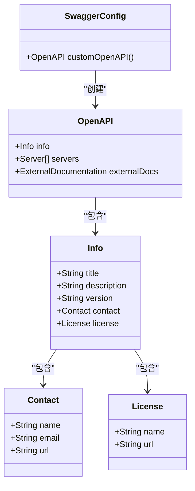
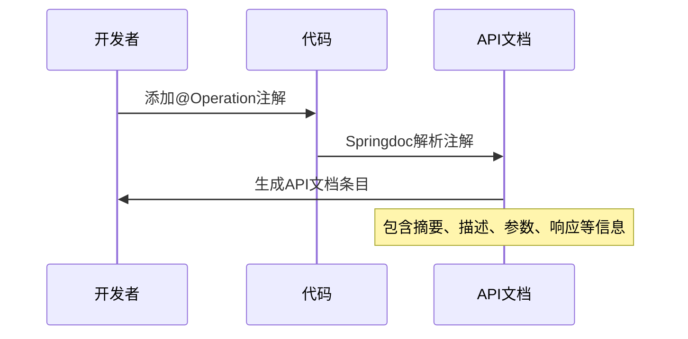
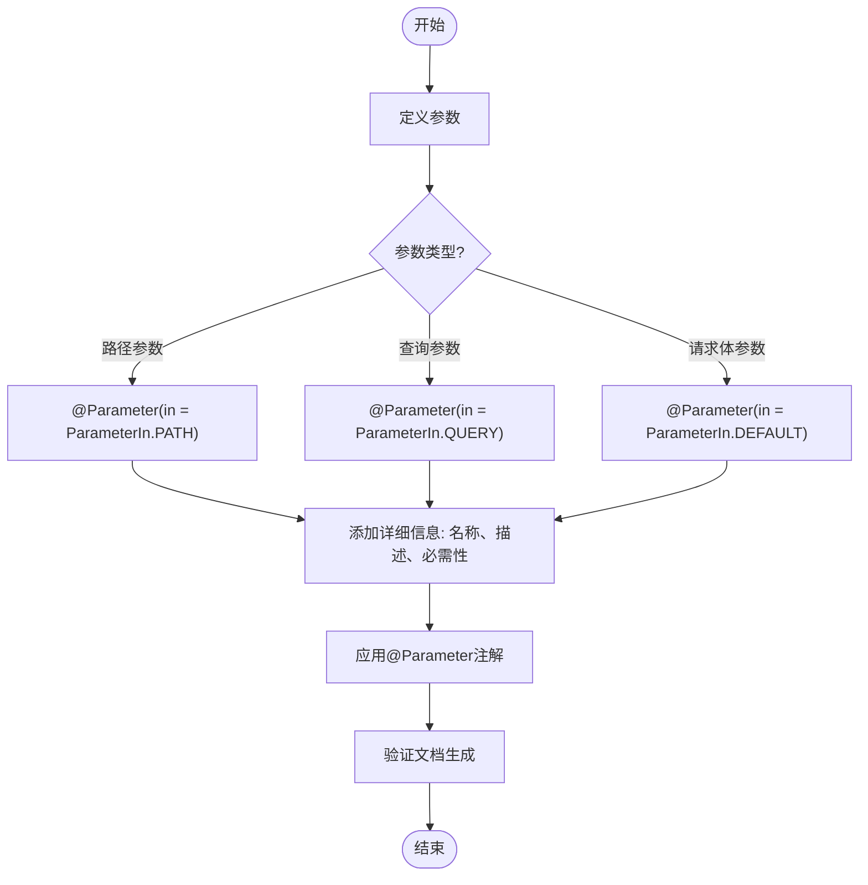
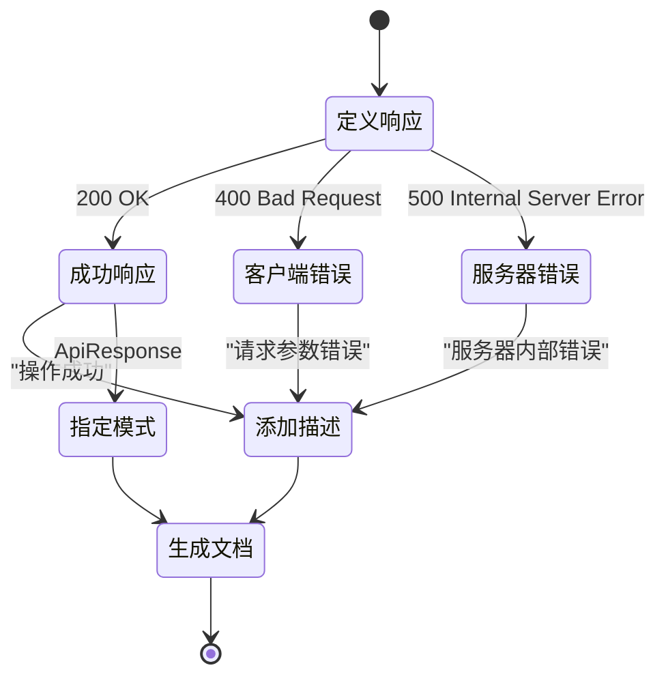
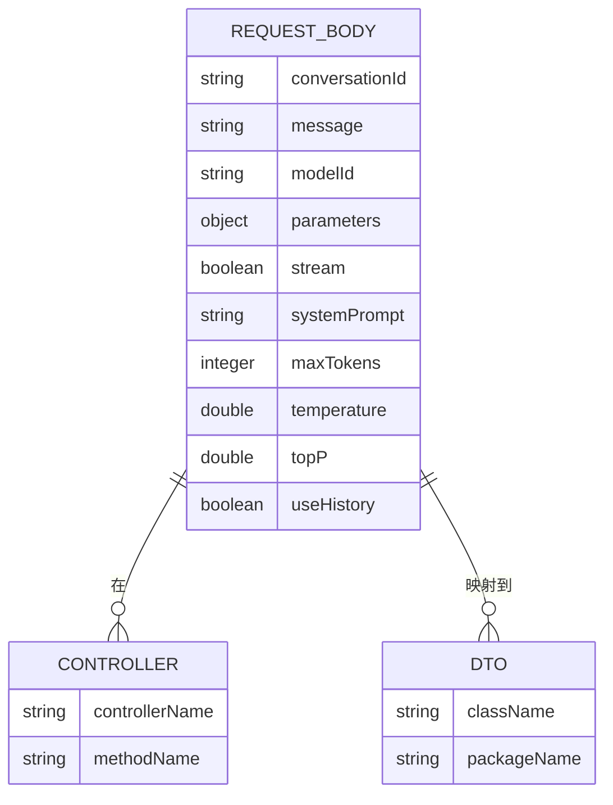
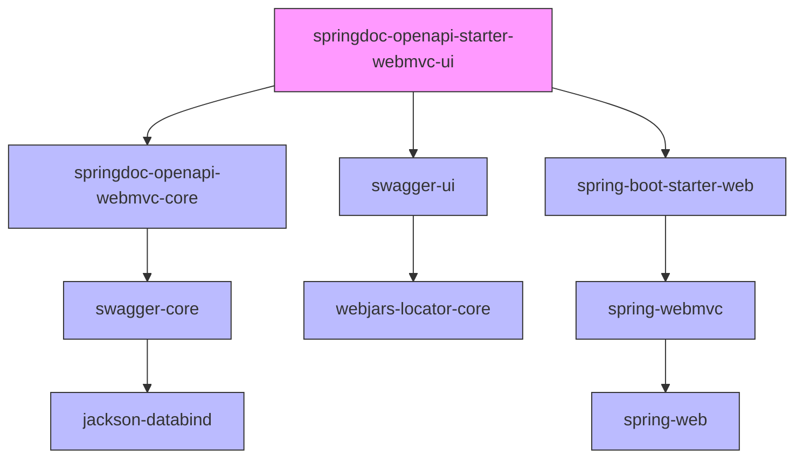

# API注解使用

<cite>
**本文档引用文件**  
- [SwaggerConfig.java](file://08-backend/src/main/java/com/enterprise/brain/common/config/SwaggerConfig.java)
- [AccountsReceivableController.java](file://08-backend/src/main/java/com/enterprise/brain/modules/finance/controller/AccountsReceivableController.java)
- [DataAnalysisController.java](file://08-backend/src/main/java/com/enterprise/brain/modules/analytics/controller/DataAnalysisController.java)
- [AuditLogController.java](file://08-backend/src/main/java/com/enterprise/brain/modules/system/audit/controller/AuditLogController.java)
- [AIChatController.java](file://08-backend/src/main/java/com/enterprise/brain/modules/ai/controller/AIChatController.java)
- [pom.xml](file://08-backend/pom.xml)
- [ApiConfig.java](file://08-backend/src/main/java/com/enterprise/brain/common/config/ApiConfig.java)
- [ApiResponse.java](file://08-backend/src/main/java/com/enterprise/brain/common/response/ApiResponse.java)
- [application.yml](file://08-backend/src/main/resources/application.yml)
</cite>

## 目录
1. [简介](#简介)
2. [项目结构](#项目结构)
3. [核心组件](#核心组件)
4. [架构概述](#架构概述)
5. [详细组件分析](#详细组件分析)
6. [依赖分析](#依赖分析)
7. [性能考虑](#性能考虑)
8. [故障排除指南](#故障排除指南)
9. [结论](#结论)

## 简介
本文档详细说明了如何在Spring Boot后端项目中使用Springdoc OpenAPI注解为RESTful API接口添加文档。通过分析AI模块、财务模块和系统审计模块的实际代码示例，展示了如何使用@Operation、@Parameter、@ApiResponse、@RequestBody等注解为API端点添加详细的描述、参数说明、响应模式和错误码文档。文档还提供了注解使用的最佳实践和常见错误避免方法。

## 项目结构
项目采用典型的Spring Boot分层架构，后端代码位于`08-backend`目录下，遵循模块化设计。主要模块包括AI、财务、分析、系统审计等，每个模块都有独立的controller、service、dto和entity包。API文档配置通过Springdoc OpenAPI实现，相关配置文件位于common/config目录下。

**图示来源**
- [SwaggerConfig.java](file://08-backend/src/main/java/com/enterprise/brain/common/config/SwaggerConfig.java)
- [AIChatController.java](file://08-backend/src/main/java/com/enterprise/brain/modules/ai/controller/AIChatController.java)
- [AccountsReceivableController.java](file://08-backend/src/main/java/com/enterprise/brain/modules/finance/controller/AccountsReceivableController.java)
- [AuditLogController.java](file://08-backend/src/main/java/com/enterprise/brain/modules/system/audit/controller/AuditLogController.java)

**章节来源**
- [08-backend/src/main/java](file://08-backend/src/main/java)

## 核心组件
本项目的核心组件包括Springdoc OpenAPI配置、API控制器、统一响应结构和文档注解。这些组件共同工作，为RESTful API提供完整的文档支持。Springdoc OpenAPI通过注解自动生成功能完整的API文档，开发者只需在控制器方法上添加适当的注解即可。

**章节来源**
- [SwaggerConfig.java](file://08-backend/src/main/java/com/enterprise/brain/common/config/SwaggerConfig.java)
- [ApiResponse.java](file://08-backend/src/main/java/com/enterprise/brain/common/response/ApiResponse.java)

## 架构概述
系统采用基于Spring Boot的微服务架构，API文档生成功能通过Springdoc OpenAPI实现。前端通过HTTP请求与后端API交互，后端使用Spring MVC处理请求，并通过Springdoc OpenAPI注解生成交互式API文档。整个架构支持Swagger UI，开发者和用户可以通过浏览器直接查看和测试API。

**图示来源**
- [EnterpriseBrainApplication.java](file://08-backend/src/main/java/com/enterprise/brain/EnterpriseBrainApplication.java)
- [SwaggerConfig.java](file://08-backend/src/main/java/com/enterprise/brain/common/config/SwaggerConfig.java)

## 详细组件分析

### Springdoc OpenAPI配置分析
Springdoc OpenAPI的配置通过SwaggerConfig类实现，该类定义了API文档的基本信息，包括标题、描述、版本、联系信息和许可证。配置类使用@Configuration注解标记为Spring配置类，并通过@Bean注解提供OpenAPI实例。

**图示来源**
- [SwaggerConfig.java](file://08-backend/src/main/java/com/enterprise/brain/common/config/SwaggerConfig.java)
- [ApiConfig.java](file://08-backend/src/main/java/com/enterprise/brain/common/config/ApiConfig.java)

**章节来源**
- [SwaggerConfig.java](file://08-backend/src/main/java/com/enterprise/brain/common/config/SwaggerConfig.java)

### @Operation注解使用分析
@Operation注解用于描述API操作的详细信息，包括摘要、描述、参数、响应等。在财务模块的AccountsReceivableController中，@Operation注解被用于描述各个API端点的功能。

**图示来源**
- [AccountsReceivableController.java](file://08-backend/src/main/java/com/enterprise/brain/modules/finance/controller/AccountsReceivableController.java)
- [DataAnalysisController.java](file://08-backend/src/main/java/com/enterprise/brain/modules/analytics/controller/DataAnalysisController.java)

**章节来源**
- [AccountsReceivableController.java](file://08-backend/src/main/java/com/enterprise/brain/modules/finance/controller/AccountsReceivableController.java)

### @Parameter注解使用分析
@Parameter注解用于描述API操作的单个参数，可以应用于方法参数或参数对象的字段。它提供了参数的名称、描述、是否必需、示例值等详细信息。

**图示来源**
- [AccountsReceivableController.java](file://08-backend/src/main/java/com/enterprise/brain/modules/finance/controller/AccountsReceivableController.java)
- [DataAnalysisController.java](file://08-backend/src/main/java/com/enterprise/brain/modules/analytics/controller/DataAnalysisController.java)

**章节来源**
- [AccountsReceivableController.java](file://08-backend/src/main/java/com/enterprise/brain/modules/finance/controller/AccountsReceivableController.java)

### @ApiResponse注解使用分析
@ApiResponse注解用于描述API操作的可能响应，包括HTTP状态码、描述、响应体模式等。它可以定义成功响应和各种错误响应，帮助API使用者理解可能的返回结果。

**图示来源**
- [ApiResponse.java](file://08-backend/src/main/java/com/enterprise/brain/common/response/ApiResponse.java)
- [AccountsReceivableController.java](file://08-backend/src/main/java/com/enterprise/brain/modules/finance/controller/AccountsReceivableController.java)

**章节来源**
- [ApiResponse.java](file://08-backend/src/main/java/com/enterprise/brain/common/response/ApiResponse.java)

### @RequestBody注解使用分析
@RequestBody注解用于指示方法参数应从HTTP请求体中绑定。结合@Parameter注解，可以为请求体提供详细的描述和示例。

**图示来源**
- [AIChatRequest.java](file://08-backend/src/main/java/com/enterprise/brain/modules/ai/dto/request/AIChatRequest.java)
- [AIChatController.java](file://08-backend/src/main/java/com/enterprise/brain/modules/ai/controller/AIChatController.java)

**章节来源**
- [AIChatRequest.java](file://08-backend/src/main/java/com/enterprise/brain/modules/ai/dto/request/AIChatRequest.java)

## 依赖分析
项目通过Maven管理依赖，Springdoc OpenAPI相关依赖在pom.xml文件中定义。核心依赖包括springdoc-openapi-starter-webmvc-ui，它提供了API文档生成所需的所有功能。

**图示来源**
- [pom.xml](file://08-backend/pom.xml)

**章节来源**
- [pom.xml](file://08-backend/pom.xml)

## 性能考虑
API文档生成功能在应用启动时进行注解扫描和文档生成，对运行时性能影响较小。建议在生产环境中通过配置控制文档的可见性，避免暴露敏感的API信息。同时，合理的注解使用可以减少文档生成时的反射开销。

## 故障排除指南
当API文档无法正常显示时，首先检查pom.xml中是否包含正确的Springdoc OpenAPI依赖。然后确认SwaggerConfig配置类是否正确配置了OpenAPI实例。检查控制器类是否使用@RestController注解，并确保API端点方法使用了适当的Spring MVC注解（如@GetMapping、@PostMapping等）。

**章节来源**
- [SwaggerConfig.java](file://08-backend/src/main/java/com/enterprise/brain/common/config/SwaggerConfig.java)
- [pom.xml](file://08-backend/pom.xml)

## 结论
通过使用Springdoc OpenAPI注解，可以有效地为RESTful API添加详细的文档。@Operation、@Parameter、@ApiResponse和@RequestBody等注解提供了全面的文档支持，使API更加易于理解和使用。遵循最佳实践，合理使用这些注解，可以显著提高API的可用性和开发效率。