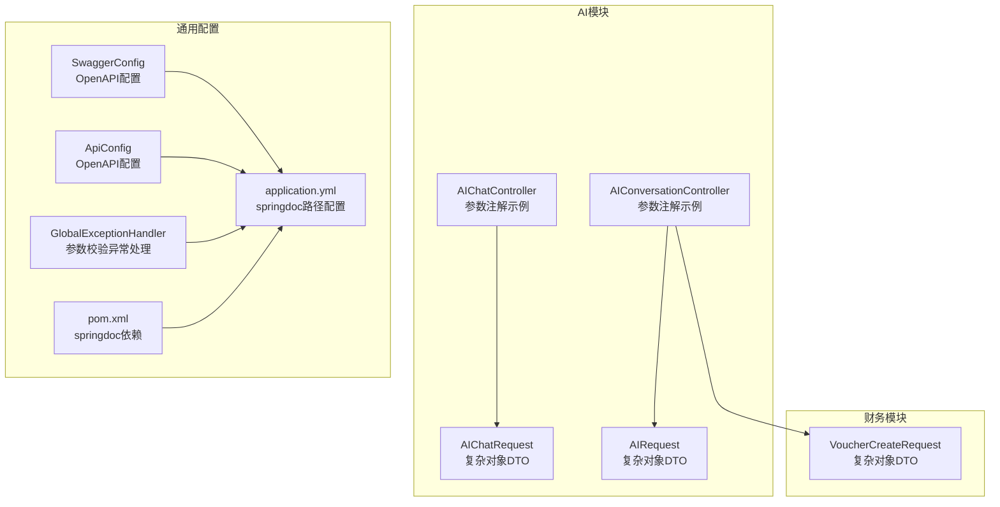
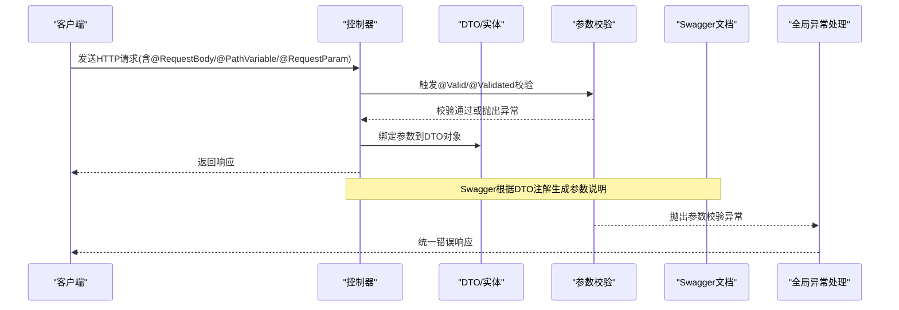
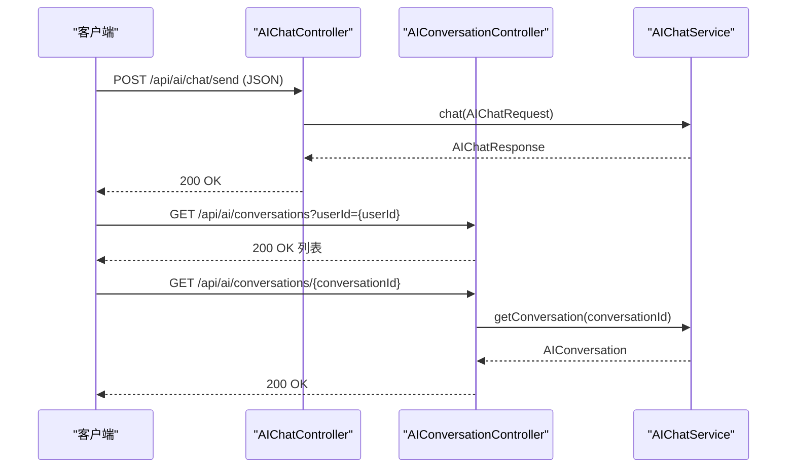
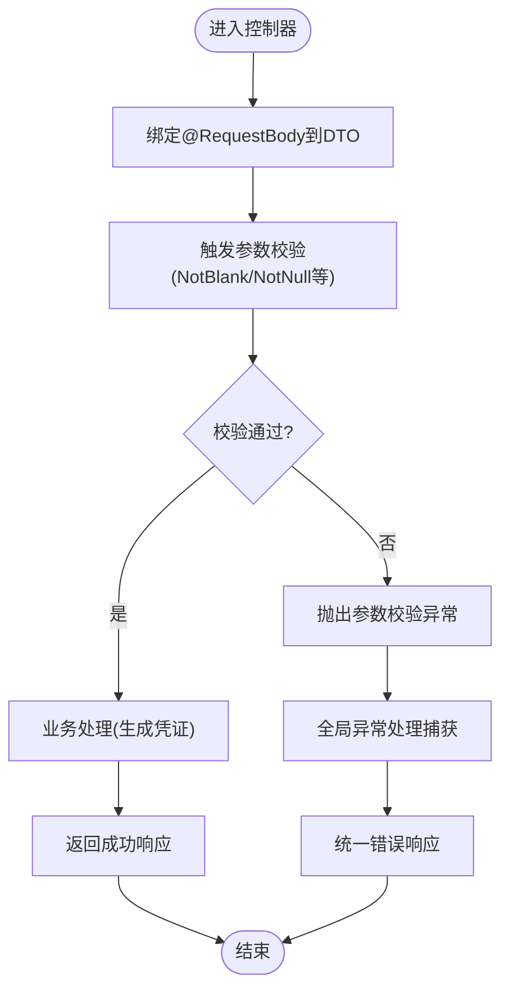
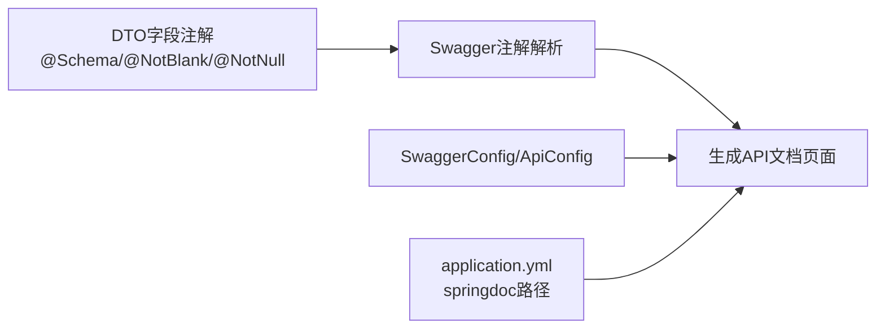
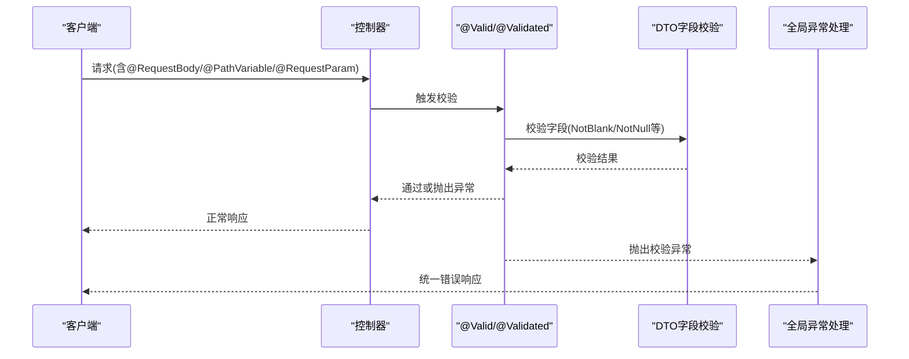
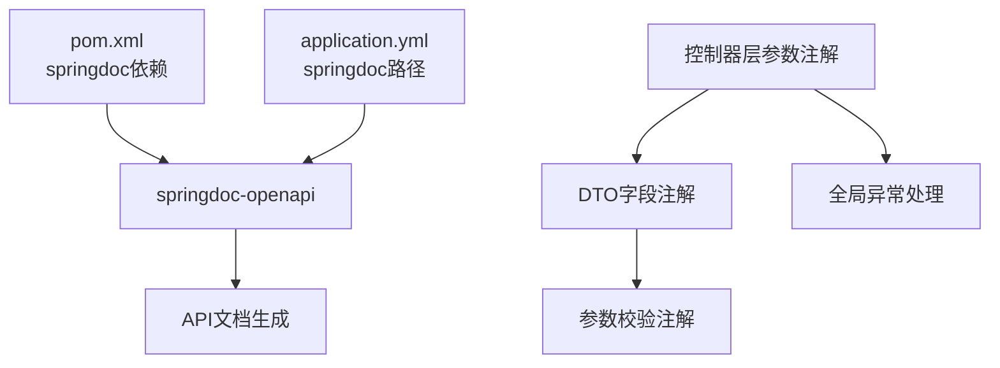

# 参数注解

<cite>
**本文引用的文件**
- [AIChatController.java](file://08-backend/src/main/java/com/enterprise/brain/modules/ai/controller/AIChatController.java)
- [AIConversationController.java](file://08-backend/src/main/java/com/enterprise/brain/modules/ai/controller/AIConversationController.java)
- [AIChatRequest.java](file://08-backend/src/main/java/com/enterprise/brain/modules/ai/dto/request/AIChatRequest.java)
- [AIRequest.java](file://08-backend/src/main/java/com/enterprise/brain/modules/ai/dto/request/AIRequest.java)
- [VoucherCreateRequest.java](file://08-backend/src/main/java/com/enterprise/brain/modules/finance/dto/request/VoucherCreateRequest.java)
- [DataAnalysisController.java](file://08-backend/src/main/java/com/enterprise/brain/modules/analytics/controller/DataAnalysisController.java)
- [DataAnalysisDTO.java](file://08-backend/src/main/java/com/enterprise/brain/modules/analytics/dto/DataAnalysisDTO.java)
- [GlobalExceptionHandler.java](file://08-backend/src/main/java/com/enterprise/brain/common/exception/GlobalExceptionHandler.java)
- [SwaggerConfig.java](file://08-backend/src/main/java/com/enterprise/brain/common/config/SwaggerConfig.java)
- [ApiConfig.java](file://08-backend/src/main/java/com/enterprise/brain/common/config/ApiConfig.java)
- [application.yml](file://08-backend/src/main/resources/application.yml)
- [pom.xml](file://08-backend/pom.xml)
</cite>

## 目录
1. [简介](#简介)
2. [项目结构](#项目结构)
3. [核心组件](#核心组件)
4. [架构总览](#架构总览)
5. [详细组件分析](#详细组件分析)
6. [依赖关系分析](#依赖关系分析)
7. [性能考虑](#性能考虑)
8. [故障排查指南](#故障排查指南)
9. [结论](#结论)
10. [附录](#附录)

## 简介
本指南聚焦于Spring Web MVC中的参数注解使用，结合AI聊天模块与财务模块的实际代码，系统讲解以下内容：
- 如何为API参数添加详细的描述、参数类型、是否必填等元数据
- @RequestBody在复杂对象参数传递中的应用
- @Parameter注解在Swagger文档中生成参数说明的作用
- 参数校验注解@Valid与参数注解的组合使用方法，确保API参数的完整性和准确性

通过阅读本指南，读者可以掌握在控制器层如何正确标注参数、如何利用Swagger生成清晰的API文档，并通过全局异常处理保障参数校验的统一反馈。

## 项目结构
本项目的后端采用Spring Boot工程，参数注解主要分布在控制器层与DTO层，Swagger配置位于common/config目录下，全局异常处理统一拦截参数校验异常。

图表来源
- [AIChatController.java](file://08-backend/src/main/java/com/enterprise/brain/modules/ai/controller/AIChatController.java#L1-L152)
- [AIConversationController.java](file://08-backend/src/main/java/com/enterprise/brain/modules/ai/controller/AIConversationController.java#L1-L111)
- [AIChatRequest.java](file://08-backend/src/main/java/com/enterprise/brain/modules/ai/dto/request/AIChatRequest.java#L1-L18)
- [AIRequest.java](file://08-backend/src/main/java/com/enterprise/brain/modules/ai/dto/request/AIRequest.java#L1-L105)
- [VoucherCreateRequest.java](file://08-backend/src/main/java/com/enterprise/brain/modules/finance/dto/request/VoucherCreateRequest.java#L1-L65)
- [SwaggerConfig.java](file://08-backend/src/main/java/com/enterprise/brain/common/config/SwaggerConfig.java#L1-L38)
- [ApiConfig.java](file://08-backend/src/main/java/com/enterprise/brain/common/config/ApiConfig.java#L14-L108)
- [GlobalExceptionHandler.java](file://08-backend/src/main/java/com/enterprise/brain/common/exception/GlobalExceptionHandler.java#L1-L119)
- [application.yml](file://08-backend/src/main/resources/application.yml#L1-L42)
- [pom.xml](file://08-backend/pom.xml#L73-L114)

章节来源
- [AIChatController.java](file://08-backend/src/main/java/com/enterprise/brain/modules/ai/controller/AIChatController.java#L1-L152)
- [AIConversationController.java](file://08-backend/src/main/java/com/enterprise/brain/modules/ai/controller/AIConversationController.java#L1-L111)
- [VoucherCreateRequest.java](file://08-backend/src/main/java/com/enterprise/brain/modules/finance/dto/request/VoucherCreateRequest.java#L1-L65)
- [SwaggerConfig.java](file://08-backend/src/main/java/com/enterprise/brain/common/config/SwaggerConfig.java#L1-L38)
- [ApiConfig.java](file://08-backend/src/main/java/com/enterprise/brain/common/config/ApiConfig.java#L14-L108)
- [application.yml](file://08-backend/src/main/resources/application.yml#L1-L42)
- [pom.xml](file://08-backend/pom.xml#L73-L114)

## 核心组件
- 控制器层参数注解
  - @RequestBody：用于接收JSON请求体，常用于复杂对象参数传递
  - @PathVariable：用于从URL路径中提取参数
  - @RequestParam：用于从查询参数或表单参数中提取参数
- DTO层参数元数据
  - 使用Swagger注解为DTO字段提供描述、是否必填等元数据
- 全局异常处理
  - 统一处理参数校验异常，保证API返回一致的错误信息

章节来源
- [AIChatController.java](file://08-backend/src/main/java/com/enterprise/brain/modules/ai/controller/AIChatController.java#L23-L152)
- [AIConversationController.java](file://08-backend/src/main/java/com/enterprise/brain/modules/ai/controller/AIConversationController.java#L18-L111)
- [VoucherCreateRequest.java](file://08-backend/src/main/java/com/enterprise/brain/modules/finance/dto/request/VoucherCreateRequest.java#L1-L65)
- [GlobalExceptionHandler.java](file://08-backend/src/main/java/com/enterprise/brain/common/exception/GlobalExceptionHandler.java#L40-L77)

## 架构总览
下图展示了参数注解在控制器与DTO之间的交互流程，以及Swagger文档生成与参数校验异常处理的关系。

图表来源
- [AIChatController.java](file://08-backend/src/main/java/com/enterprise/brain/modules/ai/controller/AIChatController.java#L23-L152)
- [AIConversationController.java](file://08-backend/src/main/java/com/enterprise/brain/modules/ai/controller/AIConversationController.java#L18-L111)
- [VoucherCreateRequest.java](file://08-backend/src/main/java/com/enterprise/brain/modules/finance/dto/request/VoucherCreateRequest.java#L1-L65)
- [GlobalExceptionHandler.java](file://08-backend/src/main/java/com/enterprise/brain/common/exception/GlobalExceptionHandler.java#L40-L77)
- [SwaggerConfig.java](file://08-backend/src/main/java/com/enterprise/brain/common/config/SwaggerConfig.java#L1-L38)
- [ApiConfig.java](file://08-backend/src/main/java/com/enterprise/brain/common/config/ApiConfig.java#L54-L108)

## 详细组件分析

### AI聊天模块参数注解实践
该模块展示了多种参数注解的典型用法：
- @RequestBody用于接收复杂对象请求体
- @PathVariable用于从路径中提取用户ID、会话ID等
- @RequestParam用于从查询参数中提取用户ID、关键词等

图表来源
- [AIChatController.java](file://08-backend/src/main/java/com/enterprise/brain/modules/ai/controller/AIChatController.java#L23-L152)
- [AIConversationController.java](file://08-backend/src/main/java/com/enterprise/brain/modules/ai/controller/AIConversationController.java#L18-L111)

章节来源
- [AIChatController.java](file://08-backend/src/main/java/com/enterprise/brain/modules/ai/controller/AIChatController.java#L23-L152)
- [AIConversationController.java](file://08-backend/src/main/java/com/enterprise/brain/modules/ai/controller/AIConversationController.java#L18-L111)

### 财务模块复杂对象参数传递
财务模块通过@RequestBody传递复杂对象，DTO中使用Swagger注解提供参数元数据，并配合校验注解确保必填字段与类型正确。

图表来源
- [VoucherCreateRequest.java](file://08-backend/src/main/java/com/enterprise/brain/modules/finance/dto/request/VoucherCreateRequest.java#L1-L65)
- [GlobalExceptionHandler.java](file://08-backend/src/main/java/com/enterprise/brain/common/exception/GlobalExceptionHandler.java#L40-L77)

章节来源
- [VoucherCreateRequest.java](file://08-backend/src/main/java/com/enterprise/brain/modules/finance/dto/request/VoucherCreateRequest.java#L1-L65)
- [GlobalExceptionHandler.java](file://08-backend/src/main/java/com/enterprise/brain/common/exception/GlobalExceptionHandler.java#L40-L77)

### Swagger文档参数说明生成
- Swagger配置类提供OpenAPI基础信息与外部文档链接
- DTO层使用Swagger注解为字段提供描述、是否必填等元数据
- application.yml中配置springdoc的API文档与UI路径

图表来源
- [SwaggerConfig.java](file://08-backend/src/main/java/com/enterprise/brain/common/config/SwaggerConfig.java#L1-L38)
- [ApiConfig.java](file://08-backend/src/main/java/com/enterprise/brain/common/config/ApiConfig.java#L54-L108)
- [application.yml](file://08-backend/src/main/resources/application.yml#L37-L42)
- [VoucherCreateRequest.java](file://08-backend/src/main/java/com/enterprise/brain/modules/finance/dto/request/VoucherCreateRequest.java#L1-L65)

章节来源
- [SwaggerConfig.java](file://08-backend/src/main/java/com/enterprise/brain/common/config/SwaggerConfig.java#L1-L38)
- [ApiConfig.java](file://08-backend/src/main/java/com/enterprise/brain/common/config/ApiConfig.java#L54-L108)
- [application.yml](file://08-backend/src/main/resources/application.yml#L37-L42)
- [VoucherCreateRequest.java](file://08-backend/src/main/java/com/enterprise/brain/modules/finance/dto/request/VoucherCreateRequest.java#L1-L65)

### 参数校验注解与参数注解的组合使用
- 在控制器方法上使用@Valid/@Validated触发参数校验
- 在DTO字段上使用校验注解(如@NotBlank、@NotNull)声明必填与约束
- 全局异常处理器统一捕获参数校验异常并返回标准错误响应

图表来源
- [DataAnalysisController.java](file://08-backend/src/main/java/com/enterprise/brain/modules/analytics/controller/DataAnalysisController.java#L42-L62)
- [DataAnalysisDTO.java](file://08-backend/src/main/java/com/enterprise/brain/modules/analytics/dto/DataAnalysisDTO.java#L1-L64)
- [GlobalExceptionHandler.java](file://08-backend/src/main/java/com/enterprise/brain/common/exception/GlobalExceptionHandler.java#L40-L77)

章节来源
- [DataAnalysisController.java](file://08-backend/src/main/java/com/enterprise/brain/modules/analytics/controller/DataAnalysisController.java#L42-L62)
- [DataAnalysisDTO.java](file://08-backend/src/main/java/com/enterprise/brain/modules/analytics/dto/DataAnalysisDTO.java#L1-L64)
- [GlobalExceptionHandler.java](file://08-backend/src/main/java/com/enterprise/brain/common/exception/GlobalExceptionHandler.java#L40-L77)

## 依赖关系分析
- Swagger依赖：通过springdoc-openapi-starter-webmvc-ui引入
- 参数校验依赖：基于Jakarta Validation API
- 异常处理依赖：基于Spring MVC异常机制

图表来源
- [pom.xml](file://08-backend/pom.xml#L73-L114)
- [application.yml](file://08-backend/src/main/resources/application.yml#L37-L42)
- [AIChatController.java](file://08-backend/src/main/java/com/enterprise/brain/modules/ai/controller/AIChatController.java#L23-L152)
- [AIConversationController.java](file://08-backend/src/main/java/com/enterprise/brain/modules/ai/controller/AIConversationController.java#L18-L111)
- [VoucherCreateRequest.java](file://08-backend/src/main/java/com/enterprise/brain/modules/finance/dto/request/VoucherCreateRequest.java#L1-L65)
- [GlobalExceptionHandler.java](file://08-backend/src/main/java/com/enterprise/brain/common/exception/GlobalExceptionHandler.java#L40-L77)

章节来源
- [pom.xml](file://08-backend/pom.xml#L73-L114)
- [application.yml](file://08-backend/src/main/resources/application.yml#L37-L42)
- [GlobalExceptionHandler.java](file://08-backend/src/main/java/com/enterprise/brain/common/exception/GlobalExceptionHandler.java#L40-L77)

## 性能考虑
- 合理使用@RequestBody传递复杂对象，避免不必要的大对象序列化开销
- 对高频接口进行参数校验前置，减少无效调用
- 在DTO中仅标注必要的元数据，避免过度注解影响文档生成性能

## 故障排查指南
- 参数校验失败
  - 现象：返回400错误，包含字段校验失败信息
  - 排查：检查DTO字段上的校验注解是否正确；确认请求体字段是否符合要求
  - 参考：全局异常处理器对MethodArgumentNotValidException、BindException、ConstraintViolationException的处理
- 参数绑定异常
  - 现象：参数无法绑定到DTO字段
  - 排查：确认请求参数命名与DTO字段一致；检查@PathVariable/@RequestParam的路径与参数名
- 文档无法访问
  - 现象：Swagger UI或API文档页面不可用
  - 排查：确认application.yml中springdoc.api-docs.path与springdoc.swagger-ui.path配置正确；确认pom.xml已引入springdoc依赖

章节来源
- [GlobalExceptionHandler.java](file://08-backend/src/main/java/com/enterprise/brain/common/exception/GlobalExceptionHandler.java#L40-L77)
- [application.yml](file://08-backend/src/main/resources/application.yml#L37-L42)
- [pom.xml](file://08-backend/pom.xml#L73-L114)

## 结论
通过在控制器层正确使用@RequestBody、@PathVariable、@RequestParam，在DTO层提供详尽的Swagger元数据，并结合@Valid/@Validated与校验注解，可以显著提升API的可读性、可维护性与健壮性。配合全局异常处理，能够为前端提供一致且明确的错误反馈，从而构建高质量的后端服务。

## 附录
- 常用参数注解速查
  - @RequestBody：接收JSON请求体，适合复杂对象
  - @PathVariable：从URL路径提取参数
  - @RequestParam：从查询参数或表单参数提取参数
- 常用校验注解速查
  - @NotBlank：字符串非空
  - @NotNull：对象非空
  - @Min/@Max：数值范围
  - @Pattern：正则表达式
- Swagger注解速查
  - @Schema：为字段提供描述、是否必填等元数据
  - @Operation/@Tag：为接口提供描述与分组