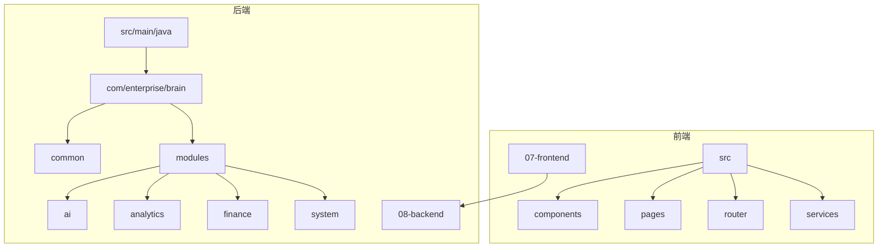
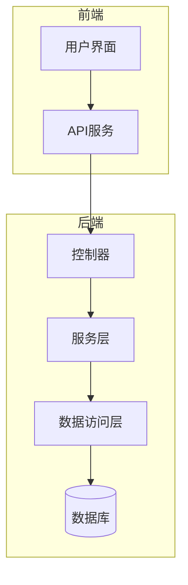
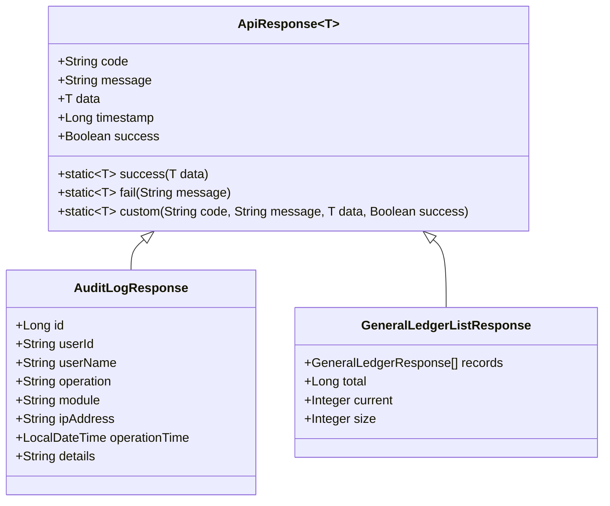
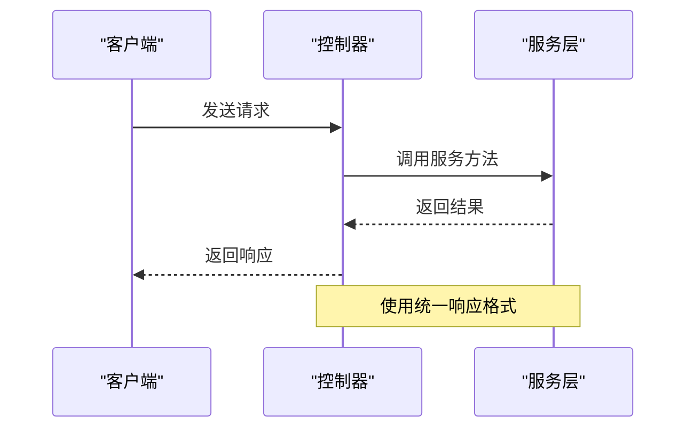
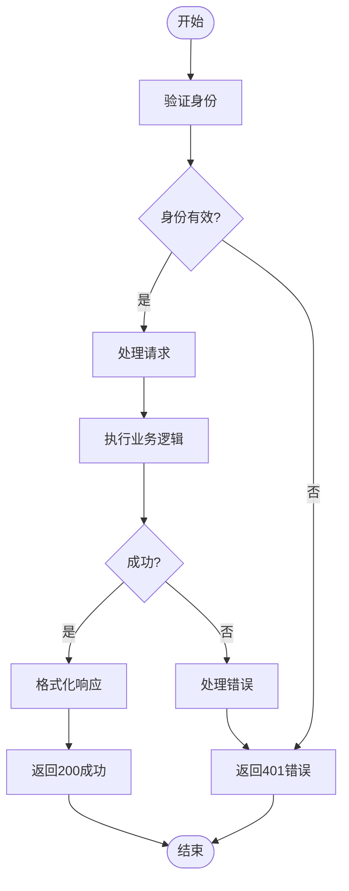
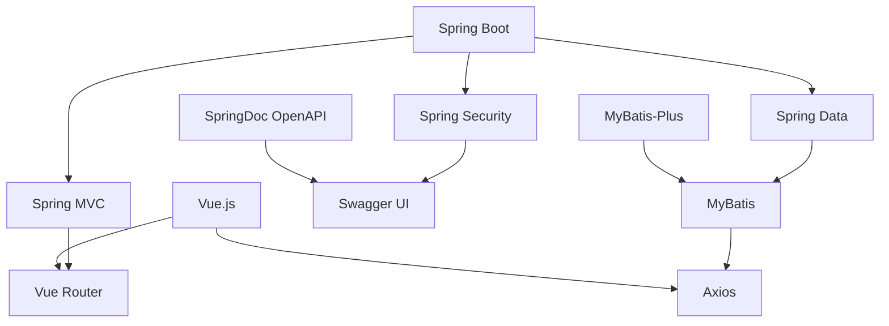

# 响应注解

<cite>
**本文档引用的文件**   
- [ApiResponse.java](file://08-backend/src/main/java/com/enterprise/brain/common/response/ApiResponse.java)
- [BaseController.java](file://08-backend/src/main/java/com/enterprise/brain/common/base/BaseController.java)
- [AuditLogController.java](file://08-backend/src/main/java/com/enterprise/brain/modules/system/audit/controller/AuditLogController.java)
- [AccountsReceivableController.java](file://08-backend/src/main/java/com/enterprise/brain/modules/finance/controller/AccountsReceivableController.java)
- [GeneralLedgerController.java](file://08-backend/src/main/java/com/enterprise/brain/modules/finance/controller/GeneralLedgerController.java)
- [AuditLogResponse.java](file://08-backend/src/main/java/com/enterprise/brain/modules/system/audit/dto/response/AuditLogResponse.java)
- [GeneralLedgerListResponse.java](file://08-backend/src/main/java/com/enterprise/brain/modules/finance/dto/response/GeneralLedgerListResponse.java)
- [ApiConfig.java](file://08-backend/src/main/java/com/enterprise/brain/common/config/ApiConfig.java)
- [SwaggerConfig.java](file://08-backend/src/main/java/com/enterprise/brain/common/config/SwaggerConfig.java)
</cite>

## 目录
1. [简介](#简介)
2. [项目结构](#项目结构)
3. [核心组件](#核心组件)
4. [架构概述](#架构概述)
5. [详细组件分析](#详细组件分析)
6. [依赖分析](#依赖分析)
7. [性能考虑](#性能考虑)
8. [故障排除指南](#故障排除指南)
9. [结论](#结论)
10. [附录](#附录) (如有必要)

## 简介
本文档详细说明了@ApiResponse、@ApiResponses注解的使用方法，以及如何通过返回类型和ResponseEntity正确描述API响应。通过系统审计模块和财务模块的代码示例，展示如何定义成功响应和各种错误响应的状态码、响应体结构和描述信息。同时解释了如何使用泛型返回类型如Page<AuditLogResponse>在Swagger文档中正确生成分页响应结构，以及如何为不同HTTP状态码配置相应的响应模型，提高API文档的完整性和可用性。

## 项目结构
本项目采用典型的分层架构，后端使用Spring Boot框架，前端使用Vue.js框架。后端代码主要位于08-backend目录下，按照模块化的方式组织，包括AI、分析、财务、系统等模块。每个模块包含controller、dto、entity、repository、service等子目录，遵循标准的Spring Boot项目结构。

**图示来源**
- [07-frontend](file://07-frontend)
- [08-backend](file://08-backend)

**章节来源**
- [07-frontend](file://07-frontend)
- [08-backend](file://08-backend)

## 核心组件
核心组件包括统一响应结果类ApiResponse、基础控制器类BaseController、系统审计模块和财务模块。ApiResponse类定义了统一的响应格式，包含响应码、响应消息、响应数据、时间戳和成功标识等字段。BaseController类提供了统一的响应方法，如success、fail等。系统审计模块和财务模块是两个典型的业务模块，展示了如何在实际业务中使用响应注解。

**章节来源**
- [ApiResponse.java](file://08-backend/src/main/java/com/enterprise/brain/common/response/ApiResponse.java)
- [BaseController.java](file://08-backend/src/main/java/com/enterprise/brain/common/base/BaseController.java)

## 架构概述
系统采用前后端分离的架构，前端通过RESTful API与后端进行通信。后端使用Spring Boot框架，通过Spring MVC处理HTTP请求，使用MyBatis-Plus进行数据库操作。API文档使用SpringDoc OpenAPI生成，支持Swagger UI。系统通过统一的响应格式和异常处理机制，确保API的稳定性和一致性。

**图示来源**
- [08-backend](file://08-backend)
- [07-frontend](file://07-frontend)

## 详细组件分析

### 响应注解分析
响应注解是API文档的重要组成部分，用于描述API的响应信息。在本项目中，主要使用了@ApiResponse和@ApiResponses注解。@ApiResponse注解用于描述单个响应，包括响应码、响应描述、响应体等信息。@ApiResponses注解用于描述多个响应，通常用于描述不同状态码的响应。

#### 响应类分析

**图示来源**
- [ApiResponse.java](file://08-backend/src/main/java/com/enterprise/brain/common/response/ApiResponse.java)
- [AuditLogResponse.java](file://08-backend/src/main/java/com/enterprise/brain/modules/system/audit/dto/response/AuditLogResponse.java)
- [GeneralLedgerListResponse.java](file://08-backend/src/main/java/com/enterprise/brain/modules/finance/dto/response/GeneralLedgerListResponse.java)

**章节来源**
- [ApiResponse.java](file://08-backend/src/main/java/com/enterprise/brain/common/response/ApiResponse.java)
- [AuditLogResponse.java](file://08-backend/src/main/java/com/enterprise/brain/modules/system/audit/dto/response/AuditLogResponse.java)
- [GeneralLedgerListResponse.java](file://08-backend/src/main/java/com/enterprise/brain/modules/finance/dto/response/GeneralLedgerListResponse.java)

#### 控制器分析

**图示来源**
- [AuditLogController.java](file://08-backend/src/main/java/com/enterprise/brain/modules/system/audit/controller/AuditLogController.java)
- [AccountsReceivableController.java](file://08-backend/src/main/java/com/enterprise/brain/modules/finance/controller/AccountsReceivableController.java)

**章节来源**
- [AuditLogController.java](file://08-backend/src/main/java/com/enterprise/brain/modules/system/audit/controller/AuditLogController.java)
- [AccountsReceivableController.java](file://08-backend/src/main/java/com/enterprise/brain/modules/finance/controller/AccountsReceivableController.java)

### 概念概述
在本项目中，API响应的设计遵循了RESTful原则，使用统一的响应格式。通过泛型返回类型，可以灵活地返回不同类型的数据。分页响应通过Page<T>类型实现，包含了分页信息和数据列表。错误响应通过统一的错误码和错误消息进行描述，便于前端处理。

## 依赖分析
项目依赖主要分为后端依赖和前端依赖。后端依赖包括Spring Boot、MyBatis-Plus、Lombok、SpringDoc OpenAPI等。前端依赖包括Vue.js、Vue Router、Axios等。通过Maven和npm进行依赖管理，确保依赖的版本一致性和可维护性。

**图示来源**
- [pom.xml](file://08-backend/pom.xml)
- [package.json](file://07-frontend/package.json)

**章节来源**
- [pom.xml](file://08-backend/pom.xml)
- [package.json](file://07-frontend/package.json)

## 性能考虑
在API设计中，性能是一个重要的考虑因素。通过使用缓存、分页、异步处理等技术，可以提高API的性能。同时，合理的数据库设计和索引优化也是提高性能的关键。在响应设计中，避免返回过多的数据，只返回必要的字段，可以减少网络传输的开销。

## 故障排除指南
在使用API时，可能会遇到各种问题。常见的问题包括身份验证失败、权限不足、数据不存在、数据验证失败等。通过查看响应码和错误消息，可以快速定位问题。对于复杂的错误，可以查看日志文件获取更多信息。在开发过程中，建议使用Swagger UI进行API测试，确保API的正确性。

**章节来源**
- [error-codes.js](file://07-frontend/src/utils/error-handling/error-codes.js)
- [help-content.js](file://07-frontend/src/utils/guide/help-content.js)

## 结论
本文档详细介绍了响应注解的使用方法，通过系统审计模块和财务模块的代码示例，展示了如何定义成功响应和各种错误响应的状态码、响应体结构和描述信息。通过使用泛型返回类型和分页响应，可以提高API文档的完整性和可用性。在实际开发中，建议遵循统一的响应格式，使用标准的响应注解，确保API的稳定性和一致性。

## 附录
附录包含了一些额外的信息，如API配置、Swagger配置等。这些配置文件定义了API的基本信息，如应用名称、版本、描述等。通过这些配置，可以生成完整的API文档，便于开发者使用。

**章节来源**
- [ApiConfig.java](file://08-backend/src/main/java/com/enterprise/brain/common/config/ApiConfig.java)
- [SwaggerConfig.java](file://08-backend/src/main/java/com/enterprise/brain/common/config/SwaggerConfig.java)