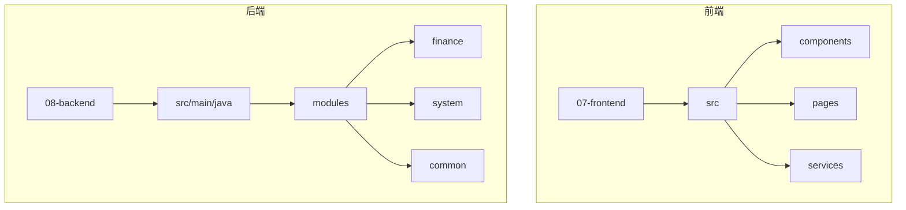
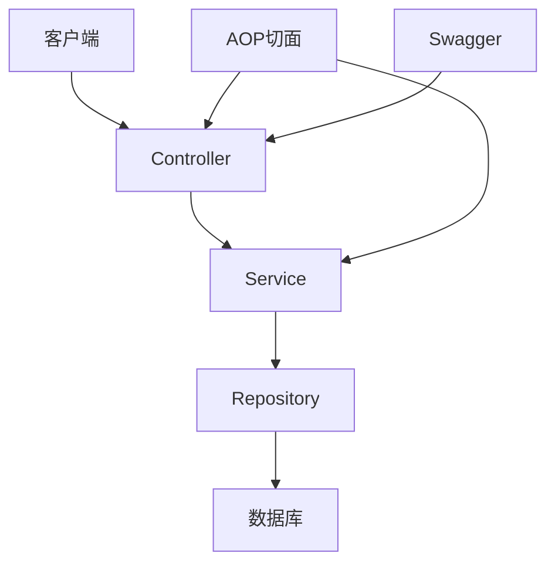
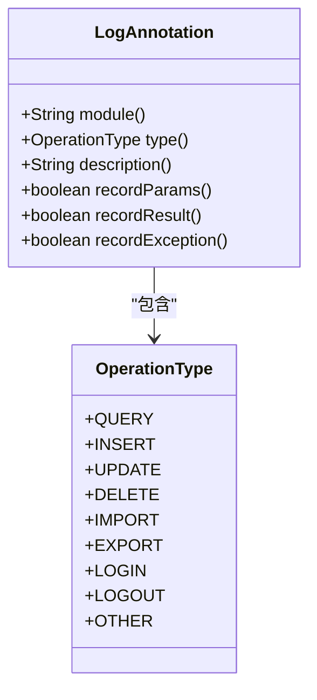
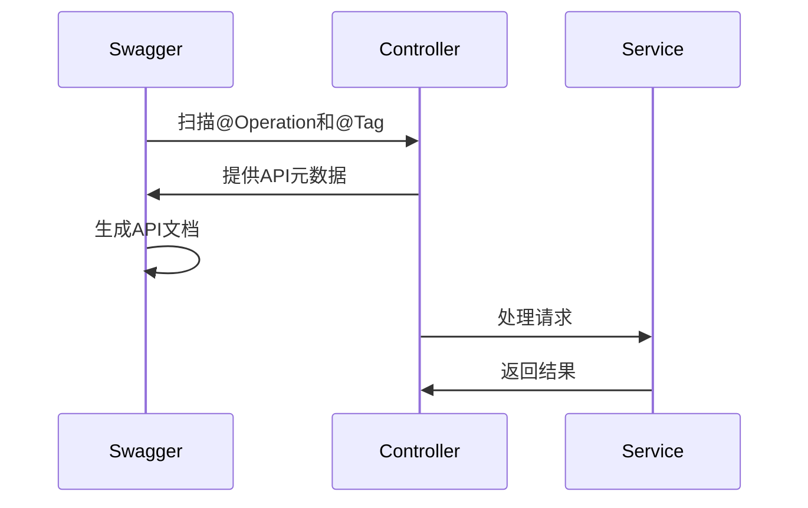
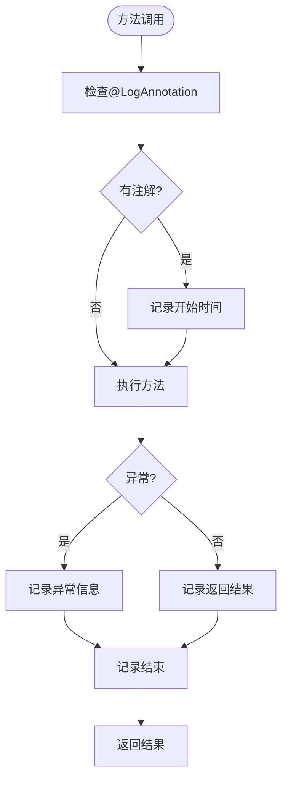
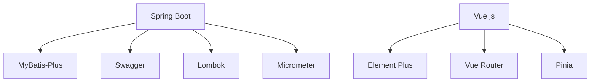

# 操作注解

<cite>
**本文档引用的文件**
- [LogAnnotation.java](file://08-backend/src/main/java/com/enterprise/brain/common/annotation/LogAnnotation.java)
- [GeneralLedgerController.java](file://08-backend/src/main/java/com/enterprise/brain/modules/finance/controller/GeneralLedgerController.java)
- [PerformanceMonitorAspect.java](file://08-backend/src/main/java/com/enterprise/brain/common/config/PerformanceMonitorAspect.java)
- [ApiConfig.java](file://08-backend/src/main/java/com/enterprise/brain/common/config/ApiConfig.java)
- [SwaggerConfig.java](file://08-backend/src/main/java/com/enterprise/brain/common/config/SwaggerConfig.java)
</cite>

## 目录
1. [简介](#简介)
2. [项目结构](#项目结构)
3. [核心组件](#核心组件)
4. [架构概述](#架构概述)
5. [详细组件分析](#详细组件分析)
6. [依赖分析](#依赖分析)
7. [性能考虑](#性能考虑)
8. [故障排除指南](#故障排除指南)
9. [结论](#结论)
10. [附录](#附录)（如有必要）

## 简介
本文档详细说明了操作注解的使用方法，重点介绍@Operation、@Tag和自定义@LogAnnotation注解的使用。通过财务模块的总账管理控制器示例，展示如何使用@Operation为API端点添加摘要和详细描述，使用@Tag对相关API进行分类。深入解析自定义的@LogAnnotation注解，包括module、type、description等属性的配置方法，以及如何通过AOP实现操作日志的自动记录。提供注解组合使用的最佳实践，如在创建、更新、删除操作上同时使用@Operation和@LogAnnotation。

## 项目结构
本项目采用典型的前后端分离架构，后端使用Spring Boot框架，前端使用Vue.js框架。后端代码位于08-backend目录，前端代码位于07-frontend目录。后端采用模块化设计，包括finance、system、analytics等模块，每个模块包含controller、service、repository等层次。前端采用组件化设计，包含components、pages、services等目录。



**图示来源**
- [07-frontend](file://07-frontend)
- [08-backend](file://08-backend)

**本节来源**
- [07-frontend](file://07-frontend)
- [08-backend](file://08-backend)

## 核心组件
核心组件包括操作日志注解@LogAnnotation、API文档注解@Operation和@Tag，以及基于AOP的切面实现。@LogAnnotation用于记录操作日志，包含module、type、description等属性。@Operation和@Tag用于生成API文档，提供接口的摘要和分类信息。AOP切面负责拦截带有@LogAnnotation的方法调用，实现日志的自动记录。

**本节来源**
- [LogAnnotation.java](file://08-backend/src/main/java/com/enterprise/brain/common/annotation/LogAnnotation.java)
- [GeneralLedgerController.java](file://08-backend/src/main/java/com/enterprise/brain/modules/finance/controller/GeneralLedgerController.java)
- [PerformanceMonitorAspect.java](file://08-backend/src/main/java/com/enterprise/brain/common/config/PerformanceMonitorAspect.java)

## 架构概述
系统采用分层架构，包括表现层、业务逻辑层和数据访问层。表现层由Controller组成，负责处理HTTP请求；业务逻辑层由Service组成，负责核心业务逻辑；数据访问层由Repository组成，负责数据库操作。通过AOP实现横切关注点的处理，如日志记录、性能监控等。API文档通过Swagger/OpenAPI生成，提供完整的接口文档。



**图示来源**
- [GeneralLedgerController.java](file://08-backend/src/main/java/com/enterprise/brain/modules/finance/controller/GeneralLedgerController.java)
- [PerformanceMonitorAspect.java](file://08-backend/src/main/java/com/enterprise/brain/common/config/PerformanceMonitorAspect.java)

## 详细组件分析
### 操作日志注解分析
#### 自定义注解@LogAnnotation


**图示来源**
- [LogAnnotation.java](file://08-backend/src/main/java/com/enterprise/brain/common/annotation/LogAnnotation.java)

#### API文档注解使用


**图示来源**
- [GeneralLedgerController.java](file://08-backend/src/main/java/com/enterprise/brain/modules/finance/controller/GeneralLedgerController.java)
- [SwaggerConfig.java](file://08-backend/src/main/java/com/enterprise/brain/common/config/SwaggerConfig.java)

#### AOP切面实现


**图示来源**
- [PerformanceMonitorAspect.java](file://08-backend/src/main/java/com/enterprise/brain/common/config/PerformanceMonitorAspect.java)

**本节来源**
- [LogAnnotation.java](file://08-backend/src/main/java/com/enterprise/brain/common/annotation/LogAnnotation.java)
- [GeneralLedgerController.java](file://08-backend/src/main/java/com/enterprise/brain/modules/finance/controller/GeneralLedgerController.java)
- [PerformanceMonitorAspect.java](file://08-backend/src/main/java/com/enterprise/brain/common/config/PerformanceMonitorAspect.java)

## 依赖分析
系统依赖关系清晰，各模块之间通过接口进行通信。后端依赖Spring Boot框架、MyBatis-Plus、Swagger等第三方库。前端依赖Vue.js、Element Plus等UI框架。通过Maven管理项目依赖，确保依赖版本的一致性。



**图示来源**
- [pom.xml](file://08-backend/pom.xml)
- [package.json](file://07-frontend/package.json)

**本节来源**
- [pom.xml](file://08-backend/pom.xml)
- [package.json](file://07-frontend/package.json)

## 性能考虑
系统通过AOP实现性能监控，记录方法执行时间，识别慢方法。使用Micrometer收集性能指标，便于系统监控和优化。日志记录考虑性能影响，只记录必要的信息，避免过度日志影响系统性能。

**本节来源**
- [PerformanceMonitorAspect.java](file://08-backend/src/main/java/com/enterprise/brain/common/config/PerformanceMonitorAspect.java)

## 故障排除指南
常见问题包括注解不生效、日志记录不完整等。确保AOP配置正确，切面类被Spring容器管理。检查注解使用是否正确，属性值是否符合要求。查看日志输出，确认切面是否被正确执行。

**本节来源**
- [PerformanceMonitorAspect.java](file://08-backend/src/main/java/com/enterprise/brain/common/config/PerformanceMonitorAspect.java)
- [LogAnnotation.java](file://08-backend/src/main/java/com/enterprise/brain/common/annotation/LogAnnotation.java)

## 结论
本文档详细介绍了操作注解的使用方法，包括@Operation、@Tag和自定义@LogAnnotation的使用。通过财务模块的总账管理控制器示例，展示了注解的实际应用。AOP切面实现了操作日志的自动记录，提高了代码的可维护性和可追溯性。建议在实际开发中遵循本文档的最佳实践，合理使用注解，提高开发效率和代码质量。

## 附录
### 注解使用示例
```java
@LogAnnotation(module = "总账管理", type = OperationType.INSERT, description = "创建总账记录")
@Operation(summary = "创建总账记录", description = "创建新的总账记录")
public GeneralLedgerResponse createGeneralLedger(@RequestBody GeneralLedgerCreateRequest request) {
    return generalLedgerService.createGeneralLedger(request);
}
```

**本节来源**
- [GeneralLedgerController.java](file://08-backend/src/main/java/com/enterprise/brain/modules/finance/controller/GeneralLedgerController.java)