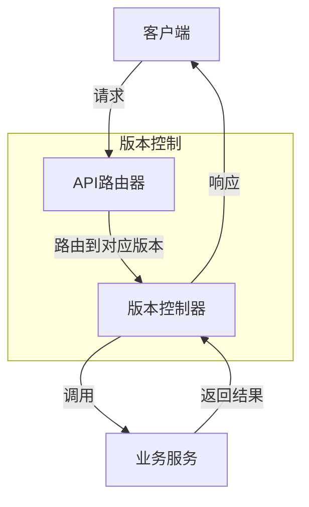
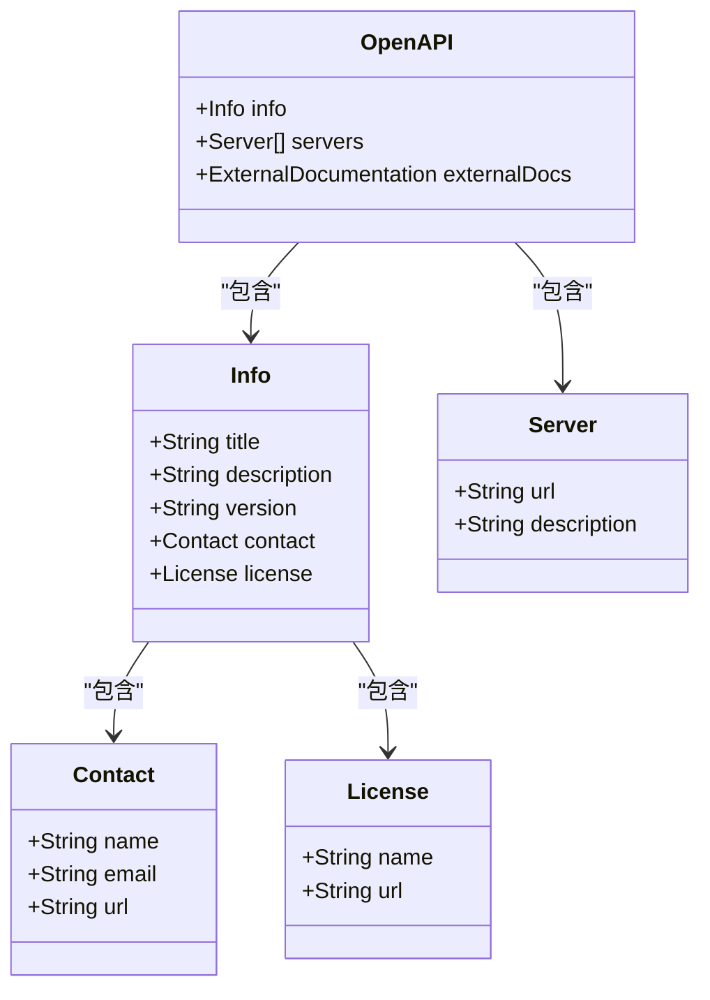
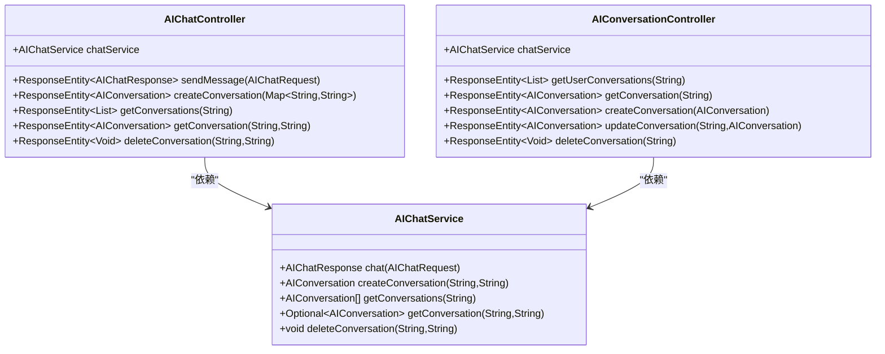
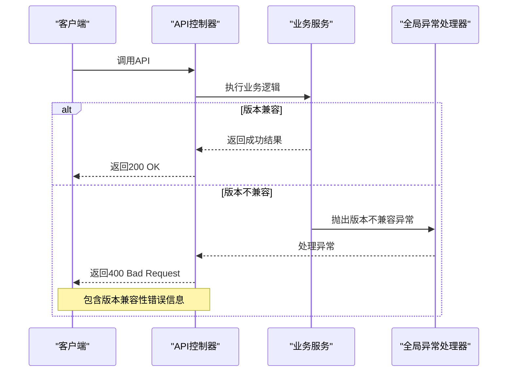
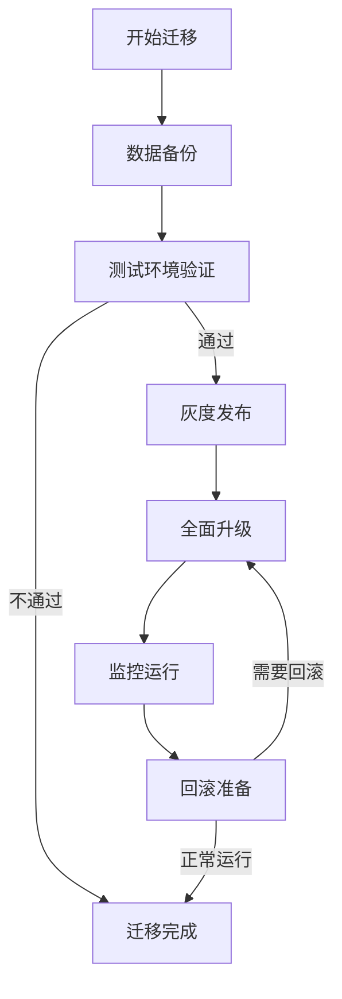
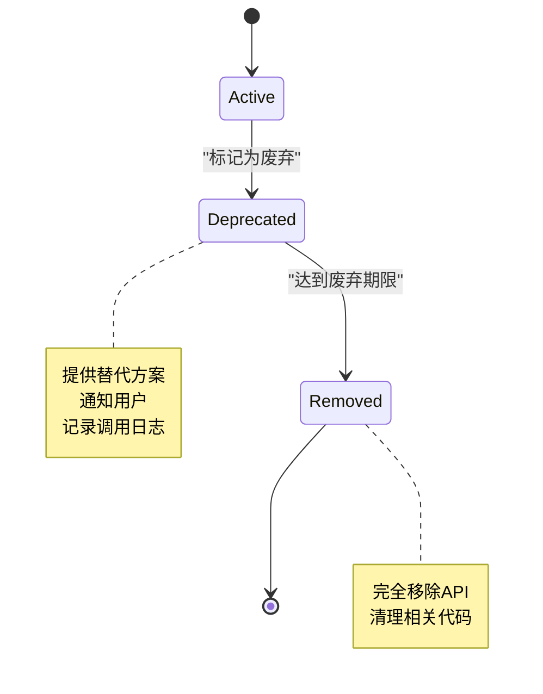

# API版本控制

<cite>
**本文档引用的文件**
- [AIChatController.java](file://08-backend/src/main/java/com/enterprise/brain/modules/ai/controller/AIChatController.java)
- [AIConversationController.java](file://08-backend/src/main/java/com/enterprise/brain/modules/ai/controller/AIConversationController.java)
- [ApiConfig.java](file://08-backend/src/main/java/com/enterprise/brain/common/config/ApiConfig.java)
- [SwaggerConfig.java](file://08-backend/src/main/java/com/enterprise/brain/common/config/SwaggerConfig.java)
- [application.yml](file://08-backend/src/main/resources/application.yml)
- [MigrationGuide.md](file://07-frontend/src/docs/MigrationGuide.md)
</cite>

## 目录
1. [引言](#引言)
2. [API版本控制策略](#api版本控制策略)
3. [Swagger文档配置](#swagger文档配置)
4. [控制器版本管理](#控制器版本管理)
5. [向后兼容性维护](#向后兼容性维护)
6. [版本迁移指南](#版本迁移指南)
7. [废弃API处理策略](#废弃api处理策略)
8. [结论](#结论)

## 引言
企业级智能管理系统采用基于URL路径的API版本控制策略，通过Spring Boot框架实现RESTful API的版本管理。系统通过Swagger/OpenAPI规范生成API文档，并在后端服务中实现版本控制机制，确保系统的稳定性和可维护性。本策略文档详细说明了API版本控制的实现方式、文档配置、兼容性维护和迁移策略。

## API版本控制策略
系统采用基于URL路径的版本控制策略，所有API端点均通过`/api`前缀进行统一管理。版本信息通过URL路径中的模块名称体现，而不是使用传统的`/v1/`、`/v2/`等版本号。这种设计方式使得API版本管理更加灵活，能够更好地支持模块化开发和微服务架构。

API版本控制主要通过以下方式实现：
- **URL路径版本控制**：通过模块化的URL路径实现版本隔离
- **配置驱动版本管理**：通过`application.yml`和`ApiConfig.java`中的配置参数管理版本信息
- **注解驱动的API文档**：使用Swagger注解对API进行版本化描述

**版本控制流程图**
- 客户端发送API请求
- 路由器根据URL路径识别目标模块和版本
- 版本控制器处理请求并调用相应的业务服务
- 业务服务执行业务逻辑并返回结果
- 版本控制器将结果返回给客户端

**API版本控制源**
- [application.yml](file://08-backend/src/main/resources/application.yml#L28)
- [ApiConfig.java](file://08-backend/src/main/java/com/enterprise/brain/common/config/ApiConfig.java#L34)

## Swagger文档配置
系统使用Swagger 3 (OpenAPI 3)进行API文档的自动生成和管理。通过`SwaggerConfig.java`和`ApiConfig.java`两个配置类实现API文档的版本化管理。

### Swagger配置实现
Swagger配置主要包含以下组件：
- **OpenAPI Bean**：定义API的基本信息，包括标题、描述、版本、联系人和许可证
- **Info对象**：包含API的元数据信息
- **Contact对象**：提供API维护团队的联系信息
- **License对象**：定义API的使用许可证

**Swagger配置类图**
- `OpenAPI`类是Swagger配置的根对象
- `Info`类包含API的基本信息
- `Contact`类提供联系人信息
- `License`类定义许可证信息
- `Server`类描述API服务器信息

**Swagger配置源**
- [SwaggerConfig.java](file://08-backend/src/main/java/com/enterprise/brain/common/config/SwaggerConfig.java#L20-L37)
- [ApiConfig.java](file://08-backend/src/main/java/com/enterprise/brain/common/config/ApiConfig.java#L54-L58)

## 控制器版本管理
系统中的API控制器通过`@RequestMapping`注解实现版本化的URL路径管理。每个模块的控制器都有独立的URL命名空间，确保API的模块化和版本隔离。

### AI模块控制器示例
以AI模块为例，系统实现了两个控制器：`AIChatController`和`AIConversationController`，分别处理聊天功能和会话管理功能。

**AI模块控制器类图**
- `AIChatController`处理聊天相关的API请求
- `AIConversationController`处理会话管理相关的API请求
- 两个控制器都依赖`AIChatService`服务类
- 服务类提供具体的业务逻辑实现

**控制器版本管理源**
- [AIChatController.java](file://08-backend/src/main/java/com/enterprise/brain/modules/ai/controller/AIChatController.java#L17)
- [AIConversationController.java](file://08-backend/src/main/java/com/enterprise/brain/modules/ai/controller/AIConversationController.java#L15)

## 向后兼容性维护
系统通过以下策略维护API的向后兼容性：

### 兼容性维护策略
1. **渐进式版本升级**：新版本API在发布时，旧版本API继续保留一段时间
2. **API废弃标记**：使用`@Deprecated`注解标记即将废弃的API
3. **错误码管理**：通过统一的错误码系统处理版本兼容性问题
4. **数据迁移服务**：提供数据迁移服务，确保不同版本间的数据兼容性

### 错误处理机制
系统定义了统一的错误处理机制，通过`GlobalExceptionHandler`类处理API调用中的异常情况。当API版本不兼容时，系统返回特定的错误码和错误信息，帮助客户端正确处理兼容性问题。

**向后兼容性维护源**
- [ApiConfig.java](file://08-backend/src/main/java/com/enterprise/brain/common/config/ApiConfig.java#L34)
- [ErrorCode.java](file://08-backend/src/main/java/com/enterprise/brain/common/constants/ErrorCode.java#L47)

## 版本迁移指南
系统提供完整的版本迁移指南，确保从旧版本到新版本的平滑过渡。

### 迁移步骤
1. **环境准备**：确保生产环境和测试环境都已准备好新版本的部署
2. **数据备份**：在迁移前对重要数据进行完整备份
3. **兼容性测试**：在测试环境中验证新版本与现有系统的兼容性
4. **灰度发布**：先在小范围内发布新版本，观察运行情况
5. **全面升级**：在确认无问题后，进行全面升级
6. **监控和回滚**：升级后密切监控系统运行情况，准备回滚方案

### 数据迁移
系统提供数据迁移服务，确保不同版本间的数据兼容性。数据迁移服务包括：
- **数据结构迁移**：自动更新数据库表结构
- **数据内容迁移**：转换数据格式以适应新版本
- **数据验证**：验证迁移后的数据完整性

**版本迁移流程图**
- 从数据备份开始迁移过程
- 在测试环境中验证新版本
- 通过灰度发布逐步扩大新版本的覆盖范围
- 全面升级后持续监控系统运行
- 准备回滚方案以应对可能出现的问题

**版本迁移源**
- [MigrationGuide.md](file://07-frontend/src/docs/MigrationGuide.md#L1)
- [SystemInitializeService.java](file://08-backend/src/main/java/com/enterprise/brain/modules/system/initialization/service/SystemInitializeService.java#L89)

## 废弃API处理策略
系统采用渐进式的API废弃策略，确保API的平稳过渡。

### 废弃流程
1. **标记废弃**：使用`@Deprecated`注解标记即将废弃的API
2. **通知用户**：通过文档和通知系统告知API用户
3. **设置废弃期限**：明确API的废弃时间表
4. **提供替代方案**：为废弃的API提供新的替代方案
5. **最终移除**：在废弃期限到达后移除API

### 废弃API管理
系统通过以下方式管理废弃的API：
- **文档标注**：在API文档中明确标注废弃状态
- **日志记录**：记录对废弃API的调用，用于分析和通知
- **监控告警**：监控废弃API的使用情况，及时发现潜在问题

**API废弃状态图**
- API从活跃状态开始
- 被标记为废弃后进入废弃状态
- 在达到废弃期限后被完全移除
- 移除后API生命周期结束

**废弃API处理源**
- [AIChatController.java](file://08-backend/src/main/java/com/enterprise/brain/modules/ai/controller/AIChatController.java)
- [AIConversationController.java](file://08-backend/src/main/java/com/enterprise/brain/modules/ai/controller/AIConversationController.java)

## 结论
企业级智能管理系统的API版本控制策略通过URL路径、配置管理和Swagger文档相结合的方式，实现了灵活、可维护的API版本管理。系统通过渐进式升级、兼容性测试和数据迁移服务，确保了版本升级的平滑过渡。同时，通过完善的废弃API处理策略，保证了系统的长期可维护性。这种版本控制策略不仅满足了当前的业务需求，也为未来的系统扩展和演进提供了坚实的基础。