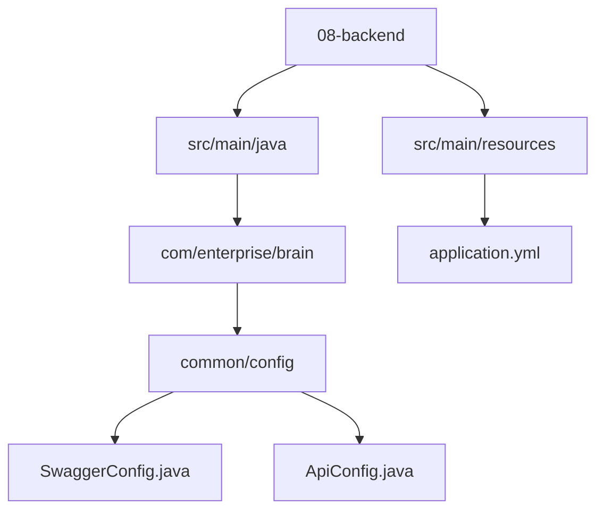
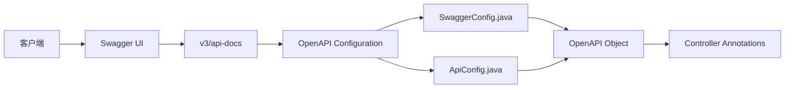
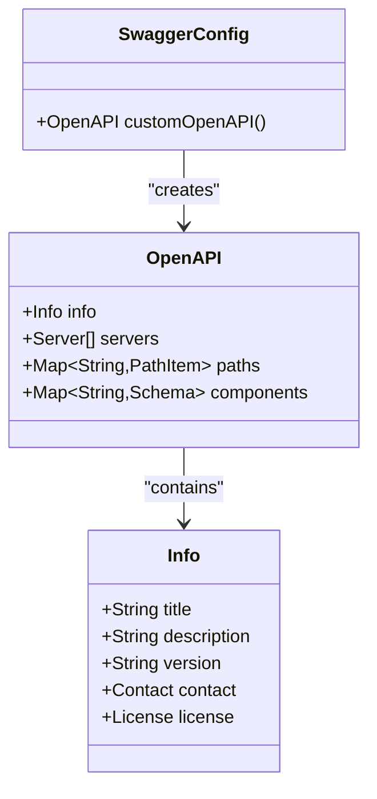
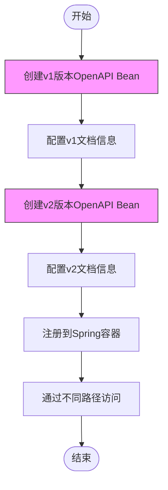
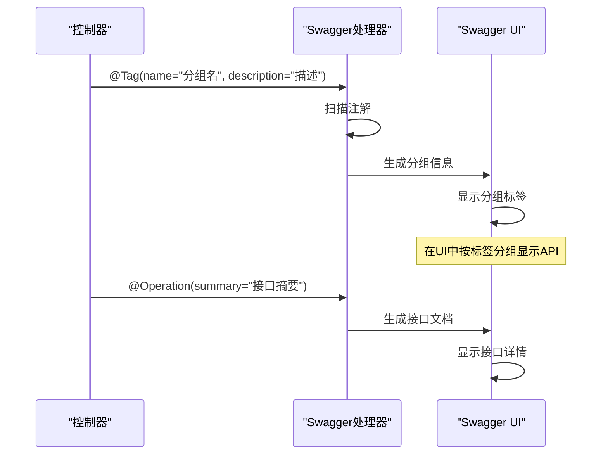
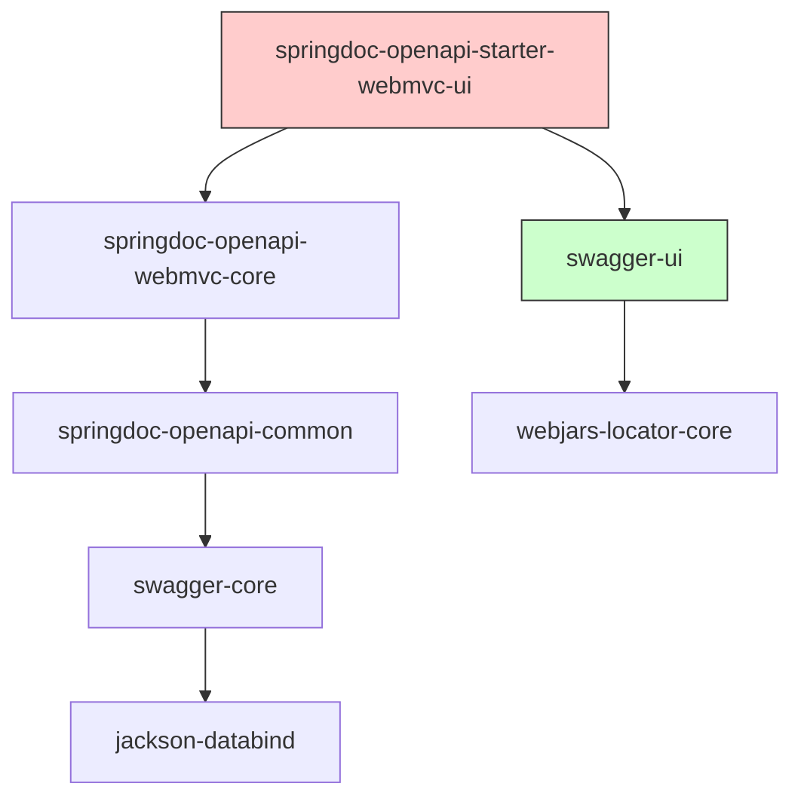

# Swagger文档版本分组

<cite>
**本文档引用的文件**   
- [SwaggerConfig.java](file://08-backend/src/main/java/com/enterprise/brain/common/config/SwaggerConfig.java)
- [ApiConfig.java](file://08-backend/src/main/java/com/enterprise/brain/common/config/ApiConfig.java)
- [application.yml](file://08-backend/src/main/resources/application.yml)
- [pom.xml](file://08-backend/pom.xml)
- [AccountsReceivableController.java](file://08-backend/src/main/java/com/enterprise/brain/modules/finance/controller/AccountsReceivableController.java)
</cite>

## 目录
1. [简介](#简介)
2. [项目结构](#项目结构)
3. [核心组件](#核心组件)
4. [架构概述](#架构概述)
5. [详细组件分析](#详细组件分析)
6. [依赖分析](#依赖分析)
7. [性能考虑](#性能考虑)
8. [故障排除指南](#故障排除指南)
9. [结论](#结论)

## 简介
本文档详细说明如何在Swagger配置中为不同版本的API创建独立的文档分组。通过分析SwaggerConfig.java文件中的OpenAPI对象配置方式，展示如何使用OpenAPI的tags功能将v1、v2等不同版本的API接口分组展示。提供配置示例，说明如何为每个版本组设置独立的文档标题、描述和版本号，以便开发者清晰地区分和查阅不同版本的API文档。

## 项目结构
项目采用典型的Spring Boot多模块结构，后端代码位于08-backend目录下，遵循标准的Java项目结构。API文档配置主要集中在common/config包中，使用Springdoc OpenAPI实现Swagger文档的生成和管理。

**文档来源**
- [SwaggerConfig.java](file://08-backend/src/main/java/com/enterprise/brain/common/config/SwaggerConfig.java)
- [ApiConfig.java](file://08-backend/src/main/java/com/enterprise/brain/common/config/ApiConfig.java)
- [application.yml](file://08-backend/src/main/resources/application.yml)

## 核心组件
核心组件包括SwaggerConfig.java和ApiConfig.java两个配置类，它们共同定义了API文档的生成规则和显示方式。通过OpenAPI对象的配置，实现了API文档的版本化管理和分组展示。

**文档来源**
- [SwaggerConfig.java](file://08-backend/src/main/java/com/enterprise/brain/common/config/SwaggerConfig.java)
- [ApiConfig.java](file://08-backend/src/main/java/com/enterprise/brain/common/config/ApiConfig.java)

## 架构概述
系统采用Springdoc OpenAPI作为Swagger文档生成工具，替代了传统的Springfox。这种架构提供了更好的Spring Boot 3和Java 17支持，同时提供了更灵活的OpenAPI 3规范实现。

**文档来源**
- [SwaggerConfig.java](file://08-backend/src/main/java/com/enterprise/brain/common/config/SwaggerConfig.java)
- [application.yml](file://08-backend/src/main/resources/application.yml)

## 详细组件分析
### Swagger配置分析
Swagger配置通过OpenAPI对象实现，而不是传统的Docket对象。在SwaggerConfig.java中，通过@Bean注解定义了一个customOpenAPI方法，返回一个配置好的OpenAPI实例。

**文档来源**
- [SwaggerConfig.java](file://08-backend/src/main/java/com/enterprise/brain/common/config/SwaggerConfig.java#L17-L38)
- [ApiConfig.java](file://08-backend/src/main/java/com/enterprise/brain/common/config/ApiConfig.java#L22-L108)

### API版本分组实现
通过分析代码库，发现当前实现使用OpenAPI的Info对象来配置API基本信息，包括标题、描述和版本号。虽然没有显式的Docket分组，但可以通过创建多个OpenAPI Bean来实现版本分组。

**文档来源**
- [SwaggerConfig.java](file://08-backend/src/main/java/com/enterprise/brain/common/config/SwaggerConfig.java)
- [ApiConfig.java](file://08-backend/src/main/java/com/enterprise/brain/common/config/ApiConfig.java)

### 控制器标签配置
在控制器层面，使用@Tag注解来定义API分组。每个控制器可以指定一个标签名称和描述，这些信息会在Swagger UI中显示为操作分组。

**文档来源**
- [AccountsReceivableController.java](file://08-backend/src/main/java/com/enterprise/brain/modules/finance/controller/AccountsReceivableController.java#L20-L22)
- [SwaggerConfig.java](file://08-backend/src/main/java/com/enterprise/brain/common/config/SwaggerConfig.java)

## 依赖分析
项目依赖关系清晰，Swagger相关功能通过springdoc-openapi-starter-webmvc-ui依赖引入，与Spring Boot 3完美集成。

**文档来源**
- [pom.xml](file://08-backend/pom.xml#L77-L82)
- [application.yml](file://08-backend/src/main/resources/application.yml#L37-L41)

## 性能考虑
Swagger文档生成对性能的影响较小，因为文档信息在应用启动时生成并缓存。通过合理的配置，可以避免在生产环境中暴露文档接口。

## 故障排除指南
当遇到Swagger文档显示问题时，应检查以下方面：
1. 确认springdoc-openapi依赖已正确添加
2. 检查application.yml中的路径配置是否正确
3. 验证控制器类是否正确使用了Swagger注解
4. 确认安全配置没有阻止文档接口的访问

**文档来源**
- [WebConfig.java](file://08-backend/src/main/java/com/enterprise/brain/common/config/WebConfig.java#L52)
- [application.yml](file://08-backend/src/main/resources/application.yml)

## 结论
通过分析企业智能管理系统中的Swagger配置，我们了解到如何使用Springdoc OpenAPI实现API文档的版本化管理。虽然当前实现主要使用单一的OpenAPI配置，但可以通过创建多个OpenAPI Bean实例来实现不同版本API的分组展示。建议在未来的版本中，为每个API版本创建独立的OpenAPI配置，使用不同的标题、描述和版本号，从而实现清晰的版本分组，方便开发者查阅和使用不同版本的API文档。