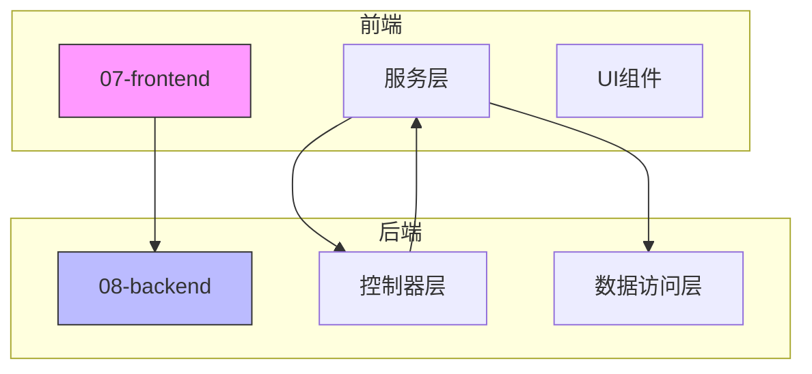
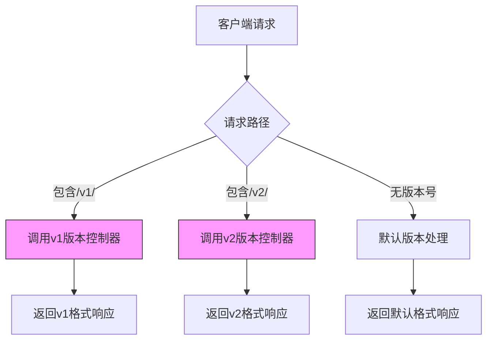
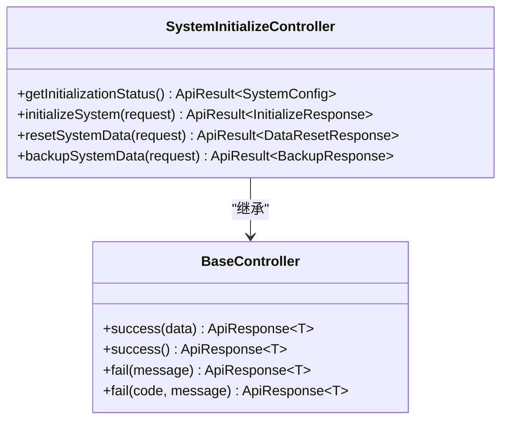
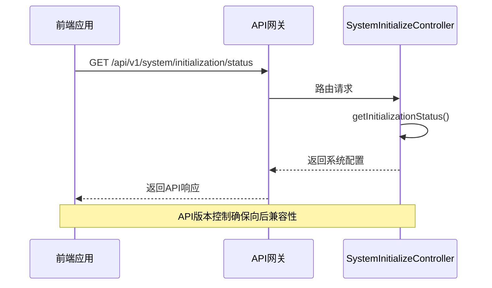
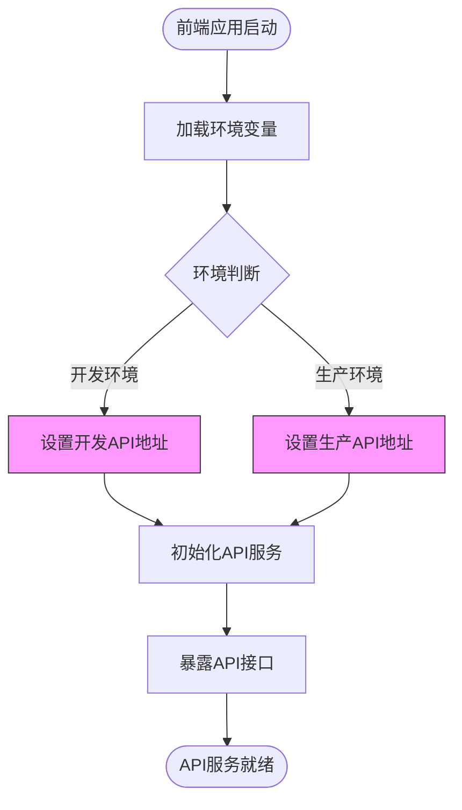

# URL路径版本控制

<cite>
**本文档引用的文件**  
- [SystemInitializeController.java](file://08-backend/src/main/java/com/enterprise/brain/modules/system/initialization/controller/SystemInitializeController.java)
- [AIChatController.java](file://08-backend/src/main/java/com/enterprise/brain/modules/ai/controller/AIChatController.java)
- [AccountBalanceController.java](file://08-backend/src/main/java/com/enterprise/brain/modules/finance/controller/AccountBalanceController.java)
- [DashboardController.java](file://08-backend/src/main/java/com/enterprise/brain/modules/analytics/controller/DashboardController.java)
- [WebConfig.java](file://08-backend/src/main/java/com/enterprise/brain/common/config/WebConfig.java)
- [ApiConfig.java](file://08-backend/src/main/java/com/enterprise/brain/common/config/ApiConfig.java)
- [finance-api.js](file://07-frontend/src/services/api/finance-api.js)
- [sales-api.js](file://07-frontend/src/services/api/sales-api.js)
- [api-integration.js](file://07-frontend/src/utils/integration/api-integration.js)
- [server.js](file://backend/server.js)
</cite>

## 目录
1. [引言](#引言)
2. [项目结构分析](#项目结构分析)
3. [核心组件分析](#核心组件分析)
4. [架构概述](#架构概述)
5. [详细组件分析](#详细组件分析)
6. [依赖分析](#依赖分析)
7. [性能考虑](#性能考虑)
8. [故障排除指南](#故障排除指南)
9. [结论](#结论)

## 引言
本文档详细说明如何通过URL路径实现API版本控制，分析各模块控制器中@RequestMapping注解的版本前缀使用模式。展示在RESTful API设计中如何通过/v1/、/v2/等路径前缀区分不同版本的接口。提供具体的代码示例，说明版本迁移时如何同时支持多个版本的URL路径，并确保向后兼容性。解释这种版本控制方式的优缺点及适用场景。

## 项目结构分析
项目采用分层架构设计，后端主要由08-backend模块构成，使用Spring Boot框架实现RESTful API服务。前端位于07-frontend目录，使用Vue.js框架构建用户界面。API版本控制主要通过后端控制器的@RequestMapping注解实现，前端通过配置文件指定API基础URL。



**图源**  
- [SystemInitializeController.java](file://08-backend/src/main/java/com/enterprise/brain/modules/system/initialization/controller/SystemInitializeController.java)
- [finance-api.js](file://07-frontend/src/services/api/finance-api.js)

**本节来源**  
- [SystemInitializeController.java](file://08-backend/src/main/java/com/enterprise/brain/modules/system/initialization/controller/SystemInitializeController.java)
- [finance-api.js](file://07-frontend/src/services/api/finance-api.js)

## 核心组件分析
系统通过@RequestMapping注解在控制器类级别定义API版本，实现URL路径版本控制。版本号作为路径前缀（如/v1/）嵌入到API端点中，确保不同版本的接口可以共存并保持向后兼容性。

**本节来源**  
- [SystemInitializeController.java](file://08-backend/src/main/java/com/enterprise/brain/modules/system/initialization/controller/SystemInitializeController.java)
- [AIChatController.java](file://08-backend/src/main/java/com/enterprise/brain/modules/ai/controller/AIChatController.java)

## 架构概述
系统采用基于URL路径的API版本控制策略，通过在@RequestMapping注解中包含版本号来区分不同版本的API。这种设计允许系统在升级过程中同时支持多个API版本，确保客户端的平滑过渡。



**图源**  
- [SystemInitializeController.java](file://08-backend/src/main/java/com/enterprise/brain/modules/system/initialization/controller/SystemInitializeController.java)
- [AccountBalanceController.java](file://08-backend/src/main/java/com/enterprise/brain/modules/finance/controller/AccountBalanceController.java)

## 详细组件分析

### 版本控制实现分析
系统通过在控制器类的@RequestMapping注解中包含版本号来实现API版本控制。这种设计模式允许系统在不同版本之间进行平滑过渡，同时保持对旧版本客户端的兼容性。

#### 控制器版本控制模式


**图源**  
- [SystemInitializeController.java](file://08-backend/src/main/java/com/enterprise/brain/modules/system/initialization/controller/SystemInitializeController.java)
- [BaseController.java](file://08-backend/src/main/java/com/enterprise/brain/common/base/BaseController.java)

#### API调用流程分析


**图源**  
- [SystemInitializeController.java](file://08-backend/src/main/java/com/enterprise/brain/modules/system/initialization/controller/SystemInitializeController.java)
- [WebConfig.java](file://08-backend/src/main/java/com/enterprise/brain/common/config/WebConfig.java)

### 前端API集成分析
前端通过服务层封装API调用，统一处理不同模块的API请求。API基础URL通过环境变量配置，支持开发和生产环境的灵活切换。

#### 前端API调用模式


**图源**  
- [finance-api.js](file://07-frontend/src/services/api/finance-api.js)
- [sales-api.js](file://07-frontend/src/services/api/sales-api.js)

**本节来源**  
- [finance-api.js](file://07-frontend/src/services/api/finance-api.js)
- [sales-api.js](file://07-frontend/src/services/api/sales-api.js)
- [api-integration.js](file://07-frontend/src/utils/integration/api-integration.js)

## 依赖分析
系统各组件之间的依赖关系清晰，后端控制器依赖于服务层和数据访问层，前端通过API服务层与后端通信。API版本控制机制作为系统架构的核心部分，影响着前后端的交互方式。

```mermaid
graph TD
A[SystemInitializeController] --> B[SystemInitializeService]
A --> C[DataResetService]
B --> D[SystemConfig]
C --> D
E[Frontend] --> F[finance-api.js]
F --> G[/api/finance/*]
H[WebConfig] --> I[CorsRegistry]
H --> J[InterceptorRegistry]
style A fill:#f9f,stroke:#333
style E fill:#f9f,stroke:#333
```

**图源**  
- [SystemInitializeController.java](file://08-backend/src/main/java/com/enterprise/brain/modules/system/initialization/controller/SystemInitializeController.java)
- [WebConfig.java](file://08-backend/src/main/java/com/enterprise/brain/common/config/WebConfig.java)

**本节来源**  
- [SystemInitializeController.java](file://08-backend/src/main/java/com/enterprise/brain/modules/system/initialization/controller/SystemInitializeController.java)
- [WebConfig.java](file://08-backend/src/main/java/com/enterprise/brain/common/config/WebConfig.java)
- [server.js](file://backend/server.js)

## 性能考虑
基于URL路径的版本控制对系统性能影响较小，因为版本解析在请求路由阶段完成，不会增加额外的处理开销。然而，维护多个版本的API会增加代码复杂性和测试成本。

## 故障排除指南
当遇到API版本相关问题时，应首先检查控制器的@RequestMapping注解是否正确包含版本号，然后验证前端请求的URL路径是否匹配。跨域问题可能影响API调用，需要检查WebConfig中的CORS配置。

**本节来源**  
- [WebConfig.java](file://08-backend/src/main/java/com/enterprise/brain/common/config/WebConfig.java)
- [server.js](file://backend/server.js)

## 结论
通过URL路径实现API版本控制是一种简单有效的策略，允许系统在升级过程中保持向后兼容性。项目中通过在@RequestMapping注解中包含版本号（如/v1/）来区分不同版本的接口，前端通过环境变量配置API基础URL。这种设计模式确保了系统的稳定性和可维护性，同时支持平滑的版本迁移。