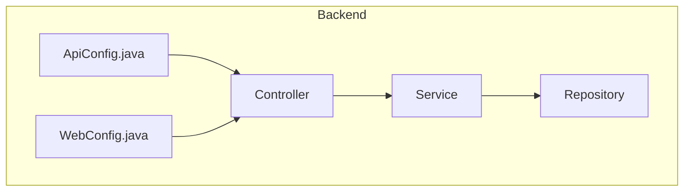
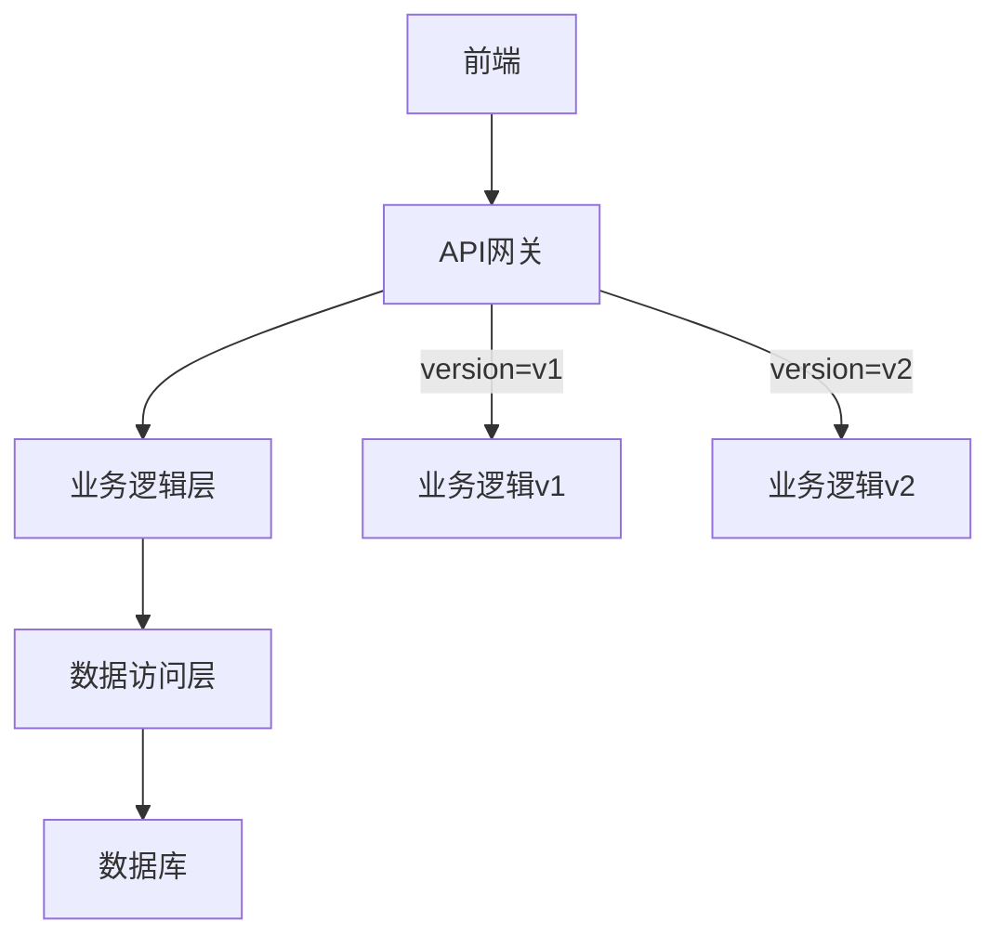
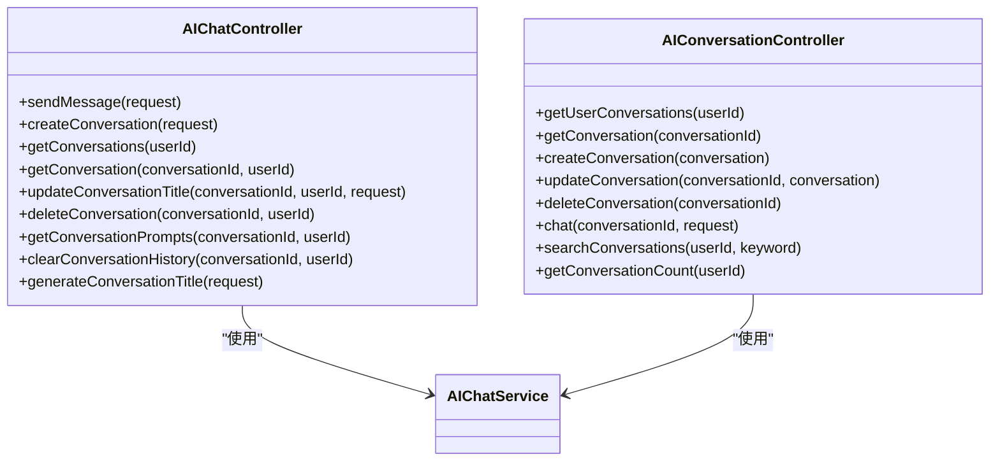
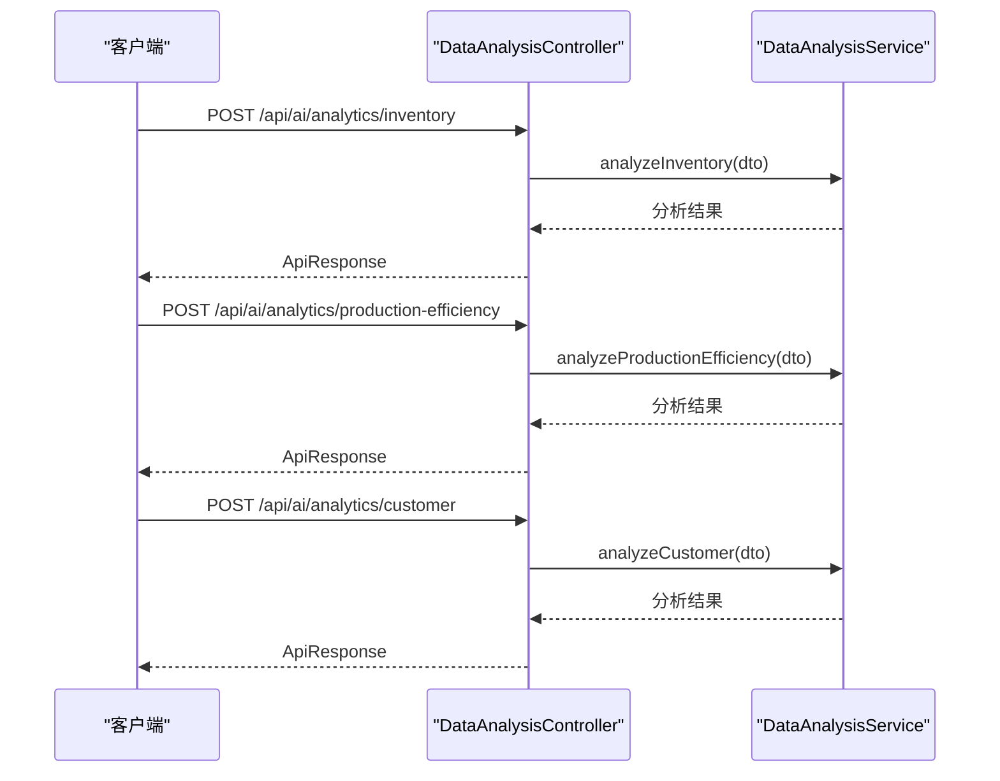
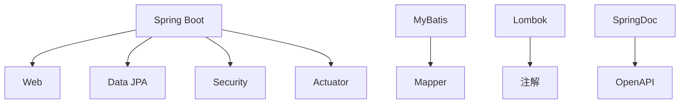

# 查询参数版本控制

<cite>
**本文档引用的文件**
- [ApiConfig.java](file://08-backend/src/main/java/com/enterprise/brain/common/config/ApiConfig.java)
- [WebConfig.java](file://08-backend/src/main/java/com/enterprise/brain/common/config/WebConfig.java)
- [AIChatController.java](file://08-backend/src/main/java/com/enterprise/brain/modules/ai/controller/AIChatController.java)
- [AIConversationController.java](file://08-backend/src/main/java/com/enterprise/brain/modules/ai/controller/AIConversationController.java)
- [AITrainingController.java](file://08-backend/src/main/java/com/enterprise/brain/modules/ai/controller/AITrainingController.java)
- [DataAnalysisController.java](file://08-backend/src/main/java/com/enterprise/brain/modules/analytics/controller/DataAnalysisController.java)
</cite>

## 目录
1. [引言](#引言)
2. [项目结构](#项目结构)
3. [核心组件](#核心组件)
4. [架构概述](#架构概述)
5. [详细组件分析](#详细组件分析)
6. [依赖分析](#依赖分析)
7. [性能考虑](#性能考虑)
8. [故障排除指南](#故障排除指南)
9. [结论](#结论)

## 引言
本文档旨在介绍通过查询参数（如?version=v1）实现API版本控制的方案，分析自定义注解@VersionMapping的设计与实现。说明如何在控制器方法中通过@RequestParam获取版本参数，并基于此参数执行不同的业务逻辑分支。提供示例代码展示如何在同一个端点内处理多个版本的请求，同时讨论这种方案对缓存策略的影响及性能考量。

## 项目结构
本项目采用典型的Spring Boot后端架构，主要包含以下模块：
- common：通用组件和配置
- modules：业务模块（AI、财务、分析等）
- config：系统配置
- annotation：自定义注解

API版本控制主要通过查询参数实现，相关配置在ApiConfig.java中定义，而WebConfig.java提供了Web MVC的配置。

**图表来源**
- [ApiConfig.java](file://08-backend/src/main/java/com/enterprise/brain/common/config/ApiConfig.java)
- [WebConfig.java](file://08-backend/src/main/java/com/enterprise/brain/common/config/WebConfig.java)

**章节来源**
- [ApiConfig.java](file://08-backend/src/main/java/com/enterprise/brain/common/config/ApiConfig.java)
- [WebConfig.java](file://08-backend/src/main/java/com/enterprise/brain/common/config/WebConfig.java)

## 核心组件
核心组件包括API配置类ApiConfig，它定义了应用的基本信息如名称、版本、描述等。这些信息通过Spring的@Value注解读取配置文件中的值。WebConfig类则负责配置Web MVC相关的设置，如静态资源处理、跨域配置等。

**章节来源**
- [ApiConfig.java](file://08-backend/src/main/java/com/enterprise/brain/common/config/ApiConfig.java)
- [WebConfig.java](file://08-backend/src/main/java/com/enterprise/brain/common/config/WebConfig.java)

## 架构概述
系统采用分层架构，从前端到后端依次为：
1. 前端：使用Vue.js构建的单页应用
2. API网关：处理请求路由和版本控制
3. 业务逻辑层：实现具体业务功能
4. 数据访问层：与数据库交互

API版本控制通过查询参数实现，客户端在请求时通过?version=v1等形式指定API版本，服务器端根据版本参数执行相应的业务逻辑。

**图表来源**
- [ApiConfig.java](file://08-backend/src/main/java/com/enterprise/brain/common/config/ApiConfig.java)
- [WebConfig.java](file://08-backend/src/main/java/com/enterprise/brain/common/config/WebConfig.java)

## 详细组件分析

### AI模块分析
AI模块包含多个控制器，如AIChatController、AIConversationController等，它们处理与AI相关的各种请求。这些控制器通过RESTful API提供服务，使用Spring的@RestController和@RequestMapping注解定义端点。

#### 对于API控制器：

**图表来源**
- [AIChatController.java](file://08-backend/src/main/java/com/enterprise/brain/modules/ai/controller/AIChatController.java)
- [AIConversationController.java](file://08-backend/src/main/java/com/enterprise/brain/modules/ai/controller/AIConversationController.java)

**章节来源**
- [AIChatController.java](file://08-backend/src/main/java/com/enterprise/brain/modules/ai/controller/AIChatController.java)
- [AIConversationController.java](file://08-backend/src/main/java/com/enterprise/brain/modules/ai/controller/AIConversationController.java)

### 分析模块分析
分析模块提供数据分析功能，包括库存分析、生产效率分析和客户分析。这些功能通过DataAnalysisController暴露为REST API。

#### 对于分析控制器：

**图表来源**
- [DataAnalysisController.java](file://08-backend/src/main/java/com/enterprise/brain/modules/analytics/controller/DataAnalysisController.java)

**章节来源**
- [DataAnalysisController.java](file://08-backend/src/main/java/com/enterprise/brain/modules/analytics/controller/DataAnalysisController.java)

## 依赖分析
项目依赖关系清晰，主要依赖包括：
- Spring Boot框架
- MyBatis作为ORM框架
- Lombok简化代码
- SpringDoc用于API文档生成

**图表来源**
- [pom.xml](file://08-backend/pom.xml)

**章节来源**
- [pom.xml](file://08-backend/pom.xml)

## 性能考虑
在实现API版本控制时，需要考虑以下性能因素：
1. 查询参数解析的开销
2. 不同版本API的缓存策略
3. 版本切换对数据库查询的影响
4. 版本兼容性检查的性能开销

建议使用适当的缓存机制来减少重复计算，同时确保不同版本的API能够高效地访问数据库。

## 故障排除指南
当遇到API版本控制相关问题时，可以按照以下步骤进行排查：
1. 检查请求URL中的version参数是否正确
2. 确认服务器端是否支持请求的版本
3. 查看日志文件以获取详细的错误信息
4. 验证配置文件中的版本设置

**章节来源**
- [ApiConfig.java](file://08-backend/src/main/java/com/enterprise/brain/common/config/ApiConfig.java)
- [WebConfig.java](file://08-backend/src/main/java/com/enterprise/brain/common/config/WebConfig.java)

## 结论
通过查询参数实现API版本控制是一种简单有效的方法，它允许在不改变URL结构的情况下支持多个API版本。这种方法易于实现和维护，同时也便于客户端进行版本切换。然而，需要注意合理设计缓存策略，以避免因版本差异导致的缓存失效问题。