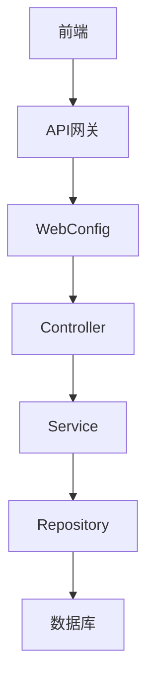
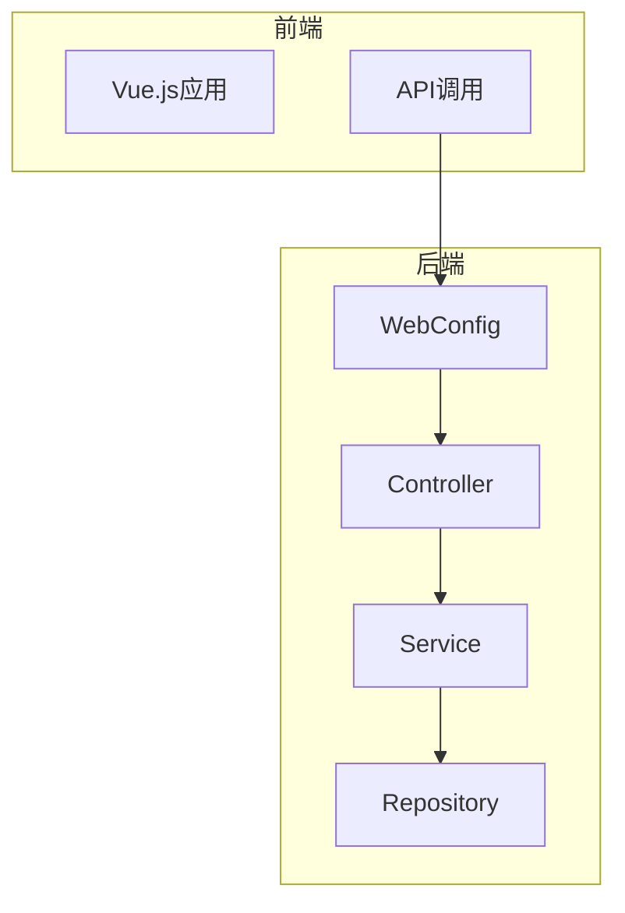
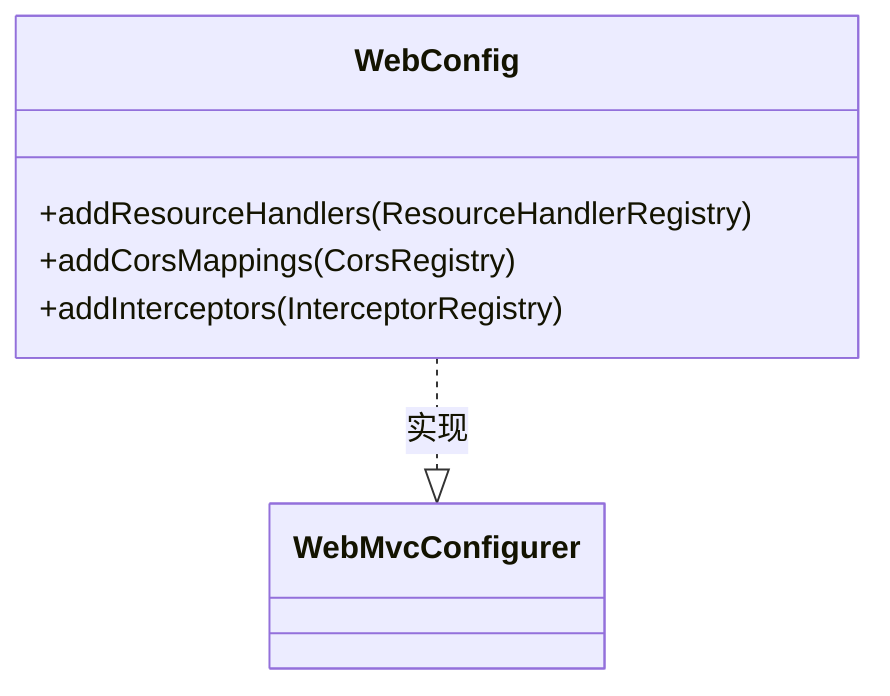
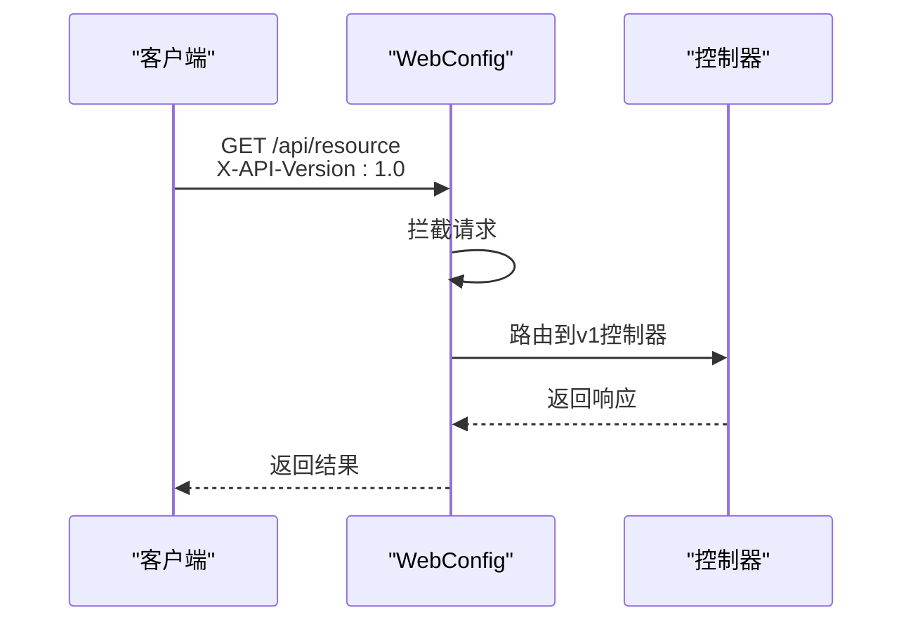
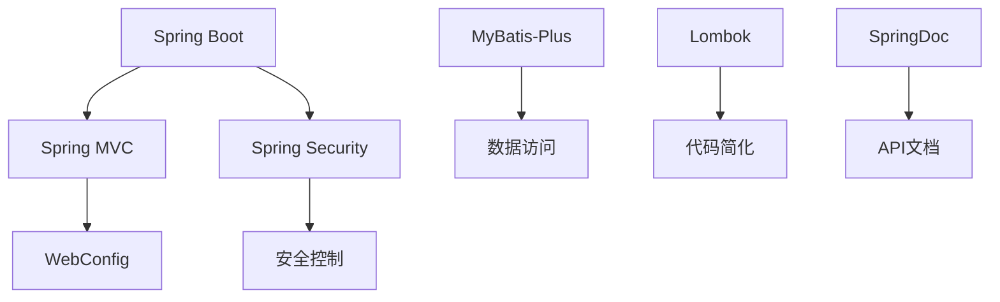

# 请求头版本控制

<cite>
**本文档引用的文件**  
- [WebConfig.java](file://08-backend/src/main/java/com/enterprise/brain/common/config/WebConfig.java)
- [ApiController.java](file://08-backend/src/main/java/com/enterprise/brain/common/base/BaseController.java)
- [ApiResponse.java](file://08-backend/src/main/java/com/enterprise/brain/common/response/ApiResponse.java)
- [GlobalExceptionHandler.java](file://08-backend/src/main/java/com/enterprise/brain/common/exception/GlobalExceptionHandler.java)
- [application.yml](file://08-backend/src/main/resources/application.yml)
</cite>

## 目录
1. [简介](#简介)
2. [项目结构](#项目结构)
3. [核心组件](#核心组件)
4. [架构概述](#架构概述)
5. [详细组件分析](#详细组件分析)
6. [依赖分析](#依赖分析)
7. [性能考虑](#性能考虑)
8. [故障排除指南](#故障排除指南)
9. [结论](#结论)

## 简介
本文档阐述了通过HTTP请求头实现API版本控制的方法，重点分析了WebConfig配置类中如何通过自定义请求头（如X-API-Version）来路由不同版本的API请求。说明了如何在Spring Boot中配置内容协商策略，基于请求头版本号将请求分发到相应的控制器方法。提供了实际代码示例展示@RequestHeader注解的使用，以及如何处理版本不存在或不支持的情况。

## 项目结构
项目采用典型的Spring Boot后端架构，包含多个模块和配置类。核心的API版本控制功能主要通过WebConfig配置类实现，该类负责配置MVC相关的设置，包括静态资源处理、跨域配置和拦截器注册。

**图示来源**
- [WebConfig.java](file://08-backend/src/main/java/com/enterprise/brain/common/config/WebConfig.java#L1-L56)

**本节来源**
- [WebConfig.java](file://08-backend/src/main/java/com/enterprise/brain/common/config/WebConfig.java#L1-L56)
- [application.yml](file://08-backend/src/main/resources/application.yml#L1-L42)

## 核心组件
核心组件包括WebConfig配置类、BaseController基类、ApiResponse统一响应类和GlobalExceptionHandler全局异常处理器。这些组件共同构成了API版本控制的基础架构。

**本节来源**
- [WebConfig.java](file://08-backend/src/main/java/com/enterprise/brain/common/config/WebConfig.java#L1-L56)
- [ApiController.java](file://08-backend/src/main/java/com/enterprise/brain/common/base/BaseController.java#L1-L91)

## 架构概述
系统采用分层架构，从前端到后端依次为：前端应用、API网关、Web配置层、控制器层、服务层、数据访问层和数据库。API版本控制主要在Web配置层和控制器层实现。

**图示来源**
- [WebConfig.java](file://08-backend/src/main/java/com/enterprise/brain/common/config/WebConfig.java#L1-L56)
- [ApiController.java](file://08-backend/src/main/java/com/enterprise/brain/common/base/BaseController.java#L1-L91)

## 详细组件分析
### WebConfig分析
WebConfig类实现了WebMvcConfigurer接口，用于配置Spring MVC的相关设置。虽然当前实现中没有直接的版本控制逻辑，但可以通过扩展addInterceptors方法来实现基于请求头的版本路由。

#### 配置方法

**图示来源**
- [WebConfig.java](file://08-backend/src/main/java/com/enterprise/brain/common/config/WebConfig.java#L1-L56)

### 版本控制实现
虽然当前代码中没有直接的版本控制实现，但可以通过以下方式扩展：

#### 请求头版本控制

**图示来源**
- [WebConfig.java](file://08-backend/src/main/java/com/enterprise/brain/common/config/WebConfig.java#L45-L54)
- [ApiController.java](file://08-backend/src/main/java/com/enterprise/brain/common/base/BaseController.java#L1-L91)

**本节来源**
- [WebConfig.java](file://08-backend/src/main/java/com/enterprise/brain/common/config/WebConfig.java#L1-L56)
- [ApiController.java](file://08-backend/src/main/java/com/enterprise/brain/common/base/BaseController.java#L1-L91)

## 依赖分析
系统依赖主要包括Spring Boot框架、MyBatis-Plus、Lombok和SpringDoc等。这些依赖为API版本控制提供了基础支持。

**图示来源**
- [pom.xml](file://08-backend/pom.xml#L73-L114)
- [WebConfig.java](file://08-backend/src/main/java/com/enterprise/brain/common/config/WebConfig.java#L1-L56)

**本节来源**
- [pom.xml](file://08-backend/pom.xml#L73-L114)
- [WebConfig.java](file://08-backend/src/main/java/com/enterprise/brain/common/config/WebConfig.java#L1-L56)

## 性能考虑
API版本控制对性能的影响主要体现在请求拦截和路由判断上。合理的缓存策略和高效的版本匹配算法可以减少性能开销。

## 故障排除指南
当API版本控制出现问题时，可以检查以下方面：
- 请求头是否正确设置
- 拦截器配置是否正确
- 版本号格式是否符合预期
- 异常处理是否完善

**本节来源**
- [GlobalExceptionHandler.java](file://08-backend/src/main/java/com/enterprise/brain/common/exception/GlobalExceptionHandler.java#L1-L119)
- [ApiResponse.java](file://08-backend/src/main/java/com/enterprise/brain/common/response/ApiResponse.java#L1-L107)

## 结论
通过HTTP请求头实现API版本控制是一种灵活且非侵入式的方法。虽然当前代码库中尚未完全实现该功能，但已具备了必要的基础架构。通过扩展WebConfig类的拦截器功能，可以轻松实现基于X-API-Version请求头的版本路由机制。