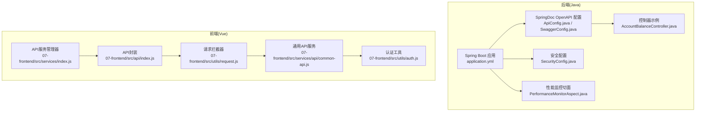
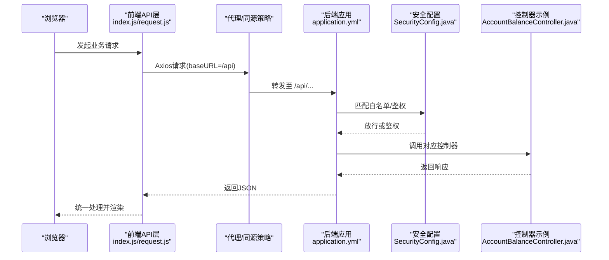
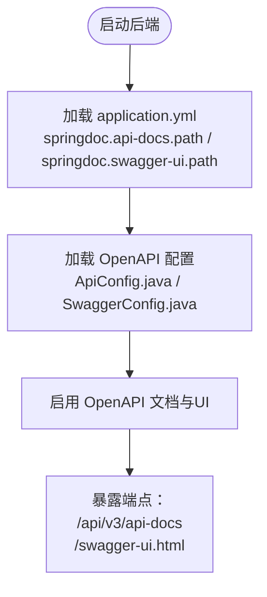
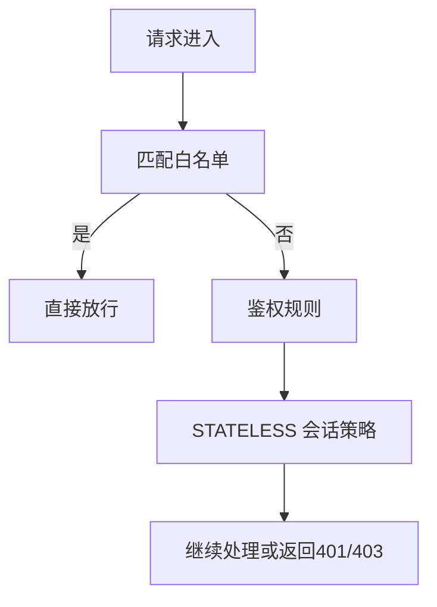
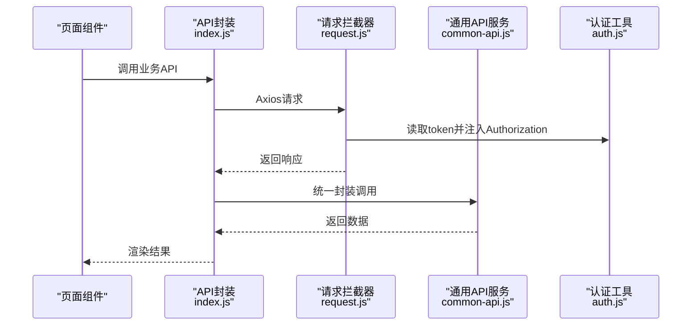
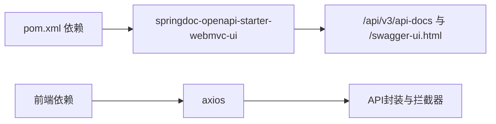

# 文档访问与测试

<cite>
**本文引用的文件**
- [application.yml](file://08-backend/src/main/resources/application.yml)
- [SecurityConfig.java](file://08-backend/src/main/java/com/enterprise/brain/common/config/SecurityConfig.java)
- [ApiConfig.java](file://08-backend/src/main/java/com/enterprise/brain/common/config/ApiConfig.java)
- [SwaggerConfig.java](file://08-backend/src/main/java/com/enterprise/brain/common/config/SwaggerConfig.java)
- [pom.xml](file://08-backend/pom.xml)
- [AccountBalanceController.java](file://08-backend/src/main/java/com/enterprise/brain/modules/finance/controller/AccountBalanceController.java)
- [index.js](file://07-frontend/src/api/index.js)
- [request.js](file://07-frontend/src/utils/request.js)
- [common-api.js](file://07-frontend/src/services/api/common-api.js)
- [auth.js](file://07-frontend/src/utils/auth.js)
- [index.js](file://07-frontend/src/services/index.js)
- [PerformanceMonitorAspect.java](file://08-backend/src/main/java/com/enterprise/brain/common/config/PerformanceMonitorAspect.java)
</cite>

## 目录
1. [简介](#简介)
2. [项目结构](#项目结构)
3. [核心组件](#核心组件)
4. [架构总览](#架构总览)
5. [详细组件分析](#详细组件分析)
6. [依赖关系分析](#依赖关系分析)
7. [性能考虑](#性能考虑)
8. [故障排查指南](#故障排查指南)
9. [结论](#结论)
10. [附录](#附录)

## 简介
本指南面向开发者，提供后端API文档访问与测试的完整方法，包括：
- 如何通过 /swagger-ui.html 访问交互式API文档界面
- 如何获取 /api/v3/api-docs 的OpenAPI JSON规范
- 在开发环境中启用/禁用API文档的方法
- 如何配置文档访问的安全认证
- 前端API服务调用后端接口的集成测试示例
- 性能测试与安全测试的最佳实践

## 项目结构
后端采用Spring Boot + SpringDoc OpenAPI，前端使用Axios进行HTTP请求封装，配合统一的拦截器与认证工具，形成完整的前后端协作链路。

**图示来源**
- [application.yml](file://08-backend/src/main/resources/application.yml#L1-L42)
- [ApiConfig.java](file://08-backend/src/main/java/com/enterprise/brain/common/config/ApiConfig.java#L1-L108)
- [SwaggerConfig.java](file://08-backend/src/main/java/com/enterprise/brain/common/config/SwaggerConfig.java#L1-L38)
- [SecurityConfig.java](file://08-backend/src/main/java/com/enterprise/brain/common/config/SecurityConfig.java#L1-L87)
- [AccountBalanceController.java](file://08-backend/src/main/java/com/enterprise/brain/modules/finance/controller/AccountBalanceController.java#L1-L22)
- [PerformanceMonitorAspect.java](file://08-backend/src/main/java/com/enterprise/brain/common/config/PerformanceMonitorAspect.java#L14-L61)
- [index.js](file://07-frontend/src/api/index.js#L1-L372)
- [request.js](file://07-frontend/src/utils/request.js#L1-L191)
- [common-api.js](file://07-frontend/src/services/api/common-api.js#L1-L240)
- [auth.js](file://07-frontend/src/utils/auth.js#L1-L110)
- [index.js](file://07-frontend/src/services/index.js#L200-L399)

**章节来源**
- [application.yml](file://08-backend/src/main/resources/application.yml#L1-L42)
- [ApiConfig.java](file://08-backend/src/main/java/com/enterprise/brain/common/config/ApiConfig.java#L1-L108)
- [SwaggerConfig.java](file://08-backend/src/main/java/com/enterprise/brain/common/config/SwaggerConfig.java#L1-L38)
- [SecurityConfig.java](file://08-backend/src/main/java/com/enterprise/brain/common/config/SecurityConfig.java#L1-L87)
- [AccountBalanceController.java](file://08-backend/src/main/java/com/enterprise/brain/modules/finance/controller/AccountBalanceController.java#L1-L22)
- [index.js](file://07-frontend/src/api/index.js#L1-L372)
- [request.js](file://07-frontend/src/utils/request.js#L1-L191)
- [common-api.js](file://07-frontend/src/services/api/common-api.js#L1-L240)
- [auth.js](file://07-frontend/src/utils/auth.js#L1-L110)
- [index.js](file://07-frontend/src/services/index.js#L200-L399)

## 核心组件
- 后端文档与路由
  - OpenAPI JSON端点：/api/v3/api-docs
  - Swagger UI端点：/swagger-ui.html
  - 上述路径由application.yml中的springdoc配置项决定
- 前端API封装
  - Axios实例、请求/响应拦截器、统一错误处理
  - 基于baseURL /api与后端上下文路径一致
- 安全与白名单
  - SecurityConfig中对文档端点的白名单放行
- 性能监控
  - 后端切面监控特定模块的执行时间
  - 前端API服务管理器记录调用耗时与成功率

**章节来源**
- [application.yml](file://08-backend/src/main/resources/application.yml#L37-L42)
- [index.js](file://07-frontend/src/api/index.js#L1-L41)
- [request.js](file://07-frontend/src/utils/request.js#L1-L108)
- [SecurityConfig.java](file://08-backend/src/main/java/com/enterprise/brain/common/config/SecurityConfig.java#L31-L60)
- [PerformanceMonitorAspect.java](file://08-backend/src/main/java/com/enterprise/brain/common/config/PerformanceMonitorAspect.java#L14-L61)

## 架构总览
下图展示了从浏览器到后端控制器的典型调用链，以及文档访问与安全放行的关键节点。

**图示来源**
- [application.yml](file://08-backend/src/main/resources/application.yml#L24-L29)
- [SecurityConfig.java](file://08-backend/src/main/java/com/enterprise/brain/common/config/SecurityConfig.java#L43-L60)
- [index.js](file://07-frontend/src/api/index.js#L1-L41)
- [request.js](file://07-frontend/src/utils/request.js#L1-L108)
- [AccountBalanceController.java](file://08-backend/src/main/java/com/enterprise/brain/modules/finance/controller/AccountBalanceController.java#L1-L22)

## 详细组件分析

### 后端文档与路由配置
- OpenAPI JSON端点
  - 路径：/api/v3/api-docs
  - 配置来源：application.yml中的springdoc.api-docs.path
- Swagger UI端点
  - 路径：/swagger-ui.html
  - 配置来源：application.yml中的springdoc.swagger-ui.path
- 文档元信息
  - ApiConfig.java与SwaggerConfig.java分别提供应用信息、服务器信息与外部文档链接
- 依赖支持
  - pom.xml引入springdoc-openapi-starter-webmvc-ui，启用文档生成与UI

**图示来源**
- [application.yml](file://08-backend/src/main/resources/application.yml#L37-L42)
- [ApiConfig.java](file://08-backend/src/main/java/com/enterprise/brain/common/config/ApiConfig.java#L54-L108)
- [SwaggerConfig.java](file://08-backend/src/main/java/com/enterprise/brain/common/config/SwaggerConfig.java#L20-L38)
- [pom.xml](file://08-backend/pom.xml#L77-L82)

**章节来源**
- [application.yml](file://08-backend/src/main/resources/application.yml#L37-L42)
- [ApiConfig.java](file://08-backend/src/main/java/com/enterprise/brain/common/config/ApiConfig.java#L54-L108)
- [SwaggerConfig.java](file://08-backend/src/main/java/com/enterprise/brain/common/config/SwaggerConfig.java#L20-L38)
- [pom.xml](file://08-backend/pom.xml#L77-L82)

### 安全与白名单
- 白名单路径
  - /v3/api-docs/**、/swagger-ui/**、/swagger-ui.html、/webjars/**、/error、/actuator/**
  - 以上路径在SecurityConfig.java中被permitAll放行
- 会话策略
  - STATELESS无状态会话，便于前后端分离与跨域
- CORS
  - 允许通配符来源、常用方法与头，支持凭证

**图示来源**
- [SecurityConfig.java](file://08-backend/src/main/java/com/enterprise/brain/common/config/SecurityConfig.java#L31-L60)

**章节来源**
- [SecurityConfig.java](file://08-backend/src/main/java/com/enterprise/brain/common/config/SecurityConfig.java#L31-L60)

### 前端API封装与认证
- Axios实例
  - baseURL设置为 /api，与后端context-path一致
  - 请求拦截器自动附加Authorization: Bearer token
  - 响应拦截器统一处理401跳转登录
- 通用API服务
  - common-api.js封装了上传、下载、区域、字典、通知、搜索、验证码、系统信息、统计、缓存等常用接口
- 认证工具
  - auth.js提供token、用户信息、权限、角色的本地存储与校验
- API服务管理器
  - services/index.js提供monitor性能监控、批量调用、条件调用、缓存调用等能力

**图示来源**
- [index.js](file://07-frontend/src/api/index.js#L1-L41)
- [request.js](file://07-frontend/src/utils/request.js#L1-L108)
- [common-api.js](file://07-frontend/src/services/api/common-api.js#L1-L240)
- [auth.js](file://07-frontend/src/utils/auth.js#L1-L110)

**章节来源**
- [index.js](file://07-frontend/src/api/index.js#L1-L372)
- [request.js](file://07-frontend/src/utils/request.js#L1-L191)
- [common-api.js](file://07-frontend/src/services/api/common-api.js#L1-L240)
- [auth.js](file://07-frontend/src/utils/auth.js#L1-L110)
- [index.js](file://07-frontend/src/services/index.js#L200-L399)

### 控制器示例与OpenAPI标注
- AccountBalanceController.java使用@Tag与@Operation标注，便于SpringDoc生成文档
- 建议在各模块控制器中添加@Tag与@Operation，提升文档可读性

**章节来源**
- [AccountBalanceController.java](file://08-backend/src/main/java/com/enterprise/brain/modules/finance/controller/AccountBalanceController.java#L1-L22)

## 依赖关系分析
- 后端依赖
  - springdoc-openapi-starter-webmvc-ui：提供OpenAPI JSON与Swagger UI
  - Spring MVC：提供REST控制器与Web配置
  - Spring Security：提供安全过滤链与白名单放行
- 前端依赖
  - axios：HTTP客户端
  - element-plus：消息与确认框（用于错误提示）
  - 本地存储：token、用户信息、权限、角色

**图示来源**
- [pom.xml](file://08-backend/pom.xml#L77-L82)
- [index.js](file://07-frontend/src/api/index.js#L1-L41)
- [request.js](file://07-frontend/src/utils/request.js#L1-L108)

**章节来源**
- [pom.xml](file://08-backend/pom.xml#L77-L82)
- [index.js](file://07-frontend/src/api/index.js#L1-L41)
- [request.js](file://07-frontend/src/utils/request.js#L1-L108)

## 性能考虑
- 后端性能监控
  - PerformanceMonitorAspect对指定包下的控制器与服务方法进行环绕监控，可用于收集执行时间指标
- 前端性能监控
  - services/index.js的monitor方法记录每次API调用的耗时、成功与否，并支持生成性能报告
- 建议
  - 对高频接口开启后端切面监控
  - 在前端关键流程使用monitor记录性能数据，结合浏览器性能面板进行对比分析
  - 对长耗时接口考虑分页、缓存与异步处理

**章节来源**
- [PerformanceMonitorAspect.java](file://08-backend/src/main/java/com/enterprise/brain/common/config/PerformanceMonitorAspect.java#L14-L61)
- [index.js](file://07-frontend/src/services/index.js#L200-L399)

## 故障排查指南
- 文档无法访问
  - 确认application.yml中springdoc.api-docs.path与springdoc.swagger-ui.path配置正确
  - 确认SecurityConfig.java中白名单包含文档端点
- 401未授权
  - 检查前端请求拦截器是否正确注入Authorization头
  - 检查后端安全配置是否允许匿名访问（开发环境）
- 跨域问题
  - 检查CORS配置是否允许前端域名与凭证
- 前端错误提示
  - request.js对401、403、404、500等状态码进行统一提示，便于快速定位

**章节来源**
- [application.yml](file://08-backend/src/main/resources/application.yml#L37-L42)
- [SecurityConfig.java](file://08-backend/src/main/java/com/enterprise/brain/common/config/SecurityConfig.java#L43-L87)
- [request.js](file://07-frontend/src/utils/request.js#L39-L108)

## 结论
通过上述配置与封装，项目实现了：
- 明确的API文档访问入口与OpenAPI JSON规范输出
- 可控的文档访问安全策略
- 前后端一体化的API调用与错误处理
- 可扩展的性能监控能力

建议在开发阶段保持文档端点开放，在生产阶段根据需要收紧白名单并启用更严格的鉴权策略。

## 附录

### 如何访问API文档
- 交互式文档界面
  - 访问地址：/swagger-ui.html
  - 该端点由application.yml中的springdoc.swagger-ui.path配置
- OpenAPI JSON规范
  - 访问地址：/api/v3/api-docs
  - 该端点由application.yml中的springdoc.api-docs.path配置

**章节来源**
- [application.yml](file://08-backend/src/main/resources/application.yml#L37-L42)

### 如何启用/禁用API文档（开发环境）
- 启用
  - 确保springdoc依赖已添加（pom.xml）
  - 确保application.yml中springdoc.api-docs.path与springdoc.swagger-ui.path已配置
  - 确保SecurityConfig.java中白名单包含文档端点
- 禁用
  - 移除springdoc依赖（pom.xml）
  - 或在application.yml中注释/删除springdoc相关配置
  - 或在SecurityConfig.java中移除白名单放行

**章节来源**
- [pom.xml](file://08-backend/pom.xml#L77-L82)
- [application.yml](file://08-backend/src/main/resources/application.yml#L37-L42)
- [SecurityConfig.java](file://08-backend/src/main/java/com/enterprise/brain/common/config/SecurityConfig.java#L31-L60)

### 前端API调用与集成测试示例
- 基础调用
  - 使用api实例发起GET/POST/PUT/DELETE请求，自动附加Authorization头
  - 参考：07-frontend/src/api/index.js
- 通用API服务
  - 上传/下载、区域/字典、通知、搜索、验证码、系统信息、统计、缓存等
  - 参考：07-frontend/src/services/api/common-api.js
- 统一错误处理
  - 401跳转登录、统一消息提示
  - 参考：07-frontend/src/utils/request.js
- 性能监控
  - 使用services/index.js的monitor记录调用耗时与成功率
  - 参考：07-frontend/src/services/index.js

**章节来源**
- [index.js](file://07-frontend/src/api/index.js#L1-L372)
- [common-api.js](file://07-frontend/src/services/api/common-api.js#L1-L240)
- [request.js](file://07-frontend/src/utils/request.js#L1-L191)
- [index.js](file://07-frontend/src/services/index.js#L200-L399)

### 性能测试与安全测试最佳实践
- 性能测试
  - 后端：对关键控制器/服务方法启用PerformanceMonitorAspect，采集P95/P99延迟
  - 前端：使用monitor记录接口耗时，结合浏览器性能面板分析瓶颈
- 安全测试
  - 文档端点白名单仅在开发环境开放，生产环境移除白名单或增加鉴权
  - 对敏感接口启用细粒度鉴权与审计
  - 使用CORS白名单，避免通配符来源在生产环境使用

**章节来源**
- [PerformanceMonitorAspect.java](file://08-backend/src/main/java/com/enterprise/brain/common/config/PerformanceMonitorAspect.java#L14-L61)
- [index.js](file://07-frontend/src/services/index.js#L200-L399)
- [SecurityConfig.java](file://08-backend/src/main/java/com/enterprise/brain/common/config/SecurityConfig.java#L43-L87)