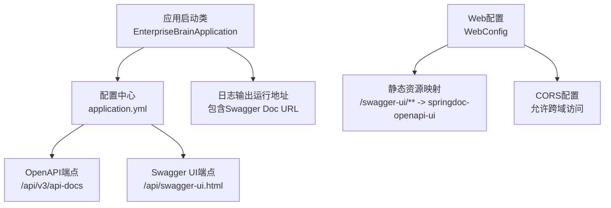
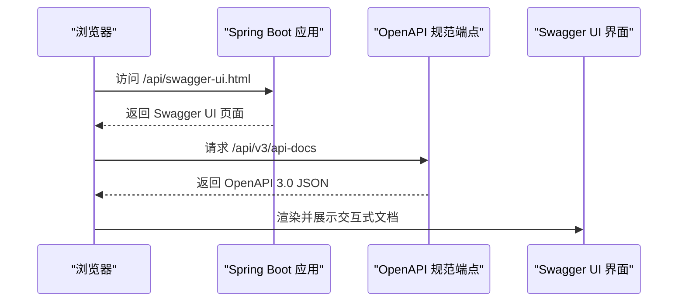
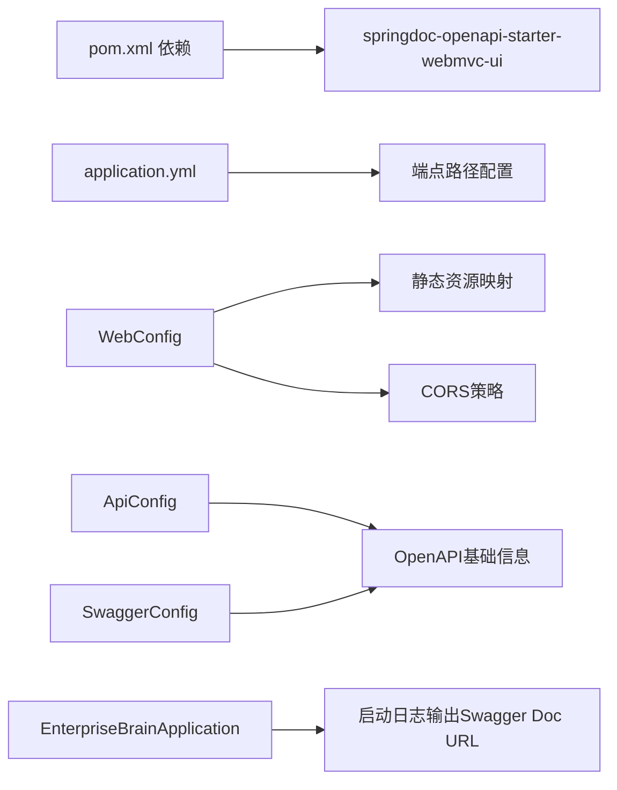

# 文档访问方式

<cite>
**本文引用的文件**
- [application.yml](file://08-backend/src/main/resources/application.yml)
- [pom.xml](file://08-backend/pom.xml)
- [EnterpriseBrainApplication.java](file://08-backend/src/main/java/com/enterprise/brain/EnterpriseBrainApplication.java)
- [WebConfig.java](file://08-backend/src/main/java/com/enterprise/brain/common/config/WebConfig.java)
- [ApiConfig.java](file://08-backend/src/main/java/com/enterprise/brain/common/config/ApiConfig.java)
- [SwaggerConfig.java](file://08-backend/src/main/java/com/enterprise/brain/common/config/SwaggerConfig.java)
- [AccountsReceivableController.java](file://08-backend/src/main/java/com/enterprise/brain/modules/finance/controller/AccountsReceivableController.java)
- [DashboardController.java](file://08-backend/src/main/java/com/enterprise/brain/modules/analytics/controller/DashboardController.java)
</cite>

## 目录
1. [简介](#简介)
2. [项目结构](#项目结构)
3. [核心组件](#核心组件)
4. [架构总览](#架构总览)
5. [详细组件分析](#详细组件分析)
6. [依赖关系分析](#依赖关系分析)
7. [性能与可用性考虑](#性能与可用性考虑)
8. [故障排查指南](#故障排查指南)
9. [结论](#结论)
10. [附录：访问示例与界面说明](#附录访问示例与界面说明)

## 简介
本指南面向开发者，系统讲解如何通过后端服务访问交互式API文档界面，并解释OpenAPI 3.0 JSON规范端点的结构与使用方式。文档覆盖开发、测试、生产三类环境下的访问路径配置与上下文路径处理，提供常见问题排查方法，帮助快速定位并解决404、跨域、加载超时等问题。

## 项目结构
后端采用Spring Boot工程，使用springdoc-openapi集成Swagger UI与OpenAPI 3.0规范输出。核心配置集中在application.yml中，文档访问端点由springdoc自动暴露；同时通过WebConfig对静态资源与CORS进行统一配置。

图表来源
- [application.yml](file://08-backend/src/main/resources/application.yml#L24-L42)
- [EnterpriseBrainApplication.java](file://08-backend/src/main/java/com/enterprise/brain/EnterpriseBrainApplication.java#L26-L60)
- [WebConfig.java](file://08-backend/src/main/java/com/enterprise/brain/common/config/WebConfig.java#L18-L30)

章节来源
- [application.yml](file://08-backend/src/main/resources/application.yml#L24-L42)
- [EnterpriseBrainApplication.java](file://08-backend/src/main/java/com/enterprise/brain/EnterpriseBrainApplication.java#L26-L60)
- [WebConfig.java](file://08-backend/src/main/java/com/enterprise/brain/common/config/WebConfig.java#L18-L30)

## 核心组件
- OpenAPI端点：/api/v3/api-docs（输出OpenAPI 3.0 JSON）
- Swagger UI端点：/api/swagger-ui.html（交互式文档界面）
- OpenAPI配置：通过ApiConfig与SwaggerConfig注入基础信息与服务器信息
- Web配置：静态资源映射与CORS策略

章节来源
- [application.yml](file://08-backend/src/main/resources/application.yml#L24-L42)
- [ApiConfig.java](file://08-backend/src/main/java/com/enterprise/brain/common/config/ApiConfig.java#L54-L108)
- [SwaggerConfig.java](file://08-backend/src/main/java/com/enterprise/brain/common/config/SwaggerConfig.java#L20-L38)
- [WebConfig.java](file://08-backend/src/main/java/com/enterprise/brain/common/config/WebConfig.java#L18-L30)

## 架构总览
下图展示了从浏览器到后端服务的文档访问链路，以及OpenAPI JSON与UI之间的关系。

图表来源
- [application.yml](file://08-backend/src/main/resources/application.yml#L37-L42)
- [WebConfig.java](file://08-backend/src/main/java/com/enterprise/brain/common/config/WebConfig.java#L21-L30)

## 详细组件分析

### OpenAPI端点与JSON结构
- 端点位置：/api/v3/api-docs
- 输出格式：OpenAPI 3.0 JSON
- 结构要点：
  - 基本信息：标题、描述、版本、联系人、许可证
  - 服务器信息：默认服务器URL（受server.url与context-path影响）
  - 路径与操作：由各Controller上的注解扫描生成
  - 分组标签：按@Tag进行分组

章节来源
- [application.yml](file://08-backend/src/main/resources/application.yml#L37-L42)
- [ApiConfig.java](file://08-backend/src/main/java/com/enterprise/brain/common/config/ApiConfig.java#L54-L108)
- [SwaggerConfig.java](file://08-backend/src/main/java/com/enterprise/brain/common/config/SwaggerConfig.java#L20-L38)

### Swagger UI界面与交互
- 端点位置：/api/swagger-ui.html
- 功能区域：
  - API分组：按@Tag分组展示
  - 请求参数输入：支持路径参数、查询参数、请求体等
  - 响应示例展示：基于模型与示例数据
  - 在线调试：直接调用后端接口并查看响应

章节来源
- [application.yml](file://08-backend/src/main/resources/application.yml#L37-L42)
- [WebConfig.java](file://08-backend/src/main/java/com/enterprise/brain/common/config/WebConfig.java#L21-L30)

### 控制器与端点组织
- 控制器示例：
  - AccountsReceivableController：财务模块，包含多个REST端点
  - DashboardController：数据分析模块，包含CRUD与分页查询
- 端点组织方式：
  - 使用@RequestMapping定义基础路径
  - 使用@GetMapping/@PostMapping等定义具体HTTP方法与子路径
  - 使用@Tag为接口分组

章节来源
- [AccountsReceivableController.java](file://08-backend/src/main/java/com/enterprise/brain/modules/finance/controller/AccountsReceivableController.java#L20-L145)
- [DashboardController.java](file://08-backend/src/main/java/com/enterprise/brain/modules/analytics/controller/DashboardController.java#L22-L84)

### 配置与上下文路径处理
- 基础路径配置：
  - server.servlet.context-path=/api
  - springdoc.api-docs.path=/v3/api-docs
  - springdoc.swagger-ui.path=/swagger-ui.html
- 上下文路径影响：
  - OpenAPI端点：/api/v3/api-docs
  - Swagger UI端点：/api/swagger-ui.html
  - 启动日志会打印包含Swagger Doc的完整URL，便于快速访问

章节来源
- [application.yml](file://08-backend/src/main/resources/application.yml#L24-L42)
- [EnterpriseBrainApplication.java](file://08-backend/src/main/java/com/enterprise/brain/EnterpriseBrainApplication.java#L39-L58)

### CORS与静态资源
- CORS配置：允许所有来源、方法与头，支持凭据
- 静态资源映射：/swagger-ui/** 映射到springdoc-openapi-ui资源目录

章节来源
- [WebConfig.java](file://08-backend/src/main/java/com/enterprise/brain/common/config/WebConfig.java#L35-L55)

## 依赖关系分析
- springdoc-openapi-starter-webmvc-ui：提供OpenAPI 3.0与Swagger UI
- application.yml：定义端点路径与上下文路径
- WebConfig：提供静态资源与CORS支持
- ApiConfig/SwaggerConfig：注入OpenAPI基础信息与服务器信息

图表来源
- [pom.xml](file://08-backend/pom.xml#L76-L82)
- [application.yml](file://08-backend/src/main/resources/application.yml#L24-L42)
- [WebConfig.java](file://08-backend/src/main/java/com/enterprise/brain/common/config/WebConfig.java#L18-L30)
- [ApiConfig.java](file://08-backend/src/main/java/com/enterprise/brain/common/config/ApiConfig.java#L54-L108)
- [SwaggerConfig.java](file://08-backend/src/main/java/com/enterprise/brain/common/config/SwaggerConfig.java#L20-L38)
- [EnterpriseBrainApplication.java](file://08-backend/src/main/java/com/enterprise/brain/EnterpriseBrainApplication.java#L39-L58)

## 性能与可用性考虑
- OpenAPI JSON体积：控制器数量与注解复杂度会影响JSON大小，建议按模块拆分或减少冗余注解
- Swagger UI渲染：网络带宽与浏览器性能会影响渲染速度，建议在本地或内网环境下访问
- CORS与跨域：生产环境建议限制允许来源，避免通配符导致安全风险
- 上下文路径：统一的context-path有助于反向代理与容器化部署的一致性

[本节为通用建议，不直接分析具体文件]

## 故障排查指南
- 404错误
  - 检查端点路径是否包含上下文路径：/api/swagger-ui.html 与 /api/v3/api-docs
  - 确认springdoc依赖已引入
  - 查看启动日志中的Swagger Doc URL是否可访问
- 跨域问题
  - 生产环境建议缩小允许来源范围，避免使用通配符
  - 确认CORS配置已生效
- 加载超时
  - 检查网络连通性与防火墙设置
  - 减少控制器注解数量或拆分模块以降低OpenAPI JSON体积
  - 在本地或内网环境下访问以提升加载速度

章节来源
- [pom.xml](file://08-backend/pom.xml#L76-L82)
- [application.yml](file://08-backend/src/main/resources/application.yml#L24-L42)
- [WebConfig.java](file://08-backend/src/main/java/com/enterprise/brain/common/config/WebConfig.java#L35-L55)
- [EnterpriseBrainApplication.java](file://08-backend/src/main/java/com/enterprise/brain/EnterpriseBrainApplication.java#L39-L58)

## 结论
通过上述配置与组件，后端提供了标准的OpenAPI 3.0 JSON规范与交互式Swagger UI界面。开发者只需在浏览器中访问 /api/swagger-ui.html 即可浏览与调试API。在不同环境中，务必根据server.servlet.context-path调整访问路径，并结合CORS与安全策略确保稳定与安全的访问体验。

[本节为总结性内容，不直接分析具体文件]

## 附录：访问示例与界面说明

### 开发环境访问
- Swagger UI：http://localhost:8080/api/swagger-ui.html
- OpenAPI JSON：http://localhost:8080/api/v3/api-docs
- 启动日志中也会打印包含Swagger Doc的完整URL，便于快速复制访问

章节来源
- [application.yml](file://08-backend/src/main/resources/application.yml#L24-L42)
- [EnterpriseBrainApplication.java](file://08-backend/src/main/java/com/enterprise/brain/EnterpriseBrainApplication.java#L39-L58)

### 测试/生产环境访问
- 若部署在反向代理或容器中，请确保代理规则将 /api 前缀转发至后端服务
- OpenAPI端点与UI端点均需带上 /api 前缀
- 如需修改端点路径，可在application.yml中调整springdoc.api-docs.path与springdoc.swagger-ui.path

章节来源
- [application.yml](file://08-backend/src/main/resources/application.yml#L37-L42)

### Swagger UI界面主要功能区域
- API分组：按@Tag进行分组展示，便于快速定位模块
- 请求参数输入：支持路径参数、查询参数、请求体等
- 响应示例展示：基于模型与示例数据
- 在线调试：直接调用后端接口并查看响应

章节来源
- [AccountsReceivableController.java](file://08-backend/src/main/java/com/enterprise/brain/modules/finance/controller/AccountsReceivableController.java#L20-L145)
- [DashboardController.java](file://08-backend/src/main/java/com/enterprise/brain/modules/analytics/controller/DashboardController.java#L22-L84)