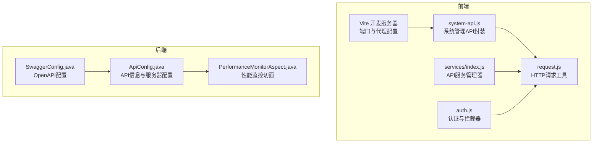
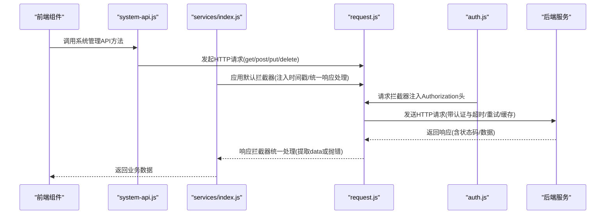
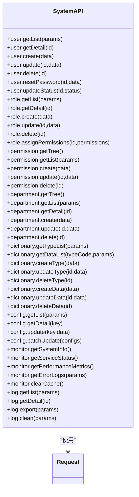
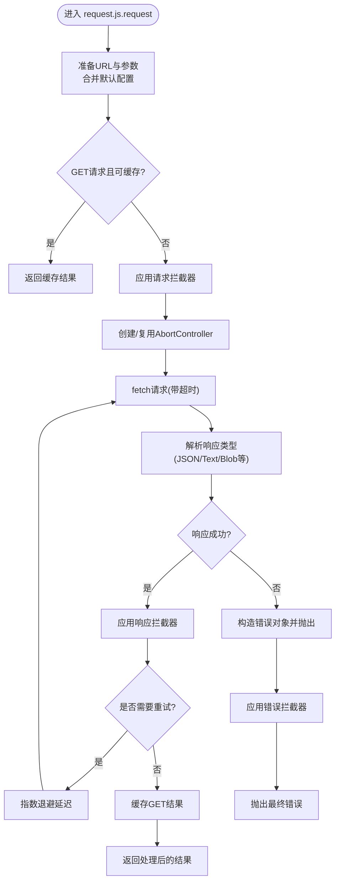
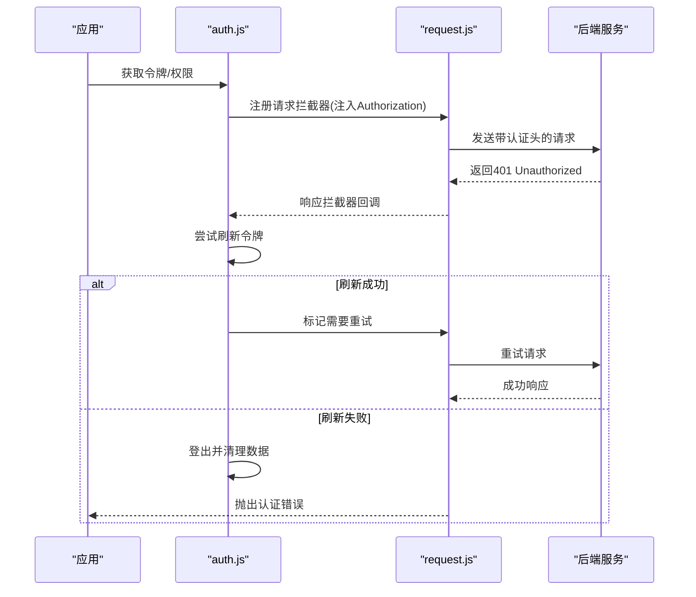
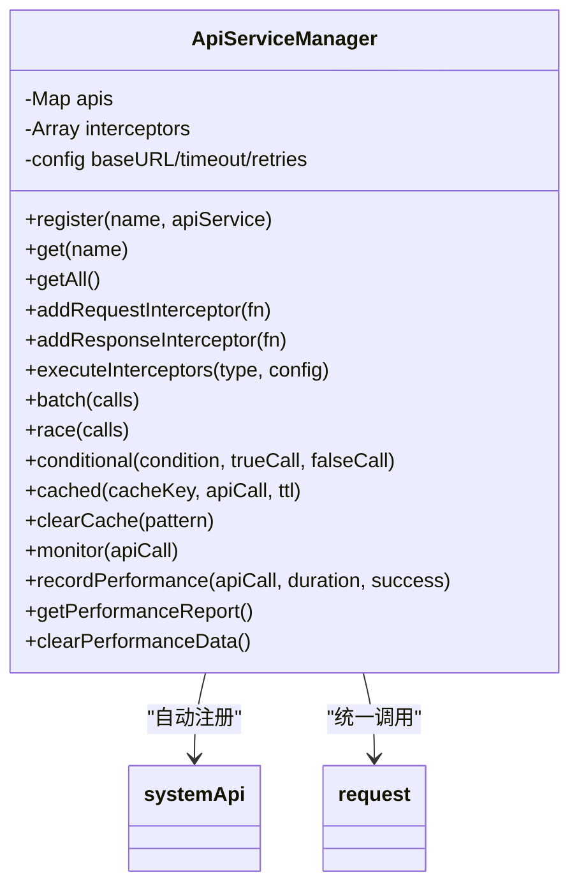
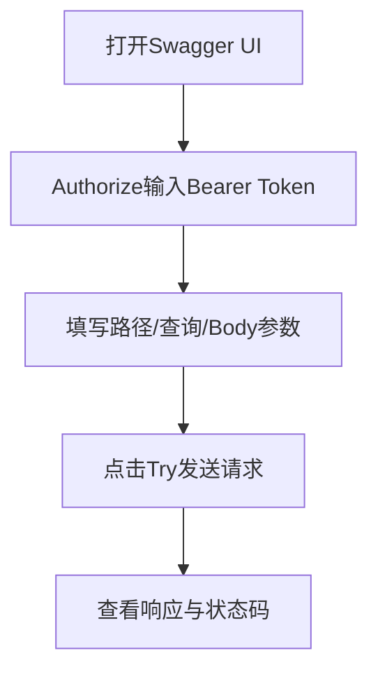
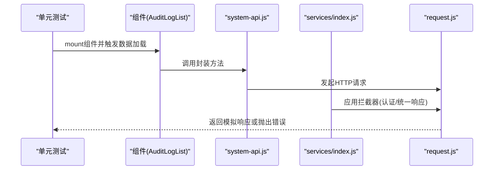
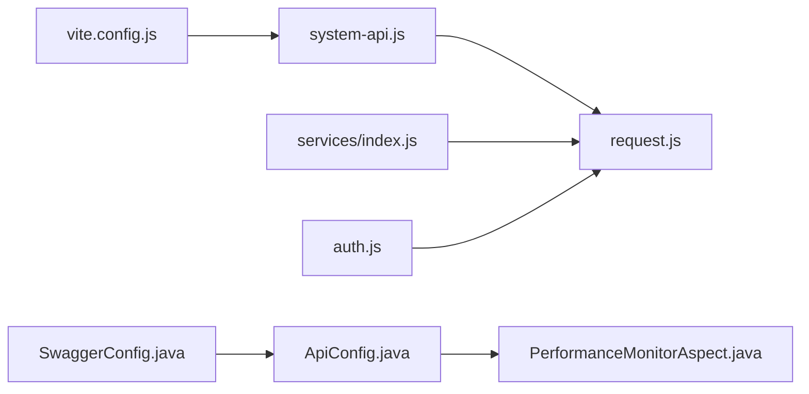

# 测试实践

<cite>
**本文引用的文件**
- [system-api.js](file://07-frontend/src/services/api/system-api.js)
- [request.js](file://07-frontend/src/services/utils/request.js)
- [auth.js](file://07-frontend/src/services/utils/auth.js)
- [index.js（服务入口）](file://07-frontend/src/services/index.js)
- [AuditLogList.spec.js](file://07-frontend/src/tests/unit/modules/system/audit/AuditLogList.spec.js)
- [vite.config.js](file://07-frontend/vite.config.js)
- [SwaggerConfig.java](file://08-backend/src/main/java/com/enterprise/brain/common/config/SwaggerConfig.java)
- [ApiConfig.java](file://08-backend/src/main/java/com/enterprise/brain/common/config/ApiConfig.java)
- [PerformanceMonitorAspect.java](file://08-backend/src/main/java/com/enterprise/brain/common/config/PerformanceMonitorAspect.java)
- [package.json](file://07-frontend/package.json)
</cite>

## 目录
1. [简介](#简介)
2. [项目结构](#项目结构)
3. [核心组件](#核心组件)
4. [架构总览](#架构总览)
5. [详细组件分析](#详细组件分析)
6. [依赖关系分析](#依赖关系分析)
7. [性能考量](#性能考量)
8. [故障排查指南](#故障排查指南)
9. [结论](#结论)
10. [附录](#附录)

## 简介
本指南面向前端与后端工程师，围绕“API测试实践”提供系统化方法论与实操步骤，涵盖：
- 使用前端API服务调用后端接口的实际代码示例，展示如何基于 system-api.js 的封装方法进行集成测试；
- 使用 Swagger UI 进行手动测试，包括参数设置、身份验证令牌注入与请求发送；
- 自动化测试最佳实践：单元测试与集成测试；
- 性能测试方法：使用 JMeter 或 Postman 进行压力测试的配置思路；
- 安全测试建议：OWASP API Security Top 10 的防护与常见漏洞检测方法。

## 项目结构
前端通过 Vite 开发服务器代理后端 API，系统 API 服务由 system-api.js 提供，底层请求封装在 request.js 中，并通过全局拦截器统一注入认证头与处理响应格式；后端通过 SpringDoc/OpenAPI 提供 API 文档。

图表来源
- [vite.config.js](file://07-frontend/vite.config.js#L1-L27)
- [system-api.js](file://07-frontend/src/services/api/system-api.js#L1-L253)
- [request.js](file://07-frontend/src/services/utils/request.js#L1-L798)
- [auth.js](file://07-frontend/src/services/utils/auth.js#L1-L800)
- [index.js（服务入口）](file://07-frontend/src/services/index.js#L1-L409)
- [SwaggerConfig.java](file://08-backend/src/main/java/com/enterprise/brain/common/config/SwaggerConfig.java#L1-L39)
- [ApiConfig.java](file://08-backend/src/main/java/com/enterprise/brain/common/config/ApiConfig.java#L1-L108)
- [PerformanceMonitorAspect.java](file://08-backend/src/main/java/com/enterprise/brain/common/config/PerformanceMonitorAspect.java#L58-L89)

章节来源
- [vite.config.js](file://07-frontend/vite.config.js#L1-L27)
- [system-api.js](file://07-frontend/src/services/api/system-api.js#L1-L253)
- [request.js](file://07-frontend/src/services/utils/request.js#L1-L798)
- [auth.js](file://07-frontend/src/services/utils/auth.js#L1-L800)
- [index.js（服务入口）](file://07-frontend/src/services/index.js#L1-L409)
- [SwaggerConfig.java](file://08-backend/src/main/java/com/enterprise/brain/common/config/SwaggerConfig.java#L1-L39)
- [ApiConfig.java](file://08-backend/src/main/java/com/enterprise/brain/common/config/ApiConfig.java#L1-L108)
- [PerformanceMonitorAspect.java](file://08-backend/src/main/java/com/enterprise/brain/common/config/PerformanceMonitorAspect.java#L58-L89)

## 核心组件
- system-api.js：提供系统管理模块的 API 封装，覆盖用户、角色、权限、部门、字典、配置、监控、日志等接口，统一通过 request.js 发起请求。
- request.js：对 fetch 的封装，提供拦截器、重试、超时、缓存、取消、批量/链式请求、下载、上传等能力。
- auth.js：认证与授权工具，负责令牌存储、刷新、过期检测、请求/响应拦截器注入 Authorization 头。
- services/index.js：API 服务管理器，集中注册各模块 API，提供批量调用、并发调用、条件调用、缓存、性能监控等能力，并内置默认拦截器。
- SwaggerConfig.java 与 ApiConfig.java：后端 OpenAPI 文档配置，提供 API 基本信息、服务器信息与外部文档链接。
- PerformanceMonitorAspect.java：后端性能监控切面，记录方法执行时间并输出慢方法告警。

章节来源
- [system-api.js](file://07-frontend/src/services/api/system-api.js#L1-L253)
- [request.js](file://07-frontend/src/services/utils/request.js#L1-L798)
- [auth.js](file://07-frontend/src/services/utils/auth.js#L1-L800)
- [index.js（服务入口）](file://07-frontend/src/services/index.js#L1-L409)
- [SwaggerConfig.java](file://08-backend/src/main/java/com/enterprise/brain/common/config/SwaggerConfig.java#L1-L39)
- [ApiConfig.java](file://08-backend/src/main/java/com/enterprise/brain/common/config/ApiConfig.java#L1-L108)
- [PerformanceMonitorAspect.java](file://08-backend/src/main/java/com/enterprise/brain/common/config/PerformanceMonitorAspect.java#L58-L89)

## 架构总览
前端通过 Vite 代理将 /api 前缀请求转发至后端服务，system-api.js 的方法最终调用 request.js 的 get/post/put/delete 等快捷方法；services/index.js 提供统一的 API 管理与拦截器，auth.js 在请求拦截器中注入 Authorization 头，确保受保护接口的身份验证。

图表来源
- [system-api.js](file://07-frontend/src/services/api/system-api.js#L1-L253)
- [index.js（服务入口）](file://07-frontend/src/services/index.js#L336-L361)
- [request.js](file://07-frontend/src/services/utils/request.js#L396-L476)
- [auth.js](file://07-frontend/src/services/utils/auth.js#L746-L785)
- [vite.config.js](file://07-frontend/vite.config.js#L13-L24)

## 详细组件分析

### system-api.js：系统管理API封装
- 覆盖用户、角色、权限、部门、字典、配置、监控、日志等模块的常用接口，如获取列表、详情、创建、更新、删除、批量更新、导出、清理等。
- 所有方法均通过 request.js 的 get/put/post/delete 等方法实现，便于统一拦截与错误处理。

图表来源
- [system-api.js](file://07-frontend/src/services/api/system-api.js#L1-L253)
- [request.js](file://07-frontend/src/services/utils/request.js#L480-L531)

章节来源
- [system-api.js](file://07-frontend/src/services/api/system-api.js#L1-L253)

### request.js：HTTP请求工具
- 支持请求/响应/错误拦截器链式处理；
- 提供超时控制、指数退避重试、缓存(GET)、取消请求、批量/链式请求、上传/下载、FormData 构造等；
- 内置默认配置（baseURL、timeout、headers、withCredentials、retryCount、retryDelay、retryableStatuses 等）。

图表来源
- [request.js](file://07-frontend/src/services/utils/request.js#L396-L476)
- [request.js](file://07-frontend/src/services/utils/request.js#L280-L311)
- [request.js](file://07-frontend/src/services/utils/request.js#L396-L476)

章节来源
- [request.js](file://07-frontend/src/services/utils/request.js#L1-L798)

### auth.js：认证与拦截器
- 提供令牌存储、刷新、过期检测、权限/角色校验、导出认证数据等；
- 创建请求拦截器自动注入 Authorization 头，创建响应拦截器处理 401 并尝试刷新令牌或登出；
- 支持多种存储方式（localStorage/sessionStorage/cookie），并可配置 Cookie 选项。

图表来源
- [auth.js](file://07-frontend/src/services/utils/auth.js#L746-L785)
- [auth.js](file://07-frontend/src/services/utils/auth.js#L503-L553)

章节来源
- [auth.js](file://07-frontend/src/services/utils/auth.js#L1-L800)

### services/index.js：API服务管理器
- 自动注册各模块 API（system/common/finance/sales/ai/dashboard/theme），并提供批量、并发、条件、缓存、性能监控等便捷方法；
- 内置默认请求拦截器（GET 请求追加时间戳防缓存）、默认响应拦截器（统一提取 data 或抛错）。

图表来源
- [index.js（服务入口）](file://07-frontend/src/services/index.js#L1-L409)
- [system-api.js](file://07-frontend/src/services/api/system-api.js#L1-L253)

章节来源
- [index.js（服务入口）](file://07-frontend/src/services/index.js#L1-L409)

### Swagger UI：手动测试
- 后端通过 SwaggerConfig.java 与 ApiConfig.java 配置 OpenAPI 文档信息与服务器信息；
- 前端通过 Vite 代理将 /api 前缀请求转发至后端，可在 Swagger UI 中直接访问受保护接口；
- 参数设置：在 Swagger UI 中填写路径参数与查询参数，Body 使用 JSON；
- 身份验证令牌注入：在 Swagger UI 顶部的 Authorize 按钮处输入 Bearer Token，随后所有请求将自动携带 Authorization 头；
- 请求发送：选择方法与路径，填写参数后点击 Try，查看响应与状态码。

图表来源
- [SwaggerConfig.java](file://08-backend/src/main/java/com/enterprise/brain/common/config/SwaggerConfig.java#L1-L39)
- [ApiConfig.java](file://08-backend/src/main/java/com/enterprise/brain/common/config/ApiConfig.java#L1-L108)
- [vite.config.js](file://07-frontend/vite.config.js#L13-L24)

章节来源
- [SwaggerConfig.java](file://08-backend/src/main/java/com/enterprise/brain/common/config/SwaggerConfig.java#L1-L39)
- [ApiConfig.java](file://08-backend/src/main/java/com/enterprise/brain/common/config/ApiConfig.java#L1-L108)
- [vite.config.js](file://07-frontend/vite.config.js#L13-L24)

### 单元测试与集成测试最佳实践
- 单元测试：使用 Vue Test Utils 对组件进行挂载与断言，例如审计日志列表组件的渲染与数据加载行为；
- 集成测试：通过 services/index.js 的 API 管理器与 system-api.js 的封装方法，结合 request.js 的拦截器与 auth.js 的认证头注入，模拟真实调用链路；
- Mock 与拦截器：利用 request.js 的 mock/disableMock 与拦截器机制，在测试环境中替换真实网络请求；
- 断言策略：对响应状态、数据结构、错误抛出进行断言，确保接口契约稳定。

图表来源
- [AuditLogList.spec.js](file://07-frontend/src/tests/unit/modules/system/audit/AuditLogList.spec.js#L1-L18)
- [system-api.js](file://07-frontend/src/services/api/system-api.js#L1-L253)
- [index.js（服务入口）](file://07-frontend/src/services/index.js#L336-L361)
- [request.js](file://07-frontend/src/services/utils/request.js#L767-L798)

章节来源
- [AuditLogList.spec.js](file://07-frontend/src/tests/unit/modules/system/audit/AuditLogList.spec.js#L1-L18)
- [index.js（服务入口）](file://07-frontend/src/services/index.js#L336-L361)

### 自动化测试：Jest/Vitest 与 E2E
- 单元测试：Vue Test Utils + Jest/Vitest，针对组件与服务层逻辑进行断言；
- 集成测试：通过 services/index.js 的 API 管理器与 system-api.js 的封装方法，结合 request.js 的拦截器与 auth.js 的认证头注入，模拟真实调用链路；
- E2E：可结合 Playwright/Cypress，对登录、菜单导航、表格加载等端到端流程进行验证。

章节来源
- [package.json](file://07-frontend/package.json#L1-L34)

### 性能测试：JMeter/Postman 压力测试配置思路
- JMeter：
  - 使用线程组配置并发用户与循环次数；
  - 使用 HTTP 请求采样器配置目标接口（基于 Swagger 文档的路径与方法）；
  - 使用 CSV 数据集配置器注入动态参数；
  - 使用聚合报告收集吞吐量、平均响应时间、错误率；
  - 使用后置处理器注入认证令牌（如 Bearer Token）。
- Postman：
  - 使用集合运行器批量执行请求；
  - 在 Pre-request Script 中生成或注入令牌；
  - 在 Tests 中添加断言（状态码、响应时间阈值、业务字段校验）；
  - 使用 Newman 导出报告并在 CI 中集成。

章节来源
- [SwaggerConfig.java](file://08-backend/src/main/java/com/enterprise/brain/common/config/SwaggerConfig.java#L1-L39)
- [ApiConfig.java](file://08-backend/src/main/java/com/enterprise/brain/common/config/ApiConfig.java#L1-L108)

### 安全测试：OWASP API Security Top 10 防护与检测
- A01:2021-Broken Access Control
  - 检测：对受保护接口进行越权访问测试（不同角色/权限用户访问）；
  - 防护：后端鉴权与授权校验，前端仅显示可访问菜单项。
- A02:2021-Cryptographic Failures
  - 检测：确认 HTTPS 传输、敏感数据加密；
  - 防护：强制 HTTPS、密钥轮换、安全存储令牌。
- A03:2021-Injection
  - 检测：SQL 注入、命令注入、XXE；
  - 防护：参数化查询、输入校验与转义、白名单过滤。
- A04:2021-Insecure Design
  - 检测：设计缺陷导致的安全问题；
  - 防护：威胁建模、最小权限原则、防御深度。
- A05:2021-Security Misconfiguration
  - 检测：暴露敏感头、错误信息泄露、默认凭证；
  - 防护：最小化暴露面、统一错误页、定期安全扫描。
- A06:2021-Vulnerable and Out-of-date Components
  - 检测：依赖漏洞扫描；
  - 防护：依赖升级策略、SBOM、漏洞修复优先级。
- A07:2021-Identification and Authentication Failures
  - 检测：弱口令、暴力破解、会话劫持；
  - 防护：多因素认证、速率限制、安全令牌策略。
- A08:2021-Software and Data Integrity Failures
  - 检测：篡改风险、供应链攻击；
  - 防护：哈希校验、签名验证、可信源管理。
- A09:2021-Security Logging and Monitoring Failures
  - 检测：日志缺失、告警不及时；
  - 防护：完善日志策略、实时告警、合规审计。
- A10:2021-Server-Side Request Forgery (SSRF)
  - 检测：内部服务探测、外联攻击；
  - 防护：白名单外联、反向代理、网络隔离。

章节来源
- [auth.js](file://07-frontend/src/services/utils/auth.js#L1-L800)
- [request.js](file://07-frontend/src/services/utils/request.js#L1-L798)

## 依赖关系分析
- 前端：system-api.js 依赖 request.js；services/index.js 统一注册与管理 API；auth.js 通过拦截器注入认证头；Vite 代理将 /api 转发至后端；
- 后端：SwaggerConfig.java 与 ApiConfig.java 提供 OpenAPI 文档信息；PerformanceMonitorAspect.java 记录方法执行时间并输出慢方法告警。

图表来源
- [system-api.js](file://07-frontend/src/services/api/system-api.js#L1-L253)
- [request.js](file://07-frontend/src/services/utils/request.js#L1-L798)
- [index.js（服务入口）](file://07-frontend/src/services/index.js#L1-L409)
- [auth.js](file://07-frontend/src/services/utils/auth.js#L1-L800)
- [vite.config.js](file://07-frontend/vite.config.js#L13-L24)
- [SwaggerConfig.java](file://08-backend/src/main/java/com/enterprise/brain/common/config/SwaggerConfig.java#L1-L39)
- [ApiConfig.java](file://08-backend/src/main/java/com/enterprise/brain/common/config/ApiConfig.java#L1-L108)
- [PerformanceMonitorAspect.java](file://08-backend/src/main/java/com/enterprise/brain/common/config/PerformanceMonitorAspect.java#L58-L89)

章节来源
- [system-api.js](file://07-frontend/src/services/api/system-api.js#L1-L253)
- [request.js](file://07-frontend/src/services/utils/request.js#L1-L798)
- [index.js（服务入口）](file://07-frontend/src/services/index.js#L1-L409)
- [auth.js](file://07-frontend/src/services/utils/auth.js#L1-L800)
- [vite.config.js](file://07-frontend/vite.config.js#L13-L24)
- [SwaggerConfig.java](file://08-backend/src/main/java/com/enterprise/brain/common/config/SwaggerConfig.java#L1-L39)
- [ApiConfig.java](file://08-backend/src/main/java/com/enterprise/brain/common/config/ApiConfig.java#L1-L108)
- [PerformanceMonitorAspect.java](file://08-backend/src/main/java/com/enterprise/brain/common/config/PerformanceMonitorAspect.java#L58-L89)

## 性能考量
- 前端性能监控：
  - services/index.js 提供 monitor 与 recordPerformance，记录每次 API 调用的耗时、成功率与按 API/方法维度的统计；
  - 可通过 getPerformanceReport 获取汇总报告，辅助定位慢接口与失败率高的端点。
- 后端性能监控：
  - PerformanceMonitorAspect.java 使用 Micrometer 计时器记录方法执行时间，并对超过阈值的方法输出慢方法警告日志。

章节来源
- [index.js（服务入口）](file://07-frontend/src/services/index.js#L206-L308)
- [PerformanceMonitorAspect.java](file://08-backend/src/main/java/com/enterprise/brain/common/config/PerformanceMonitorAspect.java#L58-L89)

## 故障排查指南
- 认证失败（401）：
  - 检查 auth.js 的请求拦截器是否正确注入 Authorization 头；
  - 确认刷新令牌流程是否成功，必要时触发登出并重新登录；
  - 在 Swagger UI 中重新 Authorize 并确认令牌有效。
- 请求超时或网络错误：
  - 检查 request.js 的超时与重试配置；
  - 确认 Vite 代理是否正确指向后端服务；
  - 查看浏览器网络面板与后端日志。
- 响应格式不一致：
  - services/index.js 的默认响应拦截器会统一提取 data 或抛错，需确保后端返回规范的 code/message/data 结构；
  - 如需自定义处理，可在调用前添加自定义响应拦截器。

章节来源
- [auth.js](file://07-frontend/src/services/utils/auth.js#L746-L785)
- [request.js](file://07-frontend/src/services/utils/request.js#L210-L278)
- [index.js（服务入口）](file://07-frontend/src/services/index.js#L336-L361)
- [vite.config.js](file://07-frontend/vite.config.js#L13-L24)

## 结论
本指南提供了从前端 API 封装、认证拦截器、服务管理器到后端 OpenAPI 文档与性能监控的完整测试实践路径。通过 system-api.js 的封装与 request.js 的统一请求能力，结合 Swagger UI 的手动测试与 Jest/Vitest 的自动化测试，能够高效地验证接口的正确性、稳定性与安全性。同时，借助性能监控与压力测试配置思路，可持续优化系统在高负载下的表现。

## 附录
- 使用 system-api.js 进行集成测试的要点
  - 通过 services/index.js 的 apiManager.register 注册 system-api.js；
  - 在测试中使用 apiManager.batch/race/conditional/cached 等能力组合调用；
  - 利用 request.js 的拦截器与 auth.js 的认证头注入，模拟真实环境；
  - 使用 request.js 的 mock/disableMock 在测试中替换真实请求。
- Swagger UI 手动测试清单
  - 验证受保护接口的认证头注入；
  - 验证参数（路径、查询、Body）与响应格式；
  - 记录慢请求与错误响应，结合后端日志定位问题。

章节来源
- [system-api.js](file://07-frontend/src/services/api/system-api.js#L1-L253)
- [index.js（服务入口）](file://07-frontend/src/services/index.js#L1-L409)
- [request.js](file://07-frontend/src/services/utils/request.js#L767-L798)
- [auth.js](file://07-frontend/src/services/utils/auth.js#L746-L785)
- [SwaggerConfig.java](file://08-backend/src/main/java/com/enterprise/brain/common/config/SwaggerConfig.java#L1-L39)
- [ApiConfig.java](file://08-backend/src/main/java/com/enterprise/brain/common/config/ApiConfig.java#L1-L108)