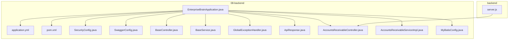
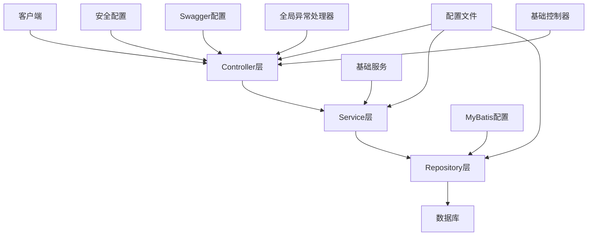
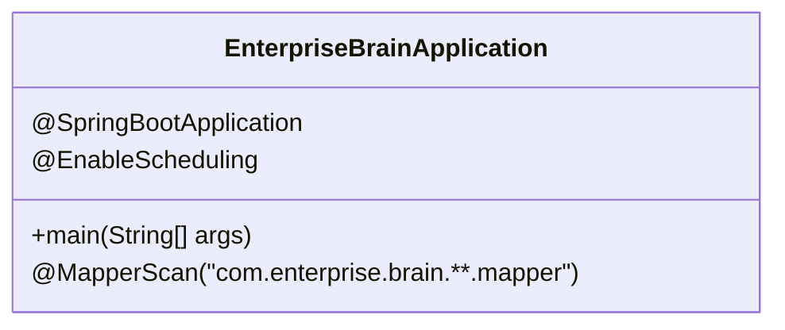
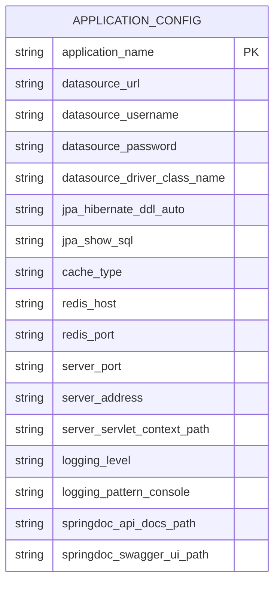
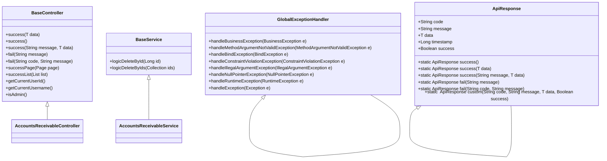
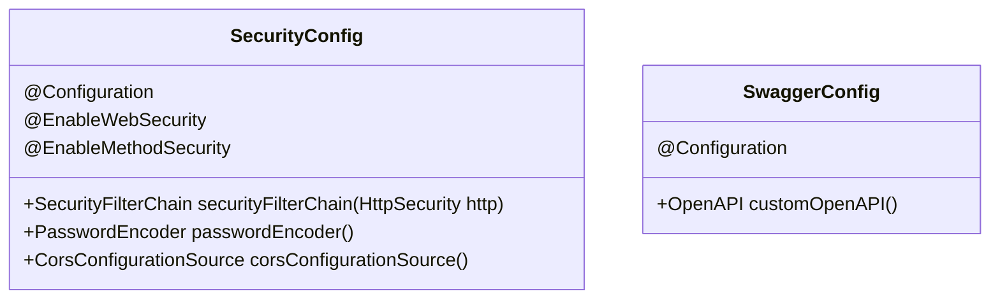
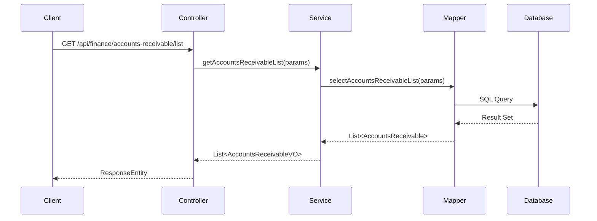
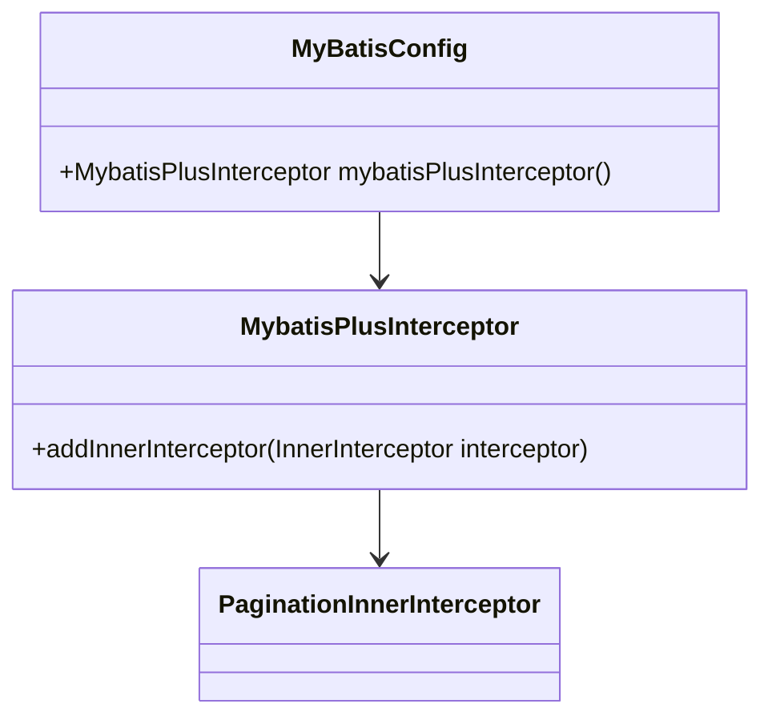
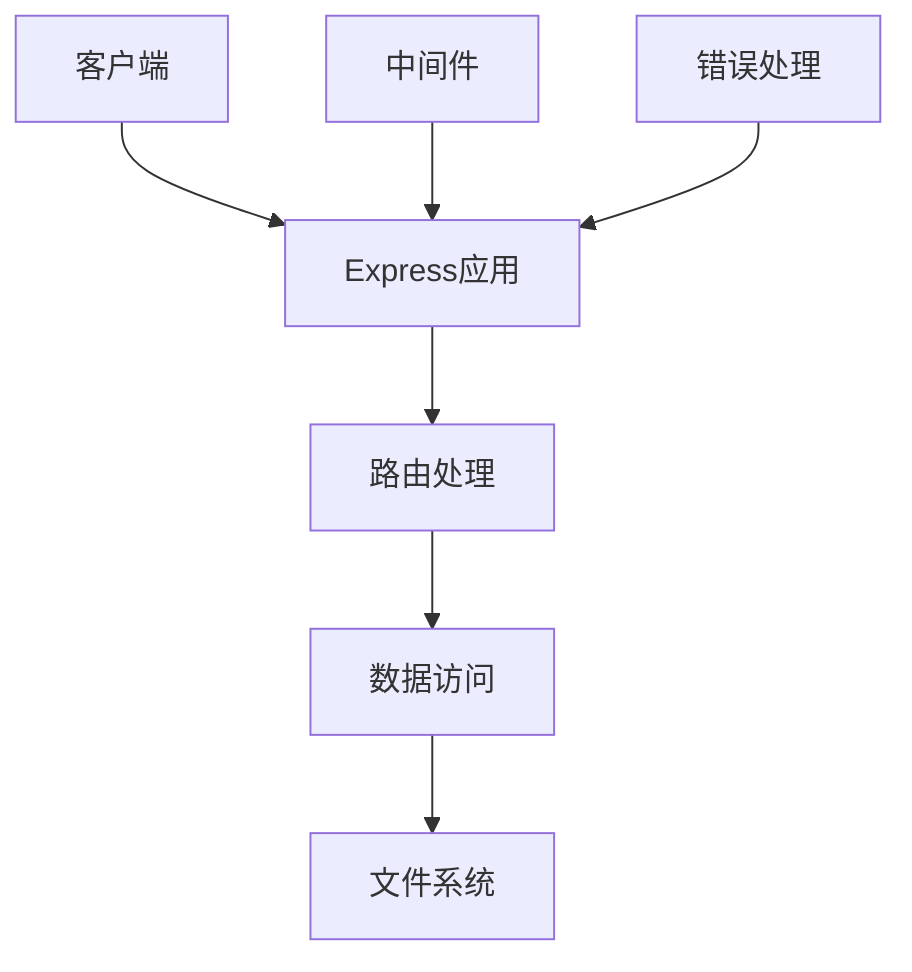
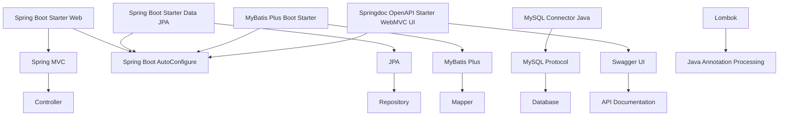

# 后端架构

<cite>
**本文档引用的文件**   
- [EnterpriseBrainApplication.java](file://08-backend/src/main/java/com/enterprise/brain/EnterpriseBrainApplication.java)
- [application.yml](file://08-backend/src/main/resources/application.yml)
- [pom.xml](file://08-backend/pom.xml)
- [SecurityConfig.java](file://08-backend/src/main/java/com/enterprise/brain/common/config/SecurityConfig.java)
- [SwaggerConfig.java](file://08-backend/src/main/java/com/enterprise/brain/common/config/SwaggerConfig.java)
- [BaseController.java](file://08-backend/src/main/java/com/enterprise/brain/common/base/BaseController.java)
- [BaseService.java](file://08-backend/src/main/java/com/enterprise/brain/common/base/BaseService.java)
- [GlobalExceptionHandler.java](file://08-backend/src/main/java/com/enterprise/brain/common/exception/GlobalExceptionHandler.java)
- [ApiResponse.java](file://08-backend/src/main/java/com/enterprise/brain/common/response/ApiResponse.java)
- [AccountsReceivableController.java](file://08-backend/src/main/java/com/enterprise/brain/modules/finance/controller/AccountsReceivableController.java)
- [AccountsReceivableServiceImpl.java](file://08-backend/src/main/java/com/enterprise/brain/modules/finance/service/impl/AccountsReceivableServiceImpl.java)
- [MyBatisConfig.java](file://08-backend/src/main/java/com/enterprise/brain/config/MyBatisConfig.java)
- [server.js](file://backend/server.js)
</cite>

## 目录
1. [简介](#简介)
2. [项目结构](#项目结构)
3. [核心组件](#核心组件)
4. [架构概述](#架构概述)
5. [详细组件分析](#详细组件分析)
6. [依赖分析](#依赖分析)
7. [性能考虑](#性能考虑)
8. [故障排除指南](#故障排除指南)
9. [结论](#结论)

## 简介
本文档系统性地文档化08-backend的Spring Boot架构设计，从EnterpriseBrainApplication.java的启动类开始，解释Spring Boot自动配置、组件扫描和依赖注入机制。详细说明application.yml中的配置项含义，包括数据库连接、安全配置、Swagger文档等。剖析基于MVC模式的分层架构：controller层处理HTTP请求，service层实现业务逻辑，repository层负责数据访问。对比Node.js后端（backend/目录）的轻量级API实现，分析两种后端技术的适用场景和集成方式。提供后端架构图，标注关键组件及其交互关系，帮助开发者理解服务端的整体运作机制。

## 项目结构

**图表来源**
- [EnterpriseBrainApplication.java](file://08-backend/src/main/java/com/enterprise/brain/EnterpriseBrainApplication.java)
- [application.yml](file://08-backend/src/main/resources/application.yml)
- [pom.xml](file://08-backend/pom.xml)
- [SecurityConfig.java](file://08-backend/src/main/java/com/enterprise/brain/common/config/SecurityConfig.java)
- [SwaggerConfig.java](file://08-backend/src/main/java/com/enterprise/brain/common/config/SwaggerConfig.java)
- [BaseController.java](file://08-backend/src/main/java/com/enterprise/brain/common/base/BaseController.java)
- [BaseService.java](file://08-backend/src/main/java/com/enterprise/brain/common/base/BaseService.java)
- [GlobalExceptionHandler.java](file://08-backend/src/main/java/com/enterprise/brain/common/exception/GlobalExceptionHandler.java)
- [ApiResponse.java](file://08-backend/src/main/java/com/enterprise/brain/common/response/ApiResponse.java)
- [AccountsReceivableController.java](file://08-backend/src/main/java/com/enterprise/brain/modules/finance/controller/AccountsReceivableController.java)
- [AccountsReceivableServiceImpl.java](file://08-backend/src/main/java/com/enterprise/brain/modules/finance/service/impl/AccountsReceivableServiceImpl.java)
- [MyBatisConfig.java](file://08-backend/src/main/java/com/enterprise/brain/config/MyBatisConfig.java)
- [server.js](file://backend/server.js)

**章节来源**
- [EnterpriseBrainApplication.java](file://08-backend/src/main/java/com/enterprise/brain/EnterpriseBrainApplication.java)
- [application.yml](file://08-backend/src/main/resources/application.yml)
- [pom.xml](file://08-backend/pom.xml)

## 核心组件

08-backend项目采用Spring Boot框架构建企业级后端服务，其核心组件包括启动类、配置文件、基础类库和业务模块。启动类EnterpriseBrainApplication.java通过@SpringBootApplication注解启用Spring Boot的自动配置机制，同时使用@MapperScan注解扫描所有MyBatis Plus的Mapper接口。application.yml文件定义了应用程序的基本配置，包括数据库连接、服务器端口、日志级别和Swagger文档配置。pom.xml文件声明了项目的所有依赖，包括Spring Boot Starter、MyBatis Plus、MySQL驱动和Swagger等。

**章节来源**
- [EnterpriseBrainApplication.java](file://08-backend/src/main/java/com/enterprise/brain/EnterpriseBrainApplication.java)
- [application.yml](file://08-backend/src/main/resources/application.yml)
- [pom.xml](file://08-backend/pom.xml)

## 架构概述

08-backend采用典型的Spring Boot MVC架构，分为controller层、service层和repository层。controller层负责处理HTTP请求，service层实现业务逻辑，repository层负责数据访问。整个架构通过Spring的依赖注入机制进行组件间的解耦，通过AOP实现日志记录、性能监控等横切关注点。安全方面使用Spring Security进行权限控制，通过JWT实现无状态认证。数据访问层使用MyBatis Plus作为ORM框架，结合分页插件实现高效的数据库操作。

**图表来源**
- [EnterpriseBrainApplication.java](file://08-backend/src/main/java/com/enterprise/brain/EnterpriseBrainApplication.java)
- [application.yml](file://08-backend/src/main/resources/application.yml)
- [SecurityConfig.java](file://08-backend/src/main/java/com/enterprise/brain/common/config/SecurityConfig.java)
- [SwaggerConfig.java](file://08-backend/src/main/java/com/enterprise/brain/common/config/SwaggerConfig.java)
- [BaseController.java](file://08-backend/src/main/java/com/enterprise/brain/common/base/BaseController.java)
- [BaseService.java](file://08-backend/src/main/java/com/enterprise/brain/common/base/BaseService.java)
- [GlobalExceptionHandler.java](file://08-backend/src/main/java/com/enterprise/brain/common/exception/GlobalExceptionHandler.java)
- [MyBatisConfig.java](file://08-backend/src/main/java/com/enterprise/brain/config/MyBatisConfig.java)

## 详细组件分析

### Spring Boot启动机制分析

EnterpriseBrainApplication.java作为Spring Boot应用的入口点，通过main方法启动Spring应用上下文。@SpringBootApplication注解是一个组合注解，包含了@Configuration、@EnableAutoConfiguration和@ComponentScan三个注解。其中@ComponentScan会自动扫描com.enterprise.brain包及其子包下的所有组件，@EnableAutoConfiguration会根据classpath中的依赖自动配置相应的Bean。@MapperScan注解指定了MyBatis Plus Mapper接口的扫描路径，确保所有Mapper接口都能被正确注册为Spring Bean。

**图表来源**
- [EnterpriseBrainApplication.java](file://08-backend/src/main/java/com/enterprise/brain/EnterpriseBrainApplication.java)

**章节来源**
- [EnterpriseBrainApplication.java](file://08-backend/src/main/java/com/enterprise/brain/EnterpriseBrainApplication.java)

### 配置文件解析

application.yml文件定义了应用程序的核心配置。spring部分配置了应用名称、数据源、JPA和Redis缓存；server部分配置了服务器端口和上下文路径；logging部分配置了日志级别和输出格式；springdoc部分配置了Swagger文档的访问路径。这些配置通过Spring的@Value注解或@ConfigurationProperties注解注入到相应的Bean中，实现了配置的外部化和集中管理。

**图表来源**
- [application.yml](file://08-backend/src/main/resources/application.yml)

**章节来源**
- [application.yml](file://08-backend/src/main/resources/application.yml)

### MVC分层架构分析

08-backend采用标准的MVC分层架构，controller层负责处理HTTP请求，service层实现业务逻辑，repository层负责数据访问。BaseController提供了统一的响应格式和辅助方法，所有controller都继承自BaseController。BaseService定义了通用的业务方法，所有service都实现BaseService接口。GlobalExceptionHandler统一处理所有未捕获的异常，返回标准化的错误响应。

**图表来源**
- [BaseController.java](file://08-backend/src/main/java/com/enterprise/brain/common/base/BaseController.java)
- [BaseService.java](file://08-backend/src/main/java/com/enterprise/brain/common/base/BaseService.java)
- [GlobalExceptionHandler.java](file://08-backend/src/main/java/com/enterprise/brain/common/exception/GlobalExceptionHandler.java)
- [ApiResponse.java](file://08-backend/src/main/java/com/enterprise/brain/common/response/ApiResponse.java)

**章节来源**
- [BaseController.java](file://08-backend/src/main/java/com/enterprise/brain/common/base/BaseController.java)
- [BaseService.java](file://08-backend/src/main/java/com/enterprise/brain/common/base/BaseService.java)
- [GlobalExceptionHandler.java](file://08-backend/src/main/java/com/enterprise/brain/common/exception/GlobalExceptionHandler.java)
- [ApiResponse.java](file://08-backend/src/main/java/com/enterprise/brain/common/response/ApiResponse.java)

### 安全与文档配置

SecurityConfig.java配置了Spring Security的安全策略，包括CORS配置、会话管理、权限规则和密码编码器。通过@EnableWebSecurity和@EnableMethodSecurity注解启用Web安全和方法级安全。SwaggerConfig.java配置了Swagger文档的元数据，包括标题、描述、版本、联系人信息和许可证。这些配置使得应用程序具有完善的安全机制和自动生成的API文档。

**图表来源**
- [SecurityConfig.java](file://08-backend/src/main/java/com/enterprise/brain/common/config/SecurityConfig.java)
- [SwaggerConfig.java](file://08-backend/src/main/java/com/enterprise/brain/common/config/SwaggerConfig.java)

**章节来源**
- [SecurityConfig.java](file://08-backend/src/main/java/com/enterprise/brain/common/config/SecurityConfig.java)
- [SwaggerConfig.java](file://08-backend/src/main/java/com/enterprise/brain/common/config/SwaggerConfig.java)

### 业务模块实现分析

以应收账款模块为例，AccountsReceivableController处理所有与应收账款相关的HTTP请求，包括获取应收账款列表、账龄分析、导出报告等。AccountsReceivableServiceImpl实现具体的业务逻辑，包括数据查询、计算和导出。通过MyBatis Plus的Mapper接口进行数据库操作，利用分页插件实现高效的分页查询。整个实现遵循了MVC分层架构，各层职责分明，代码可维护性强。

**图表来源**
- [AccountsReceivableController.java](file://08-backend/src/main/java/com/enterprise/brain/modules/finance/controller/AccountsReceivableController.java)
- [AccountsReceivableServiceImpl.java](file://08-backend/src/main/java/com/enterprise/brain/modules/finance/service/impl/AccountsReceivableServiceImpl.java)

**章节来源**
- [AccountsReceivableController.java](file://08-backend/src/main/java/com/enterprise/brain/modules/finance/controller/AccountsReceivableController.java)
- [AccountsReceivableServiceImpl.java](file://08-backend/src/main/java/com/enterprise/brain/modules/finance/service/impl/AccountsReceivableServiceImpl.java)

### MyBatis配置分析

MyBatisConfig.java配置了MyBatis Plus的核心功能，通过MybatisPlusInterceptor添加分页插件，实现了自动分页功能。该配置使得在Mapper接口中无需编写分页SQL，只需在查询方法中传入Page对象即可实现分页查询。这种配置大大简化了分页功能的实现，提高了开发效率。

**图表来源**
- [MyBatisConfig.java](file://08-backend/src/main/java/com/enterprise/brain/config/MyBatisConfig.java)

**章节来源**
- [MyBatisConfig.java](file://08-backend/src/main/java/com/enterprise/brain/config/MyBatisConfig.java)

### Node.js后端对比分析

backend目录下的Node.js后端采用Express框架实现轻量级API服务，与08-backend的Spring Boot架构形成对比。Node.js后端主要用于处理简单的HTTP请求，如健康检查、静态文件服务等。其架构相对简单，没有复杂的分层和依赖注入机制，适合处理轻量级的API请求。两种后端技术各有适用场景，Spring Boot适合复杂的业务逻辑和企业级应用，Node.js适合轻量级的API服务和实时应用。

**图表来源**
- [server.js](file://backend/server.js)

**章节来源**
- [server.js](file://backend/server.js)

## 依赖分析

08-backend的依赖关系清晰，通过Maven进行依赖管理。核心依赖包括Spring Boot Starter、MyBatis Plus、MySQL驱动和Swagger。Spring Boot Starter提供了自动配置功能，MyBatis Plus简化了数据库操作，MySQL驱动实现了与MySQL数据库的连接，Swagger提供了API文档的自动生成。这些依赖共同构成了一个功能完整的企业级后端框架。

**图表来源**
- [pom.xml](file://08-backend/pom.xml)

**章节来源**
- [pom.xml](file://08-backend/pom.xml)

## 性能考虑

08-backend在性能方面做了多项优化。首先，通过MyBatis Plus的分页插件实现了高效的分页查询，避免了全表扫描。其次，使用Redis作为缓存层，减少了数据库的访问压力。再次，通过Spring的异步处理机制，将耗时的操作放入后台线程执行，提高了响应速度。最后，通过合理的数据库索引设计和查询优化，确保了数据访问的高效性。

## 故障排除指南

当遇到后端服务问题时，可以按照以下步骤进行排查：
1. 检查应用程序日志，查看是否有异常信息
2. 检查数据库连接是否正常
3. 检查Redis缓存服务是否正常运行
4. 检查API接口的请求参数是否正确
5. 检查安全配置是否阻止了请求访问
6. 检查Swagger文档，确认API接口的使用方法

**章节来源**
- [EnterpriseBrainApplication.java](file://08-backend/src/main/java/com/enterprise/brain/EnterpriseBrainApplication.java)
- [application.yml](file://08-backend/src/main/resources/application.yml)
- [SecurityConfig.java](file://08-backend/src/main/java/com/enterprise/brain/common/config/SecurityConfig.java)
- [GlobalExceptionHandler.java](file://08-backend/src/main/java/com/enterprise/brain/common/exception/GlobalExceptionHandler.java)

## 结论

08-backend的Spring Boot架构设计体现了企业级应用的最佳实践。通过自动配置、组件扫描和依赖注入机制，实现了高度的模块化和可维护性。MVC分层架构使得代码结构清晰，各层职责分明。安全配置和文档配置完善，确保了应用的安全性和可维护性。与Node.js后端的对比分析展示了不同技术栈的适用场景，为系统集成提供了参考。整体架构设计合理，性能优化到位，为企业的数字化转型提供了坚实的技术基础。