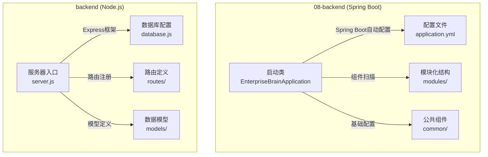
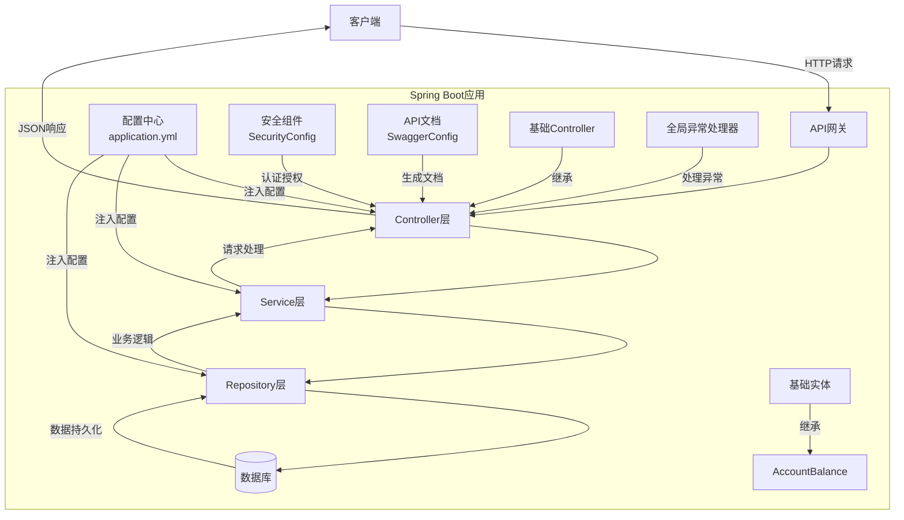
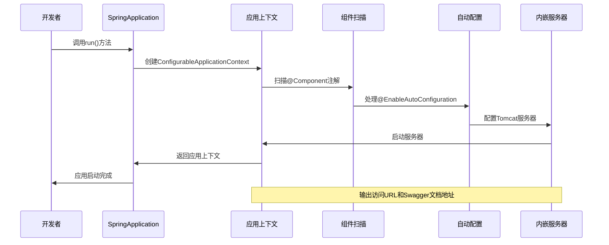
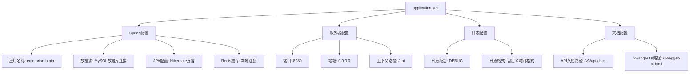
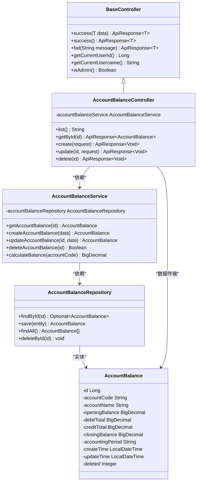
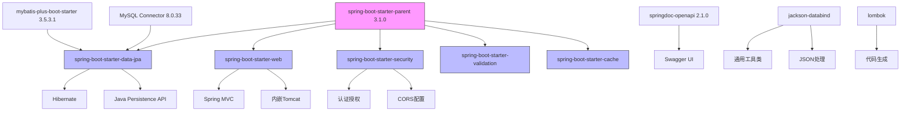

# 后端架构概览

<cite>
**本文档引用的文件**   
- [EnterpriseBrainApplication.java](file://08-backend/src/main/java/com/enterprise/brain/EnterpriseBrainApplication.java)
- [application.yml](file://08-backend/src/main/resources/application.yml)
- [pom.xml](file://08-backend/pom.xml)
- [SwaggerConfig.java](file://08-backend/src/main/java/com/enterprise/brain/common/config/SwaggerConfig.java)
- [SecurityConfig.java](file://08-backend/src/main/java/com/enterprise/brain/common/config/SecurityConfig.java)
- [BaseController.java](file://08-backend/src/main/java/com/enterprise/brain/common/base/BaseController.java)
- [BaseEntity.java](file://08-backend/src/main/java/com/enterprise/brain/common/base/BaseEntity.java)
- [GlobalExceptionHandler.java](file://08-backend/src/main/java/com/enterprise/brain/common/exception/GlobalExceptionHandler.java)
- [ApiResponse.java](file://08-backend/src/main/java/com/enterprise/brain/common/response/ApiResponse.java)
- [WebConfig.java](file://08-backend/src/main/java/com/enterprise/brain/common/config/WebConfig.java)
- [AccountBalanceController.java](file://08-backend/src/main/java/com/enterprise/brain/modules/finance/controller/AccountBalanceController.java)
- [AccountBalanceService.java](file://08-backend/src/main/java/com/enterprise/brain/modules/finance/service/AccountBalanceService.java)
- [AccountBalance.java](file://08-backend/src/main/java/com/enterprise/brain/modules/finance/entity/AccountBalance.java)
- [server.js](file://backend/server.js)
- [database.js](file://backend/config/database.js)
</cite>

## 目录
1. [简介](#简介)
2. [项目结构](#项目结构)
3. [核心组件](#核心组件)
4. [架构概览](#架构概览)
5. [详细组件分析](#详细组件分析)
6. [依赖分析](#依赖分析)
7. [性能考虑](#性能考虑)
8. [故障排除指南](#故障排除指南)
9. [结论](#结论)

## 简介
本文档系统性地文档化了08-backend的Spring Boot架构设计，从`EnterpriseBrainApplication.java`启动类开始，深入解释Spring Boot自动配置、组件扫描和依赖注入机制。详细说明了`application.yml`中的配置项含义，包括数据库连接、安全配置、Swagger文档等。剖析了基于MVC模式的分层架构：controller层处理HTTP请求，service层实现业务逻辑，repository层负责数据访问。同时对比了Node.js后端（backend/目录）的轻量级API实现，分析了两种后端技术的适用场景和集成方式。通过后端架构图，标注关键组件及其交互关系，帮助开发者理解服务端的整体运作机制。

## 项目结构



**图示来源**
- [EnterpriseBrainApplication.java](file://08-backend/src/main/java/com/enterprise/brain/EnterpriseBrainApplication.java#L20-L61)
- [application.yml](file://08-backend/src/main/resources/application.yml#L1-L42)
- [server.js](file://backend/server.js)
- [database.js](file://backend/config/database.js)

**本节来源**
- [08-backend/](file://08-backend/)
- [backend/](file://backend/)

## 核心组件

08-backend采用Spring Boot框架构建企业级应用，其核心组件包括：
- **启动类**：`EnterpriseBrainApplication.java`作为应用入口，通过`@SpringBootApplication`注解启用自动配置和组件扫描
- **配置管理**：`application.yml`文件集中管理应用配置，包括数据库连接、服务器端口、日志级别等
- **分层架构**：遵循MVC模式，分为controller、service、repository三层，实现关注点分离
- **公共基础**：`common/`目录下提供基础类、异常处理、响应封装等通用功能
- **安全配置**：通过Spring Security实现安全控制，配置CORS策略和权限管理
- **API文档**：集成SpringDoc OpenAPI，自动生成Swagger文档

**本节来源**
- [EnterpriseBrainApplication.java](file://08-backend/src/main/java/com/enterprise/brain/EnterpriseBrainApplication.java#L20-L61)
- [application.yml](file://08-backend/src/main/resources/application.yml#L1-L42)
- [pom.xml](file://08-backend/pom.xml#L30-L103)

## 架构概览



**图示来源**
- [EnterpriseBrainApplication.java](file://08-backend/src/main/java/com/enterprise/brain/EnterpriseBrainApplication.java#L20-L61)
- [BaseController.java](file://08-backend/src/main/java/com/enterprise/brain/common/base/BaseController.java#L16-L90)
- [BaseEntity.java](file://08-backend/src/main/java/com/enterprise/brain/common/base/BaseEntity.java#L18-L52)
- [GlobalExceptionHandler.java](file://08-backend/src/main/java/com/enterprise/brain/common/exception/GlobalExceptionHandler.java#L27-L118)
- [SecurityConfig.java](file://08-backend/src/main/java/com/enterprise/brain/common/config/SecurityConfig.java#L29-L86)
- [SwaggerConfig.java](file://08-backend/src/main/java/com/enterprise/brain/common/config/SwaggerConfig.java#L18-L38)

## 详细组件分析

### Spring Boot启动机制分析



**图示来源**
- [EnterpriseBrainApplication.java](file://08-backend/src/main/java/com/enterprise/brain/EnterpriseBrainApplication.java#L26-L61)

**本节来源**
- [EnterpriseBrainApplication.java](file://08-backend/src/main/java/com/enterprise/brain/EnterpriseBrainApplication.java#L20-L61)

### 配置项详解



**图示来源**
- [application.yml](file://08-backend/src/main/resources/application.yml#L1-L42)

**本节来源**
- [application.yml](file://08-backend/src/main/resources/application.yml#L1-L42)

### MVC分层架构分析



**图示来源**
- [BaseController.java](file://08-backend/src/main/java/com/enterprise/brain/common/base/BaseController.java#L16-L90)
- [AccountBalanceController.java](file://08-backend/src/main/java/com/enterprise/brain/modules/finance/controller/AccountBalanceController.java#L13-L22)
- [AccountBalanceService.java](file://08-backend/src/main/java/com/enterprise/brain/modules/finance/service/AccountBalanceService.java#L11-L13)
- [AccountBalance.java](file://08-backend/src/main/java/com/enterprise/brain/modules/finance/entity/AccountBalance.java#L19-L65)

**本节来源**
- [BaseController.java](file://08-backend/src/main/java/com/enterprise/brain/common/base/BaseController.java#L16-L90)
- [AccountBalanceController.java](file://08-backend/src/main/java/com/enterprise/brain/modules/finance/controller/AccountBalanceController.java#L13-L22)
- [AccountBalanceService.java](file://08-backend/src/main/java/com/enterprise/brain/modules/finance/service/AccountBalanceService.java#L11-L13)
- [AccountBalance.java](file://08-backend/src/main/java/com/enterprise/brain/modules/finance/entity/AccountBalance.java#L19-L65)

## 依赖分析



**图示来源**
- [pom.xml](file://08-backend/pom.xml#L30-L103)

**本节来源**
- [pom.xml](file://08-backend/pom.xml#L30-L103)

## 性能考虑

08-backend在性能方面进行了多项优化设计：
- **缓存机制**：配置Redis作为缓存层，减少数据库访问频率
- **连接池**：使用Spring Boot默认的HikariCP连接池，提高数据库连接效率
- **异步处理**：通过`@EnableScheduling`支持定时任务和异步操作
- **分页查询**：集成MyBatis Plus的分页功能，避免全表扫描
- **日志级别**：生产环境建议将日志级别调整为INFO，减少I/O开销
- **JPA优化**：配置Hibernate方言为MySQL8Dialect，充分利用MySQL 8.0特性

**本节来源**
- [application.yml](file://08-backend/src/main/resources/application.yml#L1-L42)
- [pom.xml](file://08-backend/pom.xml#L61-L65)
- [EnterpriseBrainApplication.java](file://08-backend/src/main/java/com/enterprise/brain/EnterpriseBrainApplication.java#L9)

## 故障排除指南

```mermaid
flowchart TD
A[问题发生] --> B{问题类型}
B --> C[启动失败]
B --> D[API调用失败]
B --> E[数据库连接失败]
B --> F[安全认证失败]
B --> G[性能问题]
C --> C1[检查端口占用: netstat -an | grep 8080]
C --> C2[检查依赖完整性: mvn clean install]
C --> C3[检查配置文件语法]
D --> D1[检查请求路径是否匹配]
D --> D2[查看日志输出: DEBUG级别]
D --> D3[验证参数格式是否正确]
E --> E1[检查数据库服务是否运行]
E --> E2[验证连接字符串和凭证]
E --> E3[测试网络连通性]
F --> F1[检查CORS配置]
F --> F2[验证安全白名单]
F --> F3[确认认证机制]
G --> G1[监控CPU和内存使用]
G --> G2[分析慢查询日志]
G --> G3[检查缓存命中率]
```

**本节来源**
- [application.yml](file://08-backend/src/main/resources/application.yml#L31-L35)
- [SecurityConfig.java](file://08-backend/src/main/java/com/enterprise/brain/common/config/SecurityConfig.java#L34-L41)
- [WebConfig.java](file://08-backend/src/main/java/com/enterprise/brain/common/config/WebConfig.java#L36-L42)

## 结论

通过对08-backend的Spring Boot架构进行系统性分析，我们可以得出以下结论：

1. **架构设计成熟**：采用标准的Spring Boot + Spring MVC + MyBatis Plus技术栈，遵循MVC分层架构，代码结构清晰，易于维护和扩展。

2. **配置管理完善**：通过`application.yml`集中管理配置，支持多环境配置，配置项涵盖数据库、安全、缓存、日志等各个方面。

3. **开发效率高**：利用Spring Boot的自动配置和起步依赖，大大减少了样板代码，Lombok注解进一步简化了POJO类的编写。

4. **API文档集成**：通过SpringDoc OpenAPI无缝集成Swagger文档，自动生成API文档，便于前后端协作和接口测试。

5. **安全机制健全**：集成Spring Security，提供CORS配置、权限控制等安全功能，保障系统安全。

6. **异常处理统一**：通过`GlobalExceptionHandler`实现全局异常处理，`ApiResponse`提供统一的响应格式，提高API的规范性和用户体验。

7. **技术栈对比**：相较于Node.js后端的轻量级实现，Spring Boot后端更适合复杂的企业级应用，提供更强的类型安全、更完善的生态系统和更好的性能表现。

8. **适用场景**：08-backend的架构设计适用于需要高可靠性、强类型安全、复杂业务逻辑的企业级管理系统，而Node.js后端更适合轻量级API服务、实时应用和微服务架构。

建议在实际开发中，充分利用Spring Boot的特性，遵循最佳实践，保持代码的可测试性和可维护性，同时根据具体业务需求进行适当的架构优化和性能调优。