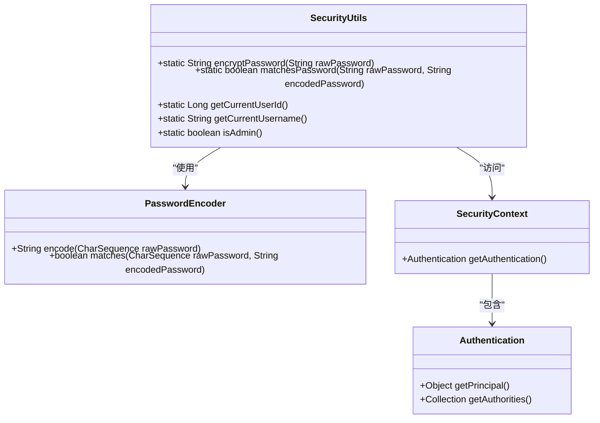
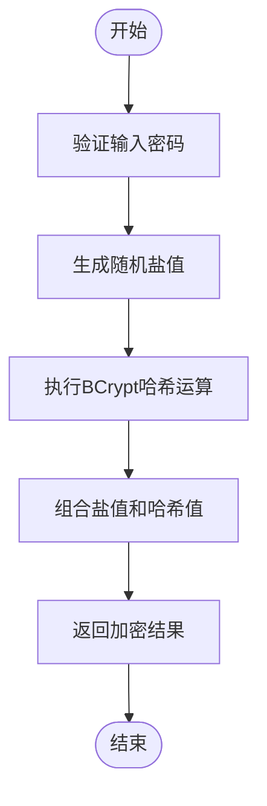
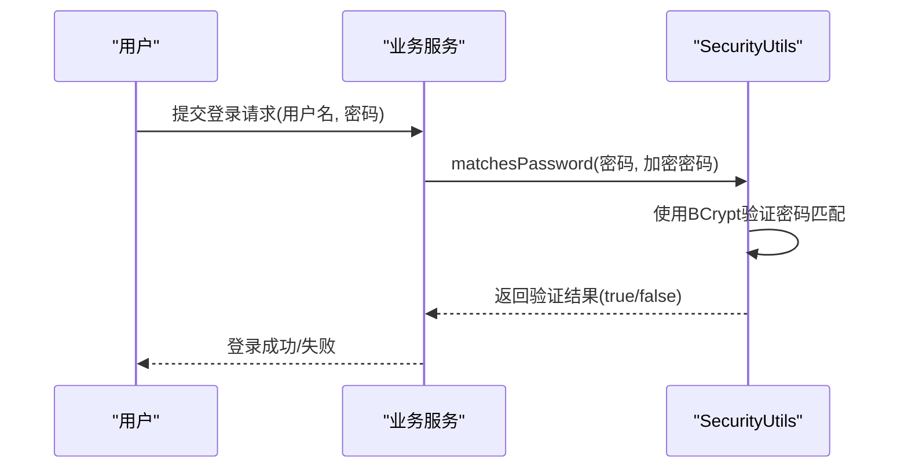
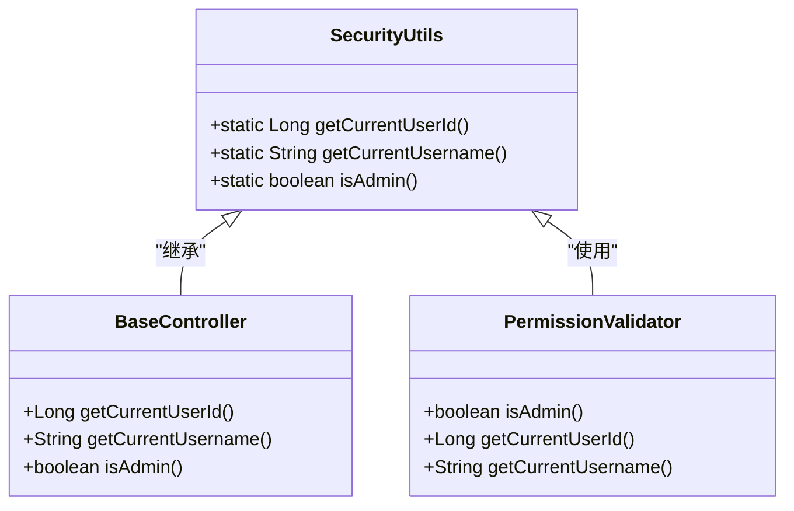

# 安全工具类

<cite>
**本文档引用的文件**   
- [SecurityUtils.java](file://08-backend/src/main/java/com/enterprise/brain/common/security/SecurityUtils.java)
- [SecurityConfig.java](file://08-backend/src/main/java/com/enterprise/brain/common/config/SecurityConfig.java)
- [PermissionValidator.java](file://08-backend/src/main/java/com/enterprise/brain/common/security/PermissionValidator.java)
- [BaseController.java](file://08-backend/src/main/java/com/enterprise/brain/common/base/BaseController.java)
- [DataEncryptor.java](file://08-backend/src/main/java/com/enterprise/brain/common/security/DataEncryptor.java)
</cite>

## 目录
1. [简介](#简介)
2. [核心功能](#核心功能)
3. [密码安全功能](#密码安全功能)
4. [安全上下文获取方法](#安全上下文获取方法)
5. [实际应用示例](#实际应用示例)
6. [调用方式与线程安全性](#调用方式与线程安全性)
7. [结论](#结论)

## 简介
安全工具类（SecurityUtils）是企业级应用中的核心安全组件，提供了一套完整的安全功能解决方案。该工具类主要负责密码加密、用户身份验证和权限管理等关键安全操作，为系统的安全运行提供了坚实的基础。通过封装Spring Security的核心功能，SecurityUtils简化了安全相关的开发工作，使开发者能够更专注于业务逻辑的实现。

**Section sources**
- [SecurityUtils.java](file://08-backend/src/main/java/com/enterprise/brain/common/security/SecurityUtils.java#L1-L13)

## 核心功能
安全工具类提供了三大核心功能模块：密码安全处理、安全上下文管理和权限验证支持。密码安全功能基于BCrypt算法实现密码的加密和匹配验证，确保用户密码的安全存储和验证。安全上下文管理功能提供了获取当前登录用户信息的便捷方法，包括用户ID、用户名和管理员身份判断。权限验证支持功能与Spring Security框架深度集成，为基于注解的权限控制提供了底层支持。



**Diagram sources **
- [SecurityUtils.java](file://08-backend/src/main/java/com/enterprise/brain/common/security/SecurityUtils.java#L16-L17)
- [SecurityConfig.java](file://08-backend/src/main/java/com/enterprise/brain/common/config/SecurityConfig.java#L65-L67)

**Section sources**
- [SecurityUtils.java](file://08-backend/src/main/java/com/enterprise/brain/common/security/SecurityUtils.java#L1-L73)

## 密码安全功能

### 密码加密（encryptPassword）
密码加密方法采用BCrypt哈希算法对原始密码进行加密处理。BCrypt是一种自适应的哈希函数，具有内置的盐值生成机制，能够有效抵御彩虹表攻击和暴力破解。该方法接收原始密码作为输入，返回经过BCrypt算法处理后的加密字符串。加密过程是单向的，无法从加密结果反向推导出原始密码，确保了密码存储的安全性。



**Diagram sources **
- [SecurityUtils.java](file://08-backend/src/main/java/com/enterprise/brain/common/security/SecurityUtils.java#L25-L27)
- [SecurityConfig.java](file://08-backend/src/main/java/com/enterprise/brain/common/config/SecurityConfig.java#L65-L67)

### 密码匹配（matchesPassword）
密码匹配方法用于验证用户输入的原始密码与数据库中存储的加密密码是否匹配。该方法接收两个参数：原始密码和加密后的密码。它使用BCrypt算法重新计算原始密码的哈希值，并与存储的加密密码进行比较。由于BCrypt算法在加密时会生成随机盐值，因此不能直接比较哈希值，而必须使用专门的匹配算法来确保验证的准确性。



**Diagram sources **
- [SecurityUtils.java](file://08-backend/src/main/java/com/enterprise/brain/common/security/SecurityUtils.java#L36-L38)
- [DataEncryptor.java](file://08-backend/src/main/java/com/enterprise/brain/common/security/DataEncryptor.java#L213-L216)

**Section sources**
- [SecurityUtils.java](file://08-backend/src/main/java/com/enterprise/brain/common/security/SecurityUtils.java#L19-L38)

## 安全上下文获取方法

### 获取当前用户ID（getCurrentUserId）
获取当前用户ID方法用于从安全上下文中提取当前登录用户的唯一标识符。该方法在需要记录操作日志、数据权限控制等场景中非常有用。在实际实现中，它会从Spring Security的SecurityContext中获取认证信息，并提取用户ID。该方法的返回值通常用于数据库操作中的创建者、修改者等字段的赋值。

### 获取当前用户名（getCurrentUsername）
获取当前用户名方法用于获取当前登录用户的用户名。与获取用户ID类似，该方法也是从安全上下文中提取信息。用户名通常用于界面显示、日志记录等场景，为用户提供个性化的体验。该方法确保了在整个应用中能够一致地获取当前用户的标识信息。

### 判断管理员身份（isAdmin）
判断管理员身份方法用于检查当前登录用户是否具有管理员权限。该方法通过检查用户的角色或权限集合来确定其是否为管理员。在实际应用中，管理员通常具有系统级别的操作权限，如用户管理、权限分配等。该方法为需要区分普通用户和管理员的业务逻辑提供了便捷的判断手段。



**Diagram sources **
- [SecurityUtils.java](file://08-backend/src/main/java/com/enterprise/brain/common/security/SecurityUtils.java#L45-L68)
- [BaseController.java](file://08-backend/src/main/java/com/enterprise/brain/common/base/BaseController.java#L70-L88)
- [PermissionValidator.java](file://08-backend/src/main/java/com/enterprise/brain/common/security/PermissionValidator.java#L274-L285)

**Section sources**
- [SecurityUtils.java](file://08-backend/src/main/java/com/enterprise/brain/common/security/SecurityUtils.java#L40-L68)

## 实际应用示例

### 用户认证场景
在用户登录认证过程中，安全工具类的密码匹配功能发挥着关键作用。当用户提交登录请求时，系统会从数据库中获取该用户的加密密码，然后使用matchesPassword方法验证用户输入的密码是否正确。这种方式避免了在代码中直接处理密码哈希的复杂性，提高了代码的可读性和安全性。

### 权限判断场景
在需要进行权限控制的业务方法上，可以通过isAdmin方法快速判断当前用户是否具有管理员权限。例如，在用户管理功能中，只有管理员才能创建新用户或修改其他用户的权限。通过在方法开始处调用isAdmin方法，可以有效地阻止非管理员用户的非法操作。

### 业务逻辑场景
在数据操作的业务逻辑中，安全上下文获取方法被广泛使用。例如，在创建新的业务记录时，系统会自动调用getCurrentUserId方法获取当前用户的ID，并将其作为创建者的标识存储在数据库中。这不仅实现了操作的可追溯性，也为后续的数据权限控制提供了基础。

```mermaid
flowchart TD
subgraph "用户管理模块"
A[创建用户] --> B{isAdmin()}
B --> |是| C[执行创建操作]
B --> |否| D[抛出权限异常]
C --> E[设置创建者为getCurrentUserId()]
E --> F[保存用户信息]
end
subgraph "订单管理模块"
G[创建订单] --> H[获取当前用户getCurrentUserId()]
H --> I[关联订单与用户]
I --> J[执行创建操作]
end
```

**Diagram sources **
- [SecurityUtils.java](file://08-backend/src/main/java/com/enterprise/brain/common/security/SecurityUtils.java#L45-L68)
- [DynamicMenuController.java](file://08-backend/src/main/java/com/enterprise/brain/modules/system/menu/controller/DynamicMenuController.java#L100-L105)

**Section sources**
- [SecurityUtils.java](file://08-backend/src/main/java/com/enterprise/brain/common/security/SecurityUtils.java#L19-L68)
- [PermissionValidator.java](file://08-backend/src/main/java/com/enterprise/brain/common/security/PermissionValidator.java#L225-L227)

## 调用方式与线程安全性
安全工具类设计为静态工具类，所有方法均为静态方法，可以直接通过类名调用，无需实例化。这种设计模式符合工具类的使用习惯，使代码更加简洁。由于所有方法都是无状态的，且不依赖于实例变量，因此该工具类是线程安全的，可以在多线程环境中安全使用。

在实际使用中，开发者只需导入SecurityUtils类，即可调用其提供的各种安全方法。例如，密码加密可以通过SecurityUtils.encryptPassword(password)调用，获取当前用户ID可以通过SecurityUtils.getCurrentUserId()调用。这种统一的调用方式降低了学习成本，提高了开发效率。

**Section sources**
- [SecurityUtils.java](file://08-backend/src/main/java/com/enterprise/brain/common/security/SecurityUtils.java#L70-L72)

## 结论
安全工具类（SecurityUtils）为应用系统提供了全面的安全功能支持。通过封装BCrypt密码加密算法和Spring Security的安全上下文管理，它简化了安全相关的开发工作，提高了代码的安全性和可维护性。密码加密和匹配功能确保了用户密码的安全存储和验证，安全上下文获取方法为权限控制和操作审计提供了基础支持。作为静态工具类，它具有良好的线程安全性，可以在各种业务场景中安全使用。建议在所有涉及安全操作的代码中优先使用该工具类，以确保系统安全的一致性和可靠性。