# 安全控制机制

<cite>
**本文引用的文件**
- [SecurityConfig.java](file://08-backend/src/main/java/com/enterprise/brain/common/config/SecurityConfig.java)
- [SecurityConfig.java](file://08-backend/src/main/java/com/enterprise/brain/config/SecurityConfig.java)
- [PermissionAnnotation.java](file://08-backend/src/main/java/com/enterprise/brain/common/annotation/PermissionAnnotation.java)
- [LogAnnotation.java](file://08-backend/src/main/java/com/enterprise/brain/common/annotation/LogAnnotation.java)
- [PermissionValidator.java](file://08-backend/src/main/java/com/enterprise/brain/common/security/PermissionValidator.java)
- [DataEncryptor.java](file://08-backend/src/main/java/com/enterprise/brain/common/security/DataEncryptor.java)
- [SecurityUtils.java](file://08-backend/src/main/java/com/enterprise/brain/common/security/SecurityUtils.java)
- [DynamicMenuController.java](file://08-backend/src/main/java/com/enterprise/brain/modules/system/menu/controller/DynamicMenuController.java)
- [application.yml](file://08-backend/src/main/resources/application.yml)
</cite>

## 目录
1. [引言](#引言)
2. [项目结构](#项目结构)
3. [核心组件](#核心组件)
4. [架构总览](#架构总览)
5. [详细组件分析](#详细组件分析)
6. [依赖关系分析](#依赖关系分析)
7. [性能与安全特性](#性能与安全特性)
8. [故障排查指南](#故障排查指南)
9. [结论](#结论)

## 引言
本文件系统化梳理后端安全架构，重点覆盖：
- 基于Spring Security的Web层安全配置（含白名单、CORS、会话策略、CSRF策略）
- 自定义注解与AOP切面实现的权限校验机制
- 敏感数据加密策略与密码处理流程
- 与前端交互的鉴权与审计日志设计思路
- 常见安全风险与防护建议

## 项目结构
后端采用多层分层与模块化组织，安全相关能力主要集中在common与config包中，并在各业务模块中配合使用注解与切面。

图表来源
- [SecurityConfig.java](file://08-backend/src/main/java/com/enterprise/brain/common/config/SecurityConfig.java#L1-L87)
- [SecurityConfig.java](file://08-backend/src/main/java/com/enterprise/brain/config/SecurityConfig.java#L1-L36)
- [PermissionAnnotation.java](file://08-backend/src/main/java/com/enterprise/brain/common/annotation/PermissionAnnotation.java#L1-L51)
- [LogAnnotation.java](file://08-backend/src/main/java/com/enterprise/brain/common/annotation/LogAnnotation.java#L1-L96)
- [PermissionValidator.java](file://08-backend/src/main/java/com/enterprise/brain/common/security/PermissionValidator.java#L1-L316)
- [DataEncryptor.java](file://08-backend/src/main/java/com/enterprise/brain/common/security/DataEncryptor.java#L1-L260)
- [SecurityUtils.java](file://08-backend/src/main/java/com/enterprise/brain/common/security/SecurityUtils.java#L1-L74)
- [DynamicMenuController.java](file://08-backend/src/main/java/com/enterprise/brain/modules/system/menu/controller/DynamicMenuController.java#L12-L106)

章节来源
- [SecurityConfig.java](file://08-backend/src/main/java/com/enterprise/brain/common/config/SecurityConfig.java#L1-L87)
- [SecurityConfig.java](file://08-backend/src/main/java/com/enterprise/brain/config/SecurityConfig.java#L1-L36)
- [application.yml](file://08-backend/src/main/resources/application.yml#L1-L42)

## 核心组件
- Web安全配置：统一的SecurityFilterChain、CORS、会话策略、CSRF策略
- 注解与切面：基于注解的权限校验与AOP拦截
- 安全工具与加密：密码编码、敏感数据加解密、盐值生成
- 控制器集成：结合方法级权限注解与@PreAuthorize等进行细粒度授权

章节来源
- [SecurityConfig.java](file://08-backend/src/main/java/com/enterprise/brain/common/config/SecurityConfig.java#L1-L87)
- [PermissionAnnotation.java](file://08-backend/src/main/java/com/enterprise/brain/common/annotation/PermissionAnnotation.java#L1-L51)
- [PermissionValidator.java](file://08-backend/src/main/java/com/enterprise/brain/common/security/PermissionValidator.java#L1-L316)
- [DataEncryptor.java](file://08-backend/src/main/java/com/enterprise/brain/common/security/DataEncryptor.java#L1-L260)
- [SecurityUtils.java](file://08-backend/src/main/java/com/enterprise/brain/common/security/SecurityUtils.java#L1-L74)

## 架构总览
整体安全架构分为三层：
- Web层：基于Spring Security的过滤链与方法级安全
- 应用层：注解+AOP实现的权限校验与审计日志
- 工具层：加密与安全工具，支撑密码与敏感数据保护

图表来源
- [SecurityConfig.java](file://08-backend/src/main/java/com/enterprise/brain/common/config/SecurityConfig.java#L43-L60)
- [PermissionValidator.java](file://08-backend/src/main/java/com/enterprise/brain/common/security/PermissionValidator.java#L32-L86)
- [DynamicMenuController.java](file://08-backend/src/main/java/com/enterprise/brain/modules/system/menu/controller/DynamicMenuController.java#L12-L106)

## 详细组件分析

### Web安全配置（SecurityConfig）
- CSRF策略：显式禁用，适用于Token认证场景；生产环境建议启用
- CORS策略：允许通配符来源、方法与头，支持凭证，设置最大缓存时间
- 会话策略：STATELESS，无状态会话
- 授权规则：白名单路径放行；当前配置对所有请求均放行（生产需细化）

章节来源
- [SecurityConfig.java](file://08-backend/src/main/java/com/enterprise/brain/common/config/SecurityConfig.java#L43-L60)
- [SecurityConfig.java](file://08-backend/src/main/java/com/enterprise/brain/config/SecurityConfig.java#L15-L36)

### 自定义注解与AOP切面

#### 注解：PermissionAnnotation
- 支持声明式权限：角色数组、权限码数组、AND/OR逻辑
- 可用于方法或类型级别，便于批量权限控制

章节来源
- [PermissionAnnotation.java](file://08-backend/src/main/java/com/enterprise/brain/common/annotation/PermissionAnnotation.java#L1-L51)

#### 切面：PermissionValidator
- 基于@Around拦截带@PermissionAnnotation的方法
- 逻辑：先校验角色，再校验权限码；AND要求全部满足，OR满足其一即可
- 当前用户信息与权限来源为占位实现（TODO），需对接真实上下文与权限存储

图表来源
- [PermissionValidator.java](file://08-backend/src/main/java/com/enterprise/brain/common/security/PermissionValidator.java#L32-L86)
- [PermissionAnnotation.java](file://08-backend/src/main/java/com/enterprise/brain/common/annotation/PermissionAnnotation.java#L1-L51)

章节来源
- [PermissionValidator.java](file://08-backend/src/main/java/com/enterprise/brain/common/security/PermissionValidator.java#L1-L316)

### 方法级授权（@PreAuthorize示例）
- 在控制器方法上使用@PreAuthorize进行细粒度授权
- 示例：菜单管理接口按权限码精确控制新增、编辑、删除、排序等操作

章节来源
- [DynamicMenuController.java](file://08-backend/src/main/java/com/enterprise/brain/modules/system/menu/controller/DynamicMenuController.java#L12-L106)

### 审计日志注解（LogAnnotation）
- 支持模块、操作类型、描述、参数/结果/异常记录开关
- 可与AOP切面结合实现统一审计日志采集

章节来源
- [LogAnnotation.java](file://08-backend/src/main/java/com/enterprise/brain/common/annotation/LogAnnotation.java#L1-L96)

### 敏感数据加密策略（DataEncryptor）
- 对称加密：AES，默认密钥（开发态），支持自定义密钥
- 哈希：MD5、SHA-256
- Base64编解码
- 敏感数据加解密：对手机号、身份证等敏感字段进行AES加密
- 密码处理：SHA-256 + 盐值；提供盐值生成与匹配验证

图表来源
- [DataEncryptor.java](file://08-backend/src/main/java/com/enterprise/brain/common/security/DataEncryptor.java#L1-L260)

章节来源
- [DataEncryptor.java](file://08-backend/src/main/java/com/enterprise/brain/common/security/DataEncryptor.java#L1-L260)

### 安全工具（SecurityUtils）
- 提供BCrypt密码编码与匹配
- 提供当前用户ID/用户名/管理员判定占位方法（需对接真实上下文）

章节来源
- [SecurityUtils.java](file://08-backend/src/main/java/com/enterprise/brain/common/security/SecurityUtils.java#L1-L74)

## 依赖关系分析

```mermaid
classDiagram
class SecurityConfig_common {
+securityFilterChain()
+passwordEncoder()
+corsConfigurationSource()
}
class SecurityConfig_config {
+filterChain()
}
class PermissionAnnotation {
+value
+permissions
+roles
+logical
}
class PermissionValidator {
+validatePermission()
-validateRoles()
-validatePermissions()
-getUserRoles()
-getUserPermissions()
-getCurrentUserId()
-getCurrentUsername()
}
class DataEncryptor {
+encryptAES()
+decryptAES()
+encryptMD5()
+encryptSHA256()
+encodeBase64()
+decodeBase64()
+encryptSensitiveData()
+decryptSensitiveData()
+encryptPassword()
+verifyPassword()
+generateSalt()
}
class SecurityUtils {
+encryptPassword()
+matchesPassword()
+getCurrentUserId()
+getCurrentUsername()
+isAdmin()
}
class DynamicMenuController {
+createMenu()
+updateMenu()
+deleteMenu()
+getMenuById()
+getFullMenuTree()
+getUserMenuTree()
+sortMenus()
+updateMenuVisibility()
+getUserMenuConfig()
+batchUpdateUserMenuVisibility()
}
SecurityConfig_common --> PermissionValidator : "启用方法安全"
PermissionValidator --> PermissionAnnotation : "读取注解"
PermissionValidator --> SecurityUtils : "获取用户上下文"
DynamicMenuController --> PermissionValidator : "方法级权限校验"
DataEncryptor --> SecurityUtils : "密码处理"
```

图表来源
- [SecurityConfig.java](file://08-backend/src/main/java/com/enterprise/brain/common/config/SecurityConfig.java#L1-L87)
- [SecurityConfig.java](file://08-backend/src/main/java/com/enterprise/brain/config/SecurityConfig.java#L1-L36)
- [PermissionAnnotation.java](file://08-backend/src/main/java/com/enterprise/brain/common/annotation/PermissionAnnotation.java#L1-L51)
- [PermissionValidator.java](file://08-backend/src/main/java/com/enterprise/brain/common/security/PermissionValidator.java#L1-L316)
- [DataEncryptor.java](file://08-backend/src/main/java/com/enterprise/brain/common/security/DataEncryptor.java#L1-L260)
- [SecurityUtils.java](file://08-backend/src/main/java/com/enterprise/brain/common/security/SecurityUtils.java#L1-L74)
- [DynamicMenuController.java](file://08-backend/src/main/java/com/enterprise/brain/modules/system/menu/controller/DynamicMenuController.java#L12-L106)

## 性能与安全特性
- 无状态会话：降低服务端状态开销，利于水平扩展
- CORS宽松策略：开发友好，生产需收敛来源与头
- CSRF禁用：适用于Token认证；若切换回表单认证，需启用CSRF
- 方法级安全：结合注解与AOP，实现细粒度授权
- 密码与敏感数据：采用BCrypt与AES+盐值策略，提升抗破解能力

章节来源
- [SecurityConfig.java](file://08-backend/src/main/java/com/enterprise/brain/common/config/SecurityConfig.java#L43-L60)
- [DataEncryptor.java](file://08-backend/src/main/java/com/enterprise/brain/common/security/DataEncryptor.java#L1-L260)
- [SecurityUtils.java](file://08-backend/src/main/java/com/enterprise/brain/common/security/SecurityUtils.java#L1-L74)

## 故障排查指南
- 权限不足异常
  - 现象：方法被拦截后抛出业务异常
  - 排查：确认@PermissionAnnotation配置、当前用户角色/权限集合、AND/OR逻辑
  - 关联：切面逻辑与用户上下文占位实现
- CSRF相关问题
  - 现象：跨域请求被拒绝或Token失效
  - 排查：确认CSRF禁用策略与前端Token传递方式；生产环境建议启用CSRF
- CORS跨域问题
  - 现象：浏览器报跨域错误
  - 排查：核对允许来源、方法、头与凭证设置
- 密码/敏感数据异常
  - 现象：登录失败或解密异常
  - 排查：确认盐值一致性、密钥一致性、Base64编解码正确性

章节来源
- [PermissionValidator.java](file://08-backend/src/main/java/com/enterprise/brain/common/security/PermissionValidator.java#L74-L86)
- [SecurityConfig.java](file://08-backend/src/main/java/com/enterprise/brain/common/config/SecurityConfig.java#L43-L60)
- [DataEncryptor.java](file://08-backend/src/main/java/com/enterprise/brain/common/security/DataEncryptor.java#L1-L260)

## 结论
本项目已建立较为完整的安全基础：Web层安全配置、注解驱动的权限校验、AOP拦截、密码与敏感数据处理。建议在生产环境中：
- 明确授权规则，细化authorizeHttpRequests策略
- 启用CSRF防护并完善白名单
- 将用户上下文与权限来源替换为真实实现（数据库/缓存）
- 使用配置中心管理密钥与敏感参数
- 强化审计日志与异常监控