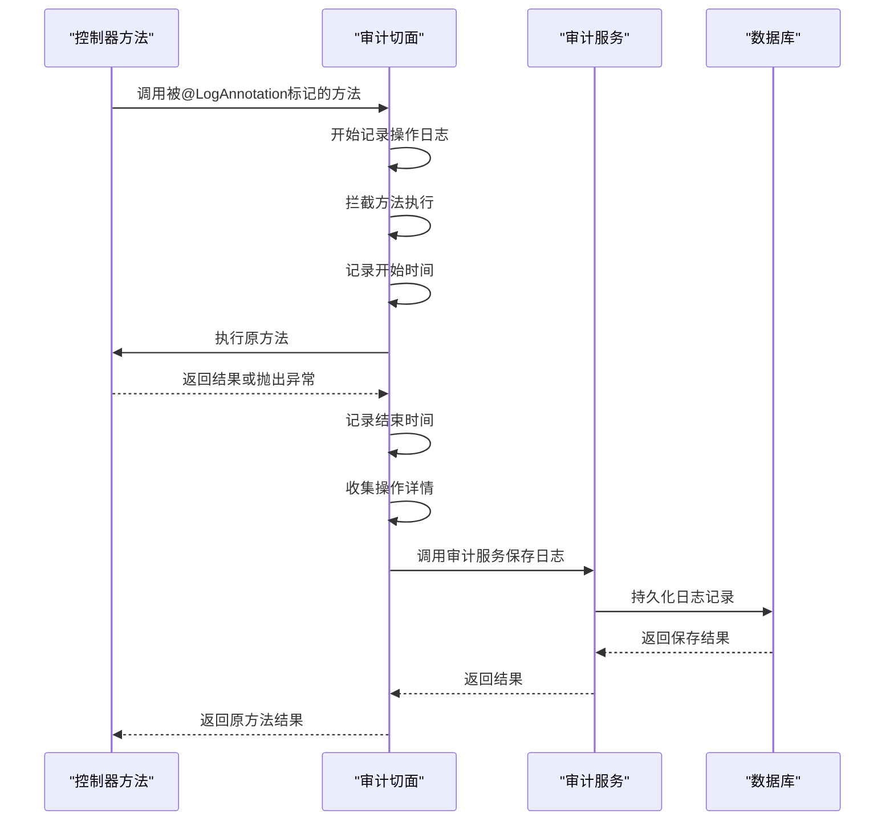
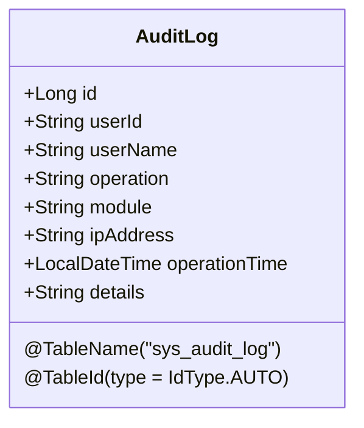
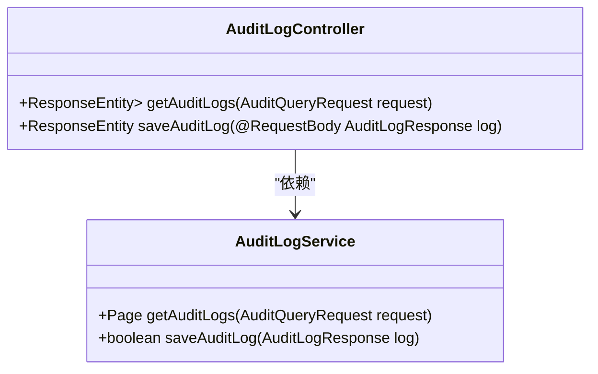
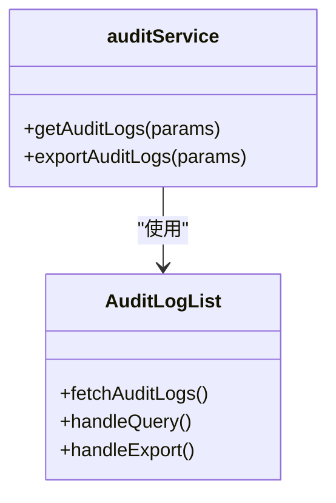

# 操作审计机制

<cite>
**本文档引用的文件**  
- [LogAnnotation.java](file://08-backend/src/main/java/com/enterprise/brain/common/annotation/LogAnnotation.java)
- [AuditLogController.java](file://08-backend/src/main/java/com/enterprise/brain/modules/system/audit/controller/AuditLogController.java)
- [AuditLogService.java](file://08-backend/src/main/java/com/enterprise/brain/modules/system/audit/service/AuditLogService.java)
- [AuditLogServiceImpl.java](file://08-backend/src/main/java/com/enterprise/brain/modules/system/audit/service/impl/AuditLogServiceImpl.java)
- [AuditLogRepository.java](file://08-backend/src/main/java/com/enterprise/brain/modules/system/audit/repository/AuditLogRepository.java)
- [AuditLog.java](file://08-backend/src/main/java/com/enterprise/brain/modules/system/audit/entity/AuditLog.java)
- [AuditLogResponse.java](file://08-backend/src/main/java/com/enterprise/brain/modules/system/audit/dto/response/AuditLogResponse.java)
- [AuditQueryRequest.java](file://08-backend/src/main/java/com/enterprise/brain/modules/system/audit/dto/request/AuditQueryRequest.java)
- [AuditLogMapper.xml](file://08-backend/src/main/resources/mapper/system/audit/AuditLogMapper.xml)
- [audit.js](file://07-frontend/src/api/system/audit.js)
- [auditService.ts](file://07-frontend/src/services/api/auditService.ts)
- [AuditLogList.vue](file://07-frontend/src/pages/system/audit-management/AuditLogList.vue)
</cite>

## 目录
1. [简介](#简介)
2. [@LogAnnotation注解详解](#logannotation注解详解)
3. [操作类型枚举](#操作类型枚举)
4. [AOP切面审计机制](#aop切面审计机制)
5. [审计日志存储结构](#审计日志存储结构)
6. [审计日志查询接口](#审计日志查询接口)
7. [前端审计功能实现](#前端审计功能实现)
8. [总结](#总结)

## 简介
本系统实现了基于注解的操作审计机制，通过@LogAnnotation注解和AOP切面技术自动记录用户操作日志。该机制能够捕获关键业务操作的详细信息，包括操作类型、模块、描述、请求参数、返回结果和异常信息，为系统安全审计和问题追踪提供完整支持。

**Section sources**
- [LogAnnotation.java](file://08-backend/src/main/java/com/enterprise/brain/common/annotation/LogAnnotation.java)

## @LogAnnotation注解详解
@LogAnnotation是系统核心的操作日志注解，用于标记需要审计的方法。该注解提供了多个属性来配置审计行为。

### 注解属性说明
@LogAnnotation注解包含以下关键属性：

| 属性名称 | 类型 | 默认值 | 说明 |
|---------|------|--------|------|
| module | String | "" | 操作所属模块，用于分类日志 |
| type | OperationType | OTHER | 操作类型，定义操作的业务含义 |
| description | String | "" | 操作描述，提供操作的详细说明 |
| recordParams | boolean | true | 是否记录请求参数 |
| recordResult | boolean | true | 是否记录返回结果 |
| recordException | boolean | true | 是否记录异常信息 |

### 属性配置示例
```java
@LogAnnotation(
    module = "用户管理",
    type = OperationType.UPDATE,
    description = "更新用户基本信息",
    recordParams = true,
    recordResult = false,
    recordException = true
)
public boolean updateUser(User user) {
    // 业务逻辑
}
```

**Section sources**
- [LogAnnotation.java](file://08-backend/src/main/java/com/enterprise/brain/common/annotation/LogAnnotation.java)

## 操作类型枚举
OperationType枚举定义了系统支持的各种操作类型，每种类型对应特定的业务场景。

### 操作类型业务含义
```java
enum OperationType {
    /**
     * 查询操作 - 用于数据检索类操作
     * 例如：用户列表查询、订单详情查看
     */
    QUERY,

    /**
     * 新增操作 - 用于创建新记录的操作
     * 例如：创建新用户、添加产品信息
     */
    INSERT,

    /**
     * 修改操作 - 用于更新现有记录的操作
     * 例如：修改用户资料、更新订单状态
     */
    UPDATE,

    /**
     * 删除操作 - 用于移除记录的操作
     * 例如：删除用户、移除产品
     */
    DELETE,

    /**
     * 导入操作 - 用于批量导入数据的操作
     * 例如：Excel数据导入、批量用户导入
     */
    IMPORT,

    /**
     * 导出操作 - 用于数据导出的操作
     * 例如：导出报表、导出用户列表
     */
    EXPORT,

    /**
     * 登录操作 - 用户登录系统
     */
    LOGIN,

    /**
     * 登出操作 - 用户退出系统
     */
    LOGOUT,

    /**
     * 其他操作 - 不属于上述类型的其他操作
     */
    OTHER
}
```

**Section sources**
- [LogAnnotation.java](file://08-backend/src/main/java/com/enterprise/brain/common/annotation/LogAnnotation.java)

## AOP切面审计机制
系统通过AOP（面向切面编程）技术实现自动化的操作日志记录，无需在业务代码中手动添加日志记录逻辑。

### 审计切面工作流程


**Diagram sources**
- [LogAnnotation.java](file://08-backend/src/main/java/com/enterprise/brain/common/annotation/LogAnnotation.java)

### 记录策略
系统实现了精细化的日志记录策略，根据@LogAnnotation的配置决定记录哪些信息：

1. **请求参数记录**：当`recordParams=true`时，序列化方法参数并记录
2. **返回结果记录**：当`recordResult=true`时，记录方法返回值
3. **异常信息记录**：当`recordException=true`且方法抛出异常时，记录异常堆栈
4. **性能数据记录**：自动记录方法执行时间

**Section sources**
- [LogAnnotation.java](file://08-backend/src/main/java/com/enterprise/brain/common/annotation/LogAnnotation.java)

## 审计日志存储结构
审计日志采用结构化存储，便于查询和分析。

### 数据库表结构
```sql
CREATE TABLE sys_audit_log (
    id BIGINT AUTO_INCREMENT PRIMARY KEY,
    user_id VARCHAR(64) NOT NULL,
    user_name VARCHAR(100) NOT NULL,
    operation VARCHAR(100) NOT NULL,
    module VARCHAR(100) NOT NULL,
    ip_address VARCHAR(45),
    operation_time DATETIME NOT NULL,
    details TEXT
);
```

### 实体类映射


**Diagram sources**
- [AuditLog.java](file://08-backend/src/main/java/com/enterprise/brain/modules/system/audit/entity/AuditLog.java)

### 字段说明
| 字段 | 类型 | 说明 |
|------|------|------|
| id | BIGINT | 主键，自增 |
| userId | VARCHAR(64) | 执行操作的用户ID |
| userName | VARCHAR(100) | 执行操作的用户名 |
| operation | VARCHAR(100) | 操作描述 |
| module | VARCHAR(100) | 操作所属模块 |
| ipAddress | VARCHAR(45) | 用户IP地址 |
| operationTime | DATETIME | 操作时间 |
| details | TEXT | 操作详情（JSON格式） |

**Section sources**
- [AuditLog.java](file://08-backend/src/main/java/com/enterprise/brain/modules/system/audit/entity/AuditLog.java)
- [AuditLogMapper.xml](file://08-backend/src/main/resources/mapper/system/audit/AuditLogMapper.xml)

## 审计日志查询接口
系统提供了RESTful API用于查询审计日志，支持多种查询条件。

### API接口定义


**Diagram sources**
- [AuditLogController.java](file://08-backend/src/main/java/com/enterprise/brain/modules/system/audit/controller/AuditLogController.java)
- [AuditLogService.java](file://08-backend/src/main/java/com/enterprise/brain/modules/system/audit/service/AuditLogService.java)

### 查询请求参数
```java
@Data
public class AuditQueryRequest {
    private String userName;      // 用户名模糊查询
    private String module;        // 模块精确查询
    private LocalDateTime startTime; // 操作时间范围开始
    private LocalDateTime endTime;   // 操作时间范围结束
    private Integer pageNum = 1;     // 页码
    private Integer pageSize = 10;   // 每页数量
}
```

### 查询响应结构
```java
@Data
public class AuditLogResponse {
    private Long id;
    private String userId;
    private String userName;
    private String operation;
    private String module;
    private String ipAddress;
    private LocalDateTime operationTime;
    private String details;
}
```

### 查询接口使用示例
```javascript
// 获取审计日志
GET /api/audit/logs?userName=admin&module=用户管理&startTime=2024-01-01T00:00:00&endTime=2024-01-31T23:59:59&pageNum=1&pageSize=20
```

**Section sources**
- [AuditQueryRequest.java](file://08-backend/src/main/java/com/enterprise/brain/modules/system/audit/dto/request/AuditQueryRequest.java)
- [AuditLogResponse.java](file://08-backend/src/main/java/com/enterprise/brain/modules/system/audit/dto/response/AuditLogResponse.java)
- [AuditLogController.java](file://08-backend/src/main/java/com/enterprise/brain/modules/system/audit/controller/AuditLogController.java)

## 前端审计功能实现
前端系统提供了审计日志的可视化界面和查询功能。

### 前端API封装


**Diagram sources**
- [auditService.ts](file://07-frontend/src/services/api/auditService.ts)
- [AuditLogList.vue](file://07-frontend/src/pages/system/audit-management/AuditLogList.vue)

### 组件结构
前端审计功能主要由以下组件构成：
- **AuditLogList.vue**：审计日志列表展示组件
- **AuditLogDetail.vue**：审计日志详情查看组件
- **audit.js**：后端API接口定义
- **auditService.ts**：前端服务封装

**Section sources**
- [auditService.ts](file://07-frontend/src/services/api/auditService.ts)
- [AuditLogList.vue](file://07-frontend/src/pages/system/audit-management/AuditLogList.vue)
- [audit.js](file://07-frontend/src/api/system/audit.js)

## 总结
本系统的操作审计机制通过@LogAnnotation注解和AOP切面技术实现了自动化、精细化的操作日志记录。该机制具有以下特点：

1. **声明式配置**：通过注解方式配置审计行为，无需侵入业务代码
2. **灵活控制**：支持细粒度的记录策略配置
3. **结构化存储**：日志信息结构化存储，便于查询分析
4. **完整追溯**：记录操作的完整上下文信息
5. **易于扩展**：基于标准的AOP框架，易于扩展新的审计功能

该审计机制为系统的安全性和可维护性提供了有力保障，是企业级应用不可或缺的重要组成部分。