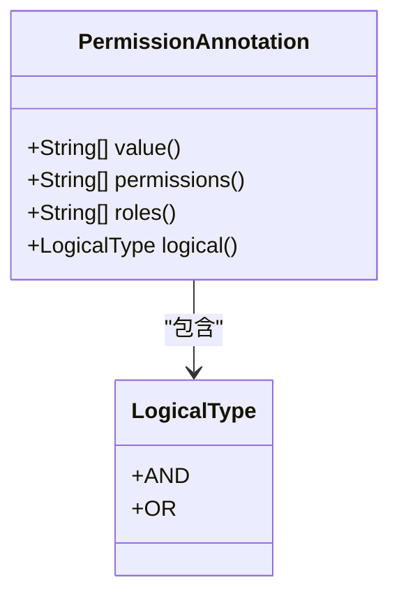
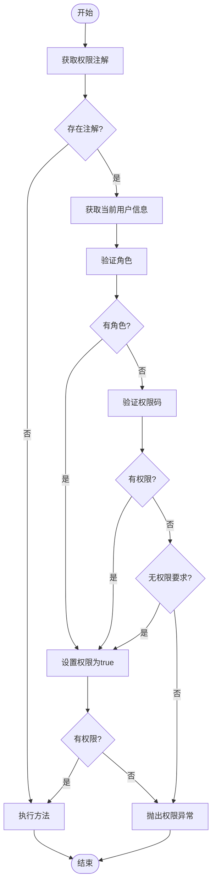
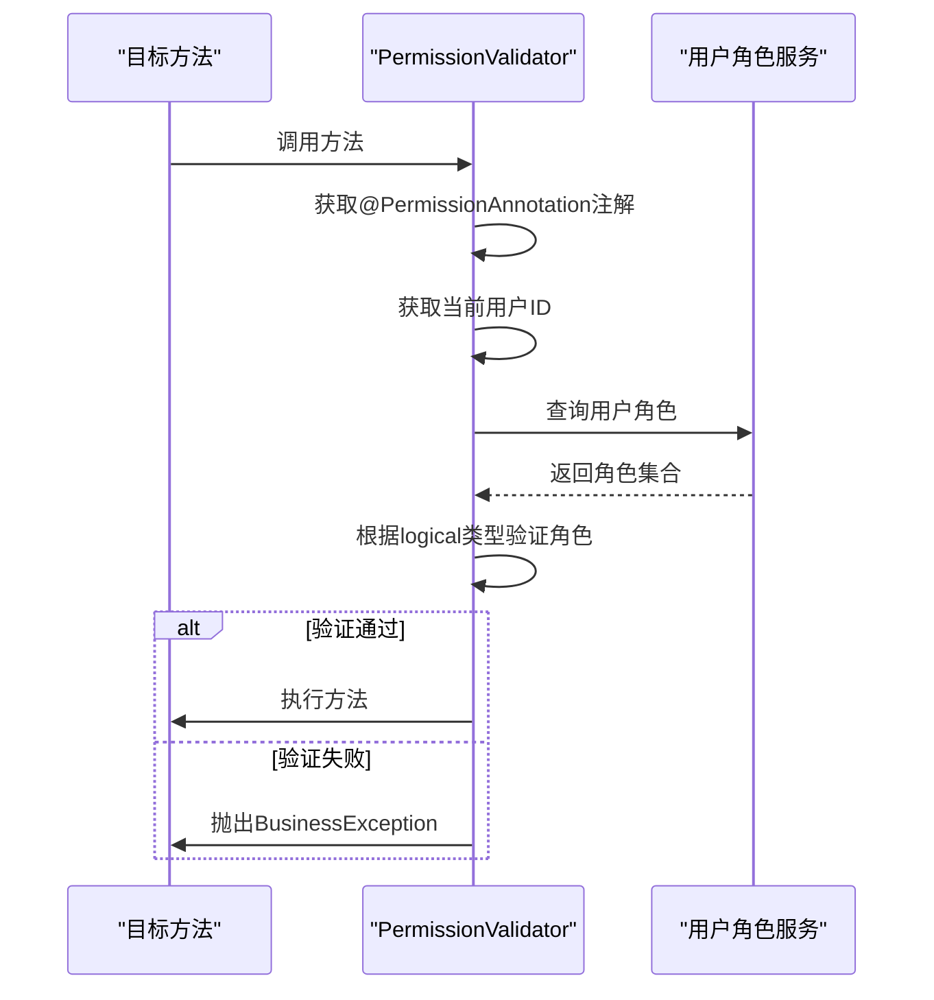
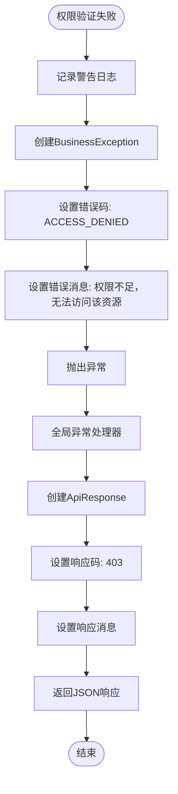

# 权限控制机制

<cite>
**本文档引用的文件**
- [PermissionAnnotation.java](file://08-backend/src/main/java/com/enterprise/brain/common/annotation/PermissionAnnotation.java)
- [PermissionValidator.java](file://08-backend/src/main/java/com/enterprise/brain/common/security/PermissionValidator.java)
- [BusinessException.java](file://08-backend/src/main/java/com/enterprise/brain/common/exception/BusinessException.java)
- [GlobalExceptionHandler.java](file://08-backend/src/main/java/com/enterprise/brain/common/exception/GlobalExceptionHandler.java)
- [ApiResponse.java](file://08-backend/src/main/java/com/enterprise/brain/common/response/ApiResponse.java)
</cite>

## 目录
1. [引言](#引言)
2. [@PermissionAnnotation注解设计与实现](#permissionannotation注解设计与实现)
3. [AOP切面权限验证流程](#aop切面权限验证流程)
4. [权限注解使用示例](#权限注解使用示例)
5. [权限验证失败处理机制](#权限验证失败处理机制)
6. [总结](#总结)

## 引言

本系统采用基于注解的权限控制机制，通过`@PermissionAnnotation`注解和AOP切面实现方法级别的权限验证。该机制支持角色和权限码的双重验证，并提供灵活的逻辑组合方式。本文档详细说明了权限控制机制的设计与实现，包括注解的属性含义、AOP切面的验证流程、使用示例以及异常处理机制。

## @PermissionAnnotation注解设计与实现

`@PermissionAnnotation`注解是权限控制的核心，用于在方法或类级别声明访问所需的权限要求。该注解定义了多个属性，支持灵活的权限配置。

### 注解属性说明

`@PermissionAnnotation`注解包含以下关键属性：

- **permissions**: 权限码数组，用于指定访问该方法所需的权限码
- **roles**: 角色数组，用于指定访问该方法所需的角色
- **logical**: 逻辑类型，定义权限验证的逻辑关系
- **value**: 权限码的别名，与permissions属性功能相同



**注解来源**
- [PermissionAnnotation.java](file://08-backend/src/main/java/com/enterprise/brain/common/annotation/PermissionAnnotation.java)

### 属性详细说明

**permissions属性**：用于指定访问该方法所需的权限码。权限码采用"模块:操作"的命名规范，如"system:user:view"表示系统模块的用户查看权限。可以指定多个权限码，通过logical属性定义验证逻辑。

**roles属性**：用于指定访问该方法所需的角色。角色是用户权限的集合，如"ADMIN"、"USER"等。与权限码类似，可以指定多个角色，并通过logical属性定义验证逻辑。

**logical属性**：定义权限验证的逻辑关系，支持两种逻辑类型：
- **AND**: 与逻辑，要求用户同时拥有所有指定的权限或角色
- **OR**: 或逻辑，要求用户拥有任意一个指定的权限或角色

当同时配置了permissions和roles时，系统会先验证角色，再验证权限码，只要其中一项验证通过即可访问。

## AOP切面权限验证流程

权限验证通过AOP切面`PermissionValidator`实现，采用环绕通知的方式拦截带有`@PermissionAnnotation`注解的方法调用。

### 权限验证流程图



**流程图来源**
- [PermissionValidator.java](file://08-backend/src/main/java/com/enterprise/brain/common/security/PermissionValidator.java#L31-L85)

### 验证逻辑详细说明

#### 角色验证逻辑

角色验证通过`validateRoles`方法实现，根据logical属性的值采用不同的验证策略：

- **AND逻辑**：使用`containsAll`方法检查用户角色集合是否包含所有要求的角色
- **OR逻辑**：遍历要求的角色数组，只要用户拥有任意一个角色即验证通过



**序列图来源**
- [PermissionValidator.java](file://08-backend/src/main/java/com/enterprise/brain/common/security/PermissionValidator.java#L95-L110)

#### 权限码验证逻辑

权限码验证通过`validatePermissions`方法实现，其逻辑与角色验证类似：

- **AND逻辑**：检查用户权限集合是否包含所有要求的权限码
- **OR逻辑**：遍历要求的权限码数组，只要用户拥有任意一个权限码即验证通过

权限码的命名采用分层结构，通常为"模块:子模块:操作"的形式，如"system:user:add"表示系统模块用户管理的添加操作权限。

### 核心验证方法

`validatePermission`是权限验证的入口方法，其执行流程如下：

1. 获取目标方法的`@PermissionAnnotation`注解
2. 获取当前用户信息（用户ID和用户名）
3. 验证角色要求
4. 验证权限码要求
5. 综合判断是否有访问权限
6. 根据验证结果决定是否执行方法或抛出异常

当没有配置任何权限要求时（即roles和permissions都为空），系统默认允许访问，这为不需要权限控制的方法提供了便利。

**核心方法来源**
- [PermissionValidator.java](file://08-backend/src/main/java/com/enterprise/brain/common/security/PermissionValidator.java#L31-L85)

## 权限注解使用示例

`@PermissionAnnotation`注解可以应用于控制器方法和业务服务方法，实现细粒度的权限控制。

### 控制器方法使用示例

在控制器方法上使用权限注解是最常见的场景，可以保护API接口的访问：

```java
@RestController
@RequestMapping("/api/system/user")
public class UserController {
    
    @Autowired
    private UserService userService;
    
    // 需要查看用户权限
    @PermissionAnnotation(permissions = "system:user:view")
    @GetMapping("/{id}")
    public User getUser(@PathVariable Long id) {
        return userService.getUserById(id);
    }
    
    // 需要添加用户权限
    @PermissionAnnotation(permissions = "system:user:add")
    @PostMapping
    public void createUser(@RequestBody User user) {
        userService.createUser(user);
    }
    
    // 需要编辑用户权限
    @PermissionAnnotation(permissions = "system:user:edit")
    @PutMapping("/{id}")
    public void updateUser(@PathVariable Long id, @RequestBody User user) {
        userService.updateUser(id, user);
    }
    
    // 需要删除用户权限
    @PermissionAnnotation(permissions = "system:user:delete")
    @DeleteMapping("/{id}")
    public void deleteUser(@PathVariable Long id) {
        userService.deleteUser(id);
    }
    
    // 需要管理员角色
    @PermissionAnnotation(roles = "ADMIN")
    @PostMapping("/batch-delete")
    public void batchDeleteUsers(@RequestBody List<Long> userIds) {
        userService.batchDeleteUsers(userIds);
    }
    
    // 需要同时拥有查看和编辑权限（AND逻辑）
    @PermissionAnnotation(
        permissions = {"system:user:view", "system:user:edit"}, 
        logical = PermissionAnnotation.LogicalType.AND
    )
    @GetMapping("/profile/{id}")
    public UserProfile getUserProfile(@PathVariable Long id) {
        return userService.getUserProfile(id);
    }
    
    // 需要拥有查看或编辑权限之一即可（OR逻辑）
    @PermissionAnnotation(
        permissions = {"system:user:view", "system:user:edit"}, 
        logical = PermissionAnnotation.LogicalType.OR
    )
    @GetMapping("/basic-info/{id}")
    public UserBasicInfo getUserBasicInfo(@PathVariable Long id) {
        return userService.getUserBasicInfo(id);
    }
}
```

### 业务服务方法使用示例

在业务服务方法上使用权限注解可以实现更细粒度的控制：

```java
@Service
public class FinanceService {
    
    @Autowired
    private AccountRepository accountRepository;
    
    // 财务报表生成需要财务主管角色或特定权限
    @PermissionAnnotation(
        roles = "FINANCE_MANAGER", 
        permissions = "finance:report:generate",
        logical = PermissionAnnotation.LogicalType.OR
    )
    public Report generateFinancialReport(ReportRequest request) {
        // 生成财务报表的业务逻辑
        return reportGenerator.generate(request);
    }
    
    // 资金转账需要双重验证：既需要角色又需要权限
    @PermissionAnnotation(
        roles = "FINANCE_STAFF",
        permissions = "finance:fund:transfer",
        logical = PermissionAnnotation.LogicalType.AND
    )
    @Transactional
    public TransferResult transferFunds(TransferRequest request) {
        // 资金转账的业务逻辑
        return fundTransferService.transfer(request);
    }
    
    // 查看账户余额只需要查看权限
    @PermissionAnnotation(permissions = "finance:account:view")
    public AccountBalance getAccountBalance(Long accountId) {
        return accountRepository.findBalanceById(accountId);
    }
}
```

### 类级别注解使用

`@PermissionAnnotation`也可以应用于类级别，为整个类的所有公共方法提供默认的权限要求：

```java
@PermissionAnnotation(roles = "ADMIN")
@RestController
@RequestMapping("/api/admin")
public class AdminController {
    
    // 此方法继承类级别的权限要求
    @GetMapping("/dashboard")
    public AdminDashboard getDashboard() {
        // 只有ADMIN角色可以访问
        return adminService.getDashboard();
    }
    
    // 此方法覆盖类级别的权限要求
    @PermissionAnnotation(permissions = "admin:monitor:view")
    @GetMapping("/monitor")
    public SystemMonitor getMonitor() {
        // 需要特定的监控查看权限
        return monitorService.getSystemStatus();
    }
}
```

**使用示例来源**
- [PermissionValidator.java](file://08-backend/src/main/java/com/enterprise/brain/common/security/PermissionValidator.java)
- [PermissionAnnotation.java](file://08-backend/src/main/java/com/enterprise/brain/common/annotation/PermissionAnnotation.java)

## 权限验证失败处理机制

当权限验证失败时，系统会抛出异常并返回标准化的错误响应，确保客户端能够正确处理权限不足的情况。

### 异常处理流程



**流程图来源**
- [PermissionValidator.java](file://08-backend/src/main/java/com/enterprise/brain/common/security/PermissionValidator.java#L74-L81)
- [GlobalExceptionHandler.java](file://08-backend/src/main/java/com/enterprise/brain/common/exception/GlobalExceptionHandler.java#L32-L37)

### 错误响应格式

权限验证失败时，系统返回标准化的JSON响应格式：

```json
{
  "code": "ACCESS_DENIED",
  "message": "权限不足，无法访问该资源",
  "data": null,
  "timestamp": 1700000000000,
  "success": false
}
```

响应包含以下字段：
- **code**: 错误码，用于程序化处理
- **message**: 错误消息，用于用户提示
- **data**: 数据，权限错误时为null
- **timestamp**: 时间戳，便于问题追踪
- **success**: 成功标识，权限错误时为false

### 前端处理建议

前端应用应根据权限错误进行适当的用户界面处理：

1. 捕获403状态码或ACCESS_DENIED错误码
2. 显示友好的错误提示信息
3. 根据情况隐藏或禁用相关功能按钮
4. 提供联系管理员申请权限的指引

```javascript
// 前端错误处理示例
api.request('/api/system/user/1')
  .then(response => {
    // 处理成功响应
  })
  .catch(error => {
    if (error.response?.data?.code === 'ACCESS_DENIED') {
      // 权限不足处理
      this.$message.warning('您没有权限访问该资源，请联系管理员申请权限');
      // 可以记录日志或进行其他处理
    } else {
      // 其他错误处理
      this.$message.error('请求失败：' + error.message);
    }
  });
```

**异常处理来源**
- [PermissionValidator.java](file://08-backend/src/main/java/com/enterprise/brain/common/security/PermissionValidator.java#L80-L81)
- [BusinessException.java](file://08-backend/src/main/java/com/enterprise/brain/common/exception/BusinessException.java)
- [GlobalExceptionHandler.java](file://08-backend/src/main/java/com/enterprise/brain/common/exception/GlobalExceptionHandler.java#L32-L37)
- [ApiResponse.java](file://08-backend/src/main/java/com/enterprise/brain/common/response/ApiResponse.java)

## 总结

本系统的基于注解的权限控制机制提供了灵活、可扩展的权限管理方案。通过`@PermissionAnnotation`注解和AOP切面的结合，实现了方法级别的细粒度权限控制。

### 核心优势

1. **声明式编程**：通过注解方式声明权限要求，无需在业务代码中嵌入权限验证逻辑
2. **灵活配置**：支持角色和权限码的双重验证，以及AND/OR逻辑组合
3. **易于维护**：权限配置集中管理，便于权限策略的调整和维护
4. **标准化响应**：统一的错误处理机制，确保前后端交互的一致性

### 最佳实践建议

1. **权限命名规范**：采用"模块:操作"的命名规范，保持权限码的一致性和可读性
2. **最小权限原则**：为每个功能分配最小必要的权限，避免权限过度授予
3. **合理使用逻辑类型**：根据业务需求选择合适的AND/OR逻辑，避免过于复杂的权限组合
4. **类级别与方法级别结合**：在类级别设置通用权限要求，在方法级别进行特殊配置
5. **完善的日志记录**：确保权限验证的日志记录完整，便于安全审计和问题排查

该权限控制机制为系统的安全性提供了有力保障，同时保持了良好的可维护性和扩展性。