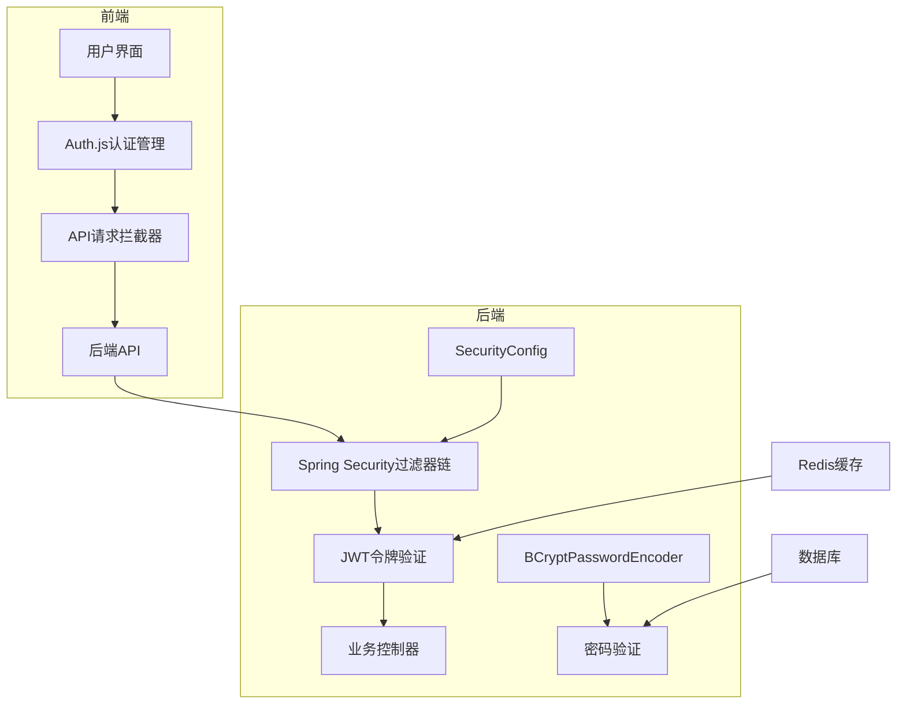
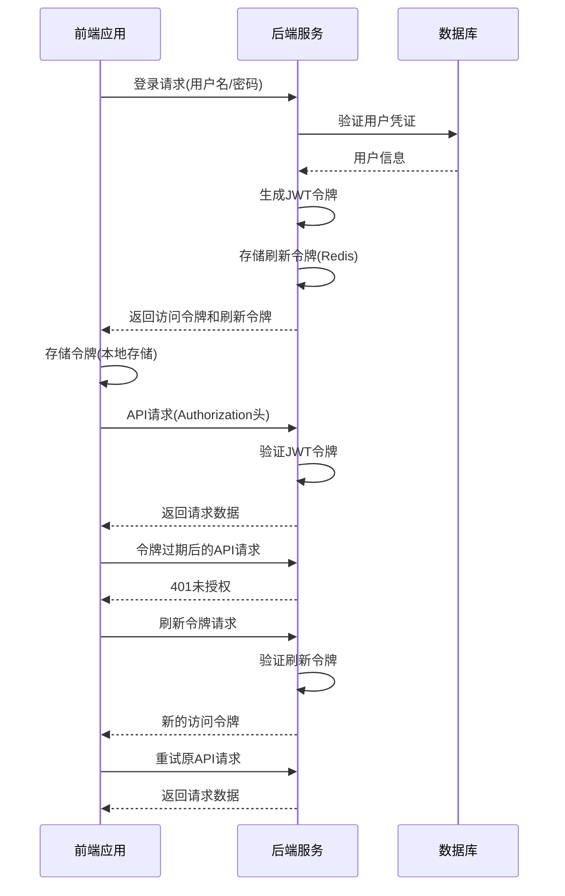

# 身份认证机制

<cite>
**本文档引用的文件**  
- [SecurityConfig.java](file://08-backend/src/main/java/com/enterprise/brain/common/config/SecurityConfig.java)
- [SecurityUtils.java](file://08-backend/src/main/java/com/enterprise/brain/common/security/SecurityUtils.java)
- [DataEncryptor.java](file://08-backend/src/main/java/com/enterprise/brain/common/security/DataEncryptor.java)
- [auth.js](file://07-frontend/src/services/utils/auth.js)
- [application.yml](file://08-backend/src/main/resources/application.yml)
- [Register.vue](file://07-frontend/src/pages/system/auth/Register.vue)
</cite>

## 目录
1. [系统架构概述](#系统架构概述)
2. [Spring Security无状态认证配置](#spring-security无状态认证配置)
3. [白名单路径配置](#白名单路径配置)
4. [密码编码器实现](#密码编码器实现)
5. [JWT令牌认证集成方案](#jwt令牌认证集成方案)
6. [前端认证管理机制](#前端认证管理机制)
7. [安全最佳实践](#安全最佳实践)

## 系统架构概述

本系统采用前后端分离架构，后端基于Spring Boot框架，前端使用Vue.js技术栈。身份认证机制主要通过Spring Security框架实现无状态认证，结合JWT（JSON Web Token）令牌进行用户身份验证和授权。

系统架构中，后端服务通过`SecurityConfig.java`配置类定义了完整的安全策略，包括CSRF防护、CORS配置、会话管理等。前端通过`auth.js`工具类管理用户认证状态、令牌存储和刷新机制。



**图示来源**  
- [SecurityConfig.java](file://08-backend/src/main/java/com/enterprise/brain/common/config/SecurityConfig.java)
- [auth.js](file://07-frontend/src/services/utils/auth.js)

## Spring Security无状态认证配置

系统通过`SecurityConfig.java`类配置了基于Spring Security的无状态认证机制。核心配置包括CSRF禁用、CORS配置和会话管理策略。

### CSRF防护配置

在基于Token的认证机制中，由于不依赖于Cookie进行身份验证，因此可以安全地禁用CSRF（跨站请求伪造）防护。这在`securityFilterChain`方法中通过`.csrf(AbstractHttpConfigurer::disable)`实现：

```java
http.csrf(AbstractHttpConfigurer::disable)
```

此配置禁用了CSRF防护，因为JWT令牌通过Authorization头传递，不受CSRF攻击的影响。

### CORS配置

系统配置了灵活的CORS（跨域资源共享）策略，允许来自任何源的请求，支持常见的HTTP方法和头部信息：

```java
@Bean
public CorsConfigurationSource corsConfigurationSource() {
    CorsConfiguration configuration = new CorsConfiguration();
    configuration.setAllowedOriginPatterns(Collections.singletonList("*"));
    configuration.setAllowedMethods(Arrays.asList("GET", "POST", "PUT", "DELETE", "OPTIONS", "PATCH"));
    configuration.setAllowedHeaders(Collections.singletonList("*"));
    configuration.setAllowCredentials(true);
    configuration.setMaxAge(3600L);

    UrlBasedCorsConfigurationSource source = new UrlBasedCorsConfigurationSource();
    source.registerCorsConfiguration("/**", configuration);
    return source;
}
```

此配置允许所有源的跨域请求，支持GET、POST、PUT、DELETE等HTTP方法，并允许携带凭证（cookies、HTTP认证等）。

### 会话管理策略

系统采用无状态会话管理策略，不依赖于服务器端的会话存储。这通过配置`SessionCreationPolicy.STATELESS`实现：

```java
.sessionManagement(session -> 
    session.sessionCreationPolicy(SessionCreationPolicy.STATELESS))
```

无状态会话策略的优势包括：
- 可扩展性：不依赖于服务器端会话存储，便于水平扩展
- 容错性：单个服务器故障不会影响用户会话
- 简化部署：无需配置会话复制或共享存储

**本节来源**  
- [SecurityConfig.java](file://08-backend/src/main/java/com/enterprise/brain/common/config/SecurityConfig.java#L47-L52)

## 白名单路径配置

系统定义了多个白名单路径，这些路径无需身份验证即可访问。白名单配置主要用于开发工具和系统监控接口。

### 白名单路径列表

在`SecurityConfig.java`中定义了以下白名单路径：

```java
private static final String[] WHITE_LIST = {
    "/v3/api-docs/**",
    "/swagger-ui/**",
    "/swagger-ui.html",
    "/webjars/**",
    "/error",
    "/actuator/**"
};
```

这些路径包括：
- **Swagger文档接口**：`/v3/api-docs/**`和`/swagger-ui/**`，用于API文档展示
- **Swagger UI页面**：`/swagger-ui.html`，提供交互式API测试界面
- **静态资源**：`/webjars/**`，包含Swagger等前端库的静态资源
- **错误处理**：`/error`，系统错误处理端点
- **监控端点**：`/actuator/**`，Spring Boot Actuator提供的应用监控接口

### 权限规则配置

白名单路径通过`requestMatchers(WHITE_LIST).permitAll()`配置为允许所有用户访问：

```java
.authorizeHttpRequests(auth -> auth
    .requestMatchers(WHITE_LIST).permitAll()
    .anyRequest().permitAll() // 暂时放开所有请求，生产环境需要配置具体权限
);
```

值得注意的是，当前配置中`anyRequest().permitAll()`将所有其他请求也设置为允许访问，这在生产环境中需要调整为更严格的权限控制策略。

**本节来源**  
- [SecurityConfig.java](file://08-backend/src/main/java/com/enterprise/brain/common/config/SecurityConfig.java#L34-L41)

## 密码编码器实现

系统采用BCrypt哈希算法进行密码加密存储，提供了安全的密码验证机制。

### BCryptPasswordEncoder配置

在`SecurityConfig.java`中配置了BCrypt密码编码器：

```java
@Bean
public PasswordEncoder passwordEncoder() {
    return new BCryptPasswordEncoder();
}
```

BCrypt是一种自适应哈希函数，具有以下优势：
- **盐值内置**：每个哈希值都包含唯一的随机盐值，防止彩虹表攻击
- **计算成本可调**：可以通过调整工作因子控制哈希计算的复杂度
- **广泛采用**：被广泛认为是安全的密码哈希算法

### 密码加密与验证

系统提供了多种密码处理方式，包括BCrypt和SHA256+盐值的组合：

#### BCrypt实现

`SecurityUtils.java`提供了基于BCrypt的密码加密和验证工具：

```java
public class SecurityUtils {
    private static final PasswordEncoder PASSWORD_ENCODER = new BCryptPasswordEncoder();

    public static String encryptPassword(String rawPassword) {
        return PASSWORD_ENCODER.encode(rawPassword);
    }

    public static boolean matchesPassword(String rawPassword, String encodedPassword) {
        return PASSWORD_ENCODER.matches(rawPassword, encodedPassword);
    }
}
```

#### SHA256+盐值实现

`DataEncryptor.java`提供了基于SHA256和盐值的密码加密方案：

```java
public String encryptPassword(String password, String salt) {
    String saltedPassword = password + salt;
    return encryptSHA256(saltedPassword);
}

public boolean verifyPassword(String inputPassword, String encryptedPassword, String salt) {
    String encrypted = encryptPassword(inputPassword, salt);
    return encrypted.equals(encryptedPassword);
}

public String generateSalt() {
    SecureRandom random = new SecureRandom();
    byte[] salt = new byte[16];
    random.nextBytes(salt);
    return bytesToHex(salt);
}
```

这种双重实现提供了灵活性，可以根据具体需求选择合适的密码加密策略。

**本节来源**  
- [SecurityConfig.java](file://08-backend/src/main/java/com/enterprise/brain/common/config/SecurityConfig.java#L65-L68)
- [SecurityUtils.java](file://08-backend/src/main/java/com/enterprise/brain/common/security/SecurityUtils.java#L17-L38)
- [DataEncryptor.java](file://08-backend/src/main/java/com/enterprise/brain/common/security/DataEncryptor.java#L200-L216)

## JWT令牌认证集成方案

虽然当前配置中尚未完全实现JWT认证，但代码中已预留了相应的集成点和最佳实践。

### JWT令牌生成

前端`auth.js`工具类提供了临时令牌生成功能，展示了JWT的基本结构：

```javascript
generateTempToken(data, expiry = 3600000) {
    const tokenData = {
        ...data,
        iat: Date.now() / 1000,
        exp: (Date.now() + expiry) / 1000
    };
    
    const encodedData = btoa(JSON.stringify(tokenData));
    return `temp_${encodedData}`;
}
```

标准的JWT令牌应包含三个部分：
- **Header**：包含令牌类型和哈希算法
- **Payload**：包含声明（claims），如用户ID、角色、过期时间等
- **Signature**：用于验证令牌的完整性

### JWT令牌验证

前端提供了令牌验证机制，包括解码和过期检查：

```javascript
decodeToken(token) {
    try {
        const base64Url = token.split('.')[1];
        const base64 = base64Url.replace(/-/g, '+').replace(/_/g, '/');
        const jsonPayload = decodeURIComponent(
            atob(base64)
                .split('')
                .map(c => `%${(`00${c.charCodeAt(0).toString(16)}`).slice(-2)}`)
                .join('')
        );
        
        return JSON.parse(jsonPayload);
    } catch (e) {
        console.error('Failed to decode token:', e);
        return null;
    }
}
```

### 令牌刷新机制

系统实现了完善的令牌刷新机制，处理令牌过期和刷新流程：

```javascript
async refreshToken(refreshFn) {
    if (this.refreshTokenLock) {
        return new Promise((resolve, reject) => {
            this.refreshTokenQueue.push({ resolve, reject });
        });
    }
    
    try {
        this.refreshTokenLock = true;
        const refreshToken = this.getRefreshToken();
        
        const result = await refreshFn(refreshToken);
        this.setAuthData(result);
        
        this.refreshTokenQueue.forEach(({ resolve }) => resolve(result));
        this.refreshTokenQueue = [];
        
        return result;
    } catch (error) {
        this.refreshTokenQueue.forEach(({ reject }) => reject(error));
        this.refreshTokenQueue = [];
        
        this.clearAuthData();
        throw error;
    } finally {
        this.refreshTokenLock = false;
    }
}
```

该机制的特点包括：
- **刷新锁**：防止多个并发刷新请求
- **请求队列**：将等待中的请求加入队列，待刷新完成后统一处理
- **错误处理**：刷新失败时清空认证数据并触发登出

### 最佳实践建议

基于现有代码结构，建议的JWT集成最佳实践包括：

1. **后端JWT过滤器**：实现`OncePerRequestFilter`，在每次请求时验证JWT令牌
2. **令牌存储**：使用Redis存储刷新令牌，便于管理和撤销
3. **权限控制**：结合`@PreAuthorize`注解实现细粒度的权限控制
4. **安全配置**：在生产环境中启用CSRF防护，并配置更严格的CORS策略



**图示来源**  
- [auth.js](file://07-frontend/src/services/utils/auth.js#L508-L552)
- [SecurityConfig.java](file://08-backend/src/main/java/com/enterprise/brain/common/config/SecurityConfig.java)

## 前端认证管理机制

前端通过`auth.js`类实现了完整的认证管理功能，包括状态管理、令牌存储和API集成。

### 认证状态管理

`Auth`类维护了用户认证相关的各种状态：

```javascript
constructor() {
    this.config = {
        tokenKey: 'auth_token',
        refreshTokenKey: 'refresh_token',
        userDataKey: 'user_data',
        sessionKey: 'session_info',
        expiryKey: 'token_expiry',
        storageType: 'localStorage'
    };
    
    this.storage = this._createStorage();
    this.refreshTokenLock = false;
    this.refreshTokenQueue = [];
    this.authStateListeners = new Set();
}
```

关键配置项包括：
- **存储方式**：支持localStorage、sessionStorage和cookie
- **令牌前缀**："Bearer "，符合标准认证头格式
- **自动刷新**：提前5分钟刷新即将过期的令牌

### 过期检测机制

系统实现了定时过期检测，确保在令牌过期前自动刷新：

```javascript
_initExpiryCheck() {
    this.expiryCheckInterval = setInterval(() => {
        if (this.config.autoRefresh && this.isAuthenticated()) {
            const expiryTime = this.getTokenExpiry();
            if (expiryTime) {
                const timeUntilExpiry = expiryTime - Date.now();
                if (timeUntilExpiry > 0 && timeUntilExpiry < this.config.refreshBeforeExpiry) {
                    this.refreshToken().catch(() => {
                        // 刷新失败可以在这里处理
                    });
                }
            }
        }
    }, 60000);
}
```

每分钟检查一次令牌状态，当剩余有效期小于5分钟时触发刷新。

### API集成

`auth.js`提供了API请求和响应拦截器，无缝集成到应用的HTTP客户端中：

```javascript
createRequestInterceptor() {
    return (config) => {
        const token = this.getToken(true);
        if (token) {
            config.headers = { ...config.headers, ...this.getAuthHeader() };
        }
        return config;
    };
}

createResponseInterceptor(refreshFn) {
    return async (response) => {
        if (response.status === 401) {
            try {
                await this.refreshToken(refreshFn);
                return { ...response, _needRetry: true };
            } catch (error) {
                this.logout();
                throw new Error('Authentication required');
            }
        }
        
        return response;
    };
}
```

这种拦截器模式确保了：
- **请求自动认证**：所有请求自动携带认证头
- **错误自动处理**：401错误自动触发令牌刷新
- **请求重试**：刷新成功后自动重试原请求

**本节来源**  
- [auth.js](file://07-frontend/src/services/utils/auth.js)

## 安全最佳实践

基于系统现有配置和行业标准，以下是身份认证机制的最佳实践建议。

### 生产环境配置建议

当前配置中存在一些开发环境的宽松设置，生产环境应进行以下调整：

1. **严格权限控制**：将`anyRequest().permitAll()`改为基于角色的精细权限控制
2. **CORS限制**：将`allowedOriginPatterns`从`"*"`改为具体的可信域名列表
3. **CSRF启用**：对于表单提交等场景，考虑启用CSRF防护
4. **HTTPS强制**：确保所有认证相关接口仅通过HTTPS访问

### 多因素认证支持

系统已具备支持多因素认证的基础：

```javascript
// 在rules/auth-web/rule.md中定义了验证码流程
const verification = await auth.getVerification({ phone_number: phoneNumber });
const verificationTokenRes = await auth.verify({
    verification_id: verification.verification_id,
    verification_code: verificationCode,
});
```

建议实现：
- **短信验证码**：用于手机号注册和登录
- **邮箱验证**：用于账户安全验证
- **TOTP**：基于时间的一次性密码，提高安全性

### 安全监控与审计

系统应加强安全事件的监控和审计：

1. **登录审计**：记录所有登录尝试，包括成功和失败
2. **异常检测**：检测频繁失败的登录尝试，防止暴力破解
3. **会话管理**：提供用户当前活跃会话列表，支持会话撤销
4. **安全通知**：在关键操作（如密码修改）后发送安全通知

### 性能优化建议

1. **令牌缓存**：在Redis中缓存已验证的JWT令牌，减少重复验证开销
2. **异步处理**：将安全审计日志等操作异步化，避免影响主流程性能
3. **连接池优化**：合理配置数据库和Redis连接池，提高并发处理能力

**本节来源**  
- [SecurityConfig.java](file://08-backend/src/main/java/com/enterprise/brain/common/config/SecurityConfig.java)
- [application.yml](file://08-backend/src/main/resources/application.yml)
- [rules/auth-web/rule.md](file://rules/auth-web/rule.md)