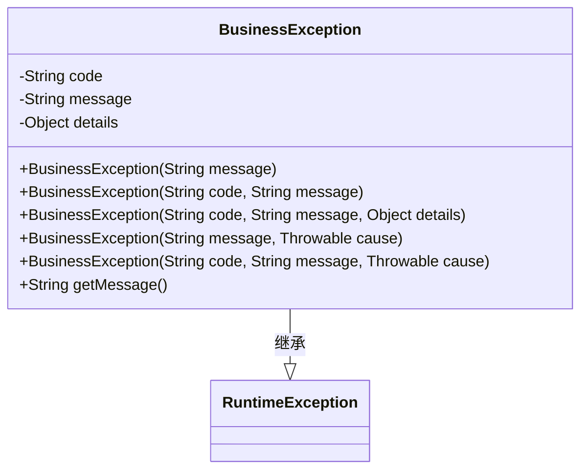
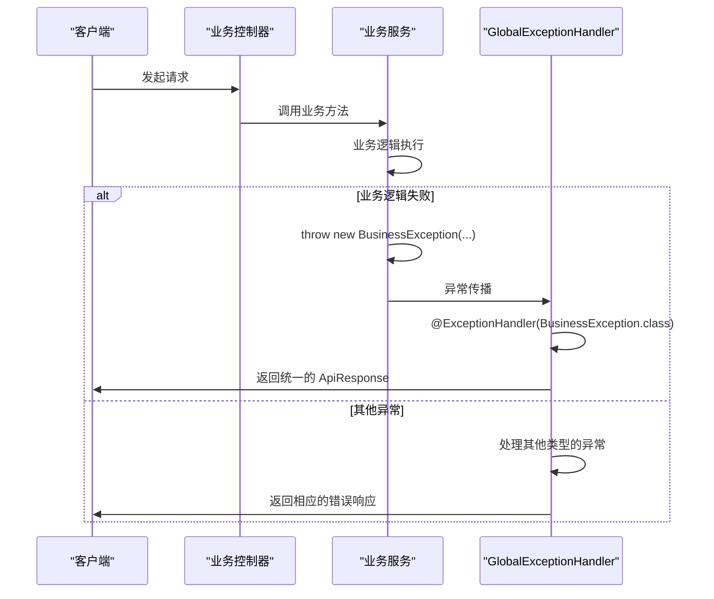
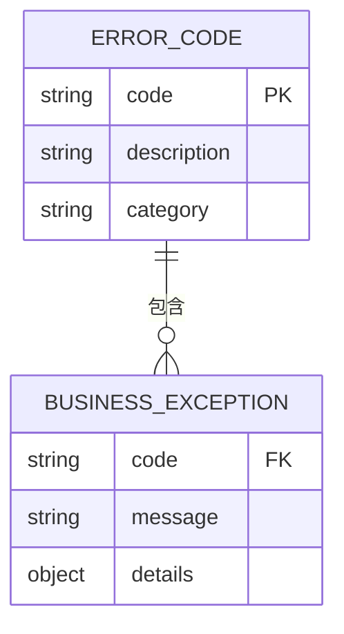
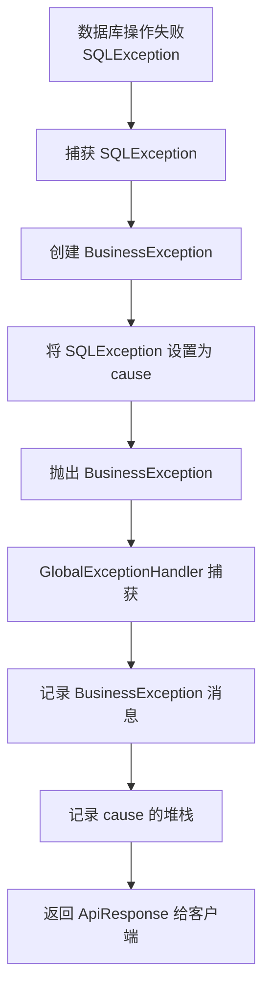

# 业务异常定义与使用

<cite>
**本文档引用的文件**   
- [BusinessException.java](file://08-backend/src/main/java/com/enterprise/brain/common/exception/BusinessException.java)
- [GlobalExceptionHandler.java](file://08-backend/src/main/java/com/enterprise/brain/common/exception/GlobalExceptionHandler.java)
- [ErrorCode.java](file://08-backend/src/main/java/com/enterprise/brain/common/constants/ErrorCode.java)
- [ApiResponse.java](file://08-backend/src/main/java/com/enterprise/brain/common/response/ApiResponse.java)
- [ValidationUtils.java](file://08-backend/src/main/java/com/enterprise/brain/common/validation/ValidationUtils.java)
- [PermissionValidator.java](file://08-backend/src/main/java/com/enterprise/brain/common/security/PermissionValidator.java)
- [BusinessConstants.java](file://08-backend/src/main/java/com/enterprise/brain/common/constants/BusinessConstants.java)
</cite>

## 目录
1. [业务异常设计原理](#业务异常设计原理)
2. [核心组件分析](#核心组件分析)
3. [业务异常在服务层的应用](#业务异常在服务层的应用)
4. [异常链式传递与上下文信息添加](#异常链式传递与上下文信息添加)
5. [实际业务场景应用](#实际业务场景应用)
6. [最佳实践总结](#最佳实践总结)

## 业务异常设计原理

业务异常（BusinessException）是系统中用于处理业务逻辑错误的核心异常类。它继承自RuntimeException，这种设计选择具有重要的架构意义和实际优势。

通过继承RuntimeException，业务异常成为非检查异常（unchecked exception），这意味着开发者不需要在方法签名中显式声明或捕获这些异常。这种设计减轻了调用方的负担，避免了代码中充斥着大量的try-catch块，使业务代码更加简洁和专注。同时，它允许异常在调用栈中自然传播，直到被全局异常处理器捕获和处理。

业务异常的设计遵循了清晰的错误处理原则，包含三个关键属性：错误码（code）、错误消息（message）和详细信息（details）。这种结构化的错误信息设计使得错误既对用户友好，又便于开发人员进行问题定位和日志分析。

**本节来源**
- [BusinessException.java](file://08-backend/src/main/java/com/enterprise/brain/common/exception/BusinessException.java#L14-L68)
- [GlobalExceptionHandler.java](file://08-backend/src/main/java/com/enterprise/brain/common/exception/GlobalExceptionHandler.java#L32-L37)

## 核心组件分析

### BusinessException 类设计

`BusinessException` 类是整个业务异常体系的核心，其设计精巧且功能完备。该类继承自 `RuntimeException`，并使用 Lombok 注解（`@Data` 和 `@EqualsAndHashCode`）来简化代码，自动生成 getter、setter、equals、hashCode 和 toString 方法。



**图示来源**
- [BusinessException.java](file://08-backend/src/main/java/com/enterprise/brain/common/exception/BusinessException.java#L14-L68)

#### 构造函数设计意图

`BusinessException` 提供了多个构造函数，以满足不同的使用场景，体现了良好的设计灵活性：

1.  **`BusinessException(String message)`**：最简单的构造方式，适用于快速抛出一个带有描述性消息的异常。此时错误码（code）会被默认设置为 `"BUSINESS_ERROR"`。
2.  **`BusinessException(String code, String message)`**：这是最常用的构造方式。它允许开发者指定一个唯一的错误码和一条用户友好的错误消息。错误码用于程序化处理和日志追踪，而消息则直接展示给用户。
3.  **`BusinessException(String code, String message, Object details)`**：在前一个构造函数的基础上增加了 `details` 字段。这个字段可以携带任何与错误相关的上下文信息，如无效的输入数据、受影响的记录ID等，极大地增强了问题诊断能力。
4.  **`BusinessException(String message, Throwable cause)`** 和 **`BusinessException(String code, String message, Throwable cause)`**：这两个构造函数用于包装底层异常。它们允许将技术性异常（如数据库异常）转换为业务异常，同时保留原始异常的堆栈信息，形成异常链，便于追溯根本原因。

### 全局异常处理器

`GlobalExceptionHandler` 是Spring框架提供的 `@RestControllerAdvice` 注解实现的全局异常处理器。它负责捕获应用中抛出的所有未处理异常，并将其转换为统一的、友好的API响应。



**图示来源**
- [GlobalExceptionHandler.java](file://08-backend/src/main/java/com/enterprise/brain/common/exception/GlobalExceptionHandler.java#L32-L37)
- [ApiResponse.java](file://08-backend/src/main/java/com/enterprise/brain/common/response/ApiResponse.java#L77-L92)

当 `GlobalExceptionHandler` 捕获到 `BusinessException` 时，它会调用 `handleBusinessException` 方法。该方法首先将异常信息记录到日志中（包含错误消息和请求URI），然后利用 `ApiResponse.fail()` 方法创建一个失败的响应对象，该对象包含了异常的错误码和消息，并通过HTTP 200状态码返回给客户端。这种设计确保了即使发生错误，API的响应格式也是一致的，便于前端解析。

### 错误码常量体系

`ErrorCode` 类是一个工具类，它集中定义了系统中所有可能的错误码。这些错误码采用分层的数字编码方案，便于分类和管理：

-   **1xxxx**: 通用错误码
-   **2xxxx**: 参数错误码
-   **3xxxx**: 认证授权错误码
-   **4xxxx**: 数据错误码
-   **5xxxx**: 业务错误码
-   **6xxxx**: 文件错误码
-   **7xxxx**: 网络错误码
-   **8xxxx**: 第三方服务错误码
-   **9xxxx**: 缓存错误码



**图示来源**
- [ErrorCode.java](file://08-backend/src/main/java/com/enterprise/brain/common/constants/ErrorCode.java#L11-L69)

这种设计确保了错误码的唯一性和可读性。例如，`INSUFFICIENT_STOCK` 的错误码是 `"50003"`，其中 `5` 代表业务错误，`0003` 是其在业务错误类别中的唯一编号。这使得开发人员和运维人员能够快速识别错误的类型和来源。

## 业务异常在服务层的应用

在服务层（Service Layer）中抛出业务异常是最佳实践，它将业务规则的验证与异常处理紧密结合。

### 库存不足场景

在处理订单创建或商品出库时，必须检查库存是否充足。如果库存不足，则应抛出带有特定错误码的业务异常。

```java
// 伪代码示例
public void createOrder(Order order) {
    for (OrderItem item : order.getItems()) {
        Product product = productRepository.findById(item.getProductId());
        if (product.getStock() < item.getQuantity()) {
            // 抛出业务异常，携带错误码和具体信息
            throw new BusinessException(
                ErrorCode.INSUFFICIENT_STOCK, 
                "商品【" + product.getName() + "】库存不足，当前库存：" + product.getStock() + "，请求数量：" + item.getQuantity(),
                Map.of("productId", product.getId(), "availableStock", product.getStock(), "requestedStock", item.getQuantity())
            );
        }
    }
    // 继续执行创建订单的逻辑
}
```

### 订单状态冲突场景

订单的生命周期包含多个状态（如待支付、已支付、已发货、已完成）。在执行某些操作（如发货）时，必须验证订单的当前状态是否允许该操作。

```java
// 伪代码示例
public void shipOrder(Long orderId) {
    Order order = orderRepository.findById(orderId);
    if (!OrderStatus.PAID.equals(order.getStatus())) {
        throw new BusinessException(
            ErrorCode.ORDER_STATUS_ERROR,
            "订单状态为【" + order.getStatus() + "】，无法执行发货操作。发货操作仅允许在【已支付】状态下进行。"
        );
    }
    // 更新订单状态为“已发货”
    order.setStatus(OrderStatus.SHIPPED);
    orderRepository.save(order);
}
```

### 参数验证场景

在服务方法的入口处，对输入参数进行严格的验证是防止错误蔓延的关键。`ValidationUtils` 工具类封装了常用的验证逻辑，当验证失败时，会直接抛出 `BusinessException`。

```java
// 伪代码示例
public void updateUserProfile(Long userId, UserProfile profile) {
    ValidationUtils.notNull(profile, "用户资料");
    ValidationUtils.notBlank(profile.getEmail(), "邮箱", 5, 50);
    ValidationUtils.validEmail(profile.getEmail(), "邮箱");
    
    // 如果验证失败，上述方法会抛出 BusinessException，后续代码不会执行
    userRepository.updateUserProfile(userId, profile);
}
```

**本节来源**
- [BusinessException.java](file://08-backend/src/main/java/com/enterprise/brain/common/exception/BusinessException.java#L39-L49)
- [ErrorCode.java](file://08-backend/src/main/java/com/enterprise/brain/common/constants/ErrorCode.java#L54-L55)
- [BusinessConstants.java](file://08-backend/src/main/java/com/enterprise/brain/common/constants/BusinessConstants.java#L14-L34)
- [ValidationUtils.java](file://08-backend/src/main/java/com/enterprise/brain/common/validation/ValidationUtils.java#L34-L210)

## 异常链式传递与上下文信息添加

### 异常链式传递

异常链式传递是指在捕获一个异常后，将其作为“原因”（cause）包装到一个新的异常中并重新抛出。这在 `BusinessException` 的构造函数中得到了完美支持。



**图示来源**
- [BusinessException.java](file://08-backend/src/main/java/com/enterprise/brain/common/exception/BusinessException.java#L52-L62)

这种模式的优势在于：
1.  **信息完整性**：保留了底层异常的完整堆栈跟踪，便于开发人员定位问题根源。
2.  **关注点分离**：向客户端暴露的是清晰的业务错误，而技术细节被封装在异常链中，只有需要时才可查看。

### 上下文信息添加

`details` 字段是 `BusinessException` 的一个强大特性，它允许开发者在抛出异常时附加任意的上下文信息。

```java
// 伪代码示例
try {
    paymentService.processPayment(order);
} catch (PaymentException e) {
    // 将支付异常包装为业务异常，并添加订单上下文
    Map<String, Object> context = new HashMap<>();
    context.put("orderId", order.getId());
    context.put("orderAmount", order.getTotalAmount());
    context.put("paymentMethod", order.getPaymentMethod());
    context.put("originalError", e.getMessage());
    
    throw new BusinessException(ErrorCode.PAYMENT_FAILED, "订单支付失败", context, e);
}
```

这些附加的上下文信息对于问题排查至关重要。日志系统可以将 `details` 字段序列化为JSON，使得运维人员能够快速了解发生错误时的完整业务场景，而无需查阅多个日志文件。

**本节来源**
- [BusinessException.java](file://08-backend/src/main/java/com/enterprise/brain/common/exception/BusinessException.java#L45-L50)
- [GlobalExceptionHandler.java](file://08-backend/src/main/java/com/enterprise/brain/common/exception/GlobalExceptionHandler.java#L35-L36)

## 实际业务场景应用

### 订单处理流程

在一个典型的订单处理流程中，业务异常贯穿始终：

1.  **创建订单**：验证用户、商品、库存、价格等。若库存不足，抛出 `INSUFFICIENT_STOCK` 异常。
2.  **支付订单**：调用支付网关。若支付失败，抛出 `PAYMENT_FAILED` 异常。
3.  **发货订单**：验证订单状态。若订单未支付，抛出 `ORDER_STATUS_ERROR` 异常。
4.  **完成订单**：验证订单状态和收货信息。若信息不全，抛出 `PARAMETER_MISSING` 异常。

每个环节的异常都会被 `GlobalExceptionHandler` 捕获，并转换为统一的JSON响应，前端可以根据错误码 `code` 来决定如何向用户展示错误信息。

### 库存管理场景

在库存同步或盘点等复杂操作中，可能会出现部分成功的情况。此时，可以设计一个响应对象（如 `InventorySyncResponse`），它内部可以包含一个 `errorList`。

```java
// 伪代码示例
public InventorySyncResponse syncInventory(List<InventoryItem> items) {
    InventorySyncResponse response = new InventorySyncResponse();
    response.setTotalItems(items.size());
    
    for (InventoryItem item : items) {
        try {
            inventoryService.updateStock(item);
            response.incrementSuccessCount();
        } catch (BusinessException e) {
            // 不中断整个流程，而是记录单个错误
            response.addError(item.getProductId(), e.getCode(), e.getMessage());
        }
    }
    
    return response;
}
```

这种方式允许系统在遇到部分错误时继续处理其他数据，并在最终响应中报告所有失败项，提供了更精细的错误处理能力。

**本节来源**
- [ErrorCode.java](file://08-backend/src/main/java/com/enterprise/brain/common/constants/ErrorCode.java#L51-L69)
- [BusinessConstants.java](file://08-backend/src/main/java/com/enterprise/brain/common/constants/BusinessConstants.java#L14-L34)
- [OrderSyncResponse.java](file://08-backend/src/main/java/com/enterprise/brain/modules/integration/ecommerce/dto/response/OrderSyncResponse.java#L167-L185)

## 最佳实践总结

1.  **使用预定义的错误码**：始终使用 `ErrorCode` 类中定义的常量，避免在代码中硬编码错误码字符串。
2.  **提供用户友好的消息**：错误消息应清晰、简洁，并直接告诉用户问题所在以及可能的解决方案。
3.  **在服务层抛出异常**：将业务规则的验证放在服务层，并在验证失败时立即抛出 `BusinessException`。
4.  **善用 `details` 字段**：在抛出异常时，尽可能提供有助于问题诊断的上下文信息。
5.  **利用异常链**：当包装底层异常时，务必使用带有 `cause` 参数的构造函数，以保留完整的错误堆栈。
6.  **避免过度使用**：业务异常应用于处理预期的、可恢复的业务错误，而不应用于控制正常的程序流程。

通过遵循这些最佳实践，可以构建一个健壮、可维护且用户体验良好的系统。

**本节来源**
- [BusinessException.java](file://08-backend/src/main/java/com/enterprise/brain/common/exception/BusinessException.java)
- [GlobalExceptionHandler.java](file://08-backend/src/main/java/com/enterprise/brain/common/exception/GlobalExceptionHandler.java)
- [ErrorCode.java](file://08-backend/src/main/java/com/enterprise/brain/common/constants/ErrorCode.java)