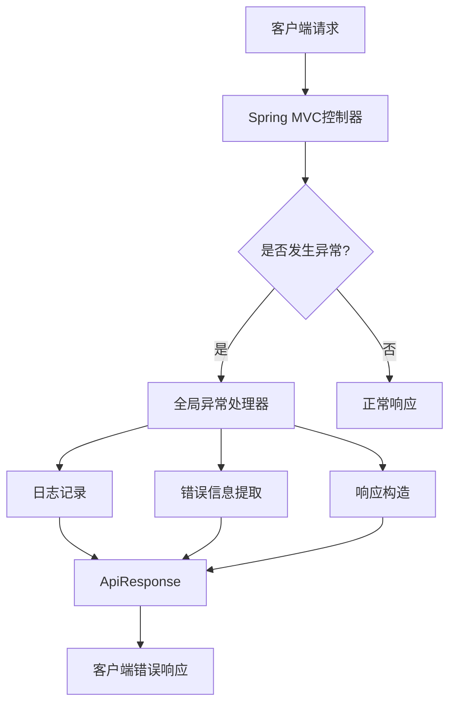
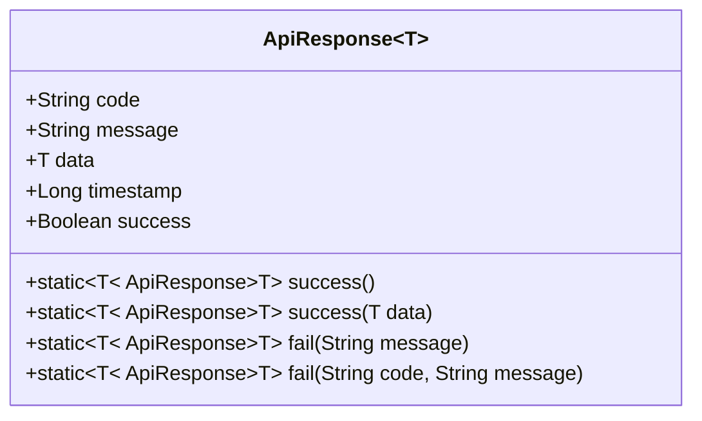
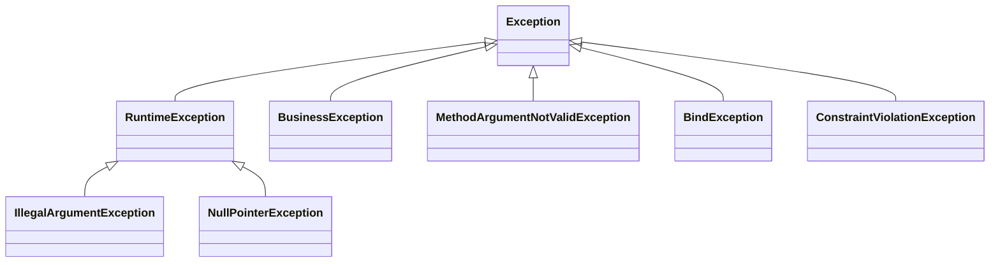

# 全局异常处理机制

<cite>
**本文档引用文件**  
- [GlobalExceptionHandler.java](file://08-backend/src/main/java/com/enterprise/brain/common/exception/GlobalExceptionHandler.java)
- [BusinessException.java](file://08-backend/src/main/java/com/enterprise/brain/common/exception/BusinessException.java)
- [ApiResponse.java](file://08-backend/src/main/java/com/enterprise/brain/common/response/ApiResponse.java)
- [ErrorResponse.java](file://08-backend/src/main/java/com/enterprise/brain/common/exception/ErrorResponse.java)
- [ErrorCode.java](file://08-backend/src/main/java/com/enterprise/brain/common/response/ErrorCode.java)
- [ValidationUtils.java](file://08-backend/src/main/java/com/enterprise/brain/common/validation/ValidationUtils.java)
</cite>

## 目录
1. [引言](#引言)
2. [全局异常处理架构](#全局异常处理架构)
3. [核心组件分析](#核心组件分析)
4. [异常处理策略详解](#异常处理策略详解)
5. [异常优先级与继承关系](#异常优先级与继承关系)
6. [自定义异常扩展方法](#自定义异常扩展方法)
7. [异常处理流程示例](#异常处理流程示例)
8. [最佳实践与建议](#最佳实践与建议)

## 引言
全局异常处理是企业级应用中至关重要的组成部分，它确保了系统在出现异常情况时能够提供一致、友好且安全的错误响应。本文档深入解析`GlobalExceptionHandler.java`中的全局异常处理机制，详细阐述各类异常的捕获策略、处理逻辑以及扩展方法，为开发者提供全面的异常处理指导。

## 全局异常处理架构



**图表来源**  
- [GlobalExceptionHandler.java](file://08-backend/src/main/java/com/enterprise/brain/common/exception/GlobalExceptionHandler.java#L25-L118)

## 核心组件分析

### @RestControllerAdvice注解的作用与优势

`@RestControllerAdvice`是Spring框架提供的一个强大的注解，它结合了`@ControllerAdvice`和`@ResponseBody`的功能，为全局异常处理提供了基础支持。

**主要作用：**
- **全局性**：该注解标记的类会自动应用于所有控制器，无需在每个控制器中单独配置异常处理逻辑。
- **统一响应**：自动将返回值转换为JSON格式，与RESTful API的响应格式保持一致。
- **集中管理**：所有异常处理逻辑集中在单一类中，便于维护和管理。

**核心优势：**
- **代码简洁性**：避免了在每个控制器中重复编写异常处理代码，提高了代码的可读性和可维护性。
- **一致性保障**：确保所有异常都通过统一的渠道处理，返回格式和错误码保持一致。
- **灵活性**：支持对不同类型的异常进行精细化处理，同时保留了扩展自定义异常处理逻辑的能力。

**组件来源**  
- [GlobalExceptionHandler.java](file://08-backend/src/main/java/com/enterprise/brain/common/exception/GlobalExceptionHandler.java#L26)

### ApiResponse统一响应结构

`ApiResponse`类是系统中所有响应的统一包装器，它定义了标准的响应格式，确保前后端交互的一致性。

**核心属性：**
- **code**：响应码，用于标识请求结果的状态（如200表示成功，500表示系统错误）。
- **message**：响应消息，提供对结果的文本描述。
- **data**：响应数据，携带实际的业务数据或错误详情。
- **timestamp**：时间戳，记录响应生成的时间。
- **success**：成功标识，布尔值，明确指示请求是否成功。

**设计优势：**
- **标准化**：所有接口返回相同结构，前端可以统一处理。
- **可扩展性**：通过泛型支持不同类型的数据返回。
- **易用性**：提供了静态工厂方法（如`success()`、`fail()`），简化了响应对象的创建。



**图表来源**  
- [ApiResponse.java](file://08-backend/src/main/java/com/enterprise/brain/common/response/ApiResponse.java#L15-L106)

**组件来源**  
- [ApiResponse.java](file://08-backend/src/main/java/com/enterprise/brain/common/response/ApiResponse.java#L15-L106)

## 异常处理策略详解

### BusinessException业务异常处理

`BusinessException`是系统自定义的业务异常，用于表示业务逻辑层面的错误，如权限不足、资源不存在等。

**处理逻辑：**
1. **日志记录**：使用`log.error`记录异常的详细信息，包括错误消息和请求URI，便于问题追踪。
2. **响应构造**：调用`ApiResponse.fail(e.getCode(), e.getMessage())`，将异常的错误码和消息直接返回给客户端。

**特点：**
- **可控性**：错误码和消息由业务代码精确控制，能够提供清晰的错误原因。
- **友好性**：不会暴露系统内部细节，提升用户体验。

```java
@ExceptionHandler(BusinessException.class)
@ResponseStatus(HttpStatus.OK)
public ApiResponse<Object> handleBusinessException(BusinessException e, HttpServletRequest request) {
    log.error("业务异常: {} - URI: {}", e.getMessage(), request.getRequestURI(), e);
    return ApiResponse.fail(e.getCode(), e.getMessage());
}
```

**组件来源**  
- [GlobalExceptionHandler.java](file://08-backend/src/main/java/com/enterprise/brain/common/exception/GlobalExceptionHandler.java#L32-L37)
- [BusinessException.java](file://08-backend/src/main/java/com/enterprise/brain/common/exception/BusinessException.java#L14-L68)

### MethodArgumentNotValidException参数校验异常处理

此异常由`@Valid`注解触发，当DTO对象的字段校验失败时抛出。

**处理逻辑：**
1. **信息提取**：从`MethodArgumentNotValidException`的`BindingResult`中获取所有`FieldError`，提取其默认消息。
2. **消息拼接**：使用`Collectors.joining("; ")`将多个字段的错误消息合并为一个字符串。
3. **日志与响应**：记录错误摘要，并返回统一的验证错误响应。

**优势：**
- **批量反馈**：一次性返回所有校验失败的字段，提高调试效率。
- **简洁性**：不暴露具体的字段名，保护数据结构。

```java
@ExceptionHandler(MethodArgumentNotValidException.class)
@ResponseStatus(HttpStatus.BAD_REQUEST)
public ApiResponse<Object> handleMethodArgumentNotValidException(MethodArgumentNotValidException e) {
    String message = e.getBindingResult().getFieldErrors().stream()
            .map(FieldError::getDefaultMessage)
            .collect(Collectors.joining("; "));
    log.error("参数校验失败: {}", message, e);
    return ApiResponse.fail("VALIDATION_ERROR", message);
}
```

**组件来源**  
- [GlobalExceptionHandler.java](file://08-backend/src/main/java/com/enterprise/brain/common/exception/GlobalExceptionHandler.java#L42-L50)

### BindException参数绑定异常处理

`BindException`通常在表单数据绑定到对象时发生，与`MethodArgumentNotValidException`类似，但处理方式略有不同。

**处理逻辑：**
1. **字段级信息**：不仅提取错误消息，还包含出错的字段名（`error.getField()`）。
2. **格式化输出**：将字段名和错误消息组合成`字段名: 错误消息`的格式。
3. **合并返回**：同样使用分号分隔所有错误。

**特点：**
- **信息更丰富**：客户端可以知道具体是哪个字段出了问题。
- **适用场景**：更适合需要精确反馈的表单提交场景。

```java
@ExceptionHandler(BindException.class)
@ResponseStatus(HttpStatus.BAD_REQUEST)
public ApiResponse<Object> handleBindException(BindException e) {
    String message = e.getBindingResult().getFieldErrors().stream()
            .map(error -> error.getField() + ": " + error.getDefaultMessage())
            .collect(Collectors.joining("; "));
    log.error("参数绑定失败: {}", message, e);
    return ApiResponse.fail("BIND_ERROR", message);
}
```

**组件来源**  
- [GlobalExceptionHandler.java](file://08-backend/src/main/java/com/enterprise/brain/common/exception/GlobalExceptionHandler.java#L55-L63)

### ConstraintViolationException约束违反异常处理

此异常由`@Validated`注解或手动调用`Validator`触发，用于处理JSR-303 Bean Validation的约束违反。

**处理逻辑：**
1. **获取违规集**：从异常中获取`ConstraintViolation`集合。
2. **提取消息**：遍历集合，提取每个违规的`getMessage()`。
3. **合并返回**：将所有消息合并后返回。

**适用场景：**
- **方法级校验**：用于校验方法参数，而不仅仅是DTO对象。
- **自定义注解**：支持使用自定义的验证注解（如`@ValidFormula`）。

```java
@ExceptionHandler(ConstraintViolationException.class)
@ResponseStatus(HttpStatus.BAD_REQUEST)
public ApiResponse<Object> handleConstraintViolationException(ConstraintViolationException e) {
    Set<ConstraintViolation<?>> violations = e.getConstraintViolations();
    String message = violations.stream()
            .map(ConstraintViolation::getMessage)
            .collect(Collectors.joining("; "));
    log.error("约束违反: {}", message, e);
    return ApiResponse.fail("CONSTRAINT_VIOLATION", message);
}
```

**组件来源**  
- [GlobalExceptionHandler.java](file://08-backend/src/main/java/com/enterprise/brain/common/exception/GlobalExceptionHandler.java#L68-L77)

### 其他异常处理

系统还定义了对`IllegalArgumentException`、`NullPointerException`、`RuntimeException`和通用`Exception`的处理，形成了完整的异常处理链条。

**处理策略：**
- **分层处理**：从具体到抽象，确保所有异常都能被捕获。
- **安全兜底**：最顶层的`Exception`处理器作为最后的防线，防止系统崩溃。
- **内部错误隐藏**：对于`NullPointerException`等系统内部异常，返回通用的错误提示，避免暴露敏感信息。

**组件来源**  
- [GlobalExceptionHandler.java](file://08-backend/src/main/java/com/enterprise/brain/common/exception/GlobalExceptionHandler.java#L82-L118)

## 异常优先级与继承关系

Spring的异常处理遵循特定的优先级规则，这决定了当多个`@ExceptionHandler`匹配时，哪个方法会被调用。

**优先级规则：**
1. **类型精确性**：优先选择异常类型最具体的处理器。例如，`BusinessException`的处理器优先于`RuntimeException`的处理器。
2. **继承关系**：子类异常的处理器优先于父类异常的处理器。

**继承关系图：**



**关键点：**
- `BusinessException`直接继承自`RuntimeException`，因此它不会被`Exception`处理器捕获，而是由专门的处理器处理。
- `MethodArgumentNotValidException`、`BindException`和`ConstraintViolationException`都是`Exception`的直接子类，它们有各自的专用处理器。
- 通用的`Exception`处理器位于继承链的顶端，作为所有未被专门处理的异常的最终捕获点。

**图表来源**  
- [BusinessException.java](file://08-backend/src/main/java/com/enterprise/brain/common/exception/BusinessException.java#L14)
- [GlobalExceptionHandler.java](file://08-backend/src/main/java/com/enterprise/brain/common/exception/GlobalExceptionHandler.java#L32-L118)

## 自定义异常扩展方法

系统提供了灵活的机制来扩展异常处理能力，以满足特定业务需求。

### 扩展ErrorCode枚举

`ErrorCode`枚举是系统错误码的集中管理点，可以通过添加新的枚举值来定义业务特定的错误码。

**扩展步骤：**
1. 在`ErrorCode`枚举中添加新的条目。
2. 遵循既定的编码规则（如10000+用于模块特定错误）。
3. 提供清晰的错误描述。

```java
// 示例：在ErrorCode中添加新的业务错误码
BUSINESS_LOGIC_ERROR(5001, "业务逻辑错误"),
CUSTOMER_NOT_FOUND(12001, "客户不存在"),
ORDER_ALREADY_PAID(12002, "订单已支付");
```

**组件来源**  
- [ErrorCode.java](file://08-backend/src/main/java/com/enterprise/brain/common/response/ErrorCode.java#L16-L90)

### 创建新的业务异常

对于复杂的业务场景，可以创建新的自定义异常类。

**创建步骤：**
1. 继承`BusinessException`或直接继承`RuntimeException`。
2. 添加业务特定的属性（如错误详情、建议操作等）。
3. 在`GlobalExceptionHandler`中添加对应的`@ExceptionHandler`方法。

### 使用ValidationUtils进行参数校验

`ValidationUtils`工具类封装了常用的校验逻辑，简化了业务代码。

**使用示例：**
```java
// 在业务服务中使用
ValidationUtils.notNull(userId, "用户ID");
ValidationUtils.notBlank(email, "邮箱", 5, 100);
ValidationUtils.validEmail(email, "邮箱");
```

当校验失败时，`ValidationUtils`会抛出`BusinessException`，该异常会被全局异常处理器捕获并处理。

**组件来源**  
- [ValidationUtils.java](file://08-backend/src/main/java/com/enterprise/brain/common/validation/ValidationUtils.java#L21-L307)

## 异常处理流程示例

以下是一个完整的异常触发和响应流程示例：

```mermaid
sequenceDiagram
participant Client as "客户端"
participant Controller as "控制器"
participant Service as "业务服务"
participant GlobalHandler as "全局异常处理器"
Client->>Controller : POST /api/users (JSON数据)
Controller->>Controller : @Valid UserDTO校验
alt 校验失败
Controller->>GlobalHandler : 抛出MethodArgumentNotValidException
GlobalHandler->>GlobalHandler : 提取错误消息
GlobalHandler->>GlobalHandler : 记录日志
GlobalHandler->>Controller : 返回ApiResponse
Controller->>Client : HTTP 400 {code : "VALIDATION_ERROR", message : "用户名不能为空; 邮箱格式不正确"}
else 校验通过
Controller->>Service : 调用业务逻辑
Service->>Service : ValidationUtils校验业务规则
alt 业务规则违反
Service->>GlobalHandler : 抛出BusinessException
GlobalHandler->>GlobalHandler : 记录业务异常日志
GlobalHandler->>Controller : 返回ApiResponse
Controller->>Client : HTTP 200 {code : "USER_EXISTS", message : "用户已存在"}
else 业务成功
Service->>Controller : 返回成功结果
Controller->>Client : HTTP 200 {code : "200", message : "操作成功", data : {...}}
end
end
```

**图表来源**  
- [GlobalExceptionHandler.java](file://08-backend/src/main/java/com/enterprise/brain/common/exception/GlobalExceptionHandler.java)
- [ValidationUtils.java](file://08-backend/src/main/java/com/enterprise/brain/common/validation/ValidationUtils.java)

## 最佳实践与建议

1. **使用BusinessException进行业务错误处理**：避免直接抛出`RuntimeException`，使用`BusinessException`可以提供更精确的错误码和消息。
2. **合理利用@Valid和@Validated**：在DTO和方法参数上使用验证注解，减少手动校验代码。
3. **保持错误消息的用户友好性**：避免在错误消息中暴露技术细节或敏感信息。
4. **完善日志记录**：确保所有异常都被记录，特别是包含请求上下文（如URI）的日志，便于问题排查。
5. **定期审查ErrorCode**：随着业务发展，及时更新和整理错误码，保持其清晰和一致性。

通过遵循这些最佳实践，可以构建一个健壮、可维护且用户体验良好的异常处理系统。