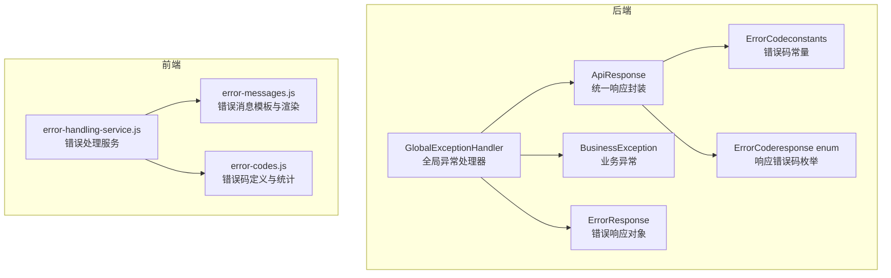
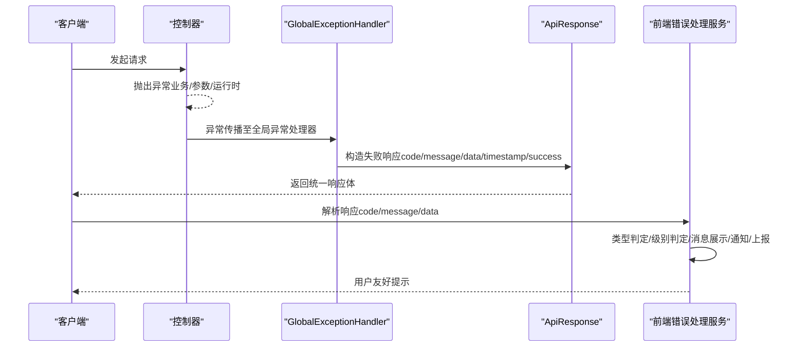
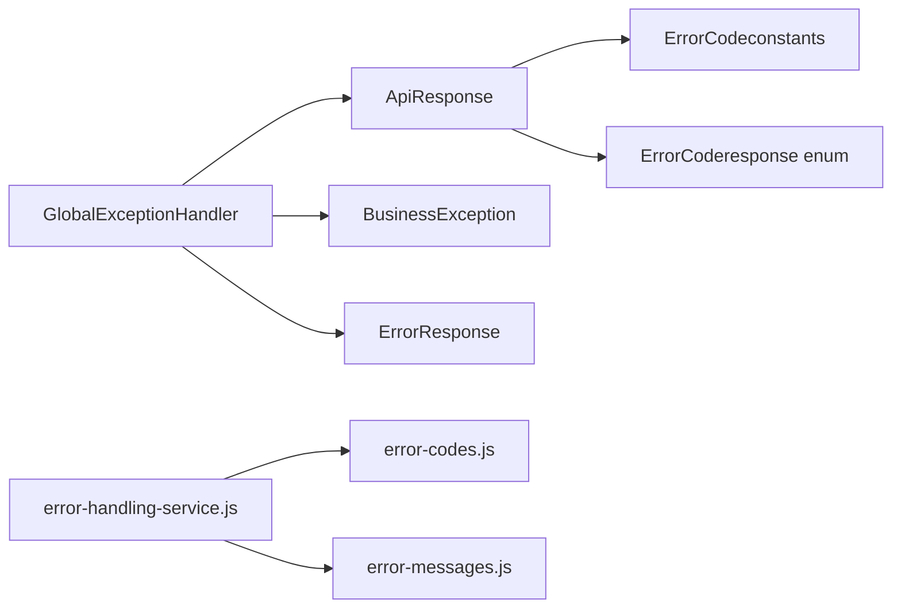
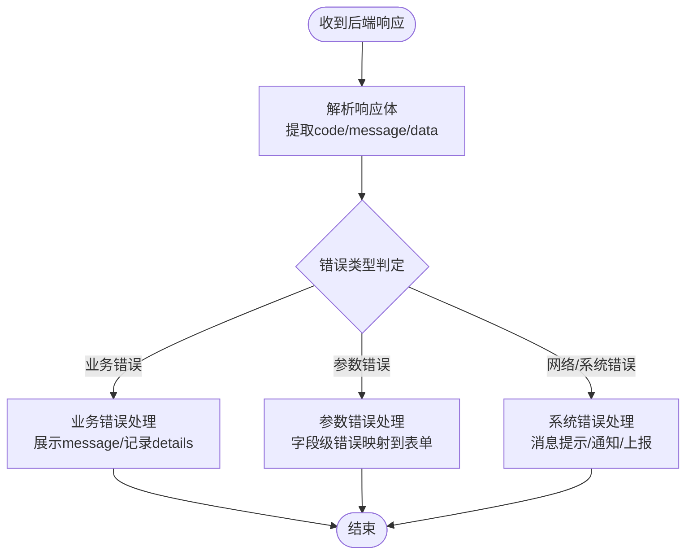

# 异常处理与响应规范

<cite>
**本文引用的文件**
- [GlobalExceptionHandler.java](file://08-backend/src/main/java/com/enterprise/brain/common/exception/GlobalExceptionHandler.java)
- [ApiResponse.java](file://08-backend/src/main/java/com/enterprise/brain/common/response/ApiResponse.java)
- [ErrorCode.java（constants）](file://08-backend/src/main/java/com/enterprise/brain/common/constants/ErrorCode.java)
- [ErrorCode.java（response enum）](file://08-backend/src/main/java/com/enterprise/brain/common/response/ErrorCode.java)
- [BusinessException.java](file://08-backend/src/main/java/com/enterprise/brain/common/exception/BusinessException.java)
- [ErrorResponse.java](file://08-backend/src/main/java/com/enterprise/brain/common/exception/ErrorResponse.java)
- [error-handling-service.js](file://07-frontend/src/services/error-handling-service.js)
- [error-codes.js](file://07-frontend/src/utils/error-handling/error-codes.js)
- [error-messages.js](file://07-frontend/src/utils/error-handling/error-messages.js)
</cite>

## 目录
1. [引言](#引言)
2. [项目结构](#项目结构)
3. [核心组件](#核心组件)
4. [架构总览](#架构总览)
5. [详细组件分析](#详细组件分析)
6. [依赖关系分析](#依赖关系分析)
7. [性能考虑](#性能考虑)
8. [故障排查指南](#故障排查指南)
9. [结论](#结论)
10. [附录](#附录)

## 引言
本规范旨在建立统一的后端异常捕获与前端错误响应解析机制，明确后端全局异常处理器对不同异常类型的处理策略，统一前后端响应格式与错误码体系，并提供前端解析与用户提示的最佳实践，确保系统在异常情况下仍能保持一致、可预期的用户体验与可观测性。

## 项目结构
本仓库包含后端Spring Boot工程与前端Vue工程，异常处理与响应规范涉及后端的全局异常处理与统一响应封装，以及前端的错误处理服务与错误码/消息管理工具。

图表来源
- [GlobalExceptionHandler.java](file://08-backend/src/main/java/com/enterprise/brain/common/exception/GlobalExceptionHandler.java#L1-L119)
- [ApiResponse.java](file://08-backend/src/main/java/com/enterprise/brain/common/response/ApiResponse.java#L1-L107)
- [ErrorCode.java（constants）](file://08-backend/src/main/java/com/enterprise/brain/common/constants/ErrorCode.java#L1-L104)
- [ErrorCode.java（response enum）](file://08-backend/src/main/java/com/enterprise/brain/common/response/ErrorCode.java#L1-L91)
- [BusinessException.java](file://08-backend/src/main/java/com/enterprise/brain/common/exception/BusinessException.java#L1-L69)
- [ErrorResponse.java](file://08-backend/src/main/java/com/enterprise/brain/common/exception/ErrorResponse.java#L1-L89)
- [error-handling-service.js](file://07-frontend/src/services/error-handling-service.js#L1-L433)
- [error-codes.js](file://07-frontend/src/utils/error-handling/error-codes.js#L1-L809)
- [error-messages.js](file://07-frontend/src/utils/error-handling/error-messages.js#L1-L874)

章节来源
- [GlobalExceptionHandler.java](file://08-backend/src/main/java/com/enterprise/brain/common/exception/GlobalExceptionHandler.java#L1-L119)
- [ApiResponse.java](file://08-backend/src/main/java/com/enterprise/brain/common/response/ApiResponse.java#L1-L107)
- [error-handling-service.js](file://07-frontend/src/services/error-handling-service.js#L1-L433)

## 核心组件
- 后端全局异常处理器：集中捕获业务异常、参数校验异常、非法参数、空指针、运行时异常及未捕获异常，统一返回统一响应格式。
- 统一响应封装：定义code、message、data、timestamp、success等字段，提供成功与失败两类静态工厂方法。
- 错误码体系：后端提供两套错误码定义，一套为常量集合，另一套为响应枚举；前端提供错误码定义与统计、消息模板与渲染。
- 业务异常模型：BusinessException支持携带code、message、details，便于精确传递业务错误信息。
- 前端错误处理服务：统一错误类型、级别、消息展示、通知、上报与重试策略，支持表单验证错误映射。

章节来源
- [ApiResponse.java](file://08-backend/src/main/java/com/enterprise/brain/common/response/ApiResponse.java#L1-L107)
- [ErrorCode.java（constants）](file://08-backend/src/main/java/com/enterprise/brain/common/constants/ErrorCode.java#L1-L104)
- [ErrorCode.java（response enum）](file://08-backend/src/main/java/com/enterprise/brain/common/response/ErrorCode.java#L1-L91)
- [BusinessException.java](file://08-backend/src/main/java/com/enterprise/brain/common/exception/BusinessException.java#L1-L69)
- [error-handling-service.js](file://07-frontend/src/services/error-handling-service.js#L1-L433)

## 架构总览
后端通过@RestControllerAdvice拦截异常，依据异常类型选择合适的HTTP状态码与错误码，构造ApiResponse返回给前端。前端通过error-handling-service.js解析响应，结合error-codes.js与error-messages.js进行用户提示与交互。

图表来源
- [GlobalExceptionHandler.java](file://08-backend/src/main/java/com/enterprise/brain/common/exception/GlobalExceptionHandler.java#L1-L119)
- [ApiResponse.java](file://08-backend/src/main/java/com/enterprise/brain/common/response/ApiResponse.java#L1-L107)
- [error-handling-service.js](file://07-frontend/src/services/error-handling-service.js#L1-L433)

## 详细组件分析

### 后端全局异常处理器（GlobalExceptionHandler）
- 捕获范围与策略
  - 业务异常：返回HTTP 200，使用业务错误码与message，便于前端识别为“业务失败”而非“系统错误”。
  - 参数校验异常（@Valid）：返回HTTP 400，聚合字段级错误消息，使用统一错误码标识。
  - 参数绑定异常（BindException）：返回HTTP 400，拼接字段与错误信息。
  - 约束违反异常（@Validated）：返回HTTP 400，聚合违反规则的描述。
  - 非法参数异常：返回HTTP 400，使用统一错误码。
  - 空指针异常：返回HTTP 500，返回通用系统内部错误提示，避免泄露内部细节。
  - 运行时异常：返回HTTP 500，返回系统运行异常提示。
  - 未捕获异常：返回HTTP 500，返回系统错误提示。
- 设计要点
  - 使用统一响应封装ApiResponse，保证前后端契约一致。
  - 对于业务异常，保留业务层传入的code与message，便于前端精准提示。
  - 对于系统异常，返回通用提示，避免泄漏敏感信息。

章节来源
- [GlobalExceptionHandler.java](file://08-backend/src/main/java/com/enterprise/brain/common/exception/GlobalExceptionHandler.java#L1-L119)

### 统一响应封装（ApiResponse）
- 字段语义
  - code：响应码，前端据此判断成功/失败与错误类型。
  - message：人类可读的错误或成功提示。
  - data：业务数据或null（失败时）。
  - timestamp：响应时间戳，便于日志与审计。
  - success：布尔标志，true表示成功，false表示失败。
- 工厂方法
  - 成功响应：提供无参、带数据、带消息与数据的重载，统一设置code为“200”、success为true。
  - 失败响应：提供仅message与带code/message的重载，默认data为null、success为false。
  - 自定义响应：允许自定义code、message、data、success，便于扩展。

章节来源
- [ApiResponse.java](file://08-backend/src/main/java/com/enterprise/brain/common/response/ApiResponse.java#L1-L107)

### 错误码体系（后端）
- 常量错误码（constants）
  - 采用分段编号策略：通用错误、参数错误、认证授权、数据错误、业务错误、文件错误、网络错误、第三方服务、缓存错误等。
  - 便于在业务层直接引用，作为BusinessException的默认或自定义code。
- 响应错误码枚举（response enum）
  - 以枚举形式定义HTTP语义化的错误码（如200、4xx、5xx），并提供快速查询缓存，提升性能。
  - 适合在需要将错误码映射到HTTP状态码或前端UI提示时使用。

章节来源
- [ErrorCode.java（constants）](file://08-backend/src/main/java/com/enterprise/brain/common/constants/ErrorCode.java#L1-L104)
- [ErrorCode.java（response enum）](file://08-backend/src/main/java/com/enterprise/brain/common/response/ErrorCode.java#L1-L91)

### 业务异常模型（BusinessException）
- 字段与构造
  - code：错误码，默认“BUSINESS_ERROR”，可覆盖。
  - message：错误消息。
  - details：详细上下文，便于前端定位问题。
- 使用场景
  - 在业务层抛出，由全局异常处理器捕获并返回统一响应。
  - 支持带cause的构造，便于链路追踪。

章节来源
- [BusinessException.java](file://08-backend/src/main/java/com/enterprise/brain/common/exception/BusinessException.java#L1-L69)

### 错误响应对象（ErrorResponse）
- 字段
  - code、message、path、timestamp、details。
- 用途
  - 作为错误详情载体，可用于日志、审计或更详细的错误展示。

章节来源
- [ErrorResponse.java](file://08-backend/src/main/java/com/enterprise/brain/common/exception/ErrorResponse.java#L1-L89)

### 前端错误处理服务（error-handling-service.js）
- 功能概览
  - 错误类型与级别：NETWORK/API/VALIDATION/AUTH/BUSINESS/SYSTEM/UNKNOWN。
  - 消息展示：基于Element Plus的消息框与通知，支持不同级别对应不同样式。
  - 错误上报：异步上报到后端接口，便于运维监控。
  - 表单错误：支持将后端字段级错误映射到表单控件。
  - Promise包装：提供wrap/silent/retry等工具，简化异步错误处理。
- 关键流程
  - 解析错误来源（字符串、axios响应data.message、原生error.message等）。
  - 根据错误类型与级别决定展示方式与通知行为。
  - 提供注册/移除处理器能力，便于模块化扩展。

章节来源
- [error-handling-service.js](file://07-frontend/src/services/error-handling-service.js#L1-L433)

### 前端错误码与消息（error-codes.js、error-messages.js）
- 错误码定义与统计
  - 按分类（系统、认证、数据、业务、网络、文件、第三方）组织错误码，提供严重程度、HTTP状态、是否可重试、自动恢复策略等元信息。
  - 提供统计与趋势分析能力，便于问题定位与容量规划。
- 错误消息模板与渲染
  - 提供多种模板（基础、错误、成功、警告、网络错误、认证错误、权限错误、验证错误、文件上传错误、确认、加载、进度等）。
  - 支持变量替换、动作按钮、网络信息补充、进度与确认等高级特性。
  - 支持批量处理与消息历史记录，便于审计与回溯。

章节来源
- [error-codes.js](file://07-frontend/src/utils/error-handling/error-codes.js#L1-L809)
- [error-messages.js](file://07-frontend/src/utils/error-handling/error-messages.js#L1-L874)

## 依赖关系分析
- 后端
  - GlobalExceptionHandler依赖ApiResponse进行统一响应，依赖BusinessException与ErrorResponse承载业务与错误详情。
  - ApiResponse与错误码（constants与response enum）解耦，通过code字段实现契约一致。
- 前端
  - error-handling-service.js依赖error-codes.js与error-messages.js进行错误码解析与消息渲染。
  - 前后端通过code与message约定进行契约对接，前端负责UI层面的友好提示与交互。

图表来源
- [GlobalExceptionHandler.java](file://08-backend/src/main/java/com/enterprise/brain/common/exception/GlobalExceptionHandler.java#L1-L119)
- [ApiResponse.java](file://08-backend/src/main/java/com/enterprise/brain/common/response/ApiResponse.java#L1-L107)
- [BusinessException.java](file://08-backend/src/main/java/com/enterprise/brain/common/exception/BusinessException.java#L1-L69)
- [ErrorResponse.java](file://08-backend/src/main/java/com/enterprise/brain/common/exception/ErrorResponse.java#L1-L89)
- [ErrorCode.java（constants）](file://08-backend/src/main/java/com/enterprise/brain/common/constants/ErrorCode.java#L1-L104)
- [ErrorCode.java（response enum）](file://08-backend/src/main/java/com/enterprise/brain/common/response/ErrorCode.java#L1-L91)
- [error-handling-service.js](file://07-frontend/src/services/error-handling-service.js#L1-L433)
- [error-codes.js](file://07-frontend/src/utils/error-handling/error-codes.js#L1-L809)
- [error-messages.js](file://07-frontend/src/utils/error-handling/error-messages.js#L1-L874)

## 性能考虑
- 后端
  - GlobalExceptionHandler使用统一响应封装，减少分支逻辑复杂度，提高异常处理性能。
  - 响应错误码枚举（response enum）内置缓存，按code查询为O(1)，降低查找成本。
- 前端
  - 错误码定义与统计采用Map结构，查询与统计高效。
  - 模板渲染与批量处理支持限制消息数量与分组策略，避免UI阻塞。

[本节为一般性建议，无需列出具体文件来源]

## 故障排查指南
- 后端常见问题
  - 业务异常未被捕获：检查控制器是否抛出BusinessException，确认全局异常处理器生效。
  - 参数校验未返回字段级错误：确认使用@Valid/@Validated与BindException/MethodArgumentNotValidException的组合是否正确。
  - 空指针或运行时异常：检查日志输出与统一响应的message是否为通用提示，避免泄露内部细节。
- 前端常见问题
  - 错误未展示或展示不准确：检查error-handling-service.js的错误类型判定与消息模板选择逻辑。
  - 表单验证错误未回填：确认后端返回的字段级错误与前端表单控件的字段名一致。
  - 网络错误未触发重试：检查promiseErrorHandler.retry的重试次数与延迟配置。

章节来源
- [GlobalExceptionHandler.java](file://08-backend/src/main/java/com/enterprise/brain/common/exception/GlobalExceptionHandler.java#L1-L119)
- [error-handling-service.js](file://07-frontend/src/services/error-handling-service.js#L1-L433)

## 结论
通过后端统一异常处理与响应封装、前后端一致的错误码与消息体系，可以显著提升系统的可观测性与用户体验。建议在后续迭代中：
- 统一前后端错误码命名与语义，减少歧义。
- 在业务层尽量使用BusinessException并携带具体code与details，便于前端精准提示。
- 前端持续完善消息模板与交互策略，提升用户可理解性与可操作性。

[本节为总结性内容，无需列出具体文件来源]

## 附录

### 响应格式字段说明（后端）
- code：错误码字符串，前端据此判断错误类型与是否可重试。
- message：人类可读提示，前端用于用户提示。
- data：业务数据或null（失败时）。
- timestamp：响应时间戳。
- success：布尔值，true表示成功，false表示失败。

章节来源
- [ApiResponse.java](file://08-backend/src/main/java/com/enterprise/brain/common/response/ApiResponse.java#L1-L107)

### 前端解析与提示流程（概念图）

[本图为概念流程示意，无需列出具体文件来源]