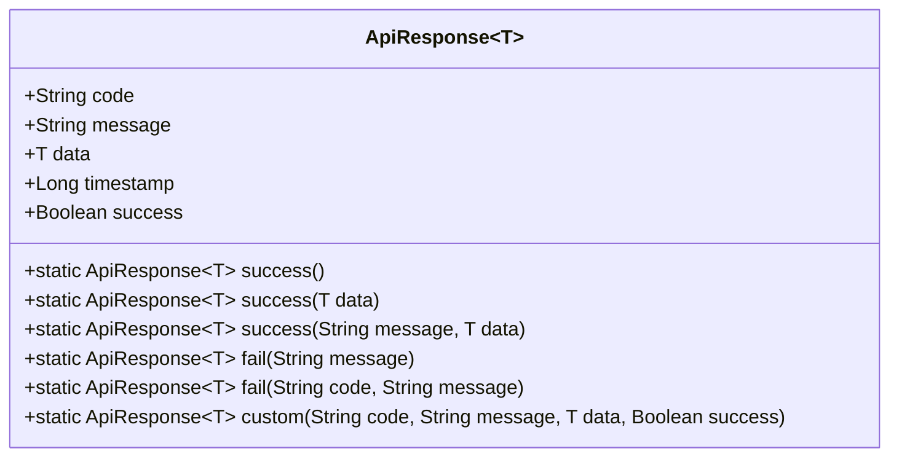
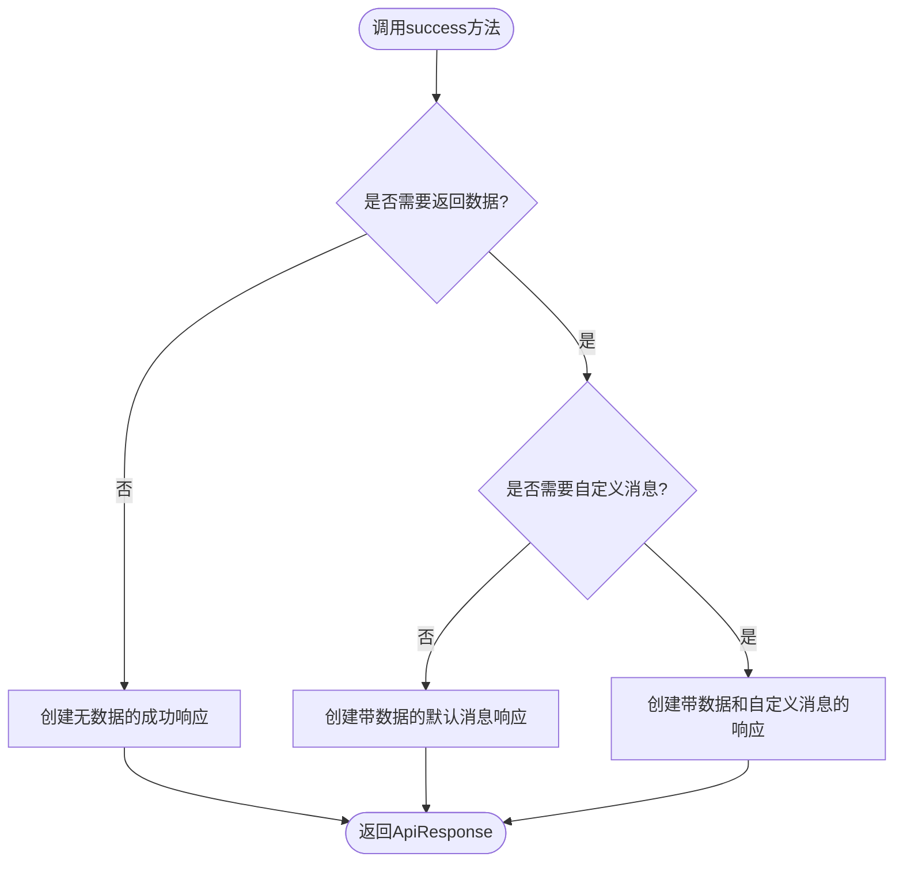
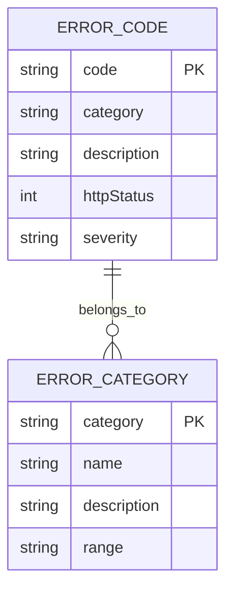
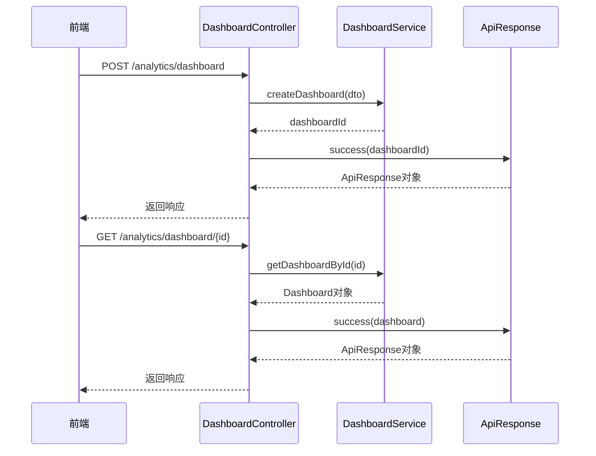
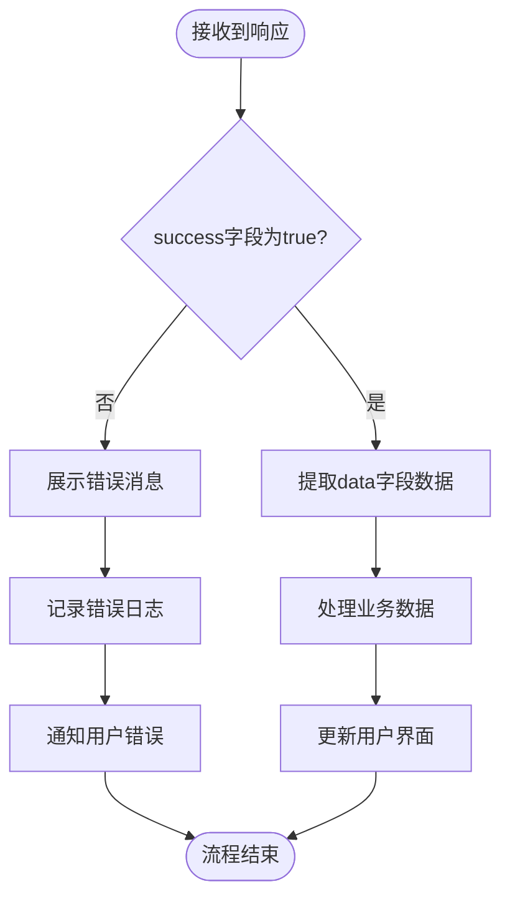

# 响应格式使用实践

<cite>
**本文档引用的文件**  
- [ApiResponse.java](file://08-backend/src/main/java/com/enterprise/brain/common/response/ApiResponse.java#L1-L107)
- [ErrorCode.java](file://08-backend/src/main/java/com/enterprise/brain/common/constants/ErrorCode.java#L1-L104)
- [ErrorCode.java](file://08-backend/src/main/java/com/enterprise/brain/common/response/ErrorCode.java#L1-L91)
- [BaseController.java](file://08-backend/src/main/java/com/enterprise/brain/common/base/BaseController.java#L1-L91)
- [GlobalExceptionHandler.java](file://08-backend/src/main/java/com/enterprise/brain/common/exception/GlobalExceptionHandler.java#L1-L119)
- [DashboardController.java](file://08-backend/src/main/java/com/enterprise/brain/modules/analytics/controller/DashboardController.java#L1-L84)
- [request.js](file://07-frontend/src/services/utils/request.js#L1-L798)
- [ProductSelector.vue](file://07-frontend/src/components/common/business/ProductSelector.vue#L1-L300)
</cite>

## 目录
1. [简介](#简介)
2. [响应格式设计模式](#响应格式设计模式)
3. [成功响应方法分析](#成功响应方法分析)
4. [失败响应方法分析](#失败响应方法分析)
5. [自定义响应方法](#自定义响应方法)
6. [Spring Boot控制器中的使用示例](#spring-boot控制器中的使用示例)
7. [前端响应解析流程](#前端响应解析流程)
8. [常见反模式与正确实践](#常见反模式与正确实践)
9. [结论](#结论)

## 简介
本文档深入分析企业级应用中统一响应格式的设计与实践。通过研究`ApiResponse`类的静态工厂方法，阐述其在前后端交互中的重要作用。文档详细说明了成功响应、失败响应和自定义响应的设计模式，展示了在Spring Boot控制器中的具体应用，并提供了前端解析响应的标准流程。同时，文档列举了常见的反模式并给出了正确的实践建议，旨在为开发团队提供统一的响应处理规范。

## 响应格式设计模式
`ApiResponse`类采用泛型设计模式，提供统一的响应结构，确保前后端交互的一致性和可预测性。该类实现了`Serializable`接口，支持跨网络传输。通过静态工厂方法模式，提供了简洁的API来创建不同类型的响应对象。

**图表来源**  
- [ApiResponse.java](file://08-backend/src/main/java/com/enterprise/brain/common/response/ApiResponse.java#L1-L107)

**本节来源**  
- [ApiResponse.java](file://08-backend/src/main/java/com/enterprise/brain/common/response/ApiResponse.java#L1-L107)

## 成功响应方法分析
`success()`方法提供了三种重载形式，满足不同场景的需求：

1. **无数据返回**：`success()`方法创建一个成功响应，不包含业务数据，适用于不需要返回具体数据的操作，如删除操作。
2. **仅带数据返回**：`success(T data)`方法创建一个成功响应，包含业务数据，使用默认消息"操作成功"，适用于查询和创建操作。
3. **自定义消息与数据返回**：`success(String message, T data)`方法创建一个成功响应，允许自定义消息和数据，适用于需要提供特定成功信息的场景。

**图表来源**  
- [ApiResponse.java](file://08-backend/src/main/java/com/enterprise/brain/common/response/ApiResponse.java#L50-L69)

**本节来源**  
- [ApiResponse.java](file://08-backend/src/main/java/com/enterprise/brain/common/response/ApiResponse.java#L50-L69)
- [BaseController.java](file://08-backend/src/main/java/com/enterprise/brain/common/base/BaseController.java#L21-L37)

## 失败响应方法分析
`fail()`方法通过简化异常处理流程来提高开发效率。它提供了两种形式：

1. **简化形式**：`fail(String message)`方法使用默认错误码"500"创建失败响应，适用于快速处理异常情况。
2. **完整形式**：`fail(String code, String message)`方法允许指定错误码和消息，适用于需要精确错误定位的场景。

这种设计意图是通过提供默认值来减少样板代码，同时保留足够的灵活性来处理复杂的错误情况。错误码采用分层设计，前两位数字表示错误类别，后三位数字表示具体错误，便于错误分类和处理。

**图表来源**  
- [ApiResponse.java](file://08-backend/src/main/java/com/enterprise/brain/common/response/ApiResponse.java#L77-L91)
- [ErrorCode.java](file://08-backend/src/main/java/com/enterprise/brain/common/constants/ErrorCode.java#L1-L104)

**本节来源**  
- [ApiResponse.java](file://08-backend/src/main/java/com/enterprise/brain/common/response/ApiResponse.java#L77-L91)
- [ErrorCode.java](file://08-backend/src/main/java/com/enterprise/brain/common/constants/ErrorCode.java#L1-L104)
- [GlobalExceptionHandler.java](file://08-backend/src/main/java/com/enterprise/brain/common/exception/GlobalExceptionHandler.java#L35-L115)

## 自定义响应方法
`custom()`方法提供了最大的灵活性，允许在特殊业务场景下创建完全自定义的响应。该方法可以指定错误码、消息、数据和成功标识，适用于以下场景：

- 需要返回非标准HTTP状态码的响应
- 需要返回特定业务状态的响应
- 需要返回复杂数据结构的响应
- 需要返回特定成功/失败状态的响应

这种设计模式遵循了开闭原则，既提供了标准的响应创建方法，又保留了扩展性，允许在必要时进行自定义。

**本节来源**  
- [ApiResponse.java](file://08-backend/src/main/java/com/enterprise/brain/common/response/ApiResponse.java#L97-L105)

## Spring Boot控制器中的使用示例
在Spring Boot控制器中，`ApiResponse`的静态工厂方法被广泛用于构建响应结果。通过继承`BaseController`类，子控制器可以直接使用这些方法，减少了重复代码。

**图表来源**  
- [DashboardController.java](file://08-backend/src/main/java/com/enterprise/brain/modules/analytics/controller/DashboardController.java#L1-L84)
- [ApiResponse.java](file://08-backend/src/main/java/com/enterprise/brain/common/response/ApiResponse.java#L50-L71)

**本节来源**  
- [DashboardController.java](file://08-backend/src/main/java/com/enterprise/brain/modules/analytics/controller/DashboardController.java#L1-L84)
- [BaseController.java](file://08-backend/src/main/java/com/enterprise/brain/common/base/BaseController.java#L1-L91)

## 前端响应解析流程
前端接收到响应后，需要按照标准流程解析`data`数据。这个流程包括对`success`字段判断、错误消息展示和成功数据提取等逻辑处理。

**图表来源**  
- [request.js](file://07-frontend/src/services/utils/request.js#L1-L798)
- [ProductSelector.vue](file://07-frontend/src/components/common/business/ProductSelector.vue#L1-L300)

**本节来源**  
- [request.js](file://07-frontend/src/services/utils/request.js#L1-L798)
- [ProductSelector.vue](file://07-frontend/src/components/common/business/ProductSelector.vue#L1-L300)

## 常见反模式与正确实践
在响应格式使用中，存在一些常见的反模式，需要避免：

### 常见反模式
1. **直接返回原始数据**：不使用`ApiResponse`包装，直接返回业务数据，导致前后端契约不明确。
2. **错误码使用不规范**：随意使用错误码，不遵循预定义的错误码体系，导致错误处理混乱。
3. **消息格式不统一**：错误消息格式不一致，缺乏标准化，影响用户体验。
4. **忽略时间戳**：不记录响应时间，影响问题排查和性能分析。

### 正确实践
1. **始终使用`ApiResponse`包装**：所有控制器方法都应返回`ApiResponse`对象，确保响应格式统一。
2. **遵循错误码规范**：使用预定义的错误码常量，确保错误码的唯一性和语义清晰。
3. **提供有意义的消息**：错误消息应清晰描述问题，帮助用户理解和解决问题。
4. **记录时间戳**：利用`ApiResponse`中的时间戳字段，便于性能监控和问题排查。

**本节来源**  
- [ApiResponse.java](file://08-backend/src/main/java/com/enterprise/brain/common/response/ApiResponse.java#L1-L107)
- [ErrorCode.java](file://08-backend/src/main/java/com/enterprise/brain/common/constants/ErrorCode.java#L1-L104)
- [GlobalExceptionHandler.java](file://08-backend/src/main/java/com/enterprise/brain/common/exception/GlobalExceptionHandler.java#L1-L119)

## 结论
`ApiResponse`类的静态工厂方法设计模式为前后端交互提供了统一、规范的响应格式。通过`success()`方法的三种重载形式，满足了不同场景的需求；`fail()`方法通过默认错误码简化了异常处理流程；`custom()`方法在特殊业务场景下提供了灵活的应用。在Spring Boot控制器中正确使用这些方法，可以提高代码的可读性和可维护性。前端按照标准流程解析响应，确保了用户体验的一致性。避免常见反模式，遵循正确实践，有助于构建健壮、可靠的企业级应用。