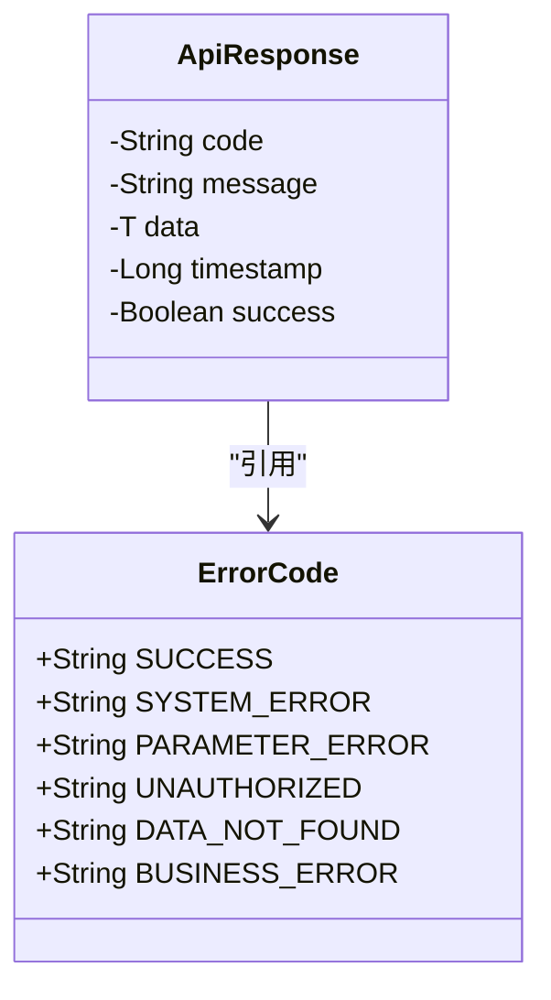
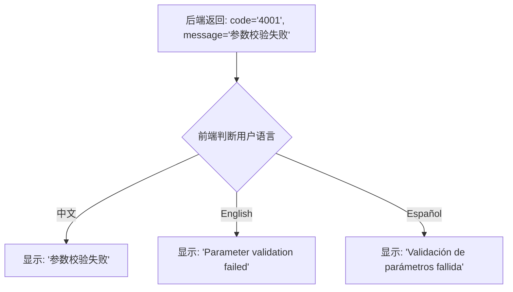
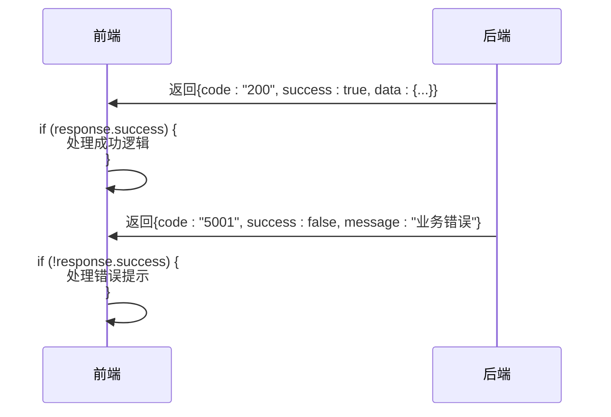

# 统一响应格式定义

<cite>
**本文档引用的文件**
- [ApiResponse.java](file://08-backend/src/main/java/com/enterprise/brain/common/response/ApiResponse.java)
- [ErrorCode.java](file://08-backend/src/main/java/com/enterprise/brain/common/response/ErrorCode.java)
- [BaseController.java](file://08-backend/src/main/java/com/enterprise/brain/common/base/BaseController.java)
- [GlobalExceptionHandler.java](file://08-backend/src/main/java/com/enterprise/brain/common/exception/GlobalExceptionHandler.java)
- [ErrorCodeConstants.java](file://08-backend/src/main/java/com/enterprise/brain/common/constants/ErrorCode.java)
</cite>

## 目录
1. [简介](#简介)
2. [核心字段语义解析](#核心字段语义解析)
3. [响应结构设计考量](#响应结构设计考量)
4. [标准化编码体系](#标准化编码体系)
5. [国际化处理建议](#国际化处理建议)
6. [泛型数据设计](#泛型数据设计)
7. [时间戳的重要性](#时间戳的重要性)
8. [成功标识的便利性](#成功标识的便利性)
9. [JSON序列化示例](#json序列化示例)

## 简介
本项目采用统一的API响应格式，通过`ApiResponse`类实现前后端数据交互的标准化。该设计确保了所有接口返回结构的一致性，便于前端统一处理响应结果，提升开发效率和用户体验。

**本节来源**
- [ApiResponse.java](file://08-backend/src/main/java/com/enterprise/brain/common/response/ApiResponse.java#L1-L107)

## 核心字段语义解析

### code字段
`code`字段表示响应码，采用字符串类型存储。该字段用于标识请求处理的结果状态，是后端与前端约定的状态标识。在`ApiResponse`类中，`code`字段被定义为字符串类型，支持灵活的编码体系。

### message字段
`message`字段表示响应消息，为用户友好的提示信息。该字段主要用于向用户展示可读性强的操作结果描述，如"操作成功"、"参数校验失败"等。在错误情况下，提供具体的错误原因说明。

### data字段
`data`字段表示响应数据，使用泛型T定义，可承载任意类型的数据。该设计使得响应结构能够适应不同接口的数据返回需求，无论是单个对象、对象列表还是基本类型数据。

### timestamp字段
`timestamp`字段表示时间戳，记录响应生成的精确时间。该字段存储的是系统当前时间的毫秒值，用于前端调试、日志追踪和性能分析。

### success字段
`success`字段表示成功标识，为布尔类型。该字段提供了一种快速判断请求是否成功的机制，避免前端需要解析`code`字段来判断业务成功与否。

**本节来源**
- [ApiResponse.java](file://08-backend/src/main/java/com/enterprise/brain/common/response/ApiResponse.java#L22-L45)

## 响应结构设计考量

### 字符串类型code的设计考量
`code`字段采用字符串类型而非整型，主要基于以下几点考虑：

1. **扩展性**：字符串类型支持更灵活的编码体系，可以包含字母、数字和特殊字符，便于实现模块化编码（如"11001"表示菜单模块错误）。
2. **语义清晰**：字符串编码可以更具描述性，如"SUCCESS"、"VALIDATION_ERROR"等，提高代码可读性。
3. **兼容性**：避免了整型数值的隐式转换问题，确保编码的精确匹配。
4. **前缀识别**：通过字符串前缀可以快速识别错误类别，如"2xx"表示成功，"4xx"表示客户端错误。

这种设计虽然增加了存储空间，但在现代系统中微不足道，而带来的灵活性和可维护性优势显著。

**本节来源**
- [ApiResponse.java](file://08-backend/src/main/java/com/enterprise/brain/common/response/ApiResponse.java#L25)
- [ErrorCode.java](file://08-backend/src/main/java/com/enterprise/brain/common/response/ErrorCode.java#L16-L90)

## 标准化编码体系

### 编码规则
项目采用多层次的标准化编码体系，确保错误码的唯一性和语义清晰：

- **200**：操作成功
- **4xx**：客户端错误（如参数错误、权限不足）
- **5xx**：业务逻辑错误（如资源不存在、重复）
- **6xx**：数据访问错误（如数据库异常）
- **7xx**：系统错误（如服务不可用）
- **10000+**：模块特定错误（如菜单模块11000+）

此外，项目还定义了常量类`ErrorCode`，将通用错误码按类别组织：



**图示来源**
- [ErrorCode.java](file://08-backend/src/main/java/com/enterprise/brain/common/constants/ErrorCode.java#L9-L103)
- [ApiResponse.java](file://08-backend/src/main/java/com/enterprise/brain/common/response/ApiResponse.java#L15-L45)

## 国际化处理建议

### message字段的作用
`message`字段作为用户友好提示，在国际化场景下具有重要作用：

1. **前端处理**：前端可以根据用户的语言偏好，将`message`中的内容替换为对应语言的翻译。
2. **动态替换**：建议后端返回英文或中立语言的提示信息，前端根据locale进行翻译。
3. **错误码映射**：可以建立错误码与多语言消息的映射表，实现自动化的消息本地化。



**图示来源**
- [ApiResponse.java](file://08-backend/src/main/java/com/enterprise/brain/common/response/ApiResponse.java#L30)
- [GlobalExceptionHandler.java](file://08-backend/src/main/java/com/enterprise/brain/common/exception/GlobalExceptionHandler.java#L49)

## 泛型数据设计

### data字段的泛型设计
`data`字段采用泛型设计，支持不同类型的数据返回：

1. **单一对象**：返回单个实体对象
2. **对象列表**：返回`List<T>`类型的数据
3. **分页数据**：返回包含分页信息的`Page<T>`对象
4. **基本类型**：返回字符串、数字等基本类型数据
5. **空值处理**：允许`null`值，表示无数据返回

这种设计通过Java泛型机制实现类型安全，同时保持了响应结构的统一性。在失败响应中，`data`字段通常设置为`null`。

```mermaid
classDiagram
class ApiResponse~T~ {
-String code
-String message
-T data
-Long timestamp
-Boolean success
}
class User {
+String name
+String email
}
class Order {
+String orderId
+Double amount
}
ApiResponse~User~ --> User : "实例化"
ApiResponse~Order[]~ --> Order : "实例化"
ApiResponse~Page~Product~~ --> Product : "实例化"
```

**图示来源**
- [ApiResponse.java](file://08-backend/src/main/java/com/enterprise/brain/common/response/ApiResponse.java#L35)
- [BaseController.java](file://08-backend/src/main/java/com/enterprise/brain/common/base/BaseController.java#L56-L64)

## 时间戳的重要性

### timestamp字段的作用
`timestamp`字段在系统中具有多重重要性：

1. **前端调试**：帮助开发者确定响应生成时间，分析请求-响应延迟。
2. **日志追踪**：与服务端日志时间戳对比，定位性能瓶颈。
3. **数据一致性**：在分布式系统中，用于判断数据的新鲜度。
4. **审计追踪**：记录操作发生的确切时间，满足审计要求。

该字段在`ApiResponse`的构造中自动设置为`System.currentTimeMillis()`，确保时间戳的准确性和一致性。

**本节来源**
- [ApiResponse.java](file://08-backend/src/main/java/com/enterprise/brain/common/response/ApiResponse.java#L37-L40)
- [ApiResponse.java](file://08-backend/src/main/java/com/enterprise/brain/common/response/ApiResponse.java#L69-L70)

## 成功标识的便利性

### success字段的优势
`success`布尔字段在快速判断响应状态时提供了显著便利：

1. **简化判断逻辑**：前端可以直接通过`if (response.success)`判断操作是否成功，无需解析`code`字段。
2. **提高可读性**：代码逻辑更加直观易懂。
3. **减少错误**：避免因`code`值比较错误导致的逻辑问题。

与仅依赖`code`字段相比，`success`字段的优势在于：

- **效率**：布尔比较比字符串或数字比较更快
- **可靠性**：减少了因编码规则变更导致的前端逻辑错误
- **用户体验**：简化了前端处理逻辑，降低出错概率



**图示来源**
- [ApiResponse.java](file://08-backend/src/main/java/com/enterprise/brain/common/response/ApiResponse.java#L42-L45)
- [ApiResponse.java](file://08-backend/src/main/java/com/enterprise/brain/common/response/ApiResponse.java#L70)

## JSON序列化示例

### 成功响应示例
```json
{
  "code": "200",
  "message": "操作成功",
  "data": {
    "userId": 123,
    "username": "admin",
    "email": "admin@example.com"
  },
  "timestamp": 1700000000000,
  "success": true
}
```

### 失败响应示例
```json
{
  "code": "4001",
  "message": "参数校验失败",
  "data": null,
  "timestamp": 1700000000000,
  "success": false
}
```

### 分页响应示例
```json
{
  "code": "200",
  "message": "获取列表成功",
  "data": {
    "records": [
      {"id": 1, "name": "产品A"},
      {"id": 2, "name": "产品B"}
    ],
    "total": 2,
    "size": 10,
    "current": 1
  },
  "timestamp": 1700000000000,
  "success": true
}
```

这些示例展示了`ApiResponse`类在实际应用中的JSON序列化结果，体现了统一响应格式的规范性和实用性。

**本节来源**
- [ApiResponse.java](file://08-backend/src/main/java/com/enterprise/brain/common/response/ApiResponse.java#L50-L105)
- [BaseController.java](file://08-backend/src/main/java/com/enterprise/brain/common/base/BaseController.java#L21-L37)