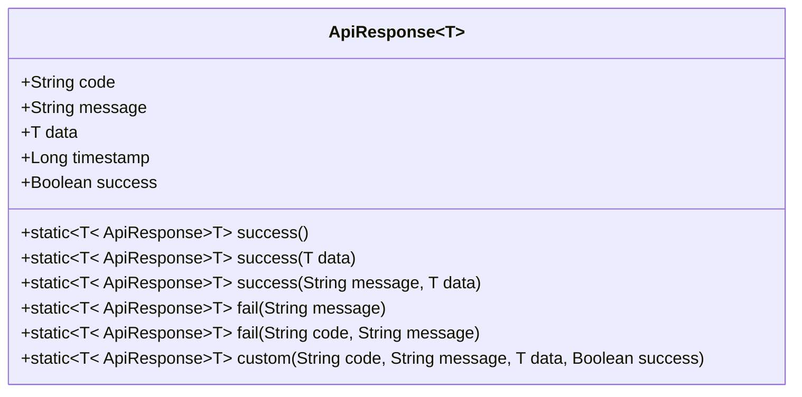
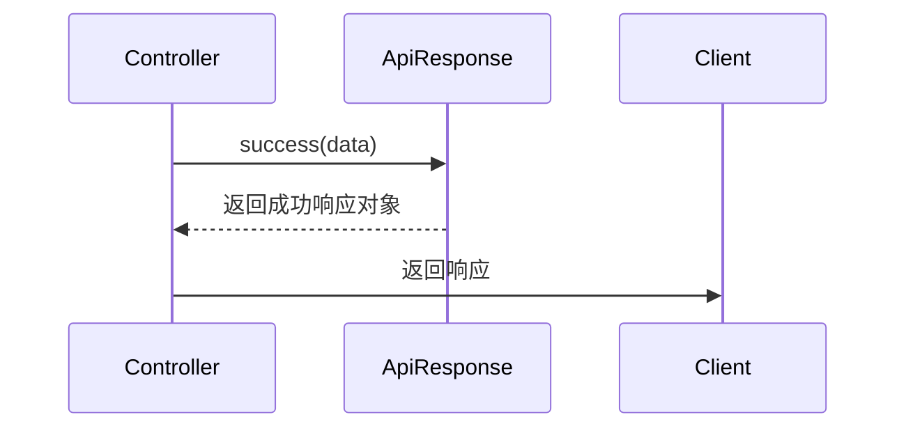
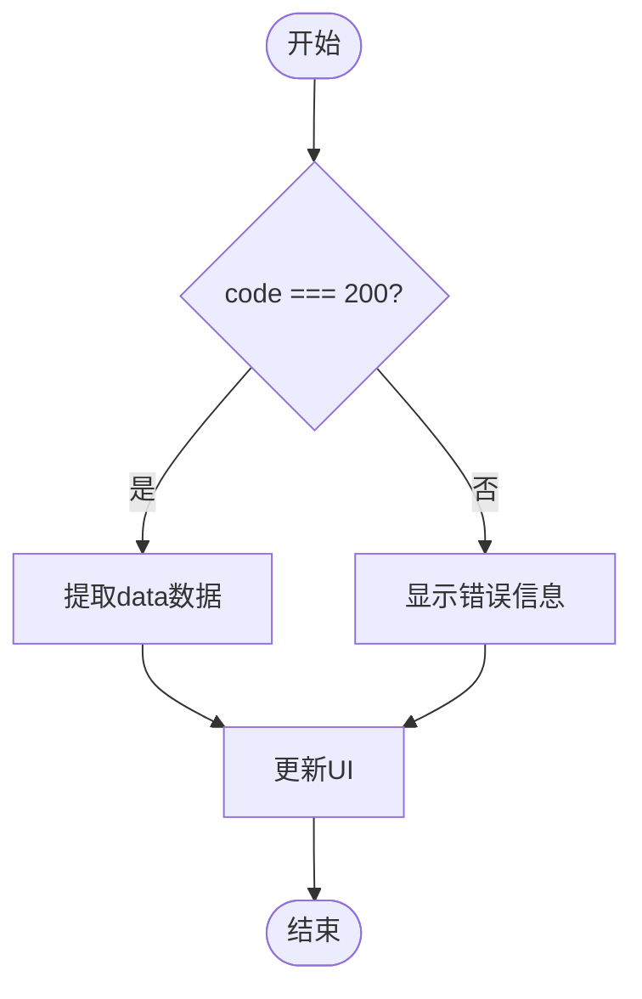

# 统一响应格式规范

<cite>
**本文档引用文件**   
- [ApiResponse.java](file://08-backend/src/main/java/com/enterprise/brain/common/response/ApiResponse.java)
- [BaseController.java](file://08-backend/src/main/java/com/enterprise/brain/common/base/BaseController.java)
- [request.js](file://07-frontend/src/services/utils/request.js)
- [index.js](file://07-frontend/src/services/index.js)
- [error-codes.js](file://07-frontend/src/utils/error-handling/error-codes.js)
- [help-content.js](file://07-frontend/src/utils/guide/help-content.js)
</cite>

## 目录
1. [引言](#引言)
2. [统一响应格式设计](#统一响应格式设计)
3. [核心字段语义与使用场景](#核心字段语义与使用场景)
4. [静态工厂方法设计模式](#静态工厂方法设计模式)
5. [泛型T在数据封装中的作用](#泛型t在数据封装中的作用)
6. [前端解析响应数据标准流程](#前端解析响应数据标准流程)
7. [响应示例](#响应示例)
8. [最佳实践与常见反模式](#最佳实践与常见反模式)
9. [错误码体系](#错误码体系)
10. [结论](#结论)

## 引言

在企业级业务管理系统中，前后端分离架构已成为主流。为了确保前后端通信的规范性、一致性和可维护性，设计并实现统一的API响应格式至关重要。本规范详细阐述了`ApiResponse`统一响应格式的设计与实现，旨在为开发团队提供清晰的指导，确保系统各模块间的数据交互遵循统一标准。

## 统一响应格式设计

`ApiResponse`类是系统中统一响应格式的核心实现，位于`08-backend/src/main/java/com/enterprise/brain/common/response/ApiResponse.java`。该类采用泛型设计，能够灵活封装各种类型的数据，同时提供静态工厂方法简化成功和失败响应的创建。



**图表来源**
- [ApiResponse.java](file://08-backend/src/main/java/com/enterprise/brain/common/response/ApiResponse.java)

**本节来源**
- [ApiResponse.java](file://08-backend/src/main/java/com/enterprise/brain/common/response/ApiResponse.java)

## 核心字段语义与使用场景

`ApiResponse`类包含五个核心字段，每个字段都有明确的语义和使用场景。

### code（响应码）

**语义**：表示响应的状态码，用于标识请求的处理结果。遵循HTTP状态码和业务自定义码的混合体系。

**使用场景**：
- `200`：表示请求成功。
- `4xx`：表示客户端错误，如参数错误、权限不足等。
- `5xx`：表示服务端错误，如服务器内部错误、数据库异常等。
- `10000+`：模块特定错误码，如菜单模块11000+。

### message（响应消息）

**语义**：提供关于响应的可读性描述，通常用于向用户展示操作结果或错误信息。

**使用场景**：
- 成功时显示"操作成功"。
- 失败时显示具体的错误原因，如"用户名或密码错误"。

### data（响应数据）

**语义**：封装实际的业务数据，类型由泛型T决定。

**使用场景**：
- 查询操作返回单个对象或对象列表。
- 分页查询返回分页结果。
- 无数据返回时为null。

### timestamp（时间戳）

**语义**：记录响应生成的时间，单位为毫秒。

**使用场景**：
- 用于前端计算请求耗时。
- 用于日志记录和问题排查。

### success（成功标识）

**语义**：布尔值，表示请求是否成功处理。

**使用场景**：
- `true`：请求成功。
- `false`：请求失败。

**本节来源**
- [ApiResponse.java](file://08-backend/src/main/java/com/enterprise/brain/common/response/ApiResponse.java)

## 静态工厂方法设计模式

`ApiResponse`类通过静态工厂方法提供了创建响应对象的便捷方式，这种设计模式具有以下优点：

### 设计模式

静态工厂方法是一种创建型设计模式，它提供了一种创建对象的替代方式，而不是使用构造函数。

### 便利性

- **简化创建**：开发者无需关心对象的构造细节，只需调用静态方法即可。
- **语义清晰**：方法名直接表达了创建意图，如`success()`和`fail()`。
- **灵活性**：支持多种参数组合，满足不同场景的需求。



**图表来源**
- [ApiResponse.java](file://08-backend/src/main/java/com/enterprise/brain/common/response/ApiResponse.java)

**本节来源**
- [ApiResponse.java](file://08-backend/src/main/java/com/enterprise/brain/common/response/ApiResponse.java)

## 泛型T在数据封装中的作用

泛型T的使用使得`ApiResponse`类能够适应各种数据类型，提高了代码的复用性和类型安全性。

### 作用

- **类型安全**：编译时检查类型，避免运行时类型转换错误。
- **代码复用**：一个类可以处理多种数据类型，减少代码重复。
- **灵活性**：能够封装任何类型的业务数据。

### 序列化支持

为了确保响应对象能够被正确序列化和反序列化，`ApiResponse`类实现了`Serializable`接口，并使用Lombok注解简化代码。

**本节来源**
- [ApiResponse.java](file://08-backend/src/main/java/com/enterprise/brain/common/response/ApiResponse.java)

## 前端解析响应数据标准流程

前端通过统一的响应拦截器处理API响应，确保所有请求都遵循相同的处理逻辑。

### 成功情况处理

1. 检查响应码是否为200。
2. 提取data字段中的业务数据。
3. 更新UI状态。

### 失败情况处理

1. 检查响应码是否不为200。
2. 提取message字段中的错误信息。
3. 显示错误提示。



**图表来源**
- [index.js](file://07-frontend/src/services/index.js)

**本节来源**
- [index.js](file://07-frontend/src/services/index.js)
- [request.js](file://07-frontend/src/services/utils/request.js)

## 响应示例

### 单个对象

```json
{
  "code": "200",
  "message": "操作成功",
  "data": {
    "id": 1,
    "name": "张三",
    "email": "zhangsan@example.com"
  },
  "timestamp": 1630000000000,
  "success": true
}
```

### 列表数据

```json
{
  "code": "200",
  "message": "操作成功",
  "data": [
    {
      "id": 1,
      "name": "张三"
    },
    {
      "id": 2,
      "name": "李四"
    }
  ],
  "timestamp": 1630000000000,
  "success": true
}
```

### 分页结果

```json
{
  "code": "200",
  "message": "操作成功",
  "data": {
    "records": [
      {
        "id": 1,
        "name": "张三"
      }
    ],
    "total": 100,
    "size": 10,
    "current": 1
  },
  "timestamp": 1630000000000,
  "success": true
}
```

**本节来源**
- [ApiResponse.java](file://08-backend/src/main/java/com/enterprise/brain/common/response/ApiResponse.java)

## 最佳实践与常见反模式

### 最佳实践

- **统一格式**：所有API响应都应遵循`ApiResponse`格式。
- **明确错误码**：使用清晰的错误码和消息，便于问题定位。
- **合理使用泛型**：根据业务需求选择合适的泛型类型。

### 常见反模式

- **直接返回原始数据**：不使用`ApiResponse`包装，导致前后端耦合。
- **错误码混乱**：使用不一致的错误码，增加维护难度。
- **忽略时间戳**：不记录响应时间，影响性能分析。

**本节来源**
- [ApiResponse.java](file://08-backend/src/main/java/com/enterprise/brain/common/response/ApiResponse.java)
- [BaseController.java](file://08-backend/src/main/java/com/enterprise/brain/common/base/BaseController.java)

## 错误码体系

系统采用分层的错误码体系，确保错误码的唯一性和语义清晰。

### 错误码规则

- `200`：成功
- `4xx`：客户端错误
- `5xx`：业务逻辑错误
- `6xx`：数据访问错误
- `7xx`：系统错误
- `10000+`：模块特定错误

### 错误码示例

- `4001`：参数校验失败
- `5002`：资源已存在
- `3001`：数据验证失败

**本节来源**
- [ErrorCode.java](file://08-backend/src/main/java/com/enterprise/brain/common/response/ErrorCode.java)
- [error-codes.js](file://07-frontend/src/utils/error-handling/error-codes.js)
- [help-content.js](file://07-frontend/src/utils/guide/help-content.js)

## 结论

`ApiResponse`统一响应格式的设计与实现，为系统提供了规范、一致的API通信机制。通过静态工厂方法、泛型支持和统一的错误码体系，不仅提高了开发效率，还增强了系统的可维护性和可扩展性。前端通过统一的响应拦截器处理响应，确保了用户体验的一致性。遵循本规范，将有助于构建高质量的企业级应用。