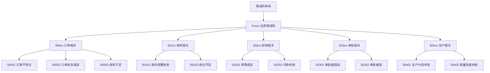
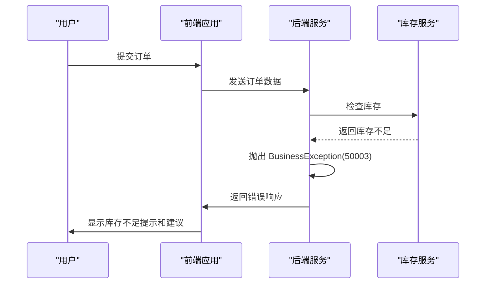
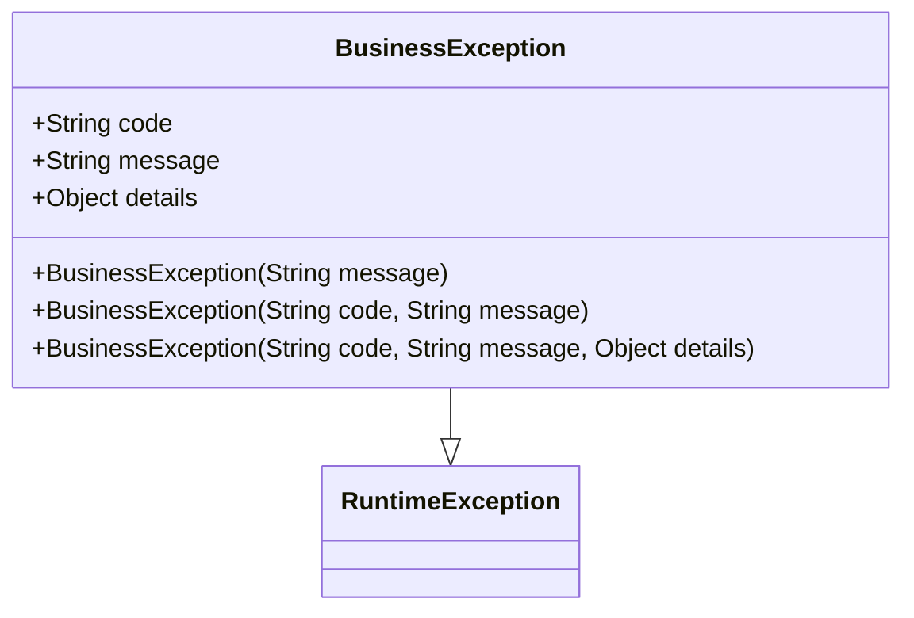
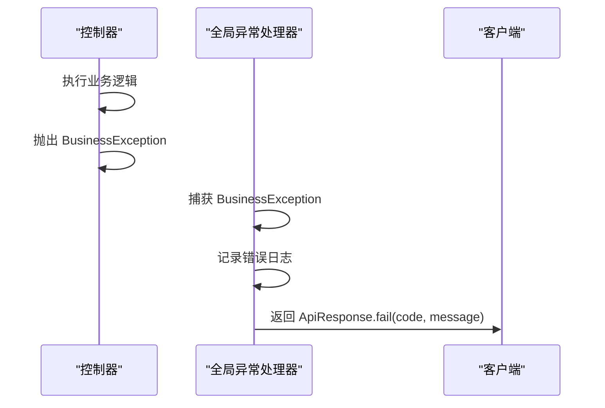
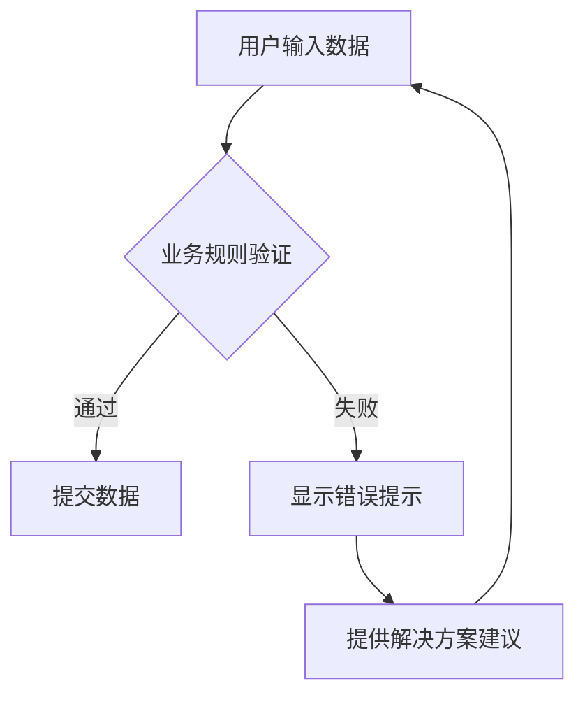
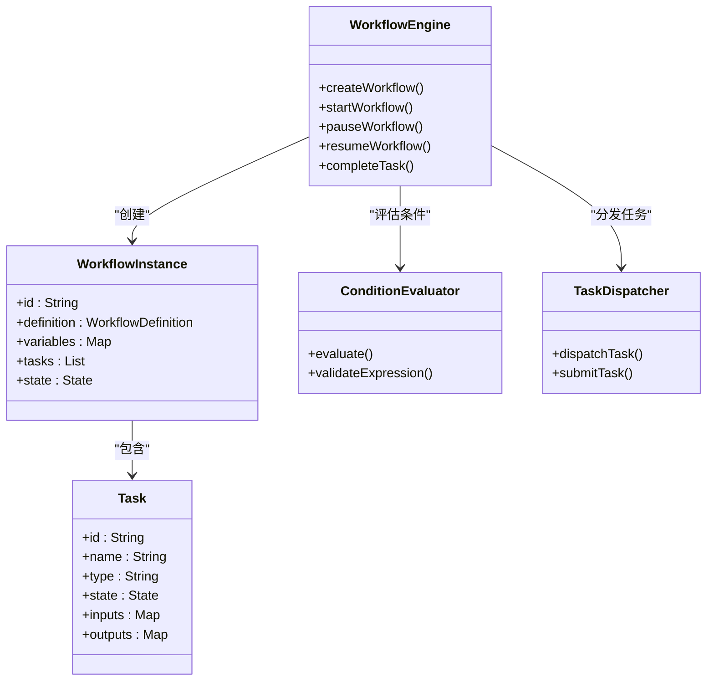

# 业务错误码

<cite>
**本文档引用的文件**
- [ErrorCode.java](file://08-backend/src/main/java/com/enterprise/brain/common/constants/ErrorCode.java)
- [BusinessException.java](file://08-backend/src/main/java/com/enterprise/brain/common/exception/BusinessException.java)
- [GlobalExceptionHandler.java](file://08-backend/src/main/java/com/enterprise/brain/common/exception/GlobalExceptionHandler.java)
- [business-rules.js](file://07-frontend/src/utils/validation/business-rules.js)
- [WorkflowEngine.java](file://08-backend/src/main/java/com/enterprise/brain/modules/workflow/engine/WorkflowEngine.java)
- [ConditionEvaluator.java](file://08-backend/src/main/java/com/enterprise/brain/modules/workflow/engine/ConditionEvaluator.java)
- [TaskDispatcher.java](file://08-backend/src/main/java/com/enterprise/brain/modules/workflow/engine/TaskDispatcher.java)
</cite>

## 目录
1. [引言](#引言)
2. [业务错误码设计体系](#业务错误码设计体系)
3. [核心业务错误码详解](#核心业务错误码详解)
4. [业务异常处理机制](#业务异常处理机制)
5. [业务规则与错误码关联](#业务规则与错误码关联)
6. [工作流引擎集成](#工作流引擎集成)
7. [最佳实践与建议](#最佳实践与建议)
8. [结论](#结论)

## 引言

业务错误码是企业级应用中用于精确标识业务规则违反场景的重要机制。与通用的技术错误码不同，业务错误码（5xxxx系列）专门用于反映特定业务领域的规则违反情况，如订单、库存、财务等领域的具体业务约束。这些错误码不仅提供了错误的精确标识，还通过其结构化设计体现了领域驱动设计（DDD）的核心思想，使业务规则的表达更加清晰和可维护。

在本系统中，业务错误码的设计遵循了分层分类的原则，通过5xxxx系列代码精确标识各类业务异常场景。从库存不足（INSUFFICIENT_STOCK, 50003）到支付失败（PAYMENT_FAILED, 50008），再到审批被拒（APPROVAL_REJECTED, 50013），每个错误码都对应着特定的业务规则违反场景，为系统的业务流程控制提供了精确的反馈机制。

**Section sources**
- [ErrorCode.java](file://08-backend/src/main/java/com/enterprise/brain/common/constants/ErrorCode.java#L50-L69)

## 业务错误码设计体系

本系统的错误码体系采用分层设计，通过前两位数字标识错误类别，后三位数字标识具体错误。业务错误码统一使用5xxxx系列，其中50000作为通用业务错误码，其他具体业务错误码则根据业务领域进行细分。

错误码体系的分层结构如下：
- **50000-50099**: 订单相关业务错误
- **50100-50199**: 库存相关业务错误  
- **50200-50299**: 财务相关业务错误
- **50300-50399**: 审批流程相关错误
- **50400-50499**: 生产制造相关错误

这种分层设计使得错误码具有良好的可扩展性和可维护性，新业务领域的错误码可以按照既定规则进行分配，同时保持了错误码体系的整体一致性。



**Diagram sources**
- [ErrorCode.java](file://08-backend/src/main/java/com/enterprise/brain/common/constants/ErrorCode.java#L50-L69)

**Section sources**
- [ErrorCode.java](file://08-backend/src/main/java/com/enterprise/brain/common/constants/ErrorCode.java#L50-L69)

## 核心业务错误码详解

### 订单领域错误码

订单领域的业务错误码主要处理订单生命周期中的各种规则违反场景。其中，`INSUFFICIENT_STOCK(50003)`是最典型的订单相关错误码，当用户尝试创建或修改订单时，系统会检查所选商品的库存情况，若库存不足以满足订单需求，则抛出此错误码。

该错误码的应用体现了业务规则与用户体验的紧密结合。系统不仅返回错误码，还提供具体的错误信息和建议，如"部分商品库存不足"，并给出"调整商品数量"、"选择其他商品"或"联系客服补货"等建议，帮助用户快速解决问题。



**Diagram sources**
- [business-rules.js](file://07-frontend/src/utils/validation/business-rules.js#L477-L500)
- [ErrorCode.java](file://08-backend/src/main/java/com/enterprise/brain/common/constants/ErrorCode.java#L54)

**Section sources**
- [business-rules.js](file://07-frontend/src/utils/validation/business-rules.js#L477-L500)
- [ErrorCode.java](file://08-backend/src/main/java/com/enterprise/brain/common/constants/ErrorCode.java#L54)

### 财务领域错误码

财务领域的业务错误码主要处理支付、退款、发票等金融交易相关的规则违反。`PAYMENT_FAILED(50008)`是其中的关键错误码，当支付网关返回支付失败或支付验证不通过时，系统会抛出此错误码。

该错误码的设计考虑了金融交易的特殊性，不仅标识了支付失败的事实，还通过错误详情提供了失败原因，如"余额不足"、"银行卡过期"或"支付网关超时"等，为后续的支付重试或问题排查提供了精确的信息。

### 审批流程错误码

审批流程的业务错误码反映了组织内部的审批规则和权限控制。`APPROVAL_REJECTED(50013)`是审批流程中的关键错误码，当审批人明确拒绝某项申请时，系统会记录此错误码。

该错误码的应用体现了工作流引擎与业务规则的深度集成。系统不仅记录了审批被拒的事实，还保存了拒绝原因、审批人信息和审批时间等上下文信息，为后续的审计和流程优化提供了完整的数据支持。

```mermaid
flowchart TD
A[提交审批申请] --> B{审批人审核}
B --> |通过| C[审批通过]
B --> |拒绝| D[记录 APPROVAL_REJECTED(50013)]
D --> E[保存拒绝原因]
E --> F[通知申请人]
F --> G[更新申请状态]
```

**Diagram sources**
- [WorkflowEngine.java](file://08-backend/src/main/java/com/enterprise/brain/modules/workflow/engine/WorkflowEngine.java#L130-L151)
- [ErrorCode.java](file://08-backend/src/main/java/com/enterprise/brain/common/constants/ErrorCode.java#L64)

**Section sources**
- [WorkflowEngine.java](file://08-backend/src/main/java/com/enterprise/brain/modules/workflow/engine/WorkflowEngine.java#L130-L151)
- [ErrorCode.java](file://08-backend/src/main/java/com/enterprise/brain/common/constants/ErrorCode.java#L64)

## 业务异常处理机制

### 业务异常类设计

系统通过`BusinessException`类实现了业务异常的统一处理。该类继承自`RuntimeException`，并扩展了错误码、错误消息和详细信息等属性，为业务异常的抛出和捕获提供了标准化的接口。



**Diagram sources**
- [BusinessException.java](file://08-backend/src/main/java/com/enterprise/brain/common/exception/BusinessException.java#L14-L68)

**Section sources**
- [BusinessException.java](file://08-backend/src/main/java/com/enterprise/brain/common/exception/BusinessException.java#L14-L68)

### 全局异常处理器

系统通过`GlobalExceptionHandler`实现了全局异常处理机制。该处理器使用Spring的`@RestControllerAdvice`注解，能够捕获所有控制器中抛出的异常，并将其转换为统一的API响应格式。

对于业务异常，处理器会记录错误日志，并返回包含错误码和错误消息的响应，确保客户端能够获得一致的错误处理体验。



**Diagram sources**
- [GlobalExceptionHandler.java](file://08-backend/src/main/java/com/enterprise/brain/common/exception/GlobalExceptionHandler.java#L32-L37)

**Section sources**
- [GlobalExceptionHandler.java](file://08-backend/src/main/java/com/enterprise/brain/common/exception/GlobalExceptionHandler.java#L32-L37)

## 业务规则与错误码关联

### 前端业务规则验证

前端通过`BusinessRules`类实现了业务规则的客户端验证。该类定义了各种业务规则，如订单金额限制、库存检查、审批链验证等，并在用户提交数据前进行预验证。

当规则验证失败时，系统会生成相应的错误信息，虽然不直接使用后端的错误码，但其错误类型与后端保持一致，确保了用户体验的一致性。



**Diagram sources**
- [business-rules.js](file://07-frontend/src/utils/validation/business-rules.js#L119-L140)

**Section sources**
- [business-rules.js](file://07-frontend/src/utils/validation/business-rules.js#L119-L140)

### 后端业务规则执行

后端在接收到请求后，会再次执行业务规则验证，确保数据的完整性和一致性。这种双重验证机制既提供了良好的用户体验，又保证了系统的安全性。

后端的业务规则执行与错误码的抛出紧密关联，每个业务规则的违反都会触发相应的业务异常，从而返回精确的错误码。

## 工作流引擎集成

### 工作流引擎架构

工作流引擎是业务错误码应用的重要场景之一。系统通过`WorkflowEngine`类实现了工作流的创建、启动、暂停和执行管理。该引擎支持复杂的任务依赖关系和条件分支，为业务流程的自动化提供了基础。



**Diagram sources**
- [WorkflowEngine.java](file://08-backend/src/main/java/com/enterprise/brain/modules/workflow/engine/WorkflowEngine.java#L15-L395)
- [ConditionEvaluator.java](file://08-backend/src/main/java/com/enterprise/brain/modules/workflow/engine/ConditionEvaluator.java#L13-L386)
- [TaskDispatcher.java](file://08-backend/src/main/java/com/enterprise/brain/modules/workflow/engine/TaskDispatcher.java#L13-L301)

**Section sources**
- [WorkflowEngine.java](file://08-backend/src/main/java/com/enterprise/brain/modules/workflow/engine/WorkflowEngine.java#L15-L395)
- [ConditionEvaluator.java](file://08-backend/src/main/java/com/enterprise/brain/modules/workflow/engine/ConditionEvaluator.java#L13-L386)
- [TaskDispatcher.java](file://08-backend/src/main/java/com/enterprise/brain/modules/workflow/engine/TaskDispatcher.java#L13-L301)

### 错误码在工作流中的应用

在工作流执行过程中，各种业务错误码被用于精确控制流程的走向。例如，当审批任务被拒绝时，系统会抛出`APPROVAL_REJECTED(50013)`错误码，工作流引擎根据此错误码决定后续的处理逻辑，如将流程退回给申请人或终止流程。

这种基于错误码的流程控制机制使得工作流具有高度的灵活性和可配置性，不同的业务场景可以通过配置不同的错误码处理策略来实现。

## 最佳实践与建议

### 错误码设计原则

1. **语义明确**: 错误码的命名和描述应清晰表达其含义，避免使用模糊或通用的描述。
2. **层次分明**: 通过分层设计保持错误码体系的可扩展性和可维护性。
3. **上下文丰富**: 错误响应应包含足够的上下文信息，帮助用户理解问题并采取相应措施。
4. **国际化支持**: 错误消息应支持多语言，确保全球用户的良好体验。

### 异常处理最佳实践

1. **尽早验证**: 在请求处理的早期阶段进行业务规则验证，避免不必要的处理开销。
2. **精确抛出**: 根据具体的业务场景抛出最精确的错误码，避免使用通用错误码。
3. **安全处理**: 敏感信息不应包含在错误消息中，防止信息泄露。
4. **日志记录**: 所有业务异常都应被记录到日志中，便于问题追踪和分析。

## 结论

业务错误码是连接业务规则与系统实现的重要桥梁。通过精心设计的错误码体系，系统能够精确地反映各种业务规则违反场景，为用户提供清晰的反馈，并为系统的业务流程控制提供精确的机制。

在本系统中，业务错误码（5xxxx系列）与领域驱动设计紧密结合，通过`BusinessException`和`GlobalExceptionHandler`等组件实现了统一的异常处理机制。同时，错误码与工作流引擎的深度集成，使得复杂的业务流程能够基于精确的错误信息进行智能决策和控制。

未来，可以进一步扩展错误码体系，增加错误码的元数据信息，如错误严重程度、建议解决方案、相关文档链接等，为系统的智能化运维和用户体验优化提供更强的支持。