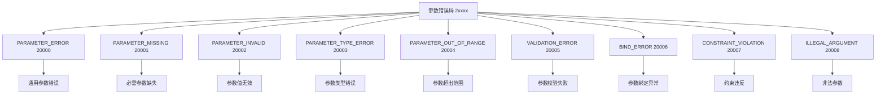
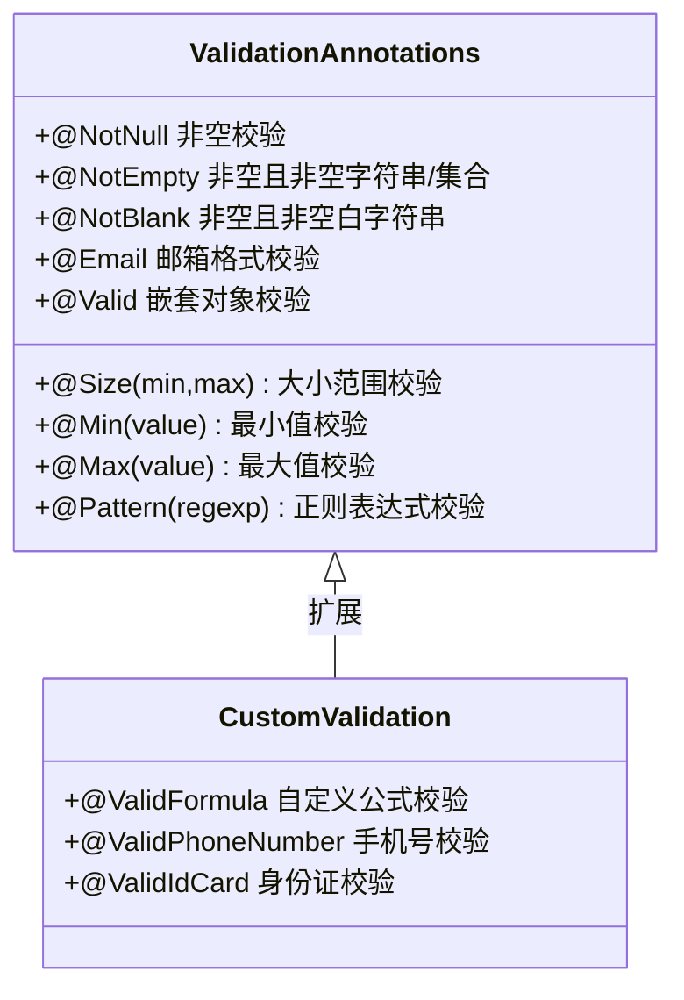
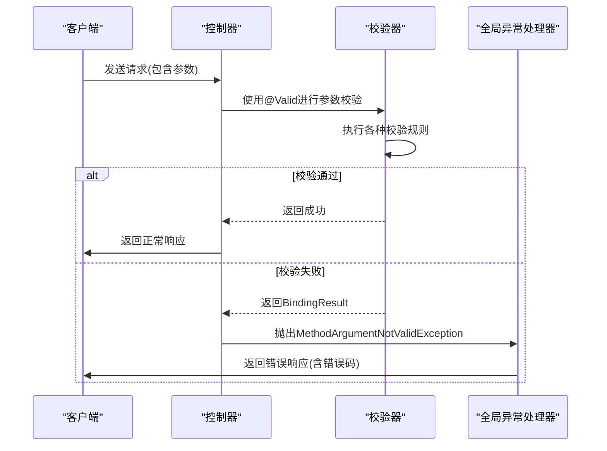
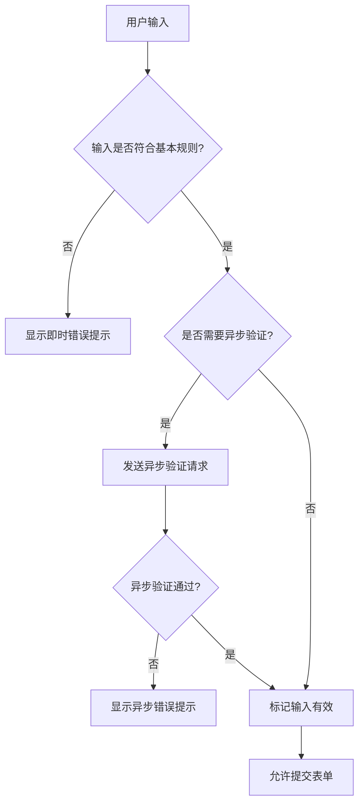
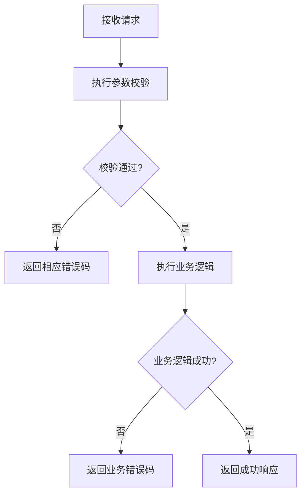
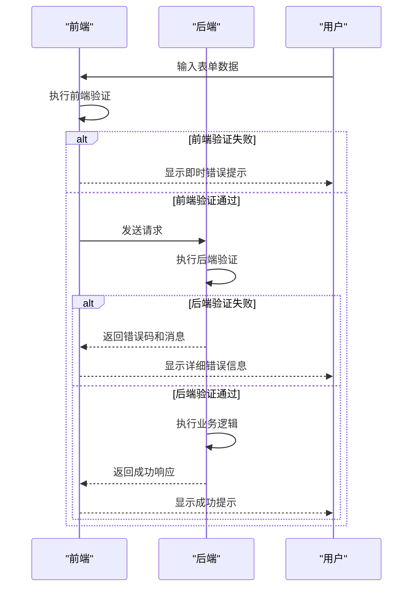
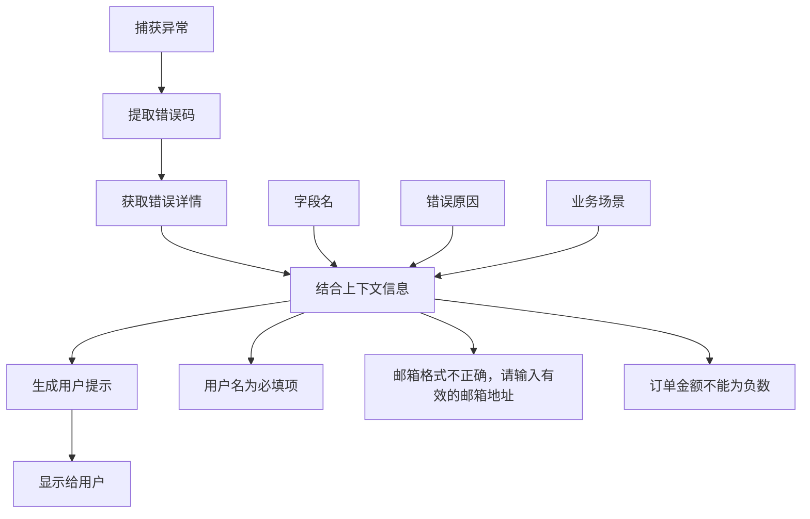

# 参数错误码

<cite>
**本文档引用的文件**   
- [ErrorCode.java](file://08-backend/src/main/java/com/enterprise/brain/common/constants/ErrorCode.java)
- [GlobalExceptionHandler.java](file://08-backend/src/main/java/com/enterprise/brain/common/exception/GlobalExceptionHandler.java)
- [ValidatorUtils.java](file://08-backend/src/main/java/com/enterprise/brain/common/utils/ValidatorUtils.java)
- [ValidFormula.java](file://08-backend/src/main/java/com/enterprise/brain/common/validation/annotation/ValidFormula.java)
- [ApiResponse.java](file://08-backend/src/main/java/com/enterprise/brain/common/response/ApiResponse.java)
- [error-codes.js](file://07-frontend/src/utils/error-handling/error-codes.js)
- [error-messages.js](file://07-frontend/src/utils/error-handling/error-messages.js)
- [input-validator.js](file://07-frontend/src/utils/validation/input-validator.js)
- [constraint-checker.js](file://07-frontend/src/utils/validation/constraint-checker.js)
- [data-validator.js](file://07-frontend/src/utils/data/data-validator.js)
</cite>

## 目录
1. [引言](#引言)
2. [参数错误码体系](#参数错误码体系)
3. [Spring Validation框架集成](#spring-validation框架集成)
4. [不同参数类型的校验策略](#不同参数类型的校验策略)
5. [前后端协同处理方案](#前后端协同处理方案)
6. [错误码与用户提示信息定位](#错误码与用户提示信息定位)
7. [结论](#结论)

## 引言

在企业级应用系统中，参数校验是确保数据完整性和系统稳定性的关键环节。本文档深入解析参数错误码（2xxxx）体系，涵盖PARAMETER_ERROR(20000)、MISSING(20001)、INVALID(20002)等具体码值。文档阐述这些错误码在Spring Validation框架集成中的应用，如何与@Valid注解和BindingResult配合使用。同时说明不同类型参数校验（路径参数、查询参数、请求体）对应的错误码选择策略，并提供前端表单验证与后端参数校验的协同处理方案，以及如何通过错误码实现精准的用户提示信息定位。

**Section sources**
- [ErrorCode.java](file://08-backend/src/main/java/com/enterprise/brain/common/constants/ErrorCode.java#L1-L104)

## 参数错误码体系

参数错误码体系是系统错误处理机制的重要组成部分，主要用于标识和处理客户端请求参数相关的各种错误情况。该体系采用五位数字编码规则，其中2xxxx系列专门用于参数相关的错误。

### 参数错误码分类

参数错误码体系包含多个层级的错误码，每个错误码都有明确的语义和使用场景：



**Diagram sources **
- [ErrorCode.java](file://08-backend/src/main/java/com/enterprise/brain/common/constants/ErrorCode.java#L18-L28)

### 错误码详细说明

#### PARAMETER_ERROR (20000)
这是参数错误的通用错误码，当无法确定具体错误类型时使用。它表示请求参数存在某种问题，但具体问题需要进一步分析。

#### PARAMETER_MISSING (20001)
此错误码表示必需的参数缺失。当API接口要求某个参数必须提供，但客户端请求中未包含该参数时，系统会返回此错误码。

#### PARAMETER_INVALID (20002)
此错误码表示参数值无效。当提供的参数值不符合预期格式或业务规则时使用，例如邮箱格式不正确、日期格式错误等。

#### PARAMETER_TYPE_ERROR (20003)
此错误码表示参数类型错误。当客户端提供的参数类型与API定义的类型不匹配时触发，例如期望数字类型但提供了字符串。

#### PARAMETER_OUT_OF_RANGE (20004)
此错误码表示参数值超出允许范围。当数值型参数超出预设的最大值或最小值，或字符串长度超出限制时使用。

#### VALIDATION_ERROR (20005)
此错误码表示参数校验失败。当使用Spring Validation框架进行参数校验，且校验未通过时返回此错误码。

#### BIND_ERROR (20006)
此错误码表示参数绑定异常。当Spring MVC在将请求参数绑定到控制器方法参数时发生错误时使用。

#### CONSTRAINT_VIOLATION (20007)
此错误码表示约束违反。当使用@Validated注解进行参数校验，且违反了定义的约束条件时返回。

#### ILLEGAL_ARGUMENT (20008)
此错误码表示非法参数。当参数值在逻辑上不合法或违反了业务规则时使用。

**Section sources**
- [ErrorCode.java](file://08-backend/src/main/java/com/enterprise/brain/common/constants/ErrorCode.java#L18-L28)

## Spring Validation框架集成

Spring Validation框架是Java企业应用中广泛使用的参数校验解决方案。它基于JSR-303/JSR-380规范，提供了丰富的注解来定义参数校验规则。

### 核心组件与注解

Spring Validation框架的核心是javax.validation包中的注解，这些注解可以直接应用于Java Bean的字段上，定义各种校验规则。



**Diagram sources **
- [ValidFormula.java](file://08-backend/src/main/java/com/enterprise/brain/common/validation/annotation/ValidFormula.java#L1-L50)

### @Valid注解与BindingResult配合使用

在Spring MVC控制器中，@Valid注解与BindingResult是参数校验的关键组合。@Valid注解用于标记需要校验的参数，而BindingResult用于捕获校验结果。



**Diagram sources **
- [GlobalExceptionHandler.java](file://08-backend/src/main/java/com/enterprise/brain/common/exception/GlobalExceptionHandler.java#L42-L50)
- [ValidatorUtils.java](file://08-backend/src/main/java/com/enterprise/brain/common/utils/ValidatorUtils.java#L33-L35)

### 全局异常处理机制

系统通过GlobalExceptionHandler类统一处理各种异常，包括参数校验异常。当参数校验失败时，系统会捕获相应的异常并返回标准化的错误响应。

```java
@ExceptionHandler(MethodArgumentNotValidException.class)
@ResponseStatus(HttpStatus.BAD_REQUEST)
public ApiResponse<Object> handleMethodArgumentNotValidException(MethodArgumentNotValidException e) {
    String message = e.getBindingResult().getFieldErrors().stream()
            .map(FieldError::getDefaultMessage)
            .collect(Collectors.joining("; "));
    log.error("参数校验失败: {}", message, e);
    return ApiResponse.fail("VALIDATION_ERROR", message);
}
```

上述代码展示了如何处理MethodArgumentNotValidException异常，提取校验错误信息，并返回包含错误码和错误消息的响应。

**Section sources**
- [GlobalExceptionHandler.java](file://08-backend/src/main/java/com/enterprise/brain/common/exception/GlobalExceptionHandler.java#L42-L50)
- [ApiResponse.java](file://08-backend/src/main/java/com/enterprise/brain/common/response/ApiResponse.java#L84-L92)

## 不同参数类型的校验策略

系统需要处理多种类型的参数，包括路径参数、查询参数和请求体参数。每种参数类型都有其特定的校验策略和最佳实践。

### 路径参数校验

路径参数是URL路径中的一部分，通常用于标识资源。对于路径参数的校验，主要关注参数的存在性和格式正确性。

```mermaid
flowchart TD
A[接收请求] --> B{路径参数是否存在?}
B --> |否| C[返回PARAMETER_MISSING(20001)]
B --> |是| D{参数格式是否正确?}
D --> |否| E[返回PARAMETER_INVALID(20002)]
D --> |是| F{参数类型是否匹配?}
F --> |否| G[返回PARAMETER_TYPE_ERROR(20003)]
F --> |是| H[继续处理请求]
```

**Diagram sources **
- [GlobalExceptionHandler.java](file://08-backend/src/main/java/com/enterprise/brain/common/exception/GlobalExceptionHandler.java#L55-L63)

### 查询参数校验

查询参数是URL中?后面的部分，通常用于过滤、排序和分页。查询参数的校验需要考虑参数的可选性、默认值和范围限制。

```mermaid
flowchart TD
A[解析查询参数] --> B{必需参数是否存在?}
B --> |否| C[返回PARAMETER_MISSING(20001)]
B --> |是| D{参数值是否在有效范围内?}
D --> |否| E[返回PARAMETER_OUT_OF_RANGE(20004)]
D --> |是| F{参数格式是否正确?}
F --> |否| G[返回PARAMETER_INVALID(20002)]
F --> |是| H[应用参数值并继续处理]
```

**Diagram sources **
- [ValidatorUtils.java](file://08-backend/src/main/java/com/enterprise/brain/common/utils/ValidatorUtils.java#L33-L35)

### 请求体参数校验

请求体参数通常用于POST、PUT等操作，包含复杂的数据结构。对于请求体参数的校验，使用Spring Validation框架的@Valid注解是最有效的方法。

```mermaid
flowchart TD
A[接收JSON请求体] --> B[反序列化为Java对象]
B --> C{对象是否符合@Valid注解规则?}
C --> |否| D[收集所有校验错误]
D --> E[返回VALIDATION_ERROR(20005)]
C --> |是| F{嵌套对象是否需要校验?}
F --> |是| G[递归校验嵌套对象]
G --> H{嵌套校验通过?}
H --> |否| I[返回VALIDATION_ERROR(20005)]
H --> |是| J[继续业务逻辑处理]
F --> |否| J
```

**Diagram sources **
- [GlobalExceptionHandler.java](file://08-backend/src/main/java/com/enterprise/brain/common/exception/GlobalExceptionHandler.java#L42-L50)

### 参数校验策略对比

| 参数类型 | 校验方式 | 错误码 | 适用场景 |
|---------|---------|-------|---------|
| 路径参数 | @PathVariable + 自定义校验 | PARAMETER_MISSING(20001)<br>PARAMETER_INVALID(20002) | 资源标识、单个简单参数 |
| 查询参数 | @RequestParam + @Valid | PARAMETER_MISSING(20001)<br>PARAMETER_OUT_OF_RANGE(20004) | 过滤、排序、分页参数 |
| 请求体参数 | @RequestBody + @Valid | VALIDATION_ERROR(20005)<br>CONSTRAINT_VIOLATION(20007) | 复杂数据结构、表单提交 |

**Section sources**
- [GlobalExceptionHandler.java](file://08-backend/src/main/java/com/enterprise/brain/common/exception/GlobalExceptionHandler.java#L42-L77)
- [ValidatorUtils.java](file://08-backend/src/main/java/com/enterprise/brain/common/utils/ValidatorUtils.java#L33-L35)

## 前后端协同处理方案

为了提供最佳的用户体验，前端表单验证与后端参数校验需要紧密协同。这种协同不仅提高了系统的响应速度，还增强了用户交互的友好性。

### 前端验证策略

前端验证主要在用户输入时即时进行，提供即时反馈，减少不必要的网络请求。



**Diagram sources **
- [input-validator.js](file://07-frontend/src/utils/validation/input-validator.js#L559-L626)
- [constraint-checker.js](file://07-frontend/src/utils/validation/constraint-checker.js#L98-L189)

### 后端验证策略

后端验证是系统安全的最后一道防线，确保所有进入业务逻辑的数据都符合预期。



**Diagram sources **
- [GlobalExceptionHandler.java](file://08-backend/src/main/java/com/enterprise/brain/common/exception/GlobalExceptionHandler.java#L42-L50)

### 协同处理流程

前后端协同处理的关键在于错误码的统一和错误消息的标准化。



**Diagram sources **
- [error-codes.js](file://07-frontend/src/utils/error-handling/error-codes.js#L1-L343)
- [error-messages.js](file://07-frontend/src/utils/error-handling/error-messages.js#L1-L800)

### 错误码映射机制

系统通过统一的错误码映射机制，确保前后端对同一错误情况使用相同的错误码。

```javascript
// 前端错误码定义
const errorCodes = {
  '20000': { code: '20000', name: 'PARAMETER_ERROR', category: 'parameter' },
  '20001': { code: '20001', name: 'PARAMETER_MISSING', category: 'parameter' },
  '20002': { code: '20002', name: 'PARAMETER_INVALID', category: 'parameter' },
  // ... 其他错误码
};
```

**Section sources**
- [error-codes.js](file://07-frontend/src/utils/error-handling/error-codes.js#L1-L343)
- [error-messages.js](file://07-frontend/src/utils/error-handling/error-messages.js#L1-L800)

## 错误码与用户提示信息定位

通过错误码实现精准的用户提示信息定位是提升用户体验的关键。系统采用多层次的错误处理机制，确保用户能够获得清晰、有用的信息。

### 错误码与用户提示的映射

系统建立了错误码与用户提示信息之间的映射关系，确保相同的错误情况在不同场景下提供一致的用户体验。

```mermaid
graph TD
A[错误码] --> B[错误类型]
B --> C[用户提示模板]
C --> D[个性化消息]
A1[20001] --> B1[参数缺失]
B1 --> C1[{{field}}为必填项]
C1 --> D1[用户名为必填项]
A2[20002] --> B2[参数无效]
B2 --> C2[{{field}}格式不正确]
C2 --> D2[邮箱格式不正确]
A3[20004] --> B3[参数超出范围]
B3 --> C3[{{field}}应在{{min}}到{{max}}之间]
C3 --> D3[年龄应在18到65之间]
```

**Diagram sources **
- [error-messages.js](file://07-frontend/src/utils/error-handling/error-messages.js#L262-L325)

### 多语言支持

系统支持多语言环境，通过错误码实现不同语言的用户提示信息定位。

```javascript
const errorMessages = {
  'zh-CN': {
    '20001': '{{field}}为必填项',
    '20002': '{{field}}格式不正确',
    '20004': '{{field}}应在{{min}}到{{max}}之间'
  },
  'en-US': {
    '20001': '{{field}} is required',
    '20002': '{{field}} format is invalid',
    '20004': '{{field}} should be between {{min}} and {{max}}'
  }
};
```

**Section sources**
- [error-messages.js](file://07-frontend/src/utils/error-handling/error-messages.js#L262-L325)

### 上下文感知的错误提示

系统能够根据错误发生的上下文提供更加精准的提示信息。



**Diagram sources **
- [error-messages.js](file://07-frontend/src/utils/error-handling/error-messages.js#L284-L358)

### 错误提示的分级显示

系统根据错误的严重程度和类型，采用不同的方式显示错误提示。

| 错误级别 | 显示方式 | 用户操作建议 |
|---------|---------|------------|
| 高 | 模态对话框、红色边框 | 立即修正错误 |
| 中 | 内联提示、黄色边框 | 建议修正错误 |
| 低 | 状态栏提示、蓝色边框 | 可选修正错误 |

**Section sources**
- [error-messages.js](file://07-frontend/src/utils/error-handling/error-messages.js#L262-L325)

## 结论

参数错误码体系是企业级应用系统中不可或缺的组成部分，它不仅提供了标准化的错误处理机制，还为前后端协同工作奠定了基础。通过深入分析参数错误码（2xxxx）体系，我们了解到PARAMETER_ERROR(20000)、MISSING(20001)、INVALID(20002)等具体码值的使用场景和语义。

Spring Validation框架的集成使得参数校验变得更加简单和可靠。通过@Valid注解与BindingResult的配合使用，系统能够自动完成复杂的参数校验任务，并通过全局异常处理器返回标准化的错误响应。

针对不同类型的参数（路径参数、查询参数、请求体），系统采用了相应的校验策略，确保各种场景下的参数都能得到适当的验证。前端表单验证与后端参数校验的协同处理方案，不仅提高了系统的性能，还极大地改善了用户体验。

通过错误码实现精准的用户提示信息定位，使得系统能够根据具体的错误情况提供清晰、有用的信息。多语言支持和上下文感知的错误提示机制，进一步提升了系统的国际化能力和用户体验。

总之，一个完善的参数错误码体系和校验机制，是构建健壮、易用的企业级应用系统的关键。它不仅保障了数据的完整性和系统的稳定性，还为用户提供了一致、友好的交互体验。