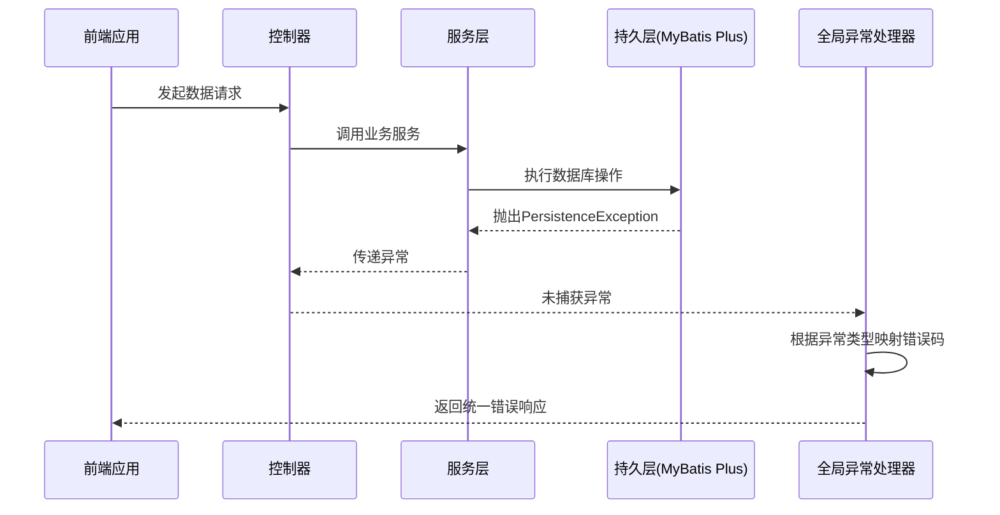
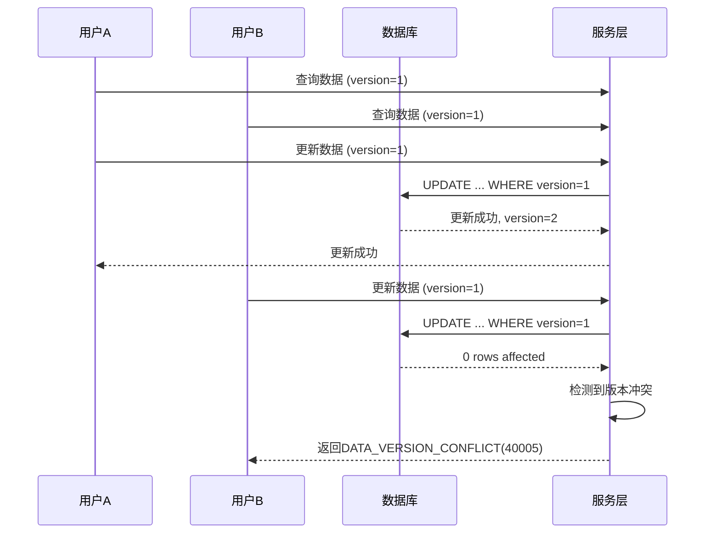
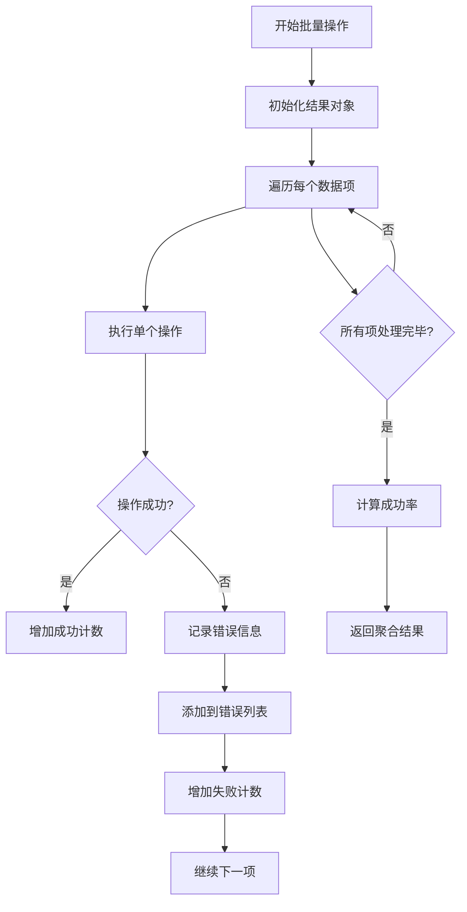

# 数据错误码

<cite>
**本文档引用的文件**   
- [error-codes.js](file://07-frontend/src/utils/error-handling/error-codes.js)
- [ErrorCode.java](file://08-backend/src/main/java/com/enterprise/brain/common/constants/ErrorCode.java)
- [GlobalExceptionHandler.java](file://08-backend/src/main/java/com/enterprise/brain/common/exception/GlobalExceptionHandler.java)
- [BaseEntity.java](file://08-backend/src/main/java/com/enterprise/brain/common/base/BaseEntity.java)
- [data-integrity.js](file://07-frontend/src/utils/validation/data-integrity.js)
- [business-rules.js](file://07-frontend/src/utils/validation/business-rules.js)
- [constraint-checker.js](file://07-frontend/src/utils/validation/constraint-checker.js)
</cite>

## 目录
1. [引言](#引言)
2. [数据错误码定义与分类](#数据错误码定义与分类)
3. [MyBatis Plus持久层错误处理](#mybatis-plus持久层错误处理)
4. [数据库约束与错误码关联](#数据库约束与错误码关联)
5. [乐观锁与版本冲突处理](#乐观锁与版本冲突处理)
6. [数据完整性校验实现](#数据完整性校验实现)
7. [批量操作错误聚合处理](#批量操作错误聚合处理)
8. [结论](#结论)

## 引言

本文档全面解析企业级应用中数据相关错误码（4xxxx系列）的使用场景和技术实现。重点阐述DATA_NOT_FOUND(40000)、ALREADY_EXISTS(40001)、DATABASE_ERROR(40004)等核心错误码在MyBatis Plus持久层操作中的触发条件，以及它们如何与数据库约束（如唯一索引、外键）协同工作。同时，深入探讨乐观锁机制下DATA_VERSION_CONFLICT(40005)的处理策略，数据完整性校验的业务实现，以及批量操作时数据错误码的聚合处理方案。

**文档来源**
- [error-codes.js](file://07-frontend/src/utils/error-handling/error-codes.js)
- [ErrorCode.java](file://08-backend/src/main/java/com/enterprise/brain/common/constants/ErrorCode.java)

## 数据错误码定义与分类

系统中的错误码采用分层分类管理，数据错误码（4xxxx系列）专门用于标识数据操作相关的异常情况。这些错误码在前后端统一定义，确保错误信息的一致性。

### 核心数据错误码

| 错误码 | 名称 | HTTP状态码 | 描述 | 使用场景 |
| :--- | :--- | :--- | :--- | :--- |
| 40000 | DATA_NOT_FOUND | 404 | 请求的数据不存在或已被删除 | 查询操作中根据ID或条件未找到匹配记录 |
| 40001 | DATA_ALREADY_EXISTS | 409 | 提交的数据已存在，违反唯一性约束 | 插入操作时唯一索引或主键冲突 |
| 40002 | DATA_CONFLICT | 409 | 数据已被其他用户修改，存在冲突 | 并发更新时检测到数据不一致 |
| 40003 | DATA_INTEGRITY_VIOLATION | 400 | 违反数据完整性约束 | 外键约束、非空约束等数据库约束被破坏 |
| 40004 | DATABASE_ERROR | 500 | 数据库操作失败 | SQL执行异常、连接失败等底层数据库错误 |
| 40005 | DATA_VERSION_CONFLICT | 409 | 数据版本冲突，乐观锁检查失败 | 基于版本号的并发控制失败 |

**错误码定义来源**
- [ErrorCode.java](file://08-backend/src/main/java/com/enterprise/brain/common/constants/ErrorCode.java#L42-L48)
- [error-codes.js](file://07-frontend/src/utils/error-handling/error-codes.js#L150-L225)

## MyBatis Plus持久层错误处理

MyBatis Plus作为核心的持久层框架，其异常处理机制与系统错误码体系紧密集成。当持久层操作发生异常时，全局异常处理器会捕获并转换为相应的业务错误码。

### 异常处理流程



**Diagram sources**
- [GlobalExceptionHandler.java](file://08-backend/src/main/java/com/enterprise/brain/common/exception/GlobalExceptionHandler.java)
- [ApiResponse.java](file://08-backend/src/main/java/com/enterprise/brain/common/response/ApiResponse.java)

**Section sources**
- [GlobalExceptionHandler.java](file://08-backend/src/main/java/com/enterprise/brain/common/exception/GlobalExceptionHandler.java#L39-L118)
- [ApiResponse.java](file://08-backend/src/main/java/com/enterprise/brain/common/response/ApiResponse.java#L74-L92)

## 数据库约束与错误码关联

数据库的物理约束（如唯一索引、外键）是保证数据一致性的基础。当应用层操作违反这些约束时，会触发相应的数据库异常，并被映射为特定的错误码。

### 约束类型与错误码映射

```mermaid
flowchart TD
A[数据库操作] --> B{操作类型}
B --> C[INSERT/UPDATE]
B --> D[DELETE]
C --> E{是否违反约束?}
E --> |唯一索引冲突| F[DATA_ALREADY_EXISTS(40001)]
E --> |外键约束冲突| G[DATA_INTEGRITY_VIOLATION(40003)]
E --> |非空约束冲突| G
E --> |无冲突| H[操作成功]
D --> I{是否存在引用?}
I --> |存在引用| G
I --> |无引用| J[操作成功]
```

**Diagram sources**
- [BaseEntity.java](file://08-backend/src/main/java/com/enterprise/brain/common/base/BaseEntity.java#L46-L51)
- [data-integrity.js](file://07-frontend/src/utils/validation/data-integrity.js#L64-L83)

**Section sources**
- [BaseEntity.java](file://08-backend/src/main/java/com/enterprise/brain/common/base/BaseEntity.java#L22-L52)
- [data-integrity.js](file://07-frontend/src/utils/validation/data-integrity.js#L64-L83)

## 乐观锁与版本冲突处理

系统采用乐观锁机制来解决并发更新问题。通过在实体类中添加版本号字段，实现数据更新时的版本检查，防止"丢失更新"问题。

### 版本冲突处理策略



**Diagram sources**
- [BaseEntity.java](file://08-backend/src/main/java/com/enterprise/brain/common/base/BaseEntity.java#L25-L32)
- [GlobalExceptionHandler.java](file://08-backend/src/main/java/com/enterprise/brain/common/exception/GlobalExceptionHandler.java#L100-L107)

**Section sources**
- [BaseEntity.java](file://08-backend/src/main/java/com/enterprise/brain/common/base/BaseEntity.java#L25-L32)
- [GlobalExceptionHandler.java](file://08-backend/src/main/java/com/enterprise/brain/common/exception/GlobalExceptionHandler.java#L100-L107)

## 数据完整性校验实现

数据完整性校验分为应用层校验和数据库层校验两个层面。应用层校验提供友好的用户反馈，数据库层校验作为最终的数据保护屏障。

### 完整性校验层次

```mermaid
graph TD
A[客户端] --> B[应用层校验]
B --> C{校验通过?}
C --> |否| D[返回DATA_VALIDATION_FAILED(3001)]
C --> |是| E[持久层操作]
E --> F[数据库约束检查]
F --> G{检查通过?}
G --> |否| H[返回4xxxx系列错误码]
G --> |是| I[操作成功]
style B fill:#f9f,stroke:#333
style F fill:#bbf,stroke:#333
```

**Diagram sources**
- [business-rules.js](file://07-frontend/src/utils/validation/business-rules.js#L73-L77)
- [constraint-checker.js](file://07-frontend/src/utils/validation/constraint-checker.js#L135-L147)

**Section sources**
- [business-rules.js](file://07-frontend/src/utils/validation/business-rules.js#L73-L77)
- [constraint-checker.js](file://07-frontend/src/utils/validation/constraint-checker.js#L135-L147)

## 批量操作错误聚合处理

在执行批量数据操作时，系统采用聚合处理策略，收集所有失败项的错误信息，而不是在遇到第一个错误时就中断整个操作。

### 批量操作错误处理流程



**Diagram sources**
- [SyncResponse.java](file://08-backend/src/main/java/com/enterprise/brain/modules/integration/ecommerce/dto/response/SyncResponse.java#L207-L227)
- [data-sync.js](file://07-frontend/src/utils/integration/data-sync.js#L699-L704)

**Section sources**
- [SyncResponse.java](file://08-backend/src/main/java/com/enterprise/brain/modules/integration/ecommerce/dto/response/SyncResponse.java#L189-L313)
- [data-sync.js](file://07-frontend/src/utils/integration/data-sync.js#L699-L704)

## 结论

本文档详细解析了数据错误码（4xxxx系列）的技术实现和使用场景。通过MyBatis Plus与数据库约束的紧密结合，系统能够精确地识别和处理各种数据操作异常。乐观锁机制有效解决了并发更新问题，而多层次的数据完整性校验确保了数据的准确性和一致性。批量操作的错误聚合处理策略提升了用户体验和系统健壮性。这些机制共同构成了一个可靠的数据操作错误处理体系。