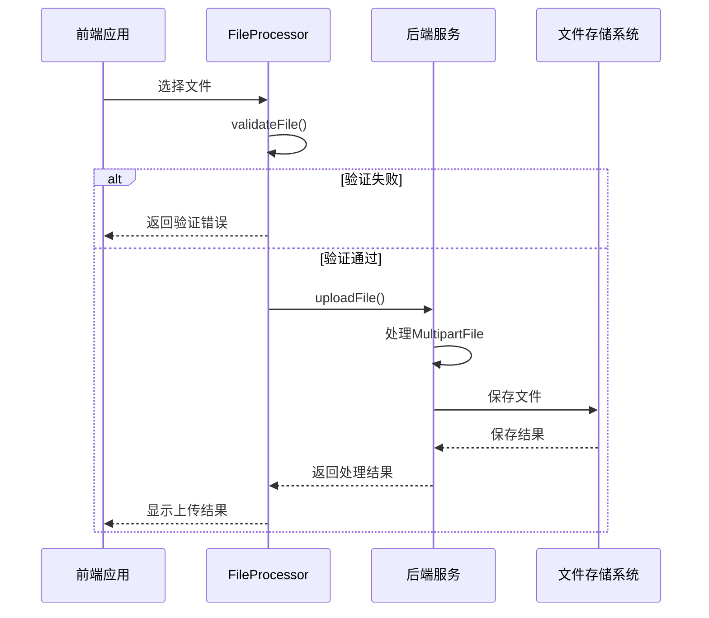
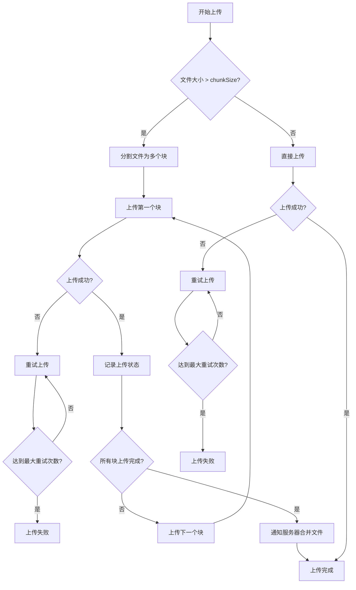
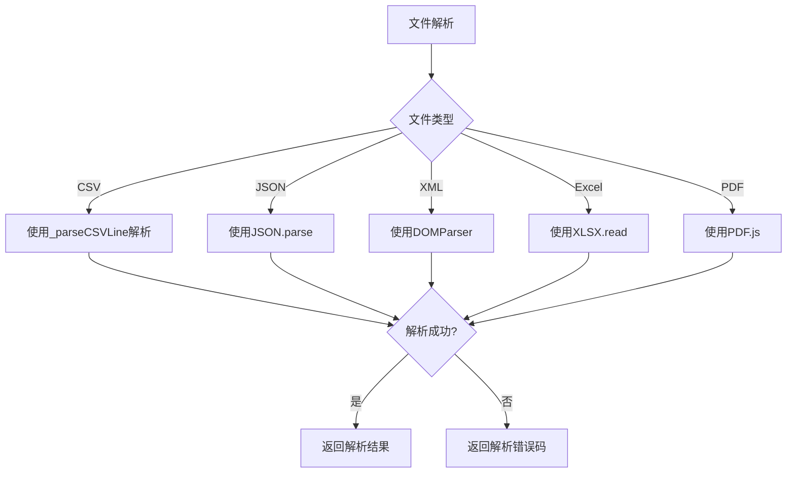

# 文件错误码

<cite>
**本文档引用的文件**   
- [error-codes.js](file://07-frontend/src/utils/error-handling/error-codes.js)
- [file-processor.js](file://07-frontend/src/utils/integration/file-processor.js)
- [import-utils.js](file://07-frontend/src/services/utils/import-utils.js)
- [DataProcessController.java](file://08-backend/src/main/java/com/enterprise/brain/modules/ai/controller/DataProcessController.java)
- [AITrainingController.java](file://08-backend/src/main/java/com/enterprise/brain/modules/ai/controller/AITrainingController.java)
</cite>

## 目录
1. [文件操作错误码设计](#文件操作错误码设计)
2. [文件服务模块集成](#文件服务模块集成)
3. [大文件上传与断点续传](#大文件上传与断点续传)
4. [文件解析异常处理](#文件解析异常处理)
5. [错误码处理策略](#错误码处理策略)

## 文件操作错误码设计

系统中的文件操作错误码范围为6000-6999，专门用于处理文件上传、下载和解析过程中的各种异常情况。这些错误码在前端和后端之间保持一致，确保错误信息的统一性和可追溯性。

文件操作错误类别在系统中被定义为'file'，包含多个具体的错误码：

- **FILE_UPLOAD_FAILED(60002)**：文件上传失败，表示在上传过程中发生了不可恢复的错误。
- **FILE_SIZE_EXCEEDED(60004)**：文件大小超过限制，当上传的文件超过系统设定的大小限制时触发。
- **FILE_TYPE_NOT_ALLOWED(60005)**：文件类型不被允许，当上传的文件格式不在系统支持的列表中时触发。

这些错误码的设计遵循统一的结构，包含错误代码、名称、分类、严重程度、用户提示信息和自动恢复策略等属性。例如，FILE_UPLOAD_FAILED错误的严重程度为'high'，表示这是一个高优先级的错误，需要用户立即关注并采取行动。

**Section sources**
- [error-codes.js](file://07-frontend/src/utils/error-handling/error-codes.js#L325-L371)

## 文件服务模块集成

文件服务模块通过MultipartFile接口与Spring Boot后端集成，实现了文件上传和处理的完整流程。在后端控制器中，如DataProcessController和AITrainingController，使用@RequestParam("file") MultipartFile file参数来接收上传的文件。

前端通过FileProcessor工具类与后端文件服务进行交互。该工具类提供了文件验证、上传、下载和解析等功能。在上传文件时，前端会先对文件进行本地验证，包括文件大小和类型检查，然后通过HTTP请求将文件发送到后端。

文件上传的流程如下：
1. 用户选择文件后，前端使用FileProcessor.validateFile方法验证文件。
2. 如果验证通过，调用FileProcessor.uploadFile方法上传文件。
3. 上传过程中，可以监听进度事件，提供实时的上传进度反馈。
4. 上传完成后，后端返回处理结果，前端根据结果进行相应的处理。

这种集成方式确保了文件操作的可靠性和用户体验的流畅性。

**Diagram sources **
- [file-processor.js](file://07-frontend/src/utils/integration/file-processor.js#L169-L198)
- [DataProcessController.java](file://08-backend/src/main/java/com/enterprise/brain/modules/ai/controller/DataProcessController.java#L19-L47)

**Section sources**
- [file-processor.js](file://07-frontend/src/utils/integration/file-processor.js#L69-L151)
- [DataProcessController.java](file://08-backend/src/main/java/com/enterprise/brain/modules/ai/controller/DataProcessController.java#L19-L116)

## 大文件上传与断点续传

对于大文件上传，系统实现了分块上传和断点续传机制，以提高上传的可靠性和用户体验。当文件大小超过配置的chunkSize（默认5MB）时，系统会自动启用分块上传。

分块上传的工作原理如下：
1. 文件被分割成多个固定大小的块（chunks）。
2. 每个块独立上传，上传时携带文件ID、块索引和总块数等元数据。
3. 服务器端接收并存储每个块，同时记录上传状态。
4. 所有块上传完成后，服务器端将它们合并成完整的文件。

断点续传功能允许在上传中断后从中断处继续上传，而不是重新开始。这通过以下机制实现：
- 每个上传任务都有唯一的fileId，用于标识和跟踪。
- 服务器端记录每个文件的已上传块信息。
- 当上传重新开始时，客户端先查询已上传的块，然后只上传剩余的块。

系统还实现了上传重试机制，当某个块上传失败时，会自动重试，最多重试次数由retryAttempts配置（默认3次），重试间隔由retryDelay配置（默认1000毫秒）。

**Diagram sources **
- [file-processor.js](file://07-frontend/src/utils/integration/file-processor.js#L725-L795)

**Section sources**
- [file-processor.js](file://07-frontend/src/utils/integration/file-processor.js#L725-L803)

## 文件解析异常处理

系统对不同类型的文件解析异常进行了详细的错误码映射和处理。对于Excel、PDF等格式文件的解析，系统采用了专门的库和策略来处理可能的格式错误。

在前端，import-utils.js提供了对多种文件格式的解析支持：
- CSV文件解析：使用自定义的CSV解析器，支持不同的分隔符和引号处理。
- JSON文件解析：使用JSON.parse方法，并捕获解析异常。
- XML文件解析：使用DOMParser进行解析，并检查解析错误。
- Excel文件解析：虽然当前实现提示需要专门的库支持，但预留了使用xlsx等库的接口。

当文件解析发生异常时，系统会返回相应的错误码。例如，JSON解析失败会触发特定的错误码，XML解析错误也会有专门的错误处理机制。

对于Excel文件，系统建议使用xlsx库进行解析，该库能够处理复杂的Excel格式，包括公式、样式和多工作表等。解析过程包括：
1. 读取文件为ArrayBuffer。
2. 使用XLSX.read方法解析Excel文件。
3. 提取指定工作表的数据。
4. 转换为JSON格式返回。

**Diagram sources **
- [import-utils.js](file://07-frontend/src/services/utils/import-utils.js#L43-L193)

**Section sources**
- [import-utils.js](file://07-frontend/src/services/utils/import-utils.js#L43-L193)
- [file-processor.js](file://07-frontend/src/utils/integration/file-processor.js#L327-L401)

## 错误码处理策略

系统对文件操作错误码的处理采用了分层策略，包括前端验证、后端验证和用户反馈三个层面。

在前端层面，FileProcessor类在上传前会对文件进行预验证：
- 检查文件大小是否超过限制
- 验证文件类型是否在允许列表中
- 确认文件不为空

这些预验证可以避免不必要的网络请求，提高系统效率。如果预验证失败，会立即返回相应的错误码，如FILE_SIZE_EXCEEDED或FILE_TYPE_NOT_ALLOWED。

在后端层面，Spring Boot的MultipartFile机制会自动处理文件上传过程中的异常，并通过全局异常处理器返回标准化的错误响应。后端还会进行额外的业务逻辑验证，确保文件内容符合业务要求。

用户反馈方面，系统根据错误的严重程度提供不同的处理建议：
- 对于可恢复的错误（如网络问题），提供重试选项
- 对于配置错误，提供修改建议
- 对于不可恢复的错误，提供联系技术支持的指引

此外，系统还实现了错误统计和监控功能，可以跟踪各类错误的发生频率和趋势，为系统优化提供数据支持。

**Section sources**
- [error-codes.js](file://07-frontend/src/utils/error-handling/error-codes.js#L414-L542)
- [file-processor.js](file://07-frontend/src/utils/integration/file-processor.js#L69-L151)