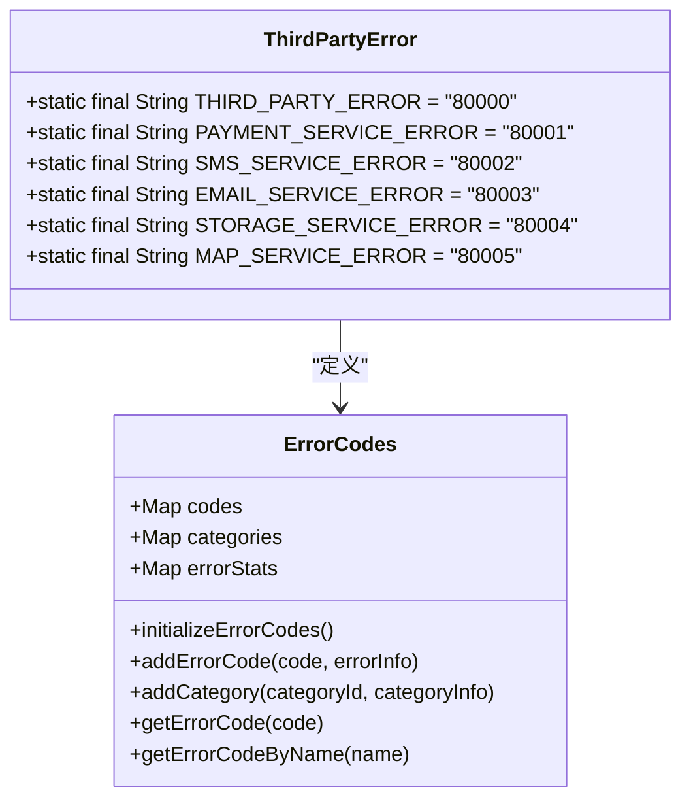
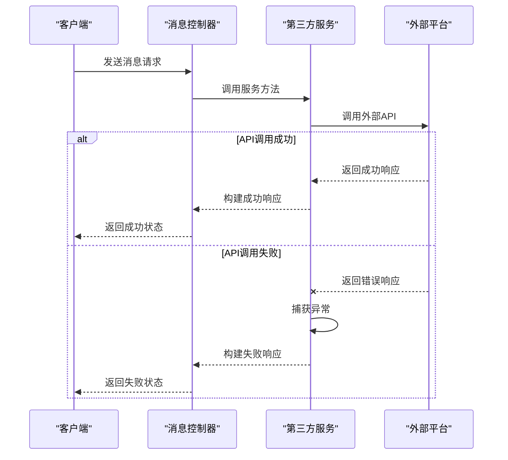
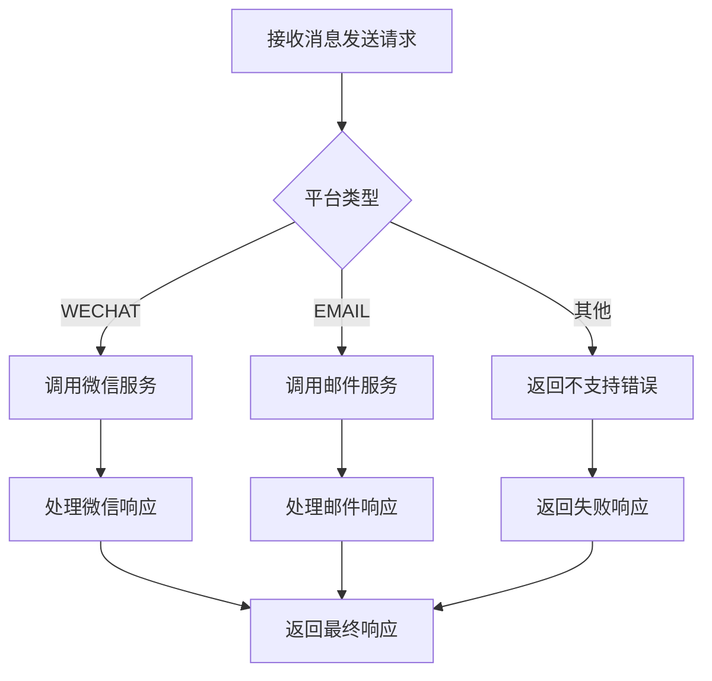

# 第三方服务错误码

<cite>
**本文档引用的文件**   
- [ErrorCode.java](file://08-backend/src/main/java/com/enterprise/brain/common/constants/ErrorCode.java)
- [error-codes.js](file://07-frontend/src/utils/error-handling/error-codes.js)
- [WechatServiceImpl.java](file://08-backend/src/main/java/com/enterprise/brain/modules/integration/messaging/service/impl/WechatServiceImpl.java)
- [TeamsServiceImpl.java](file://08-backend/src/main/java/com/enterprise/brain/modules/integration/messaging/service/impl/TeamsServiceImpl.java)
- [MessagingController.java](file://08-backend/src/main/java/com/enterprise/brain/modules/integration/messaging/controller/MessagingController.java)
</cite>

## 目录
1. [引言](#引言)
2. [第三方服务错误码体系](#第三方服务错误码体系)
3. [外部API调用失败处理规范](#外部api调用失败处理规范)
4. [第三方服务错误信息封装](#第三方服务错误信息封装)
5. [差异化错误处理策略](#差异化错误处理策略)
6. [错误码映射表设计](#错误码映射表设计)
7. [结论](#结论)

## 引言
本文档全面介绍系统中第三方服务集成相关的错误码（8xxxx）体系，包括PAYMENT_SERVICE_ERROR(80001)、SMS_SERVICE_ERROR(80002)等。详细说明这些错误码在外部API调用失败时的使用规范，如何封装第三方服务的原始错误信息，阐述不同第三方服务（支付、短信、邮件）错误处理的差异化策略，并提供错误码映射表的设计方案，以实现第三方错误码到系统内部错误码的转换。

**Section sources**
- [ErrorCode.java](file://08-backend/src/main/java/com/enterprise/brain/common/constants/ErrorCode.java#L87-L94)
- [error-codes.js](file://07-frontend/src/utils/error-handling/error-codes.js#L373-L408)

## 第三方服务错误码体系
系统采用分层的错误码体系，其中8xxxx系列专门用于第三方服务集成错误。根据代码分析，该体系包含以下核心错误码：

- **THIRD_PARTY_ERROR (80000)**: 第三方服务错误的通用错误码
- **PAYMENT_SERVICE_ERROR (80001)**: 支付服务相关错误
- **SMS_SERVICE_ERROR (80002)**: 短信服务相关错误
- **EMAIL_SERVICE_ERROR (80003)**: 邮件服务相关错误
- **STORAGE_SERVICE_ERROR (80004)**: 存储服务相关错误
- **MAP_SERVICE_ERROR (80005)**: 地图服务相关错误

这些错误码在后端Java代码和前端JavaScript代码中保持一致，确保了全栈错误处理的一致性。错误码8xxxx系列位于错误码体系的最高层级之一，专门用于标识与外部系统集成时发生的故障。

**Diagram sources**
- [ErrorCode.java](file://08-backend/src/main/java/com/enterprise/brain/common/constants/ErrorCode.java#L87-L94)
- [error-codes.js](file://07-frontend/src/utils/error-handling/error-codes.js#L373-L408)

**Section sources**
- [ErrorCode.java](file://08-backend/src/main/java/com/enterprise/brain/common/constants/ErrorCode.java#L87-L94)
- [error-codes.js](file://07-frontend/src/utils/error-handling/error-codes.js#L373-L408)

## 外部API调用失败处理规范
当系统调用外部API失败时，遵循一套标准化的处理流程。以微信服务和Teams服务的实现为例，系统采用try-catch异常处理机制来捕获和处理API调用过程中的异常。

在`WechatServiceImpl`中，当调用微信API发送消息时，系统会捕获`HttpClientErrorException`和通用`Exception`，并返回包含失败状态的响应对象。同样，在`TeamsServiceImpl`中也采用了类似的异常处理模式。

**Diagram sources**
- [WechatServiceImpl.java](file://08-backend/src/main/java/com/enterprise/brain/modules/integration/messaging/service/impl/WechatServiceImpl.java#L26-L51)
- [TeamsServiceImpl.java](file://08-backend/src/main/java/com/enterprise/brain/modules/integration/messaging/service/impl/TeamsServiceImpl.java#L116-L122)
- [MessagingController.java](file://08-backend/src/main/java/com/enterprise/brain/modules/integration/messaging/controller/MessagingController.java#L97-L103)

**Section sources**
- [WechatServiceImpl.java](file://08-backend/src/main/java/com/enterprise/brain/modules/integration/messaging/service/impl/WechatServiceImpl.java#L26-L51)
- [TeamsServiceImpl.java](file://08-backend/src/main/java/com/enterprise/brain/modules/integration/messaging/service/impl/TeamsServiceImpl.java#L116-L122)
- [MessagingController.java](file://08-backend/src/main/java/com/enterprise/brain/modules/integration/messaging/controller/MessagingController.java#L97-L103)

## 第三方服务错误信息封装
系统通过统一的响应对象来封装第三方服务的错误信息。`MessageSendResponse`构建器模式被广泛用于创建标准化的响应对象，包含以下关键属性：

- **success**: 布尔值，表示操作是否成功
- **status**: 状态码（如"SUCCESS"或"FAILED"）
- **message**: 人类可读的错误消息
- **platformResponse**: 第三方平台返回的原始响应
- **messageId**: 消息唯一标识符

这种封装方式确保了无论底层第三方服务返回何种格式的错误信息，上层应用都能获得一致的错误处理接口。在`MessagingController`中，当发生异常时，系统会创建包含详细错误信息的响应对象，包括异常消息和测试失败原因等。

**Section sources**
- [WechatServiceImpl.java](file://08-backend/src/main/java/com/enterprise/brain/modules/integration/messaging/service/impl/WechatServiceImpl.java#L45-L50)
- [TeamsServiceImpl.java](file://08-backend/src/main/java/com/enterprise/brain/modules/integration/messaging/service/impl/TeamsServiceImpl.java#L118-L122)
- [MessagingController.java](file://08-backend/src/main/java/com/enterprise/brain/modules/integration/messaging/controller/MessagingController.java#L188-L195)

## 差异化错误处理策略
不同类型的第三方服务采用差异化的错误处理策略。系统通过平台类型枚举来区分不同的服务，并应用相应的处理逻辑。

在`MessagingController`的`sendTemplateMessage`方法中，系统根据`request.getPlatformType()`的值来决定调用哪个具体的服务实现：

这种策略模式允许系统灵活地扩展对新第三方服务的支持，而无需修改核心消息发送逻辑。每种服务类型可以有自己的错误处理特性，例如微信服务可能需要处理特定的认证错误，而邮件服务可能需要处理SMTP连接错误。

**Diagram sources**
- [MessagingController.java](file://08-backend/src/main/java/com/enterprise/brain/modules/integration/messaging/controller/MessagingController.java#L114-L127)

**Section sources**
- [MessagingController.java](file://08-backend/src/main/java/com/enterprise/brain/modules/integration/messaging/controller/MessagingController.java#L114-L127)

## 错误码映射表设计
为了实现第三方错误码到系统内部错误码的转换，建议设计一个错误码映射表。该映射表应包含以下字段：

| 字段名 | 类型 | 描述 |
|-------|------|------|
| id | Long | 主键ID |
| externalErrorCode | String | 第三方服务错误码 |
| externalErrorMessage | String | 第三方服务错误消息 |
| internalErrorCode | String | 系统内部错误码(8xxxx) |
| serviceType | String | 服务类型(PAYMENT, SMS, EMAIL等) |
| recoveryStrategy | String | 恢复策略(AUTO_RETRY, MANUAL_REVIEW等) |
| description | String | 错误描述 |
| createdAt | DateTime | 创建时间 |
| updatedAt | DateTime | 更新时间 |

映射表的设计应支持动态配置，允许管理员根据第三方服务的变更及时更新映射关系。系统在接收到第三方服务的错误响应后，可以通过查询此映射表来确定应使用的内部错误码和相应的处理策略。

**Section sources**
- [ErrorCode.java](file://08-backend/src/main/java/com/enterprise/brain/common/constants/ErrorCode.java#L87-L94)

## 结论
本文档详细介绍了系统中第三方服务集成的错误码体系和相关处理规范。通过8xxxx系列错误码，系统能够清晰地区分第三方服务错误与其他类型的错误。标准化的错误信息封装和差异化的处理策略确保了系统在面对不同第三方服务时的灵活性和可靠性。建议实施错误码映射表来实现第三方错误码到系统内部错误码的转换，提高错误处理的自动化程度和一致性。