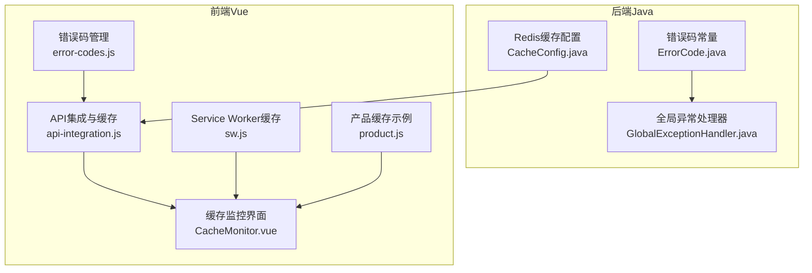
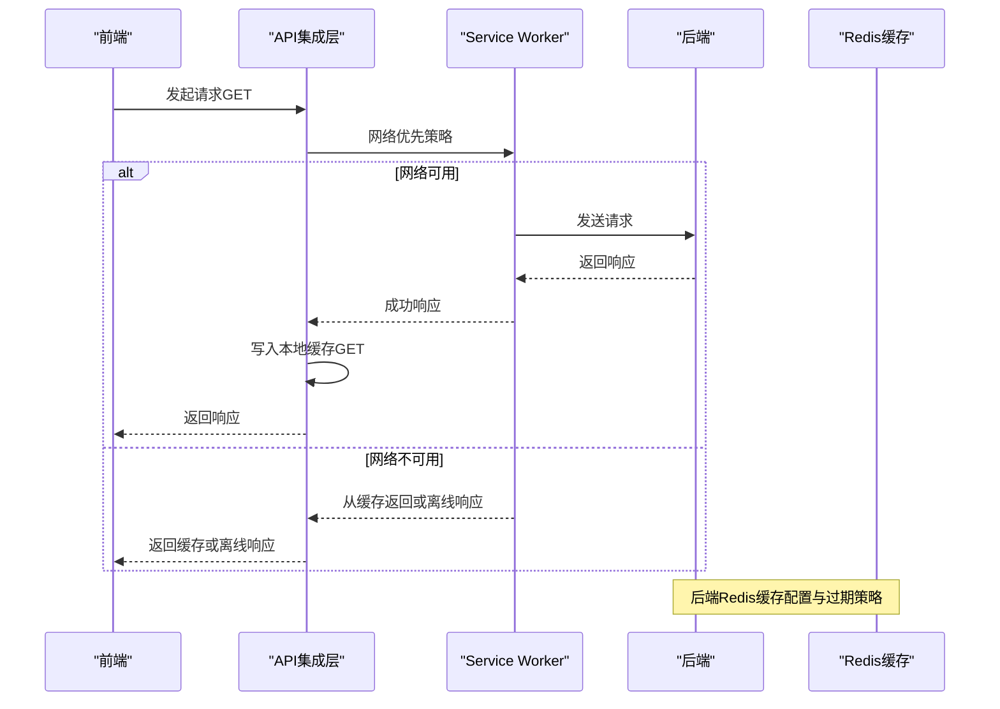
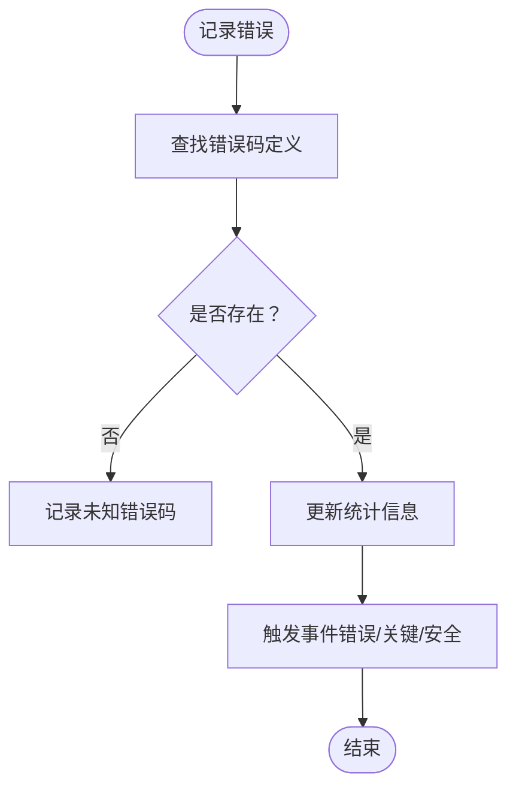
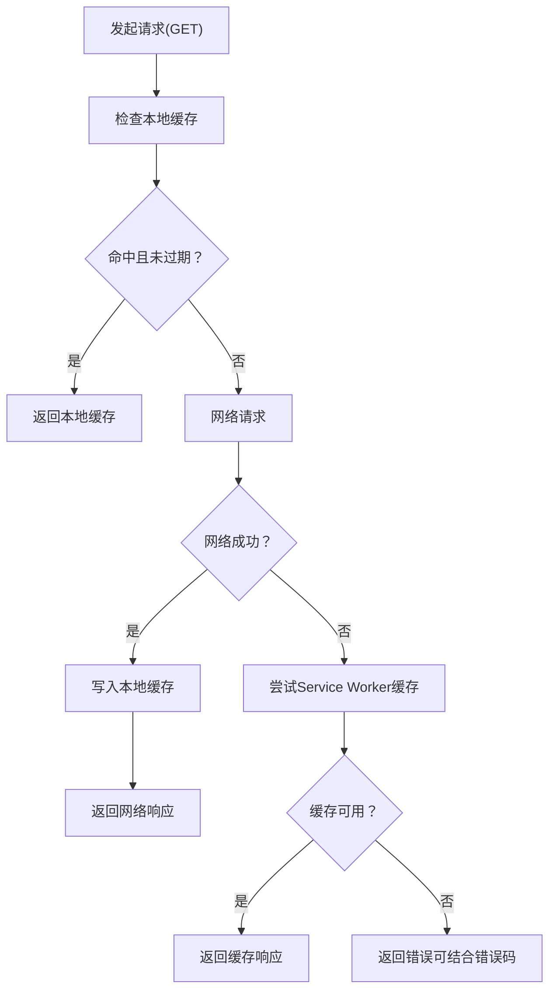
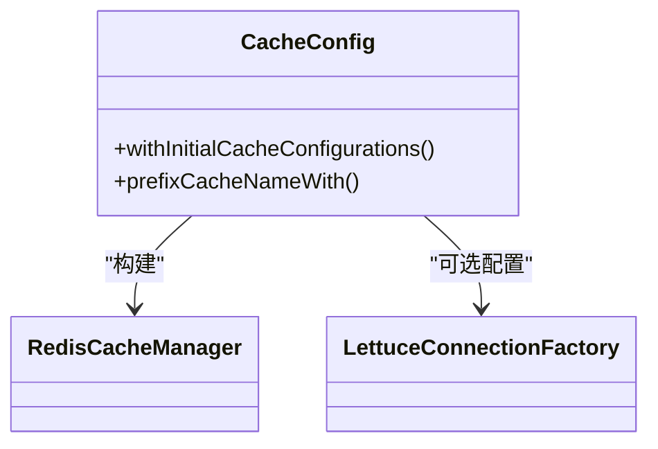
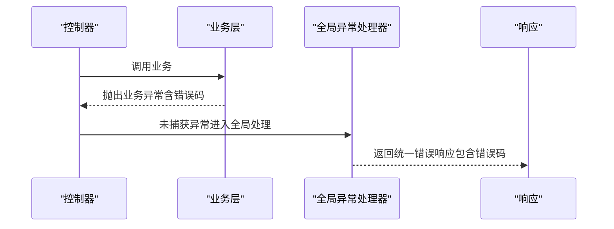
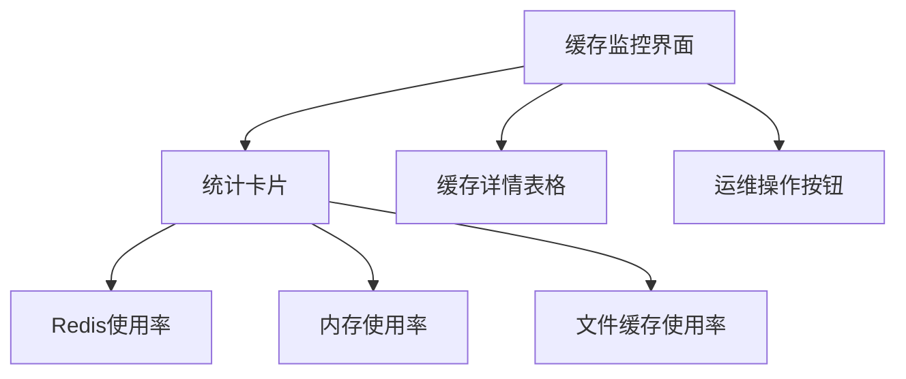
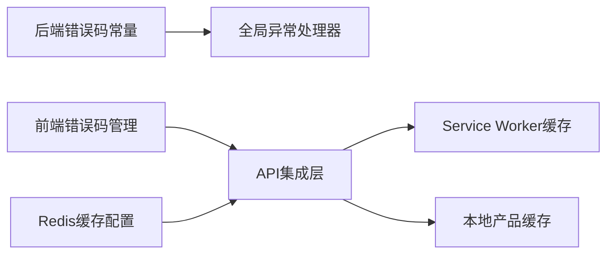

# 缓存错误码

<cite>
**本文引用的文件**
- [08-backend/src/main/java/com/enterprise/brain/common/constants/ErrorCode.java](file://08-backend/src/main/java/com/enterprise/brain/common/constants/ErrorCode.java)
- [07-frontend/src/utils/error-handling/error-codes.js](file://07-frontend/src/utils/error-handling/error-codes.js)
- [07-frontend/src/utils/integration/api-integration.js](file://07-frontend/src/utils/integration/api-integration.js)
- [07-frontend/src/pages/system/monitor/CacheMonitor.vue](file://07-frontend/src/pages/system/monitor/monitor/CacheMonitor.vue)
- [07-frontend/public/sw.js](file://07-frontend/public/sw.js)
- [07-frontend/src/api/product.js](file://07-frontend/src/api/product.js)
- [08-backend/src/main/java/com/enterprise/brain/common/cache/CacheConfig.java](file://08-backend/src/main/java/com/enterprise/brain/common/cache/CacheConfig.java)
- [08-backend/src/main/java/com/enterprise/brain/common/exception/GlobalExceptionHandler.java](file://08-backend/src/main/java/com/enterprise/brain/common/exception/GlobalExceptionHandler.java)
</cite>

## 目录
1. [引言](#引言)
2. [项目结构](#项目结构)
3. [核心组件](#核心组件)
4. [架构总览](#架构总览)
5. [详细组件分析](#详细组件分析)
6. [依赖关系分析](#依赖关系分析)
7. [性能考量](#性能考量)
8. [故障排查指南](#故障排查指南)
9. [结论](#结论)

## 引言
本文件聚焦于缓存相关错误码（9xxxx）的设计与应用，重点覆盖：
- 缓存错误码的定义与分类：CACHE_ERROR（90000）、CACHE_CONNECTION_ERROR（90001）、CACHE_OPERATION_ERROR（90002）
- 在Redis等缓存系统集成中的使用场景与区分策略：连接异常 vs 操作异常
- 针对缓存雪崩、穿透、击穿等特殊场景的错误码处理策略
- 本地缓存与分布式缓存（Redis）错误处理的差异分析

## 项目结构
本项目在前后端分别实现了缓存与错误码体系：
- 后端（Java）：集中定义错误码常量、全局异常处理、Redis缓存配置
- 前端（Vue）：统一错误码管理、本地缓存与Service Worker离线缓存策略、缓存监控界面

图表来源
- [08-backend/src/main/java/com/enterprise/brain/common/constants/ErrorCode.java](file://08-backend/src/main/java/com/enterprise/brain/common/constants/ErrorCode.java#L95-L103)
- [08-backend/src/main/java/com/enterprise/brain/common/exception/GlobalExceptionHandler.java](file://08-backend/src/main/java/com/enterprise/brain/common/exception/GlobalExceptionHandler.java#L1-L119)
- [08-backend/src/main/java/com/enterprise/brain/common/cache/CacheConfig.java](file://08-backend/src/main/java/com/enterprise/brain/common/cache/CacheConfig.java#L101-L137)
- [07-frontend/src/utils/error-handling/error-codes.js](file://07-frontend/src/utils/error-handling/error-codes.js#L1-L120)
- [07-frontend/src/utils/integration/api-integration.js](file://07-frontend/src/utils/integration/api-integration.js#L359-L410)
- [07-frontend/public/sw.js](file://07-frontend/public/sw.js#L153-L281)
- [07-frontend/src/api/product.js](file://07-frontend/src/api/product.js#L306-L374)
- [07-frontend/src/pages/system/monitor/CacheMonitor.vue](file://07-frontend/src/pages/system/monitor/CacheMonitor.vue#L1-L197)

章节来源
- [08-backend/src/main/java/com/enterprise/brain/common/constants/ErrorCode.java](file://08-backend/src/main/java/com/enterprise/brain/common/constants/ErrorCode.java#L95-L103)
- [07-frontend/src/utils/error-handling/error-codes.js](file://07-frontend/src/utils/error-handling/error-codes.js#L1-L120)

## 核心组件
- 后端错误码常量：集中定义9xxxx缓存错误码，便于统一识别与处理
- 前端错误码管理：提供错误码注册、分类、统计与事件分发能力
- 前端缓存实现：本地Map缓存、Service Worker离线缓存、API集成缓存
- Redis缓存配置：Spring Cache + Redis的配置与过期策略
- 全局异常处理：将业务异常转换为统一的错误响应

章节来源
- [08-backend/src/main/java/com/enterprise/brain/common/constants/ErrorCode.java](file://08-backend/src/main/java/com/enterprise/brain/common/constants/ErrorCode.java#L95-L103)
- [07-frontend/src/utils/error-handling/error-codes.js](file://07-frontend/src/utils/error-handling/error-codes.js#L411-L520)
- [07-frontend/src/utils/integration/api-integration.js](file://07-frontend/src/utils/integration/api-integration.js#L359-L410)
- [08-backend/src/main/java/com/enterprise/brain/common/cache/CacheConfig.java](file://08-backend/src/main/java/com/enterprise/brain/common/cache/CacheConfig.java#L101-L137)
- [08-backend/src/main/java/com/enterprise/brain/common/exception/GlobalExceptionHandler.java](file://08-backend/src/main/java/com/enterprise/brain/common/exception/GlobalExceptionHandler.java#L1-L119)

## 架构总览
缓存错误码贯穿前后端：
- 前端负责错误码注册与统计、本地/离线缓存策略、缓存监控
- 后端负责错误码常量定义、全局异常处理、Redis缓存配置
- 前后端通过API交互，错误码用于统一错误语义与重试策略

图表来源
- [07-frontend/src/utils/integration/api-integration.js](file://07-frontend/src/utils/integration/api-integration.js#L359-L410)
- [07-frontend/public/sw.js](file://07-frontend/public/sw.js#L153-L281)
- [08-backend/src/main/java/com/enterprise/brain/common/cache/CacheConfig.java](file://08-backend/src/main/java/com/enterprise/brain/common/cache/CacheConfig.java#L101-L137)

## 详细组件分析

### 缓存错误码定义与用途
- CACHE_ERROR（90000）：通用缓存错误兜底
- CACHE_CONNECTION_ERROR（90001）：缓存连接异常（如Redis连接失败、连接池耗尽）
- CACHE_OPERATION_ERROR（90002）：缓存操作异常（如命令执行失败、序列化异常）

这些错误码在后端错误常量中集中定义，便于全局识别与统一处理；前端错误码管理器可据此进行统计与告警。

章节来源
- [08-backend/src/main/java/com/enterprise/brain/common/constants/ErrorCode.java](file://08-backend/src/main/java/com/enterprise/brain/common/constants/ErrorCode.java#L95-L103)
- [07-frontend/src/utils/error-handling/error-codes.js](file://07-frontend/src/utils/error-handling/error-codes.js#L411-L520)

### 前端错误码管理与统计
- 错误码注册：支持按类别添加错误码，记录首次/最后出现时间
- 统计与趋势：提供按分类、严重程度统计，支持导出与趋势分析
- 关键/安全错误：提供事件分发，便于接入监控与告警

图表来源
- [07-frontend/src/utils/error-handling/error-codes.js](file://07-frontend/src/utils/error-handling/error-codes.js#L488-L525)

章节来源
- [07-frontend/src/utils/error-handling/error-codes.js](file://07-frontend/src/utils/error-handling/error-codes.js#L488-L525)

### 前端缓存策略与错误码关联
- 本地缓存（Map）：简单键值缓存，带过期时间；用于短期数据复用
- Service Worker缓存：离线优先/网络优先策略，提升弱网体验
- API集成缓存：仅对GET请求写入缓存，结合错误码决定是否回退缓存或报错

图表来源
- [07-frontend/src/utils/integration/api-integration.js](file://07-frontend/src/utils/integration/api-integration.js#L359-L410)
- [07-frontend/public/sw.js](file://07-frontend/public/sw.js#L153-L281)
- [07-frontend/src/api/product.js](file://07-frontend/src/api/product.js#L306-L374)

章节来源
- [07-frontend/src/utils/integration/api-integration.js](file://07-frontend/src/utils/integration/api-integration.js#L359-L410)
- [07-frontend/public/sw.js](file://07-frontend/public/sw.js#L153-L281)
- [07-frontend/src/api/product.js](file://07-frontend/src/api/product.js#L306-L374)

### Redis缓存配置与过期策略
- Spring Cache + Redis：通过配置类创建Redis缓存管理器，支持不同缓存名的TTL配置
- 前缀与命名：可为缓存键添加前缀，便于运维与隔离
- 连接工厂：可扩展连接池、SSL、集群等配置

图表来源
- [08-backend/src/main/java/com/enterprise/brain/common/cache/CacheConfig.java](file://08-backend/src/main/java/com/enterprise/brain/common/cache/CacheConfig.java#L101-L137)

章节来源
- [08-backend/src/main/java/com/enterprise/brain/common/cache/CacheConfig.java](file://08-backend/src/main/java/com/enterprise/brain/common/cache/CacheConfig.java#L101-L137)

### 全局异常处理与错误码映射
- 全局异常处理器将业务异常转换为统一响应，错误码由业务层提供
- 9xxxx缓存错误码可作为业务异常的错误码之一，便于前后端一致识别

图表来源
- [08-backend/src/main/java/com/enterprise/brain/common/exception/GlobalExceptionHandler.java](file://08-backend/src/main/java/com/enterprise/brain/common/exception/GlobalExceptionHandler.java#L1-L119)

章节来源
- [08-backend/src/main/java/com/enterprise/brain/common/exception/GlobalExceptionHandler.java](file://08-backend/src/main/java/com/enterprise/brain/common/exception/GlobalExceptionHandler.java#L1-L119)

### 缓存监控与可视化
- 前端缓存监控界面展示Redis/内存/文件缓存的使用情况、缓存键详情、命中率等
- 支持刷新、清空缓存、删除指定键等运维操作

图表来源
- [07-frontend/src/pages/system/monitor/CacheMonitor.vue](file://07-frontend/src/pages/system/monitor/CacheMonitor.vue#L1-L197)

章节来源
- [07-frontend/src/pages/system/monitor/CacheMonitor.vue](file://07-frontend/src/pages/system/monitor/CacheMonitor.vue#L1-L197)

## 依赖关系分析
- 后端错误码常量与全局异常处理耦合度低，便于扩展新的错误码
- 前端错误码管理器与各业务模块解耦，通过事件总线进行统计与告警
- 前端缓存策略与后端Redis配置相互独立，但通过API契约保持一致性

图表来源
- [08-backend/src/main/java/com/enterprise/brain/common/constants/ErrorCode.java](file://08-backend/src/main/java/com/enterprise/brain/common/constants/ErrorCode.java#L95-L103)
- [08-backend/src/main/java/com/enterprise/brain/common/exception/GlobalExceptionHandler.java](file://08-backend/src/main/java/com/enterprise/brain/common/exception/GlobalExceptionHandler.java#L1-L119)
- [07-frontend/src/utils/error-handling/error-codes.js](file://07-frontend/src/utils/error-handling/error-codes.js#L1-L120)
- [07-frontend/src/utils/integration/api-integration.js](file://07-frontend/src/utils/integration/api-integration.js#L359-L410)
- [07-frontend/public/sw.js](file://07-frontend/public/sw.js#L153-L281)
- [07-frontend/src/api/product.js](file://07-frontend/src/api/product.js#L306-L374)
- [08-backend/src/main/java/com/enterprise/brain/common/cache/CacheConfig.java](file://08-backend/src/main/java/com/enterprise/brain/common/cache/CacheConfig.java#L101-L137)

章节来源
- [08-backend/src/main/java/com/enterprise/brain/common/constants/ErrorCode.java](file://08-backend/src/main/java/com/enterprise/brain/common/constants/ErrorCode.java#L95-L103)
- [07-frontend/src/utils/error-handling/error-codes.js](file://07-frontend/src/utils/error-handling/error-codes.js#L1-L120)
- [07-frontend/src/utils/integration/api-integration.js](file://07-frontend/src/utils/integration/api-integration.js#L359-L410)
- [07-frontend/public/sw.js](file://07-frontend/public/sw.js#L153-L281)
- [07-frontend/src/api/product.js](file://07-frontend/src/api/product.js#L306-L374)
- [08-backend/src/main/java/com/enterprise/brain/common/cache/CacheConfig.java](file://08-backend/src/main/java/com/enterprise/brain/common/cache/CacheConfig.java#L101-L137)

## 性能考量
- 本地缓存命中率：通过合理的过期时间与容量控制，避免内存膨胀
- Service Worker缓存：在网络失败时提供降级路径，减少用户感知延迟
- Redis缓存：合理设置TTL与键前缀，避免热点键过热与雪崩
- 错误码统计：高频错误码应触发告警，避免掩盖性能瓶颈

## 故障排查指南
- 连接异常（CACHE_CONNECTION_ERROR）：检查Redis连接池配置、网络连通性、认证信息
- 操作异常（CACHE_OPERATION_ERROR）：检查命令合法性、序列化/反序列化、键空间过期策略
- 雪崩：为热点键设置随机TTL，启用本地缓存兜底，必要时降级非关键功能
- 穿透：对空结果也做短时缓存，配合布隆过滤器或白名单
- 击穿：热点键加互斥锁或预热，避免瞬时高并发直接打到后端

章节来源
- [08-backend/src/main/java/com/enterprise/brain/common/cache/CacheConfig.java](file://08-backend/src/main/java/com/enterprise/brain/common/cache/CacheConfig.java#L101-L137)
- [07-frontend/src/utils/integration/api-integration.js](file://07-frontend/src/utils/integration/api-integration.js#L359-L410)
- [07-frontend/public/sw.js](file://07-frontend/public/sw.js#L153-L281)
- [07-frontend/src/api/product.js](file://07-frontend/src/api/product.js#L306-L374)

## 结论
- 9xxxx缓存错误码为缓存异常提供了统一标识，便于前后端协同定位问题
- 前端通过本地缓存、Service Worker与API集成缓存形成多层防护，提升弱网体验
- 后端通过Redis配置与全局异常处理保障缓存链路的稳定性
- 针对雪崩、穿透、击穿等场景，应结合错误码统计与缓存策略进行综合治理