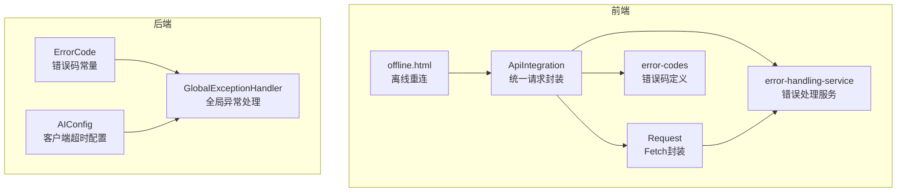
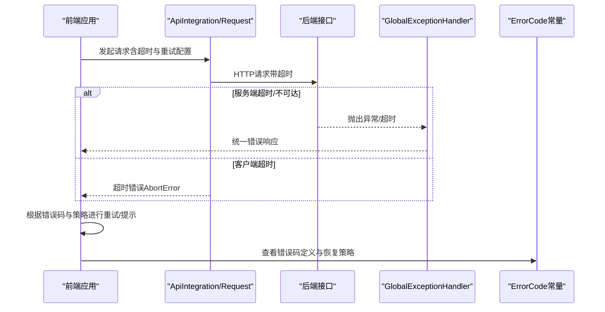
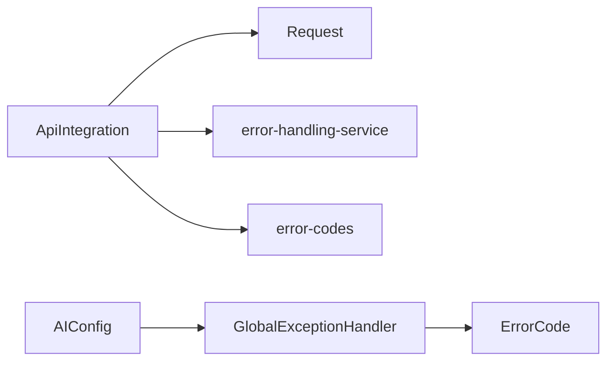

# 网络错误码

<cite>
**本文引用的文件**
- [ErrorCode.java](file://08-backend/src/main/java/com/enterprise/brain/common/constants/ErrorCode.java)
- [error-codes.js](file://07-frontend/src/utils/error-handling/error-codes.js)
- [api-integration.js](file://07-frontend/src/utils/integration/api-integration.js)
- [request.js](file://07-frontend/src/services/utils/request.js)
- [error-handling-service.js](file://07-frontend/src/services/error-handling-service.js)
- [GlobalExceptionHandler.java](file://08-backend/src/main/java/com/enterprise/brain/common/exception/GlobalExceptionHandler.java)
- [AIConfig.java](file://08-backend/src/main/java/com/enterprise/brain/modules/ai/config/AIConfig.java)
- [offline.html](file://07-frontend/public/offline.html)
</cite>

## 目录
1. [引言](#引言)
2. [项目结构](#项目结构)
3. [核心组件](#核心组件)
4. [架构总览](#架构总览)
5. [详细组件分析](#详细组件分析)
6. [依赖关系分析](#依赖关系分析)
7. [性能考量](#性能考量)
8. [故障排查指南](#故障排查指南)
9. [结论](#结论)

## 引言
本文件聚焦于网络相关错误码（7xxxx）的技术实现与工程实践，重点覆盖以下主题：
- 错误码定义与分类：CONNECTION_TIMEOUT（70001）、READ_TIMEOUT（70002）等在网络层的语义与用途
- 在前端（Fetch/Web请求封装）与后端（Spring Web/RestTemplate/WebClient）的触发机制与映射
- 重试策略与错误码的关联：如何基于错误码决定是否重试、指数退避与最大重试次数
- 如何通过错误码区分“服务端超时”与“客户端超时”
- 在熔断器（Hystrix）与网关（Spring Cloud Gateway）中的应用思路与落地建议

## 项目结构
该仓库包含前后端两套网络错误处理体系：
- 前端：统一的请求封装、拦截器、缓存、重试与错误处理
- 后端：统一的错误码常量、全局异常处理与客户端超时配置

图表来源
- [api-integration.js](file://07-frontend/src/utils/integration/api-integration.js#L1-L705)
- [request.js](file://07-frontend/src/services/utils/request.js#L1-L798)
- [error-handling-service.js](file://07-frontend/src/services/error-handling-service.js#L1-L433)
- [error-codes.js](file://07-frontend/src/utils/error-handling/error-codes.js#L1-L809)
- [ErrorCode.java](file://08-backend/src/main/java/com/enterprise/brain/common/constants/ErrorCode.java#L1-L104)
- [GlobalExceptionHandler.java](file://08-backend/src/main/java/com/enterprise/brain/common/exception/GlobalExceptionHandler.java#L39-L118)
- [AIConfig.java](file://08-backend/src/main/java/com/enterprise/brain/modules/ai/config/AIConfig.java#L1-L102)
- [offline.html](file://07-frontend/public/offline.html#L317-L350)

章节来源
- [api-integration.js](file://07-frontend/src/utils/integration/api-integration.js#L1-L705)
- [request.js](file://07-frontend/src/services/utils/request.js#L1-L798)
- [error-handling-service.js](file://07-frontend/src/services/error-handling-service.js#L1-L433)
- [error-codes.js](file://07-frontend/src/utils/error-handling/error-codes.js#L1-L809)
- [ErrorCode.java](file://08-backend/src/main/java/com/enterprise/brain/common/constants/ErrorCode.java#L1-L104)
- [GlobalExceptionHandler.java](file://08-backend/src/main/java/com/enterprise/brain/common/exception/GlobalExceptionHandler.java#L39-L118)
- [AIConfig.java](file://08-backend/src/main/java/com/enterprise/brain/modules/ai/config/AIConfig.java#L1-L102)
- [offline.html](file://07-frontend/public/offline.html#L317-L350)

## 核心组件
- 前端错误码定义与处理
  - 错误码定义：前端提供完整的错误码定义工具，包含网络错误类别与具体错误码（如 NETWORK_CONNECTION_FAILED、NETWORK_TIMEOUT 等），并配套重试策略、自动恢复策略与用户提示。
  - 错误处理服务：集中处理网络错误、API错误、验证错误等，并支持全局错误捕获与上报。
  - 请求封装：统一的 Fetch 封装，内置超时控制、重试、拦截器、缓存与取消能力。
  - 离线重连：提供离线页面与重连逻辑，提升用户体验。

- 后端错误码与异常处理
  - 错误码常量：后端定义了网络错误码（7xxxx），如 CONNECTION_TIMEOUT（70001）、READ_TIMEOUT（70002）、WRITE_TIMEOUT（70003）、CONNECTION_REFUSED（70004）等。
  - 全局异常处理：对未捕获异常进行统一包装，便于前端识别与展示。
  - 客户端超时配置：通过 RestTemplate/WebClient 的超时配置影响下游调用的超时行为。

章节来源
- [error-codes.js](file://07-frontend/src/utils/error-handling/error-codes.js#L273-L323)
- [error-handling-service.js](file://07-frontend/src/services/error-handling-service.js#L1-L433)
- [request.js](file://07-frontend/src/services/utils/request.js#L1-L798)
- [api-integration.js](file://07-frontend/src/utils/integration/api-integration.js#L1-L705)
- [ErrorCode.java](file://08-backend/src/main/java/com/enterprise/brain/common/constants/ErrorCode.java#L80-L86)
- [GlobalExceptionHandler.java](file://08-backend/src/main/java/com/enterprise/brain/common/exception/GlobalExceptionHandler.java#L39-L118)
- [AIConfig.java](file://08-backend/src/main/java/com/enterprise/brain/modules/ai/config/AIConfig.java#L1-L102)

## 架构总览
从前端到后端的网络错误处理流程如下：
- 前端通过统一请求封装发起 HTTP 请求，内置超时与重试；当发生网络错误或服务端返回特定状态码时，前端根据错误码与策略进行重试或提示。
- 后端在全局异常处理中统一包装错误，返回标准化响应；同时后端也定义了网络错误码常量，便于在服务间传递与识别。
- 离线页面提供重连检测与提示，增强弱网/离线场景的可用性。

图表来源
- [api-integration.js](file://07-frontend/src/utils/integration/api-integration.js#L448-L491)
- [request.js](file://07-frontend/src/services/utils/request.js#L430-L476)
- [GlobalExceptionHandler.java](file://08-backend/src/main/java/com/enterprise/brain/common/exception/GlobalExceptionHandler.java#L39-L118)
- [ErrorCode.java](file://08-backend/src/main/java/com/enterprise/brain/common/constants/ErrorCode.java#L80-L86)

## 详细组件分析

### 前端：错误码与错误处理
- 错误码定义
  - 前端提供了网络错误类别与具体错误码，如 NETWORK_CONNECTION_FAILED（5000）、NETWORK_TIMEOUT（5001）、NETWORK_RATE_LIMIT（5002）。这些错误码具备“是否可重试”、“重试延迟”、“最大重试次数”、“自动恢复策略”等元数据，便于统一治理。
  - 对于 7xxxx 的网络错误码，前端同样提供了对应的错误码定义（如 THIRDPARTY_API_ERROR 等），体现了与后端一致的错误码体系。

- 错误处理服务
  - 提供网络错误、API错误、验证错误、授权错误、业务错误等处理器，支持全局错误捕获与上报。
  - 对于网络错误，会弹出通知或提示，帮助用户理解当前网络状况。

- 请求封装与重试
  - 统一封装 fetch，支持超时控制（AbortController）、重试（指数退避）、拦截器、缓存与取消。
  - 重试策略：根据可重试状态码（如 408、429、500、502、503、504）与错误对象是否包含状态码决定是否重试；每次重试采用指数退避，避免雪崩。

- 离线重连
  - 提供离线页面与重连逻辑，周期性探测网络连通性，超过最大重试次数后给出提示。

章节来源
- [error-codes.js](file://07-frontend/src/utils/error-handling/error-codes.js#L273-L323)
- [error-handling-service.js](file://07-frontend/src/services/error-handling-service.js#L225-L340)
- [request.js](file://07-frontend/src/services/utils/request.js#L210-L227)
- [request.js](file://07-frontend/src/services/utils/request.js#L280-L311)
- [api-integration.js](file://07-frontend/src/utils/integration/api-integration.js#L448-L491)
- [api-integration.js](file://07-frontend/src/utils/integration/api-integration.js#L493-L520)
- [offline.html](file://07-frontend/public/offline.html#L317-L350)

### 后端：错误码常量与异常处理
- 错误码常量
  - 后端定义了网络错误码（7xxxx）：NETWORK_ERROR（70000）、CONNECTION_TIMEOUT（70001）、READ_TIMEOUT（70002）、WRITE_TIMEOUT（70003）、CONNECTION_REFUSED（70004）等，便于服务间传递与识别。

- 全局异常处理
  - 对各类异常进行统一包装，返回标准化的错误响应，便于前端识别与展示。

- 客户端超时配置
  - 通过 RestTemplate/WebClient 的超时配置（连接超时、读取超时）影响下游调用的超时行为，从而间接影响网络错误码的产生与传播。

章节来源
- [ErrorCode.java](file://08-backend/src/main/java/com/enterprise/brain/common/constants/ErrorCode.java#L80-L86)
- [GlobalExceptionHandler.java](file://08-backend/src/main/java/com/enterprise/brain/common/exception/GlobalExceptionHandler.java#L39-L118)
- [AIConfig.java](file://08-backend/src/main/java/com/enterprise/brain/modules/ai/config/AIConfig.java#L1-L102)

### 错误码与重试策略的关联
- 前端重试策略
  - 可重试状态码：408、429、500、502、503、504
  - 指数退避：初始延迟乘以回退因子的幂次，逐次增加
  - 最大重试次数：由配置决定，超过则停止并抛出最后一次错误
  - 网络错误（无状态码）：默认视为可重试，提高弱网场景的鲁棒性

- 后端客户端超时
  - 通过 RestTemplate/WebClient 的超时配置，将“客户端侧超时”转化为“服务端侧超时”，从而在全局异常处理中统一包装，便于前端识别为网络超时类错误。

章节来源
- [api-integration.js](file://07-frontend/src/utils/integration/api-integration.js#L29-L35)
- [api-integration.js](file://07-frontend/src/utils/integration/api-integration.js#L493-L520)
- [request.js](file://07-frontend/src/services/utils/request.js#L280-L311)
- [AIConfig.java](file://08-backend/src/main/java/com/enterprise/brain/modules/ai/config/AIConfig.java#L17-L23)

### 如何区分服务端超时与客户端超时
- 客户端超时（前端）
  - 通过 AbortController 与 fetch 超时控制，若在超时时间内未收到响应，前端抛出超时错误；此时 error 对象通常不包含 HTTP 状态码，前端将其视为“客户端超时”。

- 服务端超时（后端）
  - 后端在处理请求时因下游服务或数据库等原因超时，全局异常处理统一包装为标准错误响应；前端收到 408/504 等状态码，识别为“服务端超时”。

- 错误码映射
  - 前端：NETWORK_TIMEOUT（5001）对应服务端超时；NETWORK_CONNECTION_FAILED（5000）对应网络连接失败。
  - 后端：CONNECTION_TIMEOUT（70001）、READ_TIMEOUT（70002）、WRITE_TIMEOUT（70003）等用于服务间传递网络超时语义。

章节来源
- [api-integration.js](file://07-frontend/src/utils/integration/api-integration.js#L448-L491)
- [request.js](file://07-frontend/src/services/utils/request.js#L430-L476)
- [error-codes.js](file://07-frontend/src/utils/error-handling/error-codes.js#L295-L308)
- [ErrorCode.java](file://08-backend/src/main/java/com/enterprise/brain/common/constants/ErrorCode.java#L80-L86)

### 在熔断器（Hystrix）与网关（Spring Cloud Gateway）中的应用
- 熔断器（Hystrix）
  - 建议将网络错误码作为“短路触发条件”的一部分：当连续出现 CONNECTION_TIMEOUT、READ_TIMEOUT 等错误码达到阈值时，触发熔断，避免对下游造成进一步压力。
  - 结合指数退避与重试策略，减少瞬时网络抖动导致的级联故障。

- 网关（Spring Cloud Gateway）
  - 在网关层配置超时与重试策略，将上游请求的超时错误映射为统一的错误码（如 70001/70002），并在路由失败时返回一致的错误响应，便于前端统一处理。
  - 结合限流与熔断，保护后端服务免受突发流量冲击。

[本节为概念性说明，不直接分析具体文件，故不附“章节来源”]

## 依赖关系分析
- 前端
  - ApiIntegration 依赖 Request、error-handling-service、error-codes
  - Request 依赖 AbortController、fetch、指数退避与可重试状态码
  - error-handling-service 依赖 Element Plus 组件与全局事件总线

- 后端
  - GlobalExceptionHandler 依赖统一响应封装与错误码常量
  - AIConfig 依赖 RestTemplate/WebClient，影响客户端超时行为

图表来源
- [api-integration.js](file://07-frontend/src/utils/integration/api-integration.js#L1-L705)
- [request.js](file://07-frontend/src/services/utils/request.js#L1-L798)
- [error-handling-service.js](file://07-frontend/src/services/error-handling-service.js#L1-L433)
- [error-codes.js](file://07-frontend/src/utils/error-handling/error-codes.js#L1-L809)
- [GlobalExceptionHandler.java](file://08-backend/src/main/java/com/enterprise/brain/common/exception/GlobalExceptionHandler.java#L39-L118)
- [AIConfig.java](file://08-backend/src/main/java/com/enterprise/brain/modules/ai/config/AIConfig.java#L1-L102)

## 性能考量
- 指数退避与最大重试次数需结合业务场景权衡，避免在高并发下放大下游压力。
- 前端缓存策略仅适用于 GET 请求且可接受一定陈旧性，避免不必要的重复请求。
- 后端客户端超时配置应与下游 SLA 对齐，防止“过早超时”导致误判为服务端错误。

[本节提供一般性指导，不直接分析具体文件，故不附“章节来源”]

## 故障排查指南
- 前端排查
  - 检查请求封装中的超时与重试配置，确认是否命中指数退避与最大重试次数
  - 查看错误处理服务对网络错误的提示与上报情况
  - 离线页面重连逻辑是否正常工作

- 后端排查
  - 检查全局异常处理是否正确包装了网络相关异常
  - 校验客户端超时配置（连接超时、读取超时）是否合理
  - 关注网络错误码（7xxxx）的使用场景与传播路径

章节来源
- [request.js](file://07-frontend/src/services/utils/request.js#L280-L311)
- [api-integration.js](file://07-frontend/src/utils/integration/api-integration.js#L493-L520)
- [error-handling-service.js](file://07-frontend/src/services/error-handling-service.js#L225-L340)
- [GlobalExceptionHandler.java](file://08-backend/src/main/java/com/enterprise/brain/common/exception/GlobalExceptionHandler.java#L39-L118)
- [AIConfig.java](file://08-backend/src/main/java/com/enterprise/brain/modules/ai/config/AIConfig.java#L17-L23)

## 结论
- 7xxxx 网络错误码在前后端形成一致的错误语义与处理策略，前端负责超时与重试控制，后端负责异常统一包装与客户端超时配置。
- 通过指数退避与最大重试次数，可在弱网环境下提升稳定性；通过错误码区分“服务端超时”与“客户端超时”，有助于定位问题根因。
- 在熔断器与网关层面引入统一的错误码与超时策略，可进一步提升整体系统的韧性与可观测性。