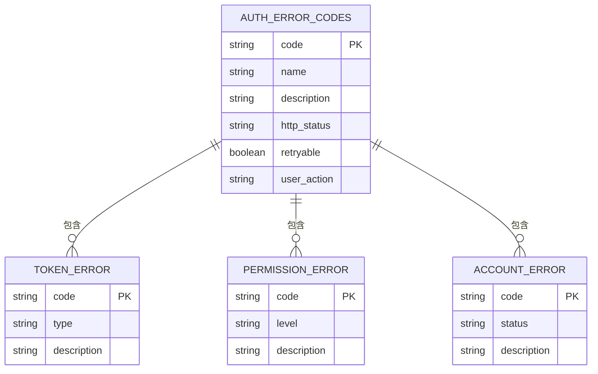
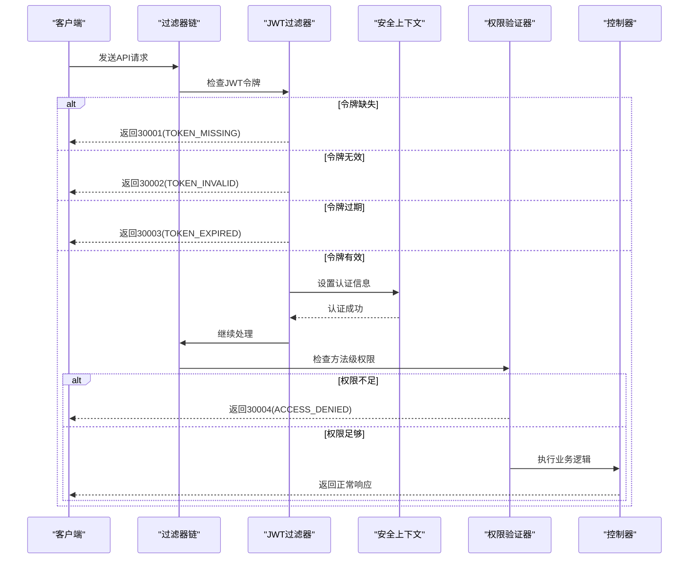
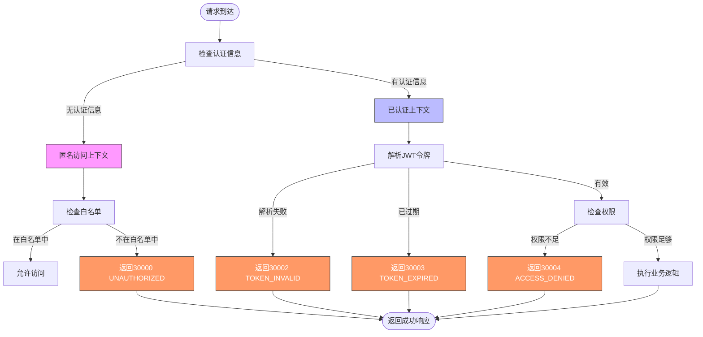
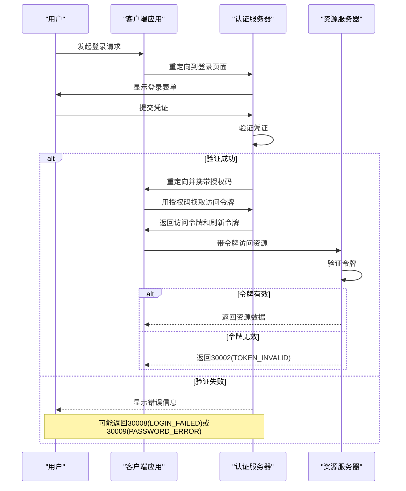
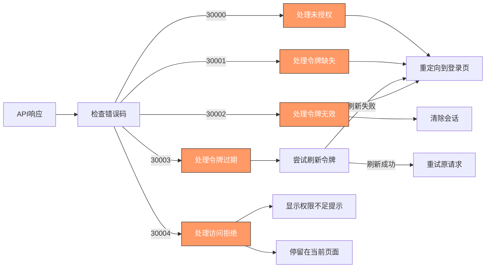

# 认证授权错误码

<cite>
**本文档引用的文件**   
- [ErrorCode.java](file://08-backend/src/main/java/com/enterprise/brain/common/constants/ErrorCode.java)
- [GlobalExceptionHandler.java](file://08-backend/src/main/java/com/enterprise/brain/common/exception/GlobalExceptionHandler.java)
- [SecurityConfig.java](file://08-backend/src/main/java/com/enterprise/brain/config/SecurityConfig.java)
- [PermissionValidator.java](file://08-backend/src/main/java/com/enterprise/brain/common/security/PermissionValidator.java)
- [error-codes.js](file://07-frontend/src/utils/error-handling/error-codes.js)
</cite>

## 目录
1. [引言](#引言)
2. [认证授权错误码设计](#认证授权错误码设计)
3. [Spring Security与JWT认证流程](#spring-security与jwt认证流程)
4. [安全上下文与错误码选择逻辑](#安全上下文与错误码选择逻辑)
5. [OAuth2.0场景下的扩展应用](#oauth20场景下的扩展应用)
6. [前端安全重定向与会话管理](#前端安全重定向与会话管理)
7. [结论](#结论)

## 引言

本系统采用统一的错误码体系来处理认证授权相关的异常情况。通过3xxxx系列错误码，系统能够精确地标识不同类型的认证和授权问题，为前后端提供一致的错误处理机制。这些错误码不仅用于API响应，还指导前端进行相应的用户界面反馈和会话管理操作。

## 认证授权错误码设计

系统定义了一套完整的认证授权错误码体系，主要集中在3xxxx号段，每个错误码都有明确的语义和触发条件。

**图源**
- [ErrorCode.java](file://08-backend/src/main/java/com/enterprise/brain/common/constants/ErrorCode.java#L29-L41)

### 核心错误码说明

系统定义了以下核心认证授权错误码：

- **UNAUTHORIZED (30000)**: 未授权访问，表示用户未登录或认证信息无效
- **TOKEN_MISSING (30001)**: 缺少令牌，请求中未包含必要的认证令牌
- **TOKEN_INVALID (30002)**: 令牌无效，提供的令牌格式不正确或已被篡改
- **TOKEN_EXPIRED (30003)**: 令牌过期，认证令牌已超过有效期
- **ACCESS_DENIED (30004)**: 访问被拒绝，用户身份已认证但权限不足
- **PERMISSION_DENIED (30005)**: 权限不足，用户缺少执行特定操作所需的权限
- **ACCOUNT_DISABLED (30006)**: 账号已禁用，用户账户被管理员禁用
- **ACCOUNT_LOCKED (30007)**: 账号已锁定，因多次登录失败而被临时锁定

这些错误码通过`ErrorCode`常量类统一管理，确保在整个系统中的一致性和可维护性。

**节源**
- [ErrorCode.java](file://08-backend/src/main/java/com/enterprise/brain/common/constants/ErrorCode.java#L29-L41)

## Spring Security与JWT认证流程

系统采用Spring Security框架结合JWT（JSON Web Token）实现认证授权机制。整个流程遵循标准的安全处理模式，通过过滤器链对请求进行逐层验证。

**图源**
- [SecurityConfig.java](file://08-backend/src/main/java/com/enterprise/brain/config/SecurityConfig.java#L15-L35)
- [PermissionValidator.java](file://08-backend/src/main/java/com/enterprise/brain/common/security/PermissionValidator.java#L32-L85)

### 认证流程详细说明

1. **请求拦截**: 所有API请求首先经过Spring Security的过滤器链
2. **令牌验证**: JWT过滤器检查请求头中的Authorization字段
3. **令牌解析**: 验证JWT签名的有效性并解析用户信息
4. **过期检查**: 检查令牌的exp（过期时间）声明
5. **上下文设置**: 将认证信息存入SecurityContext供后续使用
6. **权限验证**: 通过@PreAuthorize注解或方法级权限检查
7. **业务执行**: 通过所有安全检查后执行实际业务逻辑

当任何一个步骤失败时，系统会抛出相应的业务异常，由全局异常处理器转换为标准的错误码响应。

**节源**
- [SecurityConfig.java](file://08-backend/src/main/java/com/enterprise/brain/config/SecurityConfig.java#L15-L35)
- [GlobalExceptionHandler.java](file://08-backend/src/main/java/com/enterprise/brain/common/exception/GlobalExceptionHandler.java#L32-L37)

## 安全上下文与错误码选择逻辑

系统根据不同的安全上下文状态选择适当的错误码，确保错误信息的准确性和一致性。

**图源**
- [SecurityConfig.java](file://08-backend/src/main/java/com/enterprise/brain/config/SecurityConfig.java#L21-L25)
- [PermissionValidator.java](file://08-backend/src/main/java/com/enterprise/brain/common/security/PermissionValidator.java#L50-L82)

### 不同安全上下文的处理

#### 匿名访问上下文

当请求不包含认证信息时，系统处于匿名访问上下文。此时的处理逻辑如下：

- 如果请求路径在白名单中（如`/api/auth/**`），则允许访问
- 如果请求路径不在白名单中，则返回`30000 UNAUTHORIZED`错误码
- 这种设计允许公开接口（如登录、注册）无需认证即可访问

#### 认证失败上下文

当请求包含认证信息但验证失败时，系统根据具体失败原因返回不同的错误码：

- **30001 TOKEN_MISSING**: 请求头中缺少Authorization字段
- **30002 TOKEN_INVALID**: JWT签名验证失败或格式错误
- **30003 TOKEN_EXPIRED**: 令牌的过期时间已过

#### 权限不足上下文

当用户身份已认证但权限不足时，系统返回：

- **30004 ACCESS_DENIED**: 用户没有访问特定资源的权限
- **30005 PERMISSION_DENIED**: 用户缺少执行特定操作的权限

这种细粒度的错误码区分有助于前端进行针对性的用户引导。

**节源**
- [SecurityConfig.java](file://08-backend/src/main/java/com/enterprise/brain/config/SecurityConfig.java#L21-L25)
- [PermissionValidator.java](file://08-backend/src/main/java/com/enterprise/brain/common/security/PermissionValidator.java#L75-L82)

## OAuth2.0场景下的扩展应用

在OAuth2.0认证场景下，系统对标准错误码进行了扩展应用，以支持更复杂的认证流程。

**图源**
- [ErrorCode.java](file://08-backend/src/main/java/com/enterprise/brain/common/constants/ErrorCode.java#L38-L40)
- [GlobalExceptionHandler.java](file://08-backend/src/main/java/com/enterprise/brain/common/exception/GlobalExceptionHandler.java#L32-L37)

### OAuth2.0特定错误码处理

在OAuth2.0流程中，系统扩展了以下错误码的应用：

- **LOGIN_FAILED (30008)**: 用户名或密码错误，认证服务器验证凭证失败
- **PASSWORD_ERROR (30009)**: 密码不正确，专门用于密码验证失败的场景
- **CAPTCHA_ERROR (30010)**: 图形验证码错误，用于防止暴力破解攻击

这些错误码在OAuth2.0的授权码流程中被用来精确标识认证过程中的各种失败情况，帮助客户端应用提供更友好的用户体验。

**节源**
- [ErrorCode.java](file://08-backend/src/main/java/com/enterprise/brain/common/constants/ErrorCode.java#L38-L40)

## 前端安全重定向与会话管理

前端系统根据后端返回的认证授权错误码，实施相应的安全重定向和会话管理策略。

**图源**
- [error-codes.js](file://07-frontend/src/utils/error-handling/error-codes.js#L73-L147)

### 前端错误码处理策略

前端系统通过`error-codes.js`模块管理所有错误码的处理逻辑，针对不同的认证授权错误码采取相应的措施：

- **30000 UNAUTHORIZED**: 用户未登录，直接重定向到登录页面
- **30001 TOKEN_MISSING**: 令牌缺失，清除本地存储并重定向到登录页
- **30002 TOKEN_INVALID**: 令牌无效，视为严重安全问题，清除所有会话数据
- **30003 TOKEN_EXPIRED**: 令牌过期，尝试使用刷新令牌获取新令牌
- **30004 ACCESS_DENIED**: 权限不足，显示友好的提示信息但不中断用户流程

这种分层的错误处理机制既保证了系统的安全性，又提供了良好的用户体验。

**节源**
- [error-codes.js](file://07-frontend/src/utils/error-handling/error-codes.js#L73-L147)

## 结论

本系统的认证授权错误码设计遵循清晰、一致的原则，通过3xxxx号段的错误码精确标识各种认证和授权场景。Spring Security与JWT的结合提供了强大的安全基础，而细粒度的错误码体系则确保了前后端能够协同工作，提供一致的用户体验。在OAuth2.0等复杂场景下，系统通过扩展标准错误码的应用，支持了更丰富的认证流程。前端根据错误码实施智能的重定向和会话管理策略，既保证了安全性，又最大限度地减少了对用户正常操作的干扰。