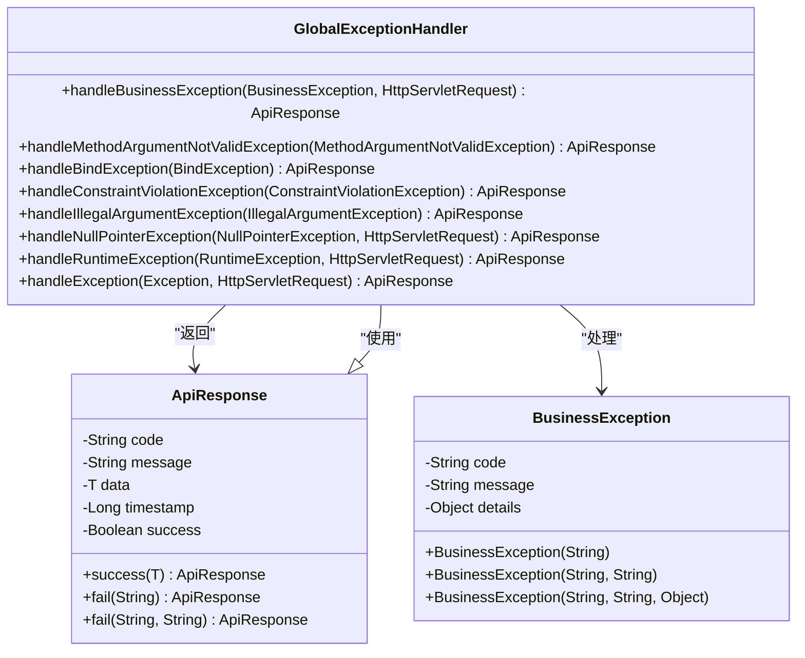
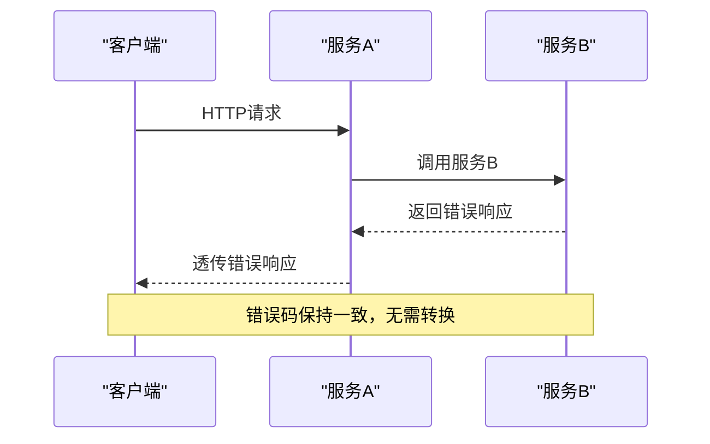

# 通用错误码

<cite>
**本文档引用文件**   
- [ErrorCode.java](file://08-backend/src/main/java/com/enterprise/brain/common/constants/ErrorCode.java)
- [GlobalExceptionHandler.java](file://08-backend/src/main/java/com/enterprise/brain/common/exception/GlobalExceptionHandler.java)
- [ApiResponse.java](file://08-backend/src/main/java/com/enterprise/brain/common/response/ApiResponse.java)
- [ErrorResponse.java](file://08-backend/src/main/java/com/enterprise/brain/common/exception/ErrorResponse.java)
- [BusinessException.java](file://08-backend/src/main/java/com/enterprise/brain/common/exception/BusinessException.java)
- [BaseController.java](file://08-backend/src/main/java/com/enterprise/brain/common/base/BaseController.java)
</cite>

## 目录
1. [引言](#引言)
2. [通用错误码设计原则](#通用错误码设计原则)
3. [核心错误码详解](#核心错误码详解)
4. [全局异常处理机制](#全局异常处理机制)
5. [统一响应结构](#统一响应结构)
6. [微服务架构中的跨服务一致性](#微服务架构中的跨服务一致性)
7. [日志追踪与监控告警应用](#日志追踪与监控告警应用)
8. [实际代码示例](#实际代码示例)
9. [结论](#结论)

## 引言
本文档详细介绍了企业级系统中通用错误码（1xxxx）的设计原则和使用场景。系统采用分层的错误码体系，确保在分布式环境下错误信息的一致性、可追溯性和可维护性。通过统一的异常处理机制和响应结构，为前端应用提供清晰的错误反馈，同时支持微服务架构下的跨服务错误传播和监控告警。

## 通用错误码设计原则

### 分层编码体系
系统采用分层的错误码编码体系，每个错误码由五位数字组成，遵循以下分层规则：

- **1xxxx**: 通用错误码 - 系统级通用错误
- **2xxxx**: 参数错误码 - 请求参数相关错误
- **3xxxx**: 认证授权错误码 - 安全相关错误
- **4xxxx**: 数据错误码 - 数据访问和完整性错误
- **5xxxx**: 业务错误码 - 特定业务逻辑错误
- **6xxxx**: 文件错误码 - 文件操作相关错误
- **7xxxx**: 网络错误码 - 网络通信错误
- **8xxxx**: 第三方服务错误码 - 外部服务调用错误
- **9xxxx**: 缓存错误码 - 缓存系统相关错误

这种分层设计确保了错误码的可扩展性和可维护性，不同模块的开发团队可以独立定义自己的错误码范围，避免冲突。

### 错误码命名规范
所有错误码常量采用大写字母和下划线的命名方式，语义清晰明确。例如：
- `SUCCESS` (10000): 操作成功
- `SYSTEM_ERROR` (10001): 系统内部错误
- `SERVICE_UNAVAILABLE` (10002): 服务不可用
- `REQUEST_TIMEOUT` (10003): 请求超时

**Section sources**
- [ErrorCode.java](file://08-backend/src/main/java/com/enterprise/brain/common/constants/ErrorCode.java#L11-L16)

## 核心错误码详解

### SUCCESS (10000)
`SUCCESS` 错误码表示操作成功完成。虽然名为"错误码"，但实际上表示成功状态，是系统中最常用的响应码。当API调用成功执行并返回预期结果时，使用此错误码。

```java
public static final String SUCCESS = "10000";
```

### SYSTEM_ERROR (10001)
`SYSTEM_ERROR` 表示系统内部发生了未预期的错误。这类错误通常是由于代码缺陷、配置问题或基础设施故障引起的。当捕获到未处理的异常时，系统会返回此错误码，同时记录详细的错误日志供开发人员排查。

```java
public static final String SYSTEM_ERROR = "10001";
```

### SERVICE_UNAVAILABLE (10002)
`SERVICE_UNAVAILABLE` 表示服务当前不可用。这可能是由于服务正在维护、过载或依赖的下游服务不可用导致的。前端应用收到此错误码时，通常会提示用户稍后重试，并可能实现自动重试机制。

```java
public static final String SERVICE_UNAVAILABLE = "10002";
```

### REQUEST_TIMEOUT (10003)
`REQUEST_TIMEOUT` 表示请求处理超时。当某个操作在预定时间内未能完成时，系统会中断处理并返回此错误码。这有助于防止长时间等待导致的资源耗尽问题。

```java
public static final String REQUEST_TIMEOUT = "10003";
```

### REMOTE_SERVICE_ERROR (10004)
`REMOTE_SERVICE_ERROR` 表示调用远程服务时发生错误。在微服务架构中，一个服务可能需要调用其他服务来完成业务逻辑。当这些远程调用失败时，使用此错误码进行反馈。

```java
public static final String REMOTE_SERVICE_ERROR = "10004";
```

**Section sources**
- [ErrorCode.java](file://08-backend/src/main/java/com/enterprise/brain/common/constants/ErrorCode.java#L11-L16)

## 全局异常处理机制

### GlobalExceptionHandler设计
系统通过`GlobalExceptionHandler`类实现全局异常处理，使用Spring的`@RestControllerAdvice`注解，能够捕获整个应用中的异常并统一处理。



**Diagram sources **
- [GlobalExceptionHandler.java](file://08-backend/src/main/java/com/enterprise/brain/common/exception/GlobalExceptionHandler.java#L27-L118)
- [BusinessException.java](file://08-backend/src/main/java/com/enterprise/brain/common/exception/BusinessException.java#L14-L68)
- [ApiResponse.java](file://08-backend/src/main/java/com/enterprise/brain/common/response/ApiResponse.java#L18-L107)

### 异常处理流程
全局异常处理器按照优先级顺序处理不同类型的异常：

1. **业务异常** (`BusinessException`): 由业务逻辑主动抛出的异常，包含具体的错误码和消息
2. **参数校验异常** (`MethodArgumentNotValidException`): Spring MVC参数校验失败时抛出
3. **参数绑定异常** (`BindException`): 参数绑定失败时抛出
4. **约束违反异常** (`ConstraintViolationException`): JSR-303 Bean Validation约束违反时抛出
5. **非法参数异常** (`IllegalArgumentException`): 传递了非法参数时抛出
6. **空指针异常** (`NullPointerException`): 空指针访问时抛出
7. **运行时异常** (`RuntimeException`): 其他运行时异常
8. **其他异常** (`Exception`): 捕获所有未处理的异常

每个异常处理器方法都会记录错误日志，并返回结构化的错误响应。

**Section sources**
- [GlobalExceptionHandler.java](file://08-backend/src/main/java/com/enterprise/brain/common/exception/GlobalExceptionHandler.java#L27-L118)

## 统一响应结构

### ApiResponse设计
系统采用`ApiResponse`类作为统一的响应结构，确保所有API返回的数据格式一致。

```mermaid
classDiagram
class ApiResponse {
-String code
-String message
-T data
-Long timestamp
-Boolean success
+success(T) ApiResponse
+fail(String) ApiResponse
+fail(String, String) ApiResponse
+custom(String, String, T, Boolean) ApiResponse
}
note right of ApiResponse
统一响应结构，包含：
- code : 错误码
- message : 错误消息
- data : 响应数据
- timestamp : 时间戳
- success : 成功标识
end note
```

**Diagram sources **
- [ApiResponse.java](file://08-backend/src/main/java/com/enterprise/brain/common/response/ApiResponse.java#L18-L107)

### 响应字段说明
统一响应结构包含以下字段：

- **code**: 错误码，字符串类型，如"10000"表示成功，"10001"表示系统错误
- **message**: 错误消息，人类可读的描述信息
- **data**: 响应数据，成功时包含业务数据，失败时为null
- **timestamp**: 时间戳，记录响应生成的时间，用于性能分析和日志关联
- **success**: 布尔值，表示操作是否成功

### 成功与失败响应
系统提供了静态工厂方法来创建成功和失败的响应：

```java
// 成功响应
public static <T> ApiResponse<T> success(T data) {
    return success("操作成功", data);
}

// 失败响应
public static <T> ApiResponse<T> fail(String code, String message) {
    ApiResponse<T> response = new ApiResponse<>();
    response.setCode(code);
    response.setMessage(message);
    response.setData(null);
    response.setTimestamp(System.currentTimeMillis());
    response.setSuccess(false);
    return response;
}
```

**Section sources**
- [ApiResponse.java](file://08-backend/src/main/java/com/enterprise/brain/common/response/ApiResponse.java#L18-L107)

## 微服务架构中的跨服务一致性

### 错误码传播机制
在微服务架构中，服务间的调用需要保持错误码的一致性。当服务A调用服务B时，服务B的错误码应该能够透明地传递给服务A的调用方。



**Diagram sources **
- [GlobalExceptionHandler.java](file://08-backend/src/main/java/com/enterprise/brain/common/exception/GlobalExceptionHandler.java#L27-L118)
- [ApiResponse.java](file://08-backend/src/main/java/com/enterprise/brain/common/response/ApiResponse.java#L18-L107)

### 服务间通信规范
为了确保跨服务的错误处理一致性，系统制定了以下规范：

1. **统一错误码体系**: 所有微服务共享相同的错误码定义，确保相同错误在不同服务中具有相同的错误码
2. **透明错误传播**: 服务在调用下游服务时，除非需要特殊处理，否则应直接透传错误响应
3. **上下文信息保留**: 在错误传播过程中，保留原始的时间戳和错误上下文，便于问题追踪
4. **错误码映射表**: 对于必须转换错误码的场景，维护明确的错误码映射表，避免随意转换

### 服务降级与熔断
当依赖服务不可用时，系统通过错误码机制实现服务降级和熔断：

- `SERVICE_UNAVAILABLE` (10002): 触发服务降级，返回缓存数据或默认值
- `REQUEST_TIMEOUT` (10003): 触发超时处理，避免资源长时间占用
- `REMOTE_SERVICE_ERROR` (10004): 触发熔断机制，暂时停止对故障服务的调用

**Section sources**
- [ErrorCode.java](file://08-backend/src/main/java/com/enterprise/brain/common/constants/ErrorCode.java#L11-L16)

## 日志追踪与监控告警应用

### 错误日志记录
全局异常处理器在捕获异常时会记录详细的错误日志，包括错误码、错误消息、请求路径和完整的堆栈跟踪。

```java
@ExceptionHandler(BusinessException.class)
@ResponseStatus(HttpStatus.OK)
public ApiResponse<Object> handleBusinessException(BusinessException e, HttpServletRequest request) {
    log.error("业务异常: {} - URI: {}", e.getMessage(), request.getRequestURI(), e);
    return ApiResponse.fail(e.getCode(), e.getMessage());
}
```

日志记录包含以下关键信息：
- 错误码：用于快速识别错误类型
- 错误消息：提供人类可读的错误描述
- 请求URI：标识发生错误的具体接口
- 堆栈跟踪：帮助开发人员定位问题根源
- 时间戳：用于问题发生时间的精确记录

### 监控指标采集
系统基于错误码采集监控指标，用于实时监控和告警：

- **错误率监控**: 按错误码统计各类错误的发生频率
- **错误趋势分析**: 分析特定错误码随时间的变化趋势
- **服务健康度**: 基于`SYSTEM_ERROR`、`SERVICE_UNAVAILABLE`等错误码评估服务健康状况
- **用户体验指标**: 基于前端收到的错误码评估用户体验质量

### 告警规则配置
基于错误码配置智能告警规则：

- **严重错误告警**: 当`SYSTEM_ERROR`(10001)错误率超过阈值时立即告警
- **服务不可用告警**: 连续出现`SERVICE_UNAVAILABLE`(10002)错误时触发告警
- **超时告警**: `REQUEST_TIMEOUT`(10003)错误率异常升高时告警
- **第三方服务告警**: `REMOTE_SERVICE_ERROR`(10004)错误专门监控，避免影响核心业务

**Section sources**
- [GlobalExceptionHandler.java](file://08-backend/src/main/java/com/enterprise/brain/common/exception/GlobalExceptionHandler.java#L27-L118)

## 实际代码示例

### 业务异常抛出
在业务逻辑中，通过抛出`BusinessException`来表示业务错误：

```java
public void processOrder(Order order) {
    if (order == null) {
        throw new BusinessException("50001", "订单信息不能为空");
    }
    
    if (!isOrderValid(order)) {
        throw new BusinessException("50002", "订单状态不允许处理");
    }
    
    if (isStockInsufficient(order)) {
        throw new BusinessException("50003", "库存不足");
    }
    
    // 处理订单逻辑
    orderService.process(order);
}
```

### 控制器中的错误处理
控制器继承`BaseController`，可以方便地返回成功或失败响应：

```mermaid
classDiagram
class BaseController {
+success(T) ApiResponse
+success() ApiResponse
+fail(String) ApiResponse
+fail(String, String) ApiResponse
+successPage(Page) ApiResponse
+successList(List) ApiResponse
}
class OrderController {
+getOrder(Long) ApiResponse
+createOrder(Order) ApiResponse
+updateOrder(Order) ApiResponse
}
BaseController <|-- OrderController : "继承"
note right of BaseController
基础控制器提供统一的
响应方法，简化错误处理
end note
```

**Diagram sources **
- [BaseController.java](file://08-backend/src/main/java/com/enterprise/brain/common/base/BaseController.java#L16-L91)

### 全局异常处理器实现
`GlobalExceptionHandler`完整实现了各类异常的处理：

```java
@RestControllerAdvice
@Slf4j
public class GlobalExceptionHandler {

    @ExceptionHandler(BusinessException.class)
    @ResponseStatus(HttpStatus.OK)
    public ApiResponse<Object> handleBusinessException(BusinessException e, HttpServletRequest request) {
        log.error("业务异常: {} - URI: {}", e.getMessage(), request.getRequestURI(), e);
        return ApiResponse.fail(e.getCode(), e.getMessage());
    }

    @ExceptionHandler(MethodArgumentNotValidException.class)
    @ResponseStatus(HttpStatus.BAD_REQUEST)
    public ApiResponse<Object> handleMethodArgumentNotValidException(MethodArgumentNotValidException e) {
        String message = e.getBindingResult().getFieldErrors().stream()
                .map(FieldError::getDefaultMessage)
                .collect(Collectors.joining("; "));
        log.error("参数校验失败: {}", message, e);
        return ApiResponse.fail("VALIDATION_ERROR", message);
    }

    // 其他异常处理方法...
}
```

**Section sources**
- [GlobalExceptionHandler.java](file://08-backend/src/main/java/com/enterprise/brain/common/exception/GlobalExceptionHandler.java#L27-L118)
- [BusinessException.java](file://08-backend/src/main/java/com/enterprise/brain/common/exception/BusinessException.java#L14-L68)
- [BaseController.java](file://08-backend/src/main/java/com/enterprise/brain/common/base/BaseController.java#L16-L91)

## 结论
通用错误码体系是企业级系统稳定性和可维护性的重要保障。通过1xxxx系列的通用错误码设计，系统实现了：

1. **标准化错误处理**: 统一的错误码体系确保了错误信息的一致性和可预测性
2. **高效的异常传播**: 在微服务架构中，错误码能够透明地跨服务传播
3. **精确的问题定位**: 详细的错误日志和监控指标帮助快速定位和解决问题
4. **良好的用户体验**: 前端可以根据错误码提供恰当的用户提示和恢复建议
5. **智能的监控告警**: 基于错误码的监控系统能够及时发现和预警潜在问题

通过`GlobalExceptionHandler`、`ApiResponse`和`BusinessException`等组件的协同工作，系统构建了一个健壮的错误处理框架，为整个应用的稳定运行提供了坚实的基础。