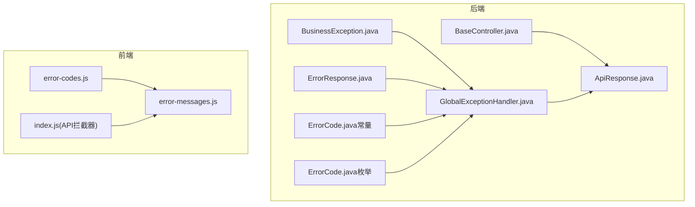
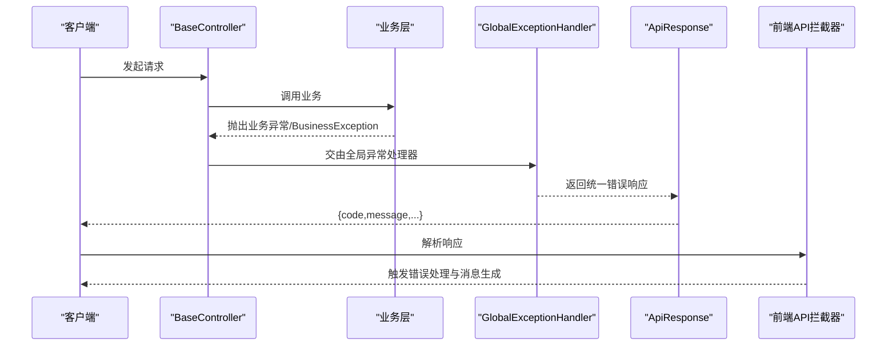
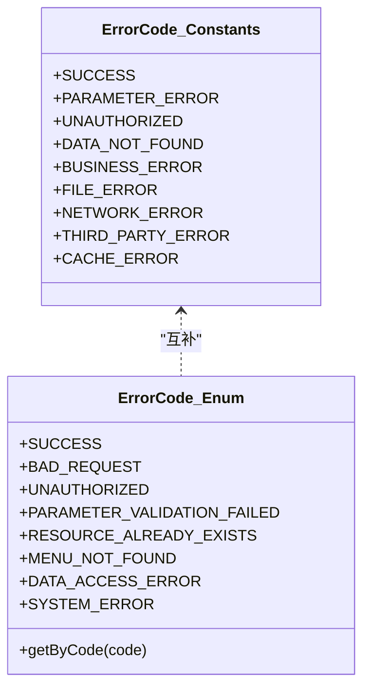
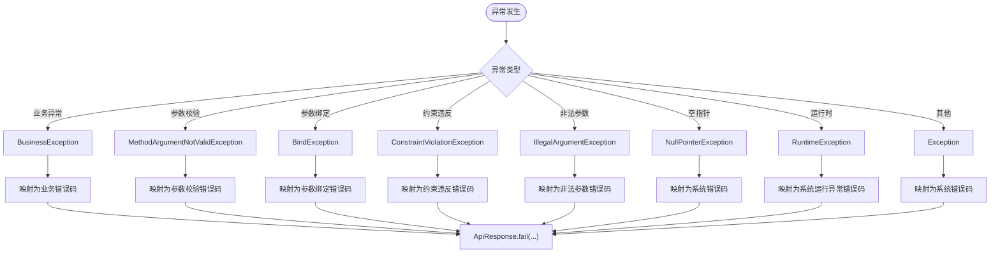
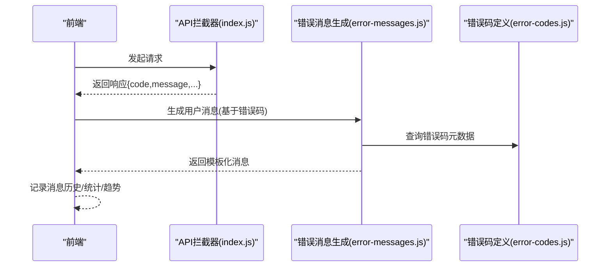
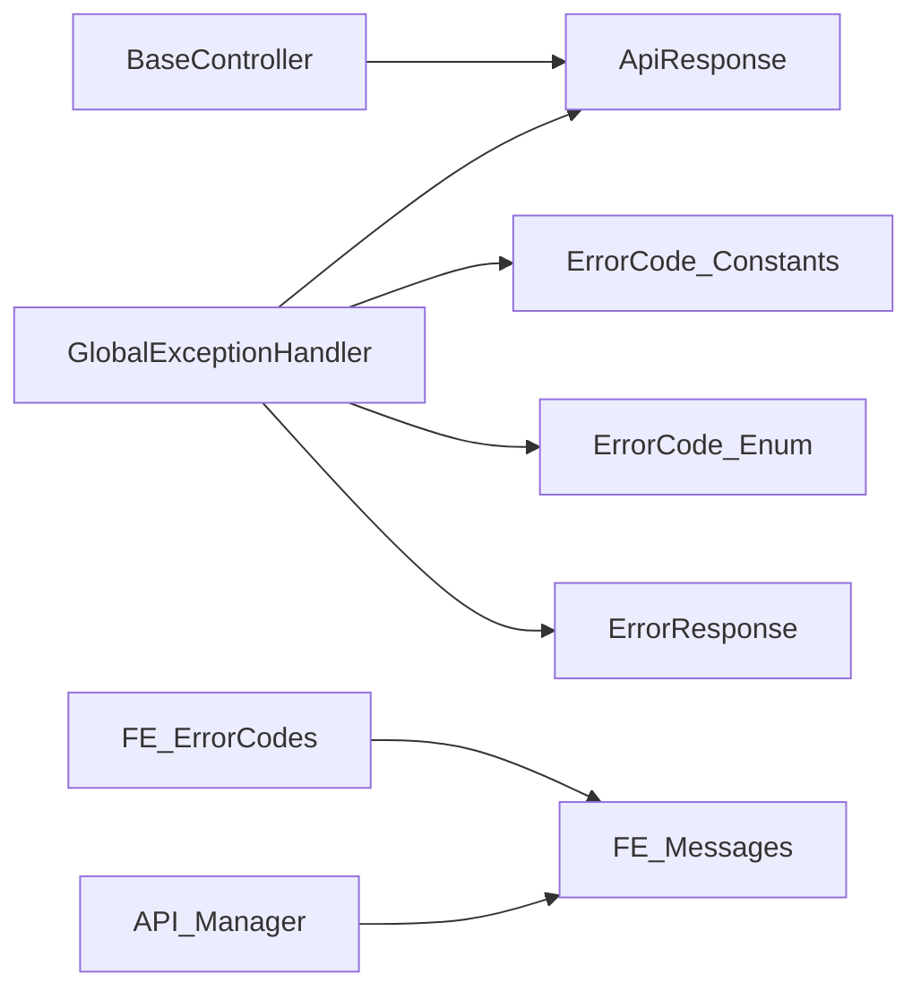

# 错误码体系设计

<cite>
**本文引用的文件列表**
- [ErrorCode.java（后端常量）](file://08-backend/src/main/java/com/enterprise/brain/common/constants/ErrorCode.java)
- [ErrorCode.java（后端枚举）](file://08-backend/src/main/java/com/enterprise/brain/common/response/ErrorCode.java)
- [ApiResponse.java](file://08-backend/src/main/java/com/enterprise/brain/common/response/ApiResponse.java)
- [ErrorResponse.java](file://08-backend/src/main/java/com/enterprise/brain/common/exception/ErrorResponse.java)
- [BusinessException.java](file://08-backend/src/main/java/com/enterprise/brain/common/exception/BusinessException.java)
- [GlobalExceptionHandler.java](file://08-backend/src/main/java/com/enterprise/brain/common/exception/GlobalExceptionHandler.java)
- [BaseController.java](file://08-backend/src/main/java/com/enterprise/brain/common/base/BaseController.java)
- [error-codes.js（前端错误码定义）](file://07-frontend/src/utils/error-handling/error-codes.js)
- [error-messages.js（前端错误消息模板与生成）](file://07-frontend/src/utils/error-handling/error-messages.js)
- [index.js（前端API管理与拦截器）](file://07-frontend/src/services/index.js)
</cite>

## 目录
1. [引言](#引言)
2. [项目结构与定位](#项目结构与定位)
3. [核心组件总览](#核心组件总览)
4. [架构概览](#架构概览)
5. [详细组件分析](#详细组件分析)
6. [依赖关系分析](#依赖关系分析)
7. [性能与可维护性考量](#性能与可维护性考量)
8. [故障排查指南](#故障排查指南)
9. [结论](#结论)
10. [附录：新增错误码流程与命名建议](#附录新增错误码流程与命名建议)

## 引言
本文件系统性阐述该仓库中“错误码体系”的设计原则、结构与实现方式，覆盖后端Java与前端JavaScript两套实现，并解释错误码与用户提示信息的分离策略、日志追踪、监控告警与国际化支持的落地方式。文档同时给出新增错误码的流程与命名建议，确保体系的一致性与可维护性。

## 项目结构与定位
- 后端采用统一响应体与异常处理机制，通过常量与枚举两类错误码定义，配合全局异常处理器进行统一兜底。
- 前端采用集中式错误码定义与消息模板系统，支持错误统计、趋势分析、事件驱动与用户偏好管理，实现错误码与用户提示的解耦。

图表来源
- [BaseController.java](file://08-backend/src/main/java/com/enterprise/brain/common/base/BaseController.java#L1-L91)
- [ApiResponse.java](file://08-backend/src/main/java/com/enterprise/brain/common/response/ApiResponse.java#L1-L107)
- [GlobalExceptionHandler.java](file://08-backend/src/main/java/com/enterprise/brain/common/exception/GlobalExceptionHandler.java#L1-L119)
- [BusinessException.java](file://08-backend/src/main/java/com/enterprise/brain/common/exception/BusinessException.java#L1-L69)
- [ErrorResponse.java](file://08-backend/src/main/java/com/enterprise/brain/common/exception/ErrorResponse.java#L1-L89)
- [ErrorCode.java（后端常量）](file://08-backend/src/main/java/com/enterprise/brain/common/constants/ErrorCode.java#L1-L104)
- [ErrorCode.java（后端枚举）](file://08-backend/src/main/java/com/enterprise/brain/common/response/ErrorCode.java#L1-L91)
- [error-codes.js（前端错误码定义）](file://07-frontend/src/utils/error-handling/error-codes.js#L1-L809)
- [error-messages.js（前端错误消息模板与生成）](file://07-frontend/src/utils/error-handling/error-messages.js#L1-L874)
- [index.js（前端API管理与拦截器）](file://07-frontend/src/services/index.js#L206-L409)

章节来源
- [BaseController.java](file://08-backend/src/main/java/com/enterprise/brain/common/base/BaseController.java#L1-L91)
- [error-codes.js（前端错误码定义）](file://07-frontend/src/utils/error-handling/error-codes.js#L1-L809)

## 核心组件总览
- 后端错误码定义
  - 常量类：按模块划分的字符串型错误码，便于直接拼接与传递。
  - 枚举类：统一的错误码枚举，提供O(1)查询缓存，便于服务内统一管理与扩展。
- 前端错误码定义
  - 集中式错误码定义与分类，包含严重程度、HTTP状态、重试策略、用户行动建议等元数据。
- 统一响应与异常处理
  - 统一响应体封装，异常处理器将异常映射为统一错误码与消息，保证前后端一致的错误契约。
- 前端消息模板与统计
  - 消息模板系统根据错误码类别选择最佳模板，支持批量处理、趋势分析、事件驱动与用户偏好。

章节来源
- [ErrorCode.java（后端常量）](file://08-backend/src/main/java/com/enterprise/brain/common/constants/ErrorCode.java#L1-L104)
- [ErrorCode.java（后端枚举）](file://08-backend/src/main/java/com/enterprise/brain/common/response/ErrorCode.java#L1-L91)
- [error-codes.js（前端错误码定义）](file://07-frontend/src/utils/error-handling/error-codes.js#L1-L809)
- [error-messages.js（前端错误消息模板与生成）](file://07-frontend/src/utils/error-handling/error-messages.js#L1-L874)
- [ApiResponse.java](file://08-backend/src/main/java/com/enterprise/brain/common/response/ApiResponse.java#L1-L107)
- [GlobalExceptionHandler.java](file://08-backend/src/main/java/com/enterprise/brain/common/exception/GlobalExceptionHandler.java#L1-L119)

## 架构概览
后端通过控制器统一返回统一响应体，异常处理器将各类异常映射为统一错误码；前端通过API拦截器统一解析响应，结合错误码定义与消息模板生成用户提示，同时支持统计与趋势分析。

图表来源
- [BaseController.java](file://08-backend/src/main/java/com/enterprise/brain/common/base/BaseController.java#L1-L91)
- [GlobalExceptionHandler.java](file://08-backend/src/main/java/com/enterprise/brain/common/exception/GlobalExceptionHandler.java#L1-L119)
- [ApiResponse.java](file://08-backend/src/main/java/com/enterprise/brain/common/response/ApiResponse.java#L1-L107)
- [index.js（前端API管理与拦截器）](file://07-frontend/src/services/index.js#L348-L360)

## 详细组件分析

### 后端错误码常量与枚举
- 常量类（模块化前缀）
  - 通用错误码：1xxxx
  - 参数错误码：2xxxx
  - 认证授权错误码：3xxxx
  - 数据错误码：4xxxx
  - 业务错误码：5xxxx
  - 文件错误码：6xxxx
  - 网络错误码：7xxxx
  - 第三方服务错误码：8xxxx
  - 缓存错误码：9xxxx
- 枚举类（统一错误码与HTTP语义）
  - 提供统一错误码枚举，含错误码、消息与静态缓存，支持按码快速查询。
  - 与HTTP状态语义对齐，便于网关与中间件识别。

图表来源
- [ErrorCode.java（后端常量）](file://08-backend/src/main/java/com/enterprise/brain/common/constants/ErrorCode.java#L1-L104)
- [ErrorCode.java（后端枚举）](file://08-backend/src/main/java/com/enterprise/brain/common/response/ErrorCode.java#L1-L91)

章节来源
- [ErrorCode.java（后端常量）](file://08-backend/src/main/java/com/enterprise/brain/common/constants/ErrorCode.java#L1-L104)
- [ErrorCode.java（后端枚举）](file://08-backend/src/main/java/com/enterprise/brain/common/response/ErrorCode.java#L1-L91)

### 统一响应与异常处理
- 统一响应体封装，包含code、message、data、timestamp、success等字段。
- 控制器基类提供success/fail便捷方法，统一返回格式。
- 全局异常处理器将不同异常映射为统一错误码与消息，保证前后端一致的错误契约。

图表来源
- [GlobalExceptionHandler.java](file://08-backend/src/main/java/com/enterprise/brain/common/exception/GlobalExceptionHandler.java#L1-L119)
- [ApiResponse.java](file://08-backend/src/main/java/com/enterprise/brain/common/response/ApiResponse.java#L1-L107)
- [BaseController.java](file://08-backend/src/main/java/com/enterprise/brain/common/base/BaseController.java#L1-L91)

章节来源
- [BaseController.java](file://08-backend/src/main/java/com/enterprise/brain/common/base/BaseController.java#L1-L91)
- [GlobalExceptionHandler.java](file://08-backend/src/main/java/com/enterprise/brain/common/exception/GlobalExceptionHandler.java#L1-L119)
- [ApiResponse.java](file://08-backend/src/main/java/com/enterprise/brain/common/response/ApiResponse.java#L1-L107)

### 前端错误码定义与消息模板
- 错误码定义（error-codes.js）
  - 按模块分类（系统、认证、数据、业务、网络、文件、第三方），每类分配连续编号区间。
  - 每个错误码包含：名称、严重程度、HTTP状态、是否可重试、用户行动建议、安全关注标记等元数据。
- 消息模板（error-messages.js）
  - 根据错误码类别选择最佳模板，支持渲染变量、动作按钮、验证错误格式化、网络错误分类与建议等。
  - 支持批量处理、消息历史、统计与趋势分析、用户偏好管理等能力。
- API拦截器（index.js）
  - 统一解析响应，当code非200时抛出错误，交由错误处理流程处理。

图表来源
- [error-codes.js（前端错误码定义）](file://07-frontend/src/utils/error-handling/error-codes.js#L1-L809)
- [error-messages.js（前端错误消息模板与生成）](file://07-frontend/src/utils/error-handling/error-messages.js#L1-L874)
- [index.js（前端API管理与拦截器）](file://07-frontend/src/services/index.js#L348-L360)

章节来源
- [error-codes.js（前端错误码定义）](file://07-frontend/src/utils/error-handling/error-codes.js#L1-L809)
- [error-messages.js（前端错误消息模板与生成）](file://07-frontend/src/utils/error-handling/error-messages.js#L1-L874)
- [index.js（前端API管理与拦截器）](file://07-frontend/src/services/index.js#L206-L409)

## 依赖关系分析
- 后端
  - BaseController依赖ApiResponse进行统一返回。
  - GlobalExceptionHandler依赖ApiResponse与各错误码常量/枚举，将异常映射为统一错误响应。
  - ErrorResponse用于携带额外细节（路径、时间戳、详情）。
- 前端
  - API拦截器依赖错误码定义与消息模板，统一处理响应与错误。
  - 错误码定义与消息模板相互协作，前者提供元数据，后者负责呈现。

图表来源
- [BaseController.java](file://08-backend/src/main/java/com/enterprise/brain/common/base/BaseController.java#L1-L91)
- [GlobalExceptionHandler.java](file://08-backend/src/main/java/com/enterprise/brain/common/exception/GlobalExceptionHandler.java#L1-L119)
- [ApiResponse.java](file://08-backend/src/main/java/com/enterprise/brain/common/response/ApiResponse.java#L1-L107)
- [ErrorResponse.java](file://08-backend/src/main/java/com/enterprise/brain/common/exception/ErrorResponse.java#L1-L89)
- [ErrorCode.java（后端常量）](file://08-backend/src/main/java/com/enterprise/brain/common/constants/ErrorCode.java#L1-L104)
- [ErrorCode.java（后端枚举）](file://08-backend/src/main/java/com/enterprise/brain/common/response/ErrorCode.java#L1-L91)
- [error-codes.js（前端错误码定义）](file://07-frontend/src/utils/error-handling/error-codes.js#L1-L809)
- [error-messages.js（前端错误消息模板与生成）](file://07-frontend/src/utils/error-handling/error-messages.js#L1-L874)

章节来源
- [GlobalExceptionHandler.java](file://08-backend/src/main/java/com/enterprise/brain/common/exception/GlobalExceptionHandler.java#L1-L119)
- [ApiResponse.java](file://08-backend/src/main/java/com/enterprise/brain/common/response/ApiResponse.java#L1-L107)
- [error-codes.js（前端错误码定义）](file://07-frontend/src/utils/error-handling/error-codes.js#L1-L809)
- [error-messages.js（前端错误消息模板与生成）](file://07-frontend/src/utils/error-handling/error-messages.js#L1-L874)

## 性能与可维护性考量
- 后端枚举的O(1)查询缓存避免了频繁Map查找开销，适合高频错误码查询场景。
- 前端错误码定义支持统计与趋势分析，便于发现热点错误与异常波动。
- 错误码与用户提示分离，前端模板系统支持多模板与变量替换，降低UI耦合度。
- 全局异常处理器统一映射，减少重复逻辑，提升一致性与可维护性。

[本节为通用性能讨论，无需列出具体文件来源]

## 故障排查指南
- 后端
  - 业务异常：检查BusinessException构造参数与全局异常处理器映射。
  - 参数校验/绑定/约束：检查GlobalExceptionHandler对各类异常的映射与返回码。
  - 未捕获异常：确认GlobalExceptionHandler对Exception的兜底处理。
- 前端
  - API响应非200：检查API拦截器是否正确抛错并进入错误处理流程。
  - 用户提示不正确：检查错误码定义与消息模板选择逻辑，确认类别与严重程度配置。
  - 统计与趋势异常：检查错误记录与统计接口调用链路。

章节来源
- [BusinessException.java](file://08-backend/src/main/java/com/enterprise/brain/common/exception/BusinessException.java#L1-L69)
- [GlobalExceptionHandler.java](file://08-backend/src/main/java/com/enterprise/brain/common/exception/GlobalExceptionHandler.java#L1-L119)
- [index.js（前端API管理与拦截器）](file://07-frontend/src/services/index.js#L348-L360)
- [error-messages.js（前端错误消息模板与生成）](file://07-frontend/src/utils/error-handling/error-messages.js#L1-L874)

## 结论
该错误码体系通过“后端常量/枚举 + 统一响应 + 全局异常处理”与“前端错误码定义 + 模板系统 + 统一拦截器”的双端协同，实现了错误码与用户提示的分离、跨模块的统一管理以及可观测性的增强。体系具备良好的扩展性与可维护性，适合在复杂业务场景中长期演进。

[本节为总结性内容，无需列出具体文件来源]

## 附录：新增错误码流程与命名建议

### 新增后端错误码（Java）
- 步骤
  1) 在后端常量类中按模块前缀新增常量，保持连续编号。
  2) 在后端枚举类中新增枚举值，必要时补充HTTP状态与描述。
  3) 在GlobalExceptionHandler中增加对应异常的映射分支，返回统一错误码与消息。
  4) 在BaseController中如需直接返回错误，使用fail(code, message)。
- 命名建议
  - 使用全大写蛇形命名，语义明确，体现模块与错误类型。
  - 与枚举值保持一致的语义映射，便于前后端对齐。

章节来源
- [ErrorCode.java（后端常量）](file://08-backend/src/main/java/com/enterprise/brain/common/constants/ErrorCode.java#L1-L104)
- [ErrorCode.java（后端枚举）](file://08-backend/src/main/java/com/enterprise/brain/common/response/ErrorCode.java#L1-L91)
- [GlobalExceptionHandler.java](file://08-backend/src/main/java/com/enterprise/brain/common/exception/GlobalExceptionHandler.java#L1-L119)
- [BaseController.java](file://08-backend/src/main/java/com/enterprise/brain/common/base/BaseController.java#L1-L91)

### 新增前端错误码（JavaScript）
- 步骤
  1) 在错误码定义文件中新增错误码条目，填写名称、严重程度、HTTP状态、用户行动建议等。
  2) 如需新类别，先添加分类，再在分类下新增错误码。
  3) 在消息模板中根据类别选择合适模板，或新增模板。
  4) 在API拦截器与错误处理流程中确保错误码被正确记录与上报。
- 命名建议
  - 使用全大写蛇形命名，语义清晰，便于检索与统计。
  - 严重程度与HTTP状态保持合理映射，便于自动化处理与告警。

章节来源
- [error-codes.js（前端错误码定义）](file://07-frontend/src/utils/error-handling/error-codes.js#L1-L809)
- [error-messages.js（前端错误消息模板与生成）](file://07-frontend/src/utils/error-handling/error-messages.js#L1-L874)
- [index.js（前端API管理与拦截器）](file://07-frontend/src/services/index.js#L348-L360)