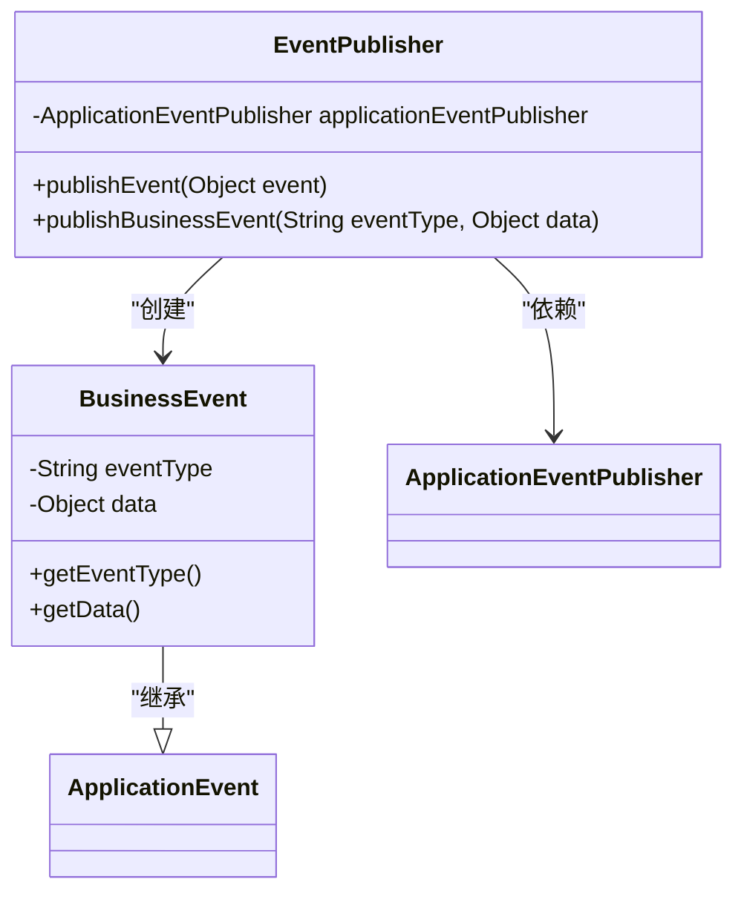
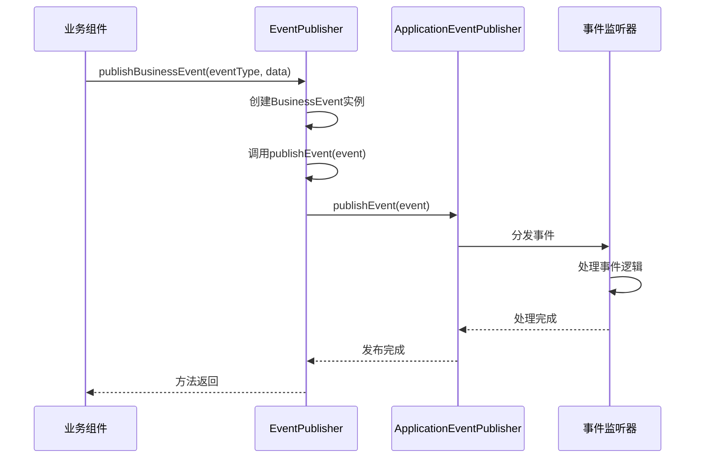
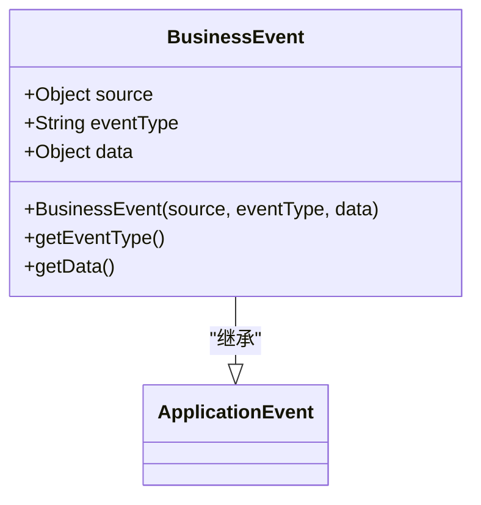
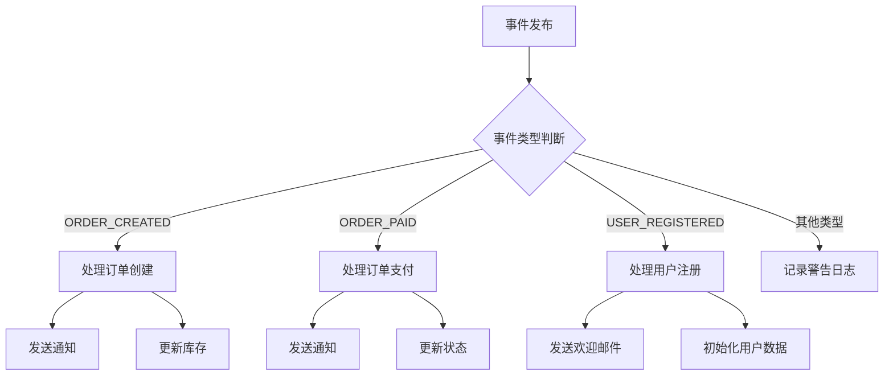
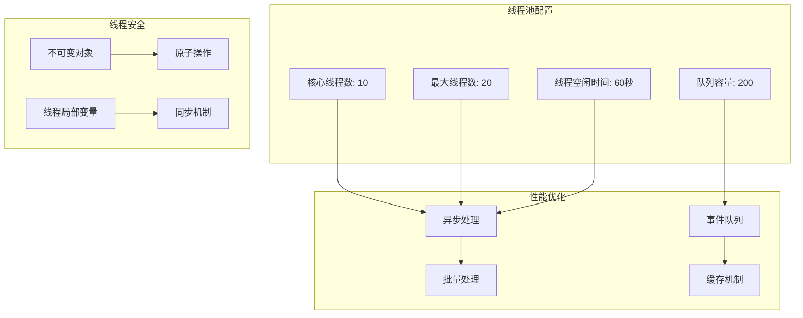
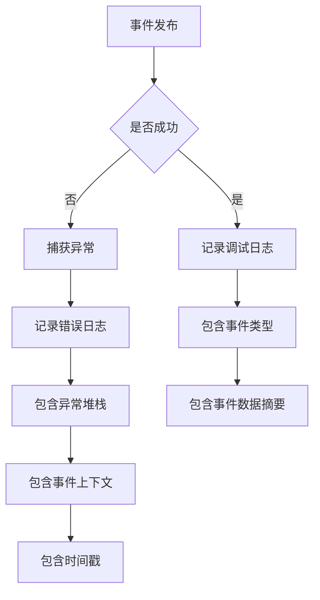

# 事件发布机制

<cite>
**本文档引用的文件**
- [EventPublisher.java](file://08-backend/src/main/java/com/enterprise/brain/common/async/EventPublisher.java)
- [EventListener.java](file://08-backend/src/main/java/com/enterprise/brain/common/async/EventListener.java)
- [MessageQueueConfig.java](file://08-backend/src/main/java/com/enterprise/brain/common/async/MessageQueueConfig.java)
- [application.yml](file://08-backend/src/main/resources/application.yml)
</cite>

## 目录
1. [事件发布机制概述](#事件发布机制概述)
2. [EventPublisher核心组件分析](#eventpublisher核心组件分析)
3. [事件发布流程详解](#事件发布流程详解)
4. [业务事件设计与实现](#业务事件设计与实现)
5. [事件监听与处理机制](#事件监听与处理机制)
6. [线程安全与性能考量](#线程安全与性能考量)
7. [错误处理与日志记录](#错误处理与日志记录)
8. [配置与集成](#配置与集成)

## 事件发布机制概述

本文档深入解析EventPublisher类的事件发布机制，重点阐述其通过Spring ApplicationEventPublisher实现事件分发的技术细节。系统分析了事件发布的核心组件、流程设计、业务事件封装、监听处理机制以及相关的线程安全和错误处理策略。

**事件发布机制**采用Spring框架的事件驱动模型，通过EventPublisher类封装事件发布逻辑，实现了业务逻辑的解耦。该机制允许系统组件在不直接依赖的情况下进行通信，提高了系统的可维护性和扩展性。事件发布者通过发布事件通知系统中的其他组件，而具体的业务处理由独立的事件监听器完成。

该机制在企业级应用中具有重要作用，能够有效处理异步任务、解耦业务逻辑、实现系统模块间的松耦合通信。通过事件驱动架构，系统可以更好地应对复杂的业务场景，提高响应速度和可扩展性。

## EventPublisher核心组件分析

EventPublisher类是事件发布机制的核心组件，负责封装事件发布逻辑并提供统一的事件发布接口。



**图示来源**
- [EventPublisher.java](file://08-backend/src/main/java/com/enterprise/brain/common/async/EventPublisher.java#L1-L67)

**核心组件分析**
- **EventPublisher类**：作为事件发布器，通过构造函数注入Spring的ApplicationEventPublisher，实现了事件发布的封装
- **BusinessEvent内部类**：继承自Spring的ApplicationEvent，封装了事件类型、数据载荷和事件源等关键信息
- **依赖注入机制**：使用@RequiredArgsConstructor注解实现构造函数注入，确保ApplicationEventPublisher的依赖注入

EventPublisher通过@RequiredArgsConstructor注解实现了依赖注入，这种设计模式避免了显式的@Autowired注解，使代码更加简洁。同时，@Component注解确保该类被Spring容器管理，可以在其他组件中通过依赖注入使用。

**组件来源**
- [EventPublisher.java](file://08-backend/src/main/java/com/enterprise/brain/common/async/EventPublisher.java#L1-L67)

## 事件发布流程详解

事件发布流程是事件驱动架构的核心，包括事件创建、发布和分发三个主要阶段。



**图示来源**
- [EventPublisher.java](file://08-backend/src/main/java/com/enterprise/brain/common/async/EventPublisher.java#L26-L44)
- [EventListener.java](file://08-backend/src/main/java/com/enterprise/brain/common/async/EventListener.java#L23-L46)

**发布流程分析**
1. **业务事件发布**：调用publishBusinessEvent方法，传入事件类型和数据
2. **事件对象创建**：创建BusinessEvent实例，封装事件类型、数据和事件源
3. **事件发布**：调用publishEvent方法，将事件对象传递给Spring的ApplicationEventPublisher
4. **事件分发**：Spring容器将事件分发给所有注册的监听器
5. **事件处理**：监听器异步处理事件业务逻辑

publishEvent方法封装了事件发布的核心逻辑，包括异常处理和日志记录。该方法使用try-catch块捕获可能的异常，确保事件发布失败不会影响主业务流程的执行。同时，通过日志记录发布过程，便于问题排查和系统监控。

**流程来源**
- [EventPublisher.java](file://08-backend/src/main/java/com/enterprise/brain/common/async/EventPublisher.java#L26-L33)

## 业务事件设计与实现

BusinessEvent内部类的设计体现了事件驱动架构中事件对象的封装原则，包括事件类型、数据载荷和事件源的封装。



**图示来源**
- [EventPublisher.java](file://08-backend/src/main/java/com/enterprise/brain/common/async/EventPublisher.java#L49-L66)

**设计特点**
- **继承ApplicationEvent**：BusinessEvent继承自Spring的ApplicationEvent基类，符合Spring事件模型的设计规范
- **事件类型标识**：通过eventType字段标识事件的业务类型，便于监听器根据类型进行差异化处理
- **数据载荷封装**：使用Object类型的data字段封装事件相关的业务数据，具有良好的扩展性
- **事件源记录**：通过父类的source字段记录事件发布者，便于追溯事件来源

BusinessEvent的构造函数接收三个参数：事件源、事件类型和事件数据。其中，事件源通常为发布事件的组件实例，事件类型为字符串常量（如"ORDER_CREATED"、"USER_REGISTERED"等），事件数据为具体的业务对象。这种设计使得事件对象既具有明确的语义标识，又能携带丰富的业务信息。

事件类型的设计采用常量字符串的方式，便于在系统中统一管理和使用。常见的事件类型包括：
- 订单相关：ORDER_CREATED、ORDER_PAID、ORDER_CANCELLED
- 用户相关：USER_REGISTERED、USER_LOGIN、USER_PROFILE_UPDATED
- 系统相关：SYSTEM_STARTUP、CONFIGURATION_CHANGED、CACHE_CLEARED

**设计来源**
- [EventPublisher.java](file://08-backend/src/main/java/com/enterprise/brain/common/async/EventPublisher.java#L49-L66)

## 事件监听与处理机制

事件监听与处理机制是事件驱动架构的另一重要组成部分，负责接收和处理发布的事件。



**图示来源**
- [EventListener.java](file://08-backend/src/main/java/com/enterprise/brain/common/async/EventListener.java#L30-L41)

**监听器实现**
- **@EventListener注解**：标识该方法为事件监听方法，Spring容器会自动注册该监听器
- **@Async注解**：确保事件处理在异步线程中执行，避免阻塞事件发布线程
- **类型安全**：方法参数明确指定为EventPublisher.BusinessEvent类型，确保只处理特定类型的事件

事件处理流程包括：
1. 接收事件：监听器方法被Spring容器调用，接收发布的BusinessEvent对象
2. 类型判断：通过switch语句判断事件类型，执行相应的处理逻辑
3. 业务处理：调用私有方法处理具体的业务逻辑
4. 异常处理：捕获处理过程中的异常，记录错误日志

监听器采用异步处理模式，通过@Async注解确保事件处理不会阻塞主业务流程。这种设计提高了系统的响应速度和吞吐量，特别是在处理耗时较长的业务逻辑时效果显著。

**处理机制来源**
- [EventListener.java](file://08-backend/src/main/java/com/enterprise/brain/common/async/EventListener.java#L23-L46)

## 线程安全与性能考量

事件发布机制在设计时充分考虑了线程安全和性能优化，确保在高并发场景下的稳定运行。



**图示来源**
- [MessageQueueConfig.java](file://08-backend/src/main/java/com/enterprise/brain/common/async/MessageQueueConfig.java#L24-L54)

**线程安全设计**
- **不可变对象**：BusinessEvent对象在创建后其属性不可修改，确保在多线程环境下的安全性
- **线程隔离**：每个事件处理在独立的线程中执行，避免共享状态带来的竞争条件
- **同步机制**：在必要时使用同步块或锁机制保护共享资源

**性能优化策略**
- **线程池管理**：通过MessageQueueConfig配置合理的线程池参数，平衡资源利用率和响应速度
- **异步处理**：事件处理与事件发布分离，提高系统吞吐量
- **队列缓冲**：使用有界队列缓冲待处理事件，防止系统过载
- **拒绝策略**：采用CallerRunsPolicy策略，当队列满时由调用线程直接执行任务，避免任务丢失

线程池配置中，核心线程数设置为10，最大线程数为20，队列容量为200。这种配置能够在保证系统响应速度的同时，有效控制资源消耗。当系统负载较低时，使用核心线程处理任务；当负载增加时，创建额外线程处理；当线程数达到上限后，任务进入队列等待；当队列也满时，由调用线程直接执行任务。

**性能考量来源**
- [MessageQueueConfig.java](file://08-backend/src/main/java/com/enterprise/brain/common/async/MessageQueueConfig.java#L24-L54)

## 错误处理与日志记录

事件发布机制包含完善的错误处理和日志记录策略，确保系统的可靠性和可维护性。



**图示来源**
- [EventPublisher.java](file://08-backend/src/main/java/com/enterprise/brain/common/async/EventPublisher.java#L27-L32)
- [EventListener.java](file://08-backend/src/main/java/com/enterprise/brain/common/async/EventListener.java#L43-L45)

**错误处理策略**
- **发布阶段**：在publishEvent方法中使用try-catch块捕获异常，确保发布失败不会中断主业务流程
- **处理阶段**：在事件处理方法中使用try-catch块捕获异常，防止单个事件处理失败影响其他事件
- **日志记录**：详细记录异常信息，包括错误消息和堆栈跟踪，便于问题排查

**日志记录内容**
- **调试日志**：在事件发布时记录调试信息，包括事件类型和简要信息
- **信息日志**：在事件处理时记录处理进度和结果
- **警告日志**：记录未处理的事件类型或潜在问题
- **错误日志**：记录异常情况，包括完整的异常堆栈

日志级别配置在application.yml文件中，com.enterprise.brain包的日志级别设置为DEBUG，便于开发和调试阶段的详细监控。生产环境中可以根据需要调整日志级别，平衡监控需求和性能开销。

**错误处理来源**
- [EventPublisher.java](file://08-backend/src/main/java/com/enterprise/brain/common/async/EventPublisher.java#L30-L32)
- [EventListener.java](file://08-backend/src/main/java/com/enterprise/brain/common/async/EventListener.java#L43-L45)

## 配置与集成

事件发布机制的配置与集成涉及Spring框架的多个方面，包括异步支持、线程池配置和应用上下文设置。

```mermaid
graph LR
A[Spring Boot应用] --> B[@EnableAsync]
A --> C[@ComponentScan]
A --> D[@Configuration]
B --> E[异步方法支持]
C --> F[组件自动发现]
D --> G[线程池配置]
G --> H[taskExecutor]
G --> I[scheduledExecutor]
G --> J[emailExecutor]
H --> K[事件处理线程池]
I --> L[定时任务线程池]
J --> M[邮件发送线程池]
```

**图示来源**
- [MessageQueueConfig.java](file://08-backend/src/main/java/com/enterprise/brain/common/async/MessageQueueConfig.java#L17-L19)
- [EnterpriseBrainApplication.java](file://08-backend/src/main/java/com/enterprise/brain/EnterpriseBrainApplication.java#L21-L23)

**关键配置**
- **@EnableAsync**：在MessageQueueConfig类上使用@EnableAsync注解，启用Spring的异步方法支持
- **线程池配置**：定义多个线程池，分别用于不同类型的异步任务
- **应用上下文**：通过@Component注解将EventPublisher和EventListener注册为Spring Bean

集成要点包括：
1. 确保主应用类或配置类上标注@EnableAsync注解
2. 正确配置线程池参数以适应系统负载
3. 使用@Component或@Service注解将事件发布器和监听器注册为Spring Bean
4. 在application.yml中配置适当的日志级别以便监控

**配置来源**
- [MessageQueueConfig.java](file://08-backend/src/main/java/com/enterprise/brain/common/async/MessageQueueConfig.java#L17-L19)
- [application.yml](file://08-backend/src/main/resources/application.yml#L31-L33)