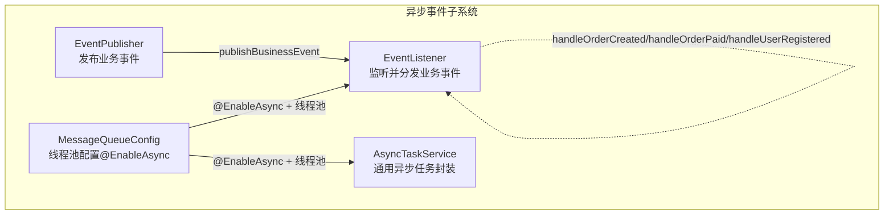
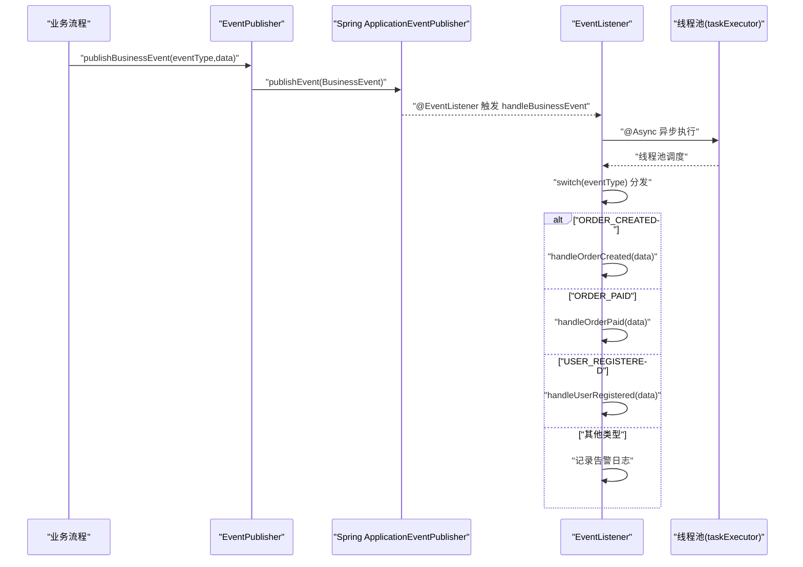
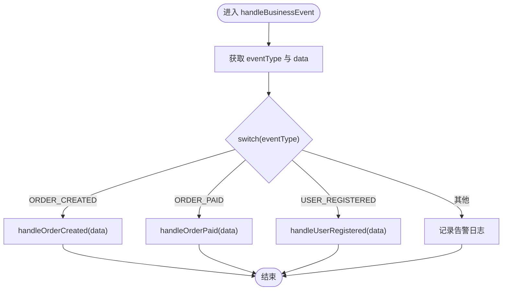
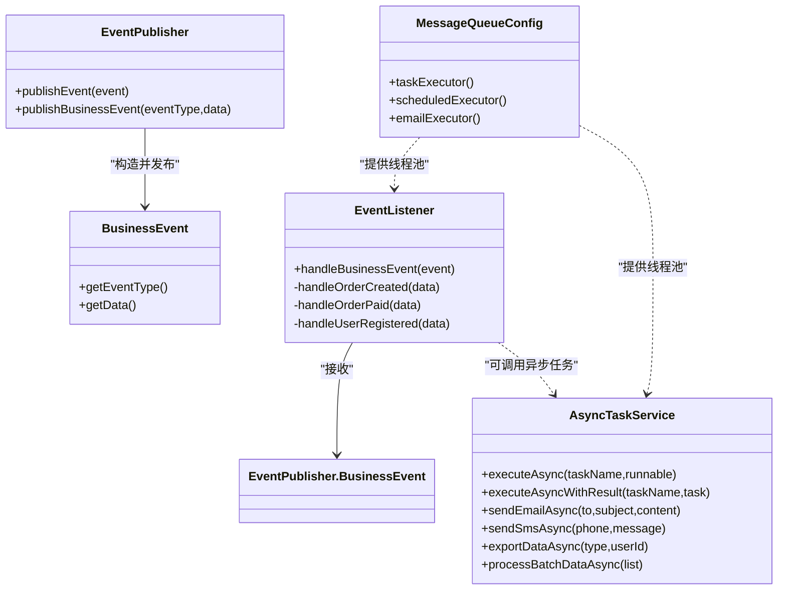

# 事件监听与处理

<cite>
**本文引用的文件**
- [EventListener.java](file://08-backend/src/main/java/com/enterprise/brain/common/async/EventListener.java)
- [EventPublisher.java](file://08-backend/src/main/java/com/enterprise/brain/common/async/EventPublisher.java)
- [MessageQueueConfig.java](file://08-backend/src/main/java/com/enterprise/brain/common/async/MessageQueueConfig.java)
- [AsyncTaskService.java](file://08-backend/src/main/java/com/enterprise/brain/common/async/AsyncTaskService.java)
- [EnterpriseBrainApplication.java](file://08-backend/src/main/java/com/enterprise/brain/EnterpriseBrainApplication.java)
- [application.yml](file://08-backend/src/main/resources/application.yml)
</cite>

## 目录
1. [引言](#引言)
2. [项目结构](#项目结构)
3. [核心组件](#核心组件)
4. [架构总览](#架构总览)
5. [详细组件分析](#详细组件分析)
6. [依赖关系分析](#依赖关系分析)
7. [性能与并发特性](#性能与并发特性)
8. [故障排查指南](#故障排查指南)
9. [结论](#结论)
10. [附录](#附录)

## 引言
本文件围绕事件监听与处理机制展开，重点解析以下内容：
- @EventListener 注解如何实现事件订阅与触发
- @Async 注解如何确保事件处理的异步化
- handleBusinessEvent 方法的事件分发逻辑（基于 eventType 的 switch 分发）
- handleOrderCreated、handleOrderPaid、handleUserRegistered 三个私有方法的业务处理框架及其在订单生命周期与用户管理中的应用场景
- 结合代码路径示例，展示事件监听器如何解耦核心业务逻辑与后续操作，提升系统可维护性与扩展性
- 异步事件处理的线程池配置、错误恢复机制与事件追溯方案建议

## 项目结构
本次文档聚焦后端模块中的异步事件子系统，涉及事件发布、事件监听与异步线程池配置。下图给出与事件处理相关的关键文件与职责概览。

图表来源
- [EventPublisher.java](file://08-backend/src/main/java/com/enterprise/brain/common/async/EventPublisher.java#L1-L67)
- [EventListener.java](file://08-backend/src/main/java/com/enterprise/brain/common/async/EventListener.java#L1-L71)
- [MessageQueueConfig.java](file://08-backend/src/main/java/com/enterprise/brain/common/async/MessageQueueConfig.java#L1-L94)
- [AsyncTaskService.java](file://08-backend/src/main/java/com/enterprise/brain/common/async/AsyncTaskService.java#L1-L149)

章节来源
- [EventPublisher.java](file://08-backend/src/main/java/com/enterprise/brain/common/async/EventPublisher.java#L1-L67)
- [EventListener.java](file://08-backend/src/main/java/com/enterprise/brain/common/async/EventListener.java#L1-L71)
- [MessageQueueConfig.java](file://08-backend/src/main/java/com/enterprise/brain/common/async/MessageQueueConfig.java#L1-L94)
- [AsyncTaskService.java](file://08-backend/src/main/java/com/enterprise/brain/common/async/AsyncTaskService.java#L1-L149)

## 核心组件
- 事件发布器 EventPublisher：提供 publishEvent 与 publishBusinessEvent，封装 Spring ApplicationEventPublisher 的发布能力，并定义业务事件载体 BusinessEvent（包含 eventType 与 data）。
- 事件监听器 EventListener：通过 @EventListener 订阅业务事件，@Async 保证异步执行；在 handleBusinessEvent 中按 eventType 进行 switch 分发至具体处理方法。
- 线程池配置 MessageQueueConfig：启用异步并定义多个命名线程池（taskExecutor、scheduledExecutor、emailExecutor），设置核心/最大线程、队列容量、拒绝策略、优雅停机等待时间等。
- 异步任务服务 AsyncTaskService：提供 executeAsync、executeAsyncWithResult、sendEmailAsync、sendSmsAsync、exportDataAsync、processBatchDataAsync 等异步任务封装，便于在业务流程中直接调用。

章节来源
- [EventPublisher.java](file://08-backend/src/main/java/com/enterprise/brain/common/async/EventPublisher.java#L1-L67)
- [EventListener.java](file://08-backend/src/main/java/com/enterprise/brain/common/async/EventListener.java#L1-L71)
- [MessageQueueConfig.java](file://08-backend/src/main/java/com/enterprise/brain/common/async/MessageQueueConfig.java#L1-L94)
- [AsyncTaskService.java](file://08-backend/src/main/java/com/enterprise/brain/common/async/AsyncTaskService.java#L1-L149)

## 架构总览
下图展示从“业务流程”到“事件发布”，再到“事件监听与异步处理”的完整链路。

图表来源
- [EventPublisher.java](file://08-backend/src/main/java/com/enterprise/brain/common/async/EventPublisher.java#L1-L67)
- [EventListener.java](file://08-backend/src/main/java/com/enterprise/brain/common/async/EventListener.java#L1-L71)
- [MessageQueueConfig.java](file://08-backend/src/main/java/com/enterprise/brain/common/async/MessageQueueConfig.java#L1-L94)

## 详细组件分析

### 事件发布器 EventPublisher
- 职责
  - 封装 Spring 的 ApplicationEventPublisher，统一发布事件入口
  - 提供 publishBusinessEvent(eventType, data) 快捷方法，构造 BusinessEvent 并发布
- 关键点
  - BusinessEvent 继承自 Spring ApplicationEvent，包含 eventType 与 data 字段
  - 发布异常时记录错误日志，避免阻塞业务流程

章节来源
- [EventPublisher.java](file://08-backend/src/main/java/com/enterprise/brain/common/async/EventPublisher.java#L1-L67)

### 事件监听器 EventListener
- 职责
  - 使用 @EventListener 订阅业务事件
  - 使用 @Async 异步处理事件，避免阻塞业务线程
  - 在 handleBusinessEvent 中按 eventType 进行 switch 分发
- 分发逻辑
  - ORDER_CREATED -> handleOrderCreated
  - ORDER_PAID -> handleOrderPaid
  - USER_REGISTERED -> handleUserRegistered
  - 其他类型 -> 记录告警日志
- 错误处理
  - try-catch 包裹分发逻辑，捕获异常并记录错误日志

图表来源
- [EventListener.java](file://08-backend/src/main/java/com/enterprise/brain/common/async/EventListener.java#L1-L71)

章节来源
- [EventListener.java](file://08-backend/src/main/java/com/enterprise/brain/common/async/EventListener.java#L1-L71)

### handleOrderCreated / handleOrderPaid / handleUserRegistered 业务处理框架
- 框架职责
  - 作为 switch 分发后的具体处理桩位，预留扩展点
  - 订单生命周期场景：订单创建后触发 ORDER_CREATED；订单支付后触发 ORDER_PAID
  - 用户管理场景：用户注册后触发 USER_REGISTERED
- 建议实现方向（基于框架预留）
  - handleOrderCreated：发送通知、更新库存、生成对账单、写入审计日志
  - handleOrderPaid：发送支付确认通知、更新订单状态、触发结算流程、写入审计日志
  - handleUserRegistered：发送欢迎邮件/短信、初始化用户资料、分配默认角色、写入审计日志

章节来源
- [EventListener.java](file://08-backend/src/main/java/com/enterprise/brain/common/async/EventListener.java#L1-L71)

### 线程池配置 MessageQueueConfig
- 启用异步：@EnableAsync
- 任务线程池 taskExecutor
  - 核心线程数、最大线程数、队列容量、空闲存活时间、线程名前缀
  - 拒绝策略：CallerRunsPolicy（由调用线程执行）
  - 优雅停机：等待任务完成再关闭，设置等待时间
- 定时任务线程池 scheduledExecutor
  - 适用于定时任务场景
- 邮件线程池 emailExecutor
  - 专用线程池，隔离邮件发送对业务的影响

章节来源
- [MessageQueueConfig.java](file://08-backend/src/main/java/com/enterprise/brain/common/async/MessageQueueConfig.java#L1-L94)

### 异步任务服务 AsyncTaskService
- 提供多种异步任务封装
  - executeAsync / executeAsyncWithResult：无返回值/有返回值的异步执行
  - sendEmailAsync / sendSmsAsync：异步发送邮件/短信
  - exportDataAsync：异步导出数据
  - processBatchDataAsync：异步批量处理数据
- 适用场景
  - 与 EventListener 协同，将耗时或外部依赖的操作放入异步任务，降低主线程压力

章节来源
- [AsyncTaskService.java](file://08-backend/src/main/java/com/enterprise/brain/common/async/AsyncTaskService.java#L1-L149)

## 依赖关系分析
- 组件耦合
  - EventListener 依赖 EventPublisher.BusinessEvent（通过 @EventListener 接收）
  - EventPublisher 依赖 Spring ApplicationEventPublisher（通过注入）
  - 线程池配置通过 @EnableAsync 与 @Bean 定义，影响 @Async 的执行行为
- 关系图

图表来源
- [EventPublisher.java](file://08-backend/src/main/java/com/enterprise/brain/common/async/EventPublisher.java#L1-L67)
- [EventListener.java](file://08-backend/src/main/java/com/enterprise/brain/common/async/EventListener.java#L1-L71)
- [AsyncTaskService.java](file://08-backend/src/main/java/com/enterprise/brain/common/async/AsyncTaskService.java#L1-L149)
- [MessageQueueConfig.java](file://08-backend/src/main/java/com/enterprise/brain/common/async/MessageQueueConfig.java#L1-L94)

## 性能与并发特性
- 异步执行
  - @Async 使事件处理在独立线程中执行，避免阻塞业务线程
  - 线程池参数直接影响吞吐与延迟：核心线程数、最大线程数、队列容量、拒绝策略
- 线程池配置要点
  - taskExecutor：通用异步任务，适合事件处理与批量任务
  - scheduledExecutor：定时任务专用，避免与业务异步任务互相干扰
  - emailExecutor：邮件发送专用，隔离网络波动对业务的影响
- 优雅停机
  - 设置 waitForTasksToCompleteOnShutdown 与 awaitTerminationSeconds，确保应用关闭前完成已提交任务
- 日志与监控
  - 建议在事件处理前后增加耗时日志，便于定位热点与瓶颈

章节来源
- [MessageQueueConfig.java](file://08-backend/src/main/java/com/enterprise/brain/common/async/MessageQueueConfig.java#L1-L94)
- [EventListener.java](file://08-backend/src/main/java/com/enterprise/brain/common/async/EventListener.java#L1-L71)
- [AsyncTaskService.java](file://08-backend/src/main/java/com/enterprise/brain/common/async/AsyncTaskService.java#L1-L149)

## 故障排查指南
- 事件未被监听
  - 确认 @EnableAsync 已启用（应用主类或配置类）
  - 确认 EventListener 为 Spring 组件（@Component）
  - 确认事件类型字符串一致（ORDER_CREATED、ORDER_PAID、USER_REGISTERED）
- 异步未生效
  - 检查是否在同一个类内调用 @Async 方法（需通过代理调用）
  - 检查线程池是否正确初始化
- 错误恢复
  - handleBusinessEvent 已捕获异常并记录日志，建议补充重试/死信队列策略
  - 对于幂等性要求高的操作，应在处理方法内部实现去重与幂等校验
- 事件追溯
  - 建议在 BusinessEvent 中加入 traceId 或 correlationId 字段，贯穿事件发布、处理与下游调用
  - 在日志中输出 eventType、data、traceId，便于问题定位与审计

章节来源
- [EnterpriseBrainApplication.java](file://08-backend/src/main/java/com/enterprise/brain/EnterpriseBrainApplication.java#L1-L61)
- [EventListener.java](file://08-backend/src/main/java/com/enterprise/brain/common/async/EventListener.java#L1-L71)
- [EventPublisher.java](file://08-backend/src/main/java/com/enterprise/brain/common/async/EventPublisher.java#L1-L67)
- [application.yml](file://08-backend/src/main/resources/application.yml#L1-L42)

## 结论
- 该事件监听与处理机制通过 @EventListener 与 @Async 实现了事件的解耦与异步化，有效提升了系统的可维护性与扩展性
- handleBusinessEvent 的 switch 分发清晰地将不同业务事件路由到对应处理方法，便于在订单生命周期与用户管理场景中落地
- 线程池配置提供了灵活的并发控制能力，配合 AsyncTaskService 可进一步封装复杂异步任务
- 建议在生产环境中完善错误恢复、幂等与事件追溯能力，以保障事件驱动架构的稳定性与可观测性

## 附录
- 代码路径参考
  - 事件发布：[EventPublisher.publishBusinessEvent](file://08-backend/src/main/java/com/enterprise/brain/common/async/EventPublisher.java#L35-L44)
  - 事件监听与分发：[EventListener.handleBusinessEvent](file://08-backend/src/main/java/com/enterprise/brain/common/async/EventListener.java#L18-L46)
  - 订单创建处理：[EventListener.handleOrderCreated](file://08-backend/src/main/java/com/enterprise/brain/common/async/EventListener.java#L48-L55)
  - 订单支付处理：[EventListener.handleOrderPaid](file://08-backend/src/main/java/com/enterprise/brain/common/async/EventListener.java#L56-L63)
  - 用户注册处理：[EventListener.handleUserRegistered](file://08-backend/src/main/java/com/enterprise/brain/common/async/EventListener.java#L64-L71)
  - 线程池配置：[MessageQueueConfig](file://08-backend/src/main/java/com/enterprise/brain/common/async/MessageQueueConfig.java#L1-L94)
  - 异步任务封装：[AsyncTaskService](file://08-backend/src/main/java/com/enterprise/brain/common/async/AsyncTaskService.java#L1-L149)
  - 应用启动类（启用异步与定时）：[EnterpriseBrainApplication](file://08-backend/src/main/java/com/enterprise/brain/EnterpriseBrainApplication.java#L1-L61)
  - 应用配置（日志级别等）：[application.yml](file://08-backend/src/main/resources/application.yml#L1-L42)